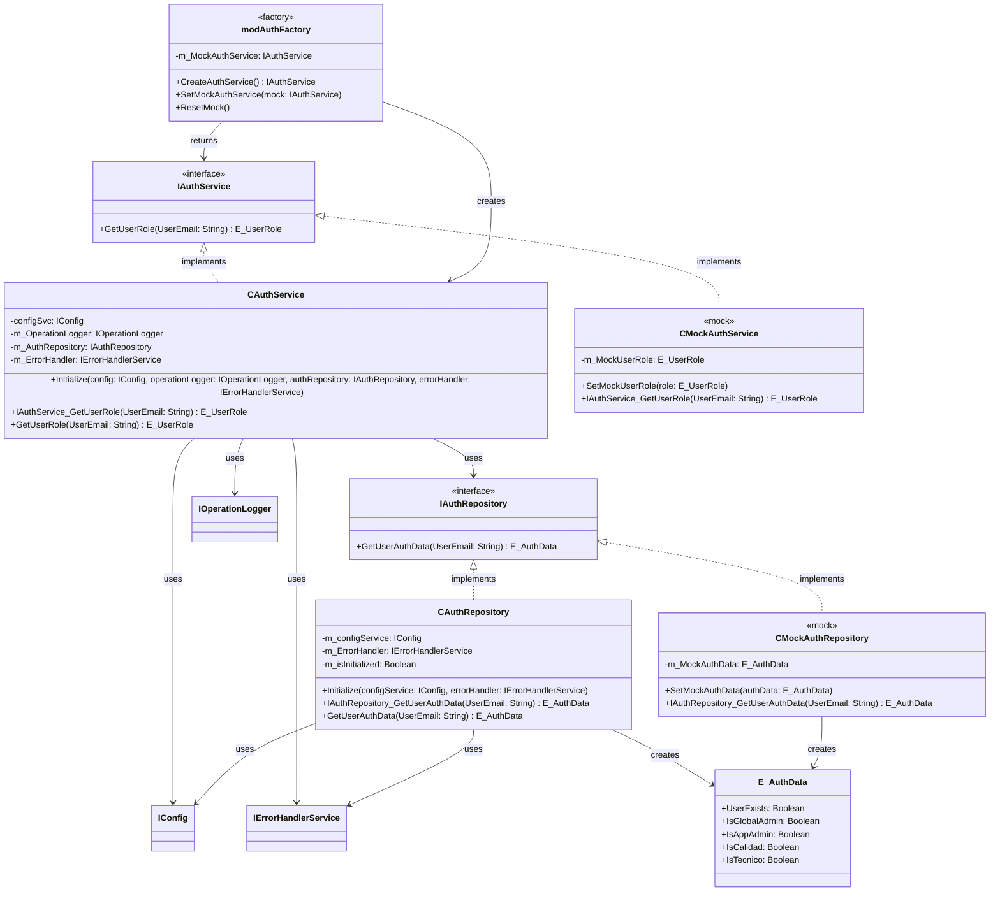
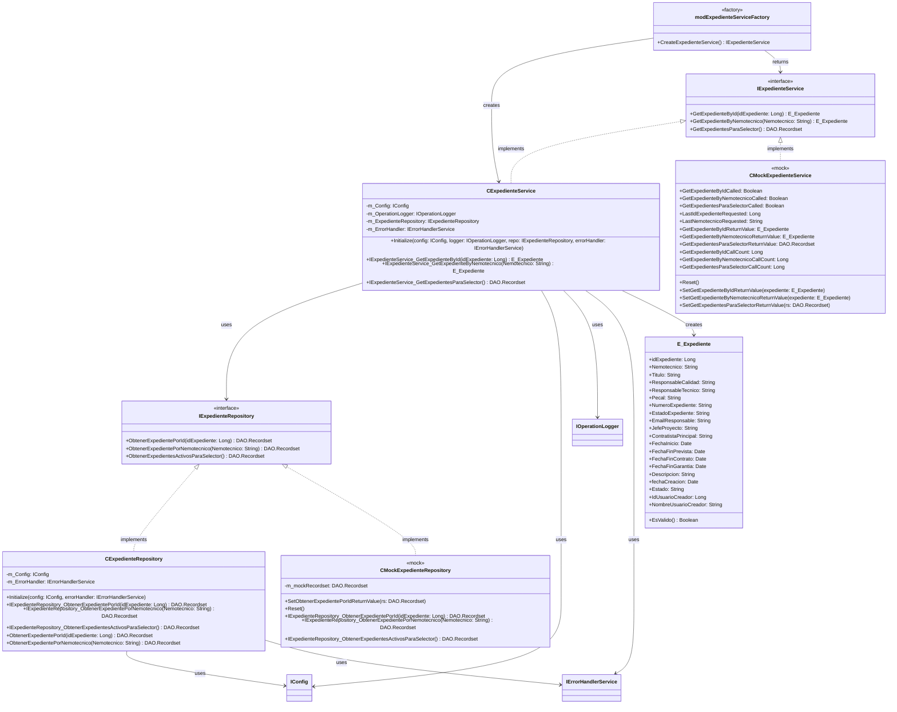
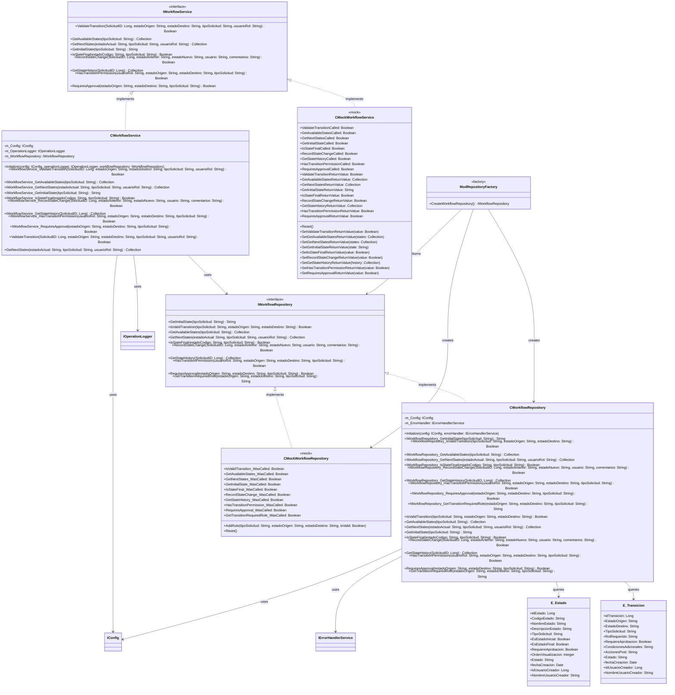
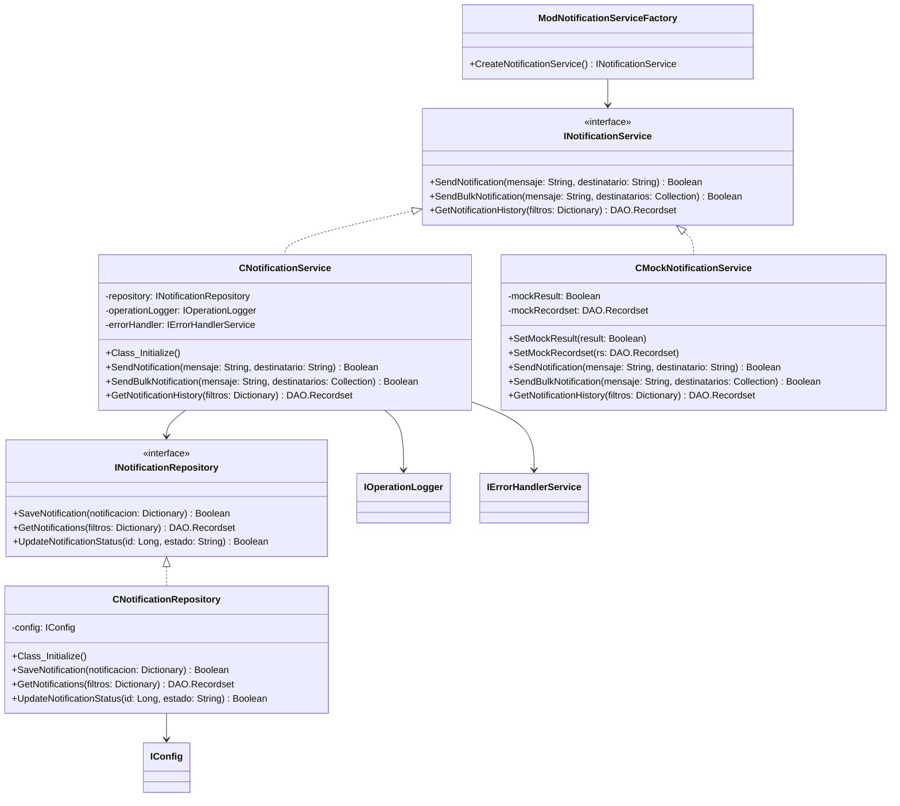
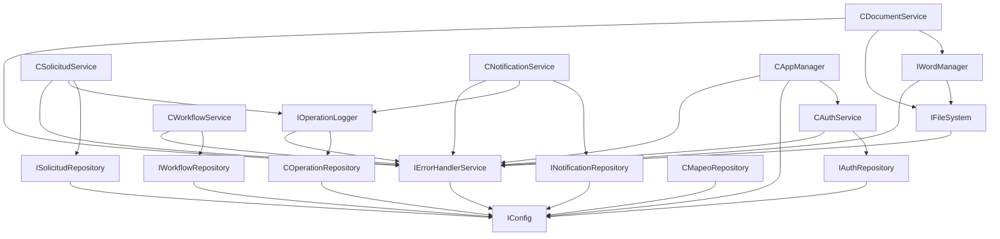

# CONDOR - MASTER PLAN

## Índice

1. [Visión y Objetivo Principal](#1-visión-y-objetivo-principal)
2. [Arquitectura y Principios Fundamentales](#2-arquitectura-y-principios-fundamentales)
   - 2.1. [Arquitectura General](#21-arquitectura-general)
   - 2.2. [Principios de Diseño (No Negociables)](#22-principios-de-diseño-no-negociables)
3. [Resumen de Componentes por Funcionalidad](#3-resumen-de-componentes-por-funcionalidad)
   - 3.1. [Autenticación (Auth)](#31-autenticación-auth)
   - 3.2. [Gestión de Documentos (Document)](#32-gestión-de-documentos-document)
   - 3.3. [Gestión de Expedientes (Expediente)](#33-gestión-de-expedientes-expediente)
   - 3.4. [Gestión de Solicitudes (Solicitud)](#34-gestión-de-solicitudes-solicitud)
   - 3.5. [Gestión de Flujos de Trabajo (Workflow)](#35-gestión-de-flujos-de-trabajo-workflow)
   - 3.6. [Gestión de Mapeos (Mapeo)](#36-gestión-de-mapeos-mapeo)
   - 3.7. [Gestión de Notificaciones (Notification)](#37-gestión-de-notificaciones-notification)
   - 3.8. [Gestión de Operaciones y Logging (Operation)](#38-gestión-de-operaciones-y-logging-operation)
4. [Configuración](#4-configuración)
5. [Sistema de Archivos](#5-sistema-de-archivos)
6. [Gestión de Word](#6-gestión-de-word)
7. [Gestión de Errores](#7-gestión-de-errores)
8. [Framework de Testing](#8-framework-de-testing)
9. [Gestión de Aplicación](#9-gestión-de-aplicación)
10. [Modelos de Datos](#10-modelos-de-datos)
11. [Utilidades y Enumeraciones](#11-utilidades-y-enumeraciones)
12. [Mapa de Dependencias Principales](#12-mapa-de-dependencias-principales)
13. [Estadísticas del Proyecto](#13-estadísticas-del-proyecto)
14. [Patrones Arquitectónicos Identificados](#14-patrones-arquitectónicos-identificados)
15. [Sistema de Autoaprovisionamiento de Tests](#15-sistema-de-autoaprovisionamiento-de-tests)
16. [Flujo de Trabajo y Gestión de Estados](#16-flujo-de-trabajo-y-gestión-de-estados)
17. [Especificaciones de Integración Clave](#17-especificaciones-de-integración-clave)
18. [Estructura de la Base de Datos](#18-estructura-de-la-base-de-datos)
19. [Ciclo de Trabajo de Desarrollo](#19-ciclo-de-trabajo-de-desarrollo)
20. [Lecciones Aprendidas](#20-lecciones-aprendidas)
21. [Anexo A: Estructura Detallada de la Base de Datos](#21-anexo-a-estructura-detallada-de-la-base-de-datos)
22. [Anexo B: Mapeo de Campos para Generación de Documentos](#22-anexo-b-mapeo-de-campos-para-generación-de-documentos)

---

## 1. Visión y Objetivo Principal

1. El objetivo principal de CONDOR es ser la herramienta centralizada para la gestión integral del ciclo de vida de las solicitudes de Cambios, Concesiones y Desviaciones. Para ello, la aplicación debe cumplir con cuatro funcionalidades esenciales:

**Registro Centralizado**: Servir como el único punto de entrada para registrar los tres tipos de solicitudes: Propuestas de Cambio (PC), Concesiones/Desviaciones (CD-CA) y Concesiones/Desviaciones de Sub-suministrador (CD-CA-SUB).

**Generación de Documentos (Escritura)**: Automatizar la generación de la documentación oficial asociada a cada tipo de solicitud, utilizando los datos registrados en el sistema para rellenar las plantillas Word predefinidas.

**Sincronización de Documentos (Lectura)**: Permitir la actualización de los registros en la base de datos a partir de una plantilla Word que haya sido rellenada o modificada fuera de la aplicación, asegurando la consistencia de los datos.

- **Trazabilidad de Estado**: Proporcionar una visión clara y en tiempo real del estado en el que se encuentra cada solicitud a lo largo de su ciclo de vida, desde el registro hasta el cierre.
- **Auditoría de Operaciones**: Registrar de forma detallada las acciones clave realizadas por los usuarios y el sistema para garantizar la trazabilidad y la rendición de cuentas.

## 2. Arquitectura y Principios Fundamentales

### 2.1. Arquitectura General
El sistema sigue una arquitectura en 3 Capas sobre un entorno Cliente-Servidor con bases de datos Access separadas para el frontend y el backend.

**Capa de Presentación**: Formularios de Access (.accde).

**Capa de Lógica de Negocio**: Clases y Módulos VBA con lógica de negocio, incluyendo servicios de autenticación, configuración, documentos, notificaciones y **logging de operaciones**.

**Capa de Datos**: Módulos VBA que gestionan el acceso a la base de datos CONDOR_datos.accdb.

### 2.2. Principios de Diseño (No Negociables)
**Inversión de Dependencias**: Las clases de alto nivel deben depender de Interfaces (I*), no de clases concretas (C*). Esto es clave para el testing y el bajo acoplamiento.

**Nomenclatura Estricta**:

- Interfaces: IAuthService, **IOperationLogger**
- Clases: CAuthService, **COperationLogger**
- Módulos: modDatabase, **modOperationLoggerFactory**, **modConfigFactory**
- Tipos de Datos: E_Usuario
- Miembros: camelCase (sin guiones bajos).

**Testing contra la Interfaz**: En los módulos de prueba (Test_*), las variables de servicio siempre se declaran del tipo de la interfaz.

**Principio de Fábricas**: Los métodos `Create` de las factorías (mod*Factory) NO deben recibir argumentos. Las dependencias deben ser creadas internamente por cada factoría llamando a otras factorías. Ejemplo: `modErrorHandlerFactory.CreateErrorHandlerService()` crea sus propias dependencias (`IConfig`, `IFileSystem`) sin recibirlas como parámetros.

- **Manejo de Errores Centralizado**: Todo procedimiento susceptible de fallar debe implementar un bloque `On Error GoTo` que obligatoriamente registre el error a través del servicio central `modErrorHandler`. Los errores silenciosos están prohibidos.

- **Auditoría de Operaciones**: Toda operación que represente una acción de negocio significativa (creación, cambio de estado, etc.) debe ser registrada a través del servicio `IOperationLogger`. La trazabilidad de las acciones es un requisito fundamental.

## 3. Resumen de Componentes por Funcionalidad

### 3.1. Autenticación (Auth)
```text
┌─────────────────────────────────────────────────────────────┐
│                    AUTENTICACIÓN                           │
├─────────────────────────────────────────────────────────────┤
│ 📄 IAuthService.cls          ← Interface                   │
│ 📄 IAuthRepository.cls       ← Interface                   │
│ 🔧 CAuthService.cls          ← Implementación              │
│ 🔧 CAuthRepository.cls       ← Implementación              │
│ 🧪 CMockAuthService.cls      ← Mock para testing           │
│ 🧪 CMockAuthRepository.cls   ← Mock para testing           │
│ 🏭 modAuthFactory.bas        ← Factory                     │
│ 📊 E_AuthData.cls           ← Entidad de datos             │
│ ✅ Test_AuthService.bas      ← Tests unitarios             │
│ 🔬 IntegrationTest_AuthRepository.bas ← Tests integración  │
│                                                             │
│ 📊 Análisis de Código Fuente: 10 archivos identificados    │
└─────────────────────────────────────────────────────────────┘
```

#### Diagrama de Clases UML



#### Patrón Mock para Testing

El sistema de autenticación implementa un patrón Mock completo para facilitar las pruebas unitarias:

- **CMockAuthService**: Mock de `IAuthService` que permite configurar el rol de usuario devuelto mediante `SetMockUserRole()`
- **CMockAuthRepository**: Mock de `IAuthRepository` que permite configurar los datos de autenticación devueltos mediante `SetMockAuthData()`
- **ModAuthFactory**: Incluye funcionalidad para inyectar mocks mediante `SetMockAuthService()` y resetear el estado con `ResetMock()`

#### Dependencias Externas

🔗 **Dependencias:**
- CAuthService ➜ IAuthRepository (inyección de dependencia)
- CAuthService ➜ IConfig (configuración del sistema)
- CAuthService ➜ IOperationLogger (logging de operaciones)
- CAuthService ➜ IErrorHandlerService (manejo de errores)
- CAuthRepository ➜ IConfig (configuración de base de datos)
- CAuthRepository ➜ IErrorHandlerService (manejo de errores)

#### Funcionalidades Clave

1. **Gestión de Roles de Usuario**: Determinación del rol basada en datos de autenticación de base de datos
2. **Consulta Optimizada**: Una sola consulta SQL con LEFT JOIN para obtener todos los datos de autenticación
3. **Jerarquía de Roles**: Prioridad definida (Administrador Global > Administrador App > Calidad > Técnico)
4. **Logging de Auditoría**: Registro completo de consultas de roles y asignaciones
5. **Manejo de Errores**: Gestión robusta de errores con logging detallado

#### Patrones Implementados

- **Dependency Injection**: Inyección de dependencias en constructores
- **Repository Pattern**: Separación de lógica de acceso a datos
- **Factory Pattern**: Creación centralizada de servicios con gestión de mocks
- **Interface Segregation**: Interfaces específicas para cada responsabilidad
- **Mock Pattern**: Implementación completa de mocks para testing

### 3.2. Gestión de Documentos (Document)
```text
┌─────────────────────────────────────────────────────────────┐
│                GESTIÓN DE DOCUMENTOS                       │
├─────────────────────────────────────────────────────────────┤
│ 📄 IDocumentService.cls      ← Interface                   │
│ 🔧 CDocumentService.cls      ← Implementación              │
│ 🧪 CMockDocumentService.cls  ← Mock para testing           │
│ 🏭 ModDocumentServiceFactory.bas ← Factory                 │
│ ✅ TestDocumentService.bas  ← Tests unitarios             │
│ 🔬 IntegrationTestDocumentService.bas ← Tests integración │
└─────────────────────────────────────────────────────────────┘

🔗 **Dependencias:**
- CDocumentService ➜ IWordManager
- CDocumentService ➜ IFileSystem
- CDocumentService ➜ IErrorHandlerService
```

### 3.3. Gestión de Expedientes (Expediente)
```text
┌─────────────────────────────────────────────────────────────┐
│                GESTIÓN DE EXPEDIENTES                      │
├─────────────────────────────────────────────────────────────┤
│ 📄 IExpedienteService.cls    ← Interface                   │
│ 📄 IExpedienteRepository.cls ← Interface                   │
│ 🔧 CExpedienteService.cls    ← Implementación              │
│ 🔧 CExpedienteRepository.cls ← Implementación              │
│ 🧪 CMockExpedienteService.cls ← Mock para testing          │
│ 🧪 CMockExpedienteRepository.cls ← Mock para testing       │
│ 🏭 ModExpedienteServiceFactory.bas ← Factory               │
│ 📊 E_Expediente.cls         ← Entidad principal            │
│ ✅ TestCExpedienteService.bas ← Tests unitarios           │
│ 🔬 IntegrationTestCExpedienteRepository.bas ← Tests integración │
│                                                             │
│ 📊 Análisis de Código Fuente: 10 archivos identificados    │
└─────────────────────────────────────────────────────────────┘
```

#### Diagrama de Clases UML



#### Patrón Mock para Testing

El módulo implementa un sistema completo de mocks para aislamiento de pruebas:

- **CMockExpedienteService**: Mock del servicio que permite configurar valores de retorno y verificar llamadas
- **CMockExpedienteRepository**: Mock del repositorio que simula el acceso a datos
- **Verificación de Llamadas**: Los mocks registran todas las llamadas realizadas para validación en tests
- **Configuración Flexible**: Permite establecer diferentes escenarios de prueba (éxito, error, datos vacíos)

#### Dependencias Externas

🔗 **Dependencias:**
- CExpedienteService ➜ IExpedienteRepository (Acceso a datos)
- CExpedienteService ➜ IOperationLogger (Logging de operaciones)
- CExpedienteService ➜ IErrorHandlerService (Manejo de errores)
- CExpedienteService ➜ IConfig (Configuración)
- CExpedienteRepository ➜ IConfig (Configuración de BD)
- CExpedienteRepository ➜ IErrorHandlerService (Manejo de errores)
- ModSolicitudServiceFactory ➜ Múltiples factories (Inyección de dependencias)

#### Funcionalidades Clave

1. **Consulta por ID**: Obtiene expedientes específicos por identificador único
2. **Consulta por Nemotécnico**: Búsqueda por código nemotécnico del expediente
3. **Lista para Selectores**: Obtiene expedientes activos para componentes de UI
4. **Mapeo de Datos**: Conversión automática de recordsets a objetos E_Expediente
5. **Manejo de Errores**: Gestión robusta de errores con logging detallado
6. **Consultas Parametrizadas**: Prevención de inyección SQL mediante parámetros
7. **Gestión de Recursos**: Limpieza automática de conexiones y recordsets

#### Patrones Implementados

- **Repository Pattern**: Separación entre lógica de negocio y acceso a datos
- **Dependency Injection**: Inyección de dependencias para bajo acoplamiento
- **Factory Pattern**: Creación centralizada de servicios con dependencias
- **Mock Pattern**: Objetos simulados para testing aislado
- **Interface Segregation**: Interfaces específicas y cohesivas

### 3.4. Gestión de Solicitudes (Solicitud)
```text
┌─────────────────────────────────────────────────────────────┐
│                GESTIÓN DE SOLICITUDES                      │
├─────────────────────────────────────────────────────────────┤
│ 📄 ISolicitudService.cls     ← Interface                   │
│ 📄 ISolicitudRepository.cls  ← Interface                   │
│ 🔧 CSolicitudService.cls     ← Implementación              │
│ 🔧 CSolicitudRepository.cls  ← Implementación              │
│ 🧪 CMockSolicitudService.cls ← Mock para testing           │
│ 🧪 CMockSolicitudRepository.cls ← Mock para testing        │
│ 🏭 ModSolicitudServiceFactory.bas ← Factory                │
│ 📊 E_Solicitud.cls          ← Entidad principal            │
│ 📊 E_Datos_PC.cls           ← Datos específicos PC         │
│ 📊 E_Datos_CD_CA.cls        ← Datos específicos CD/CA      │
│ 📊 E_Datos_CD_CA_SUB.cls    ← Datos específicos CD/CA/SUB  │
│ ✅ TestSolicitudService.bas ← Tests unitarios             │
│ 🔬 IntegrationTestSolicitudRepository.bas ← Tests integración │
│                                                             │
│ 📊 Análisis de Código Fuente: 10 archivos identificados    │
└─────────────────────────────────────────────────────────────┘
```

#### Diagrama de Clases UML



```mermaid
classDiagram
    %% Interfaces
    class ISolicitudService {
        <<interface>>
        +CreateSolicitud(tipoSolicitud: String) E_Solicitud
+SaveSolicitud(solicitud: E_Solicitud) Boolean
    }
    
    class ISolicitudRepository {
        <<interface>>
        +GetSolicitudById(id: Long) E_Solicitud
+SaveSolicitud(solicitud: E_Solicitud) Boolean
        +ExecuteQuery(sql: String) Variant
        +Initialize(config: IConfig)
    }
    
    %% Implementaciones
    class CSolicitudService {
        -repository: ISolicitudRepository
        -logger: IOperationLogger
        -errorHandler: IErrorHandlerService
        +Initialize(repo: ISolicitudRepository, log: IOperationLogger, err: IErrorHandlerService)
        +ISolicitudService_CreateSolicitud(tipoSolicitud: String) E_Solicitud
+ISolicitudService_SaveSolicitud(solicitud: E_Solicitud) Boolean
        -GenerateCodigoSolicitud() String
    }
    
    class CSolicitudRepository {
        -config: IConfig
        +Initialize(cfg: IConfig)
        +ISolicitudRepository_GetSolicitudById(id: Long) E_Solicitud
        +ISolicitudRepository_SaveSolicitud(solicitud: E_Solicitud) Boolean
        +ISolicitudRepository_ExecuteQuery(sql: String) Variant
        -LoadDatosPC(idSolicitud: Long) E_Datos_PC
        -LoadDatosCDCA(idSolicitud: Long) E_Datos_CD_CA
        -LoadDatosCDCASUB(idSolicitud: Long) E_Datos_CD_CA_SUB
    }
    
    %% Entidades de Datos
    class E_Solicitud {
        +idSolicitud: Long
        +tipoSolicitud: String
        +codigoSolicitud: String
        +fechaCreacion: Date
        +estadoInterno: String
        +usuarioCreacion: String
        +fechaModificacion: Date
        +usuarioModificacion: String
        +Datos: Object
        -datosPC: E_Datos_PC
        -datosCDCA: E_Datos_CD_CA
        -datosCDCASUB: E_Datos_CD_CA_SUB
    }
    
    class E_Datos_PC {
        +idDatosPC: Long
        +idSolicitud: Long
        +refContratoInspeccionOficial: String
        +refSuministrador: String
        +suministradorNombreDir: String
        +objetoContrato: String
        +descripcionMaterialAfectado: String
        +numPlanoEspecificacion: String
        +descripcionPropuestaCambio: String
        +motivoCorregirDeficiencias: Boolean
        +motivoMejorarCapacidad: Boolean
        +motivoAumentarNacionalizacion: Boolean
        +incidenciaCoste: String
        +incidenciaPlazo: String
        +incidenciaSeguridad: Boolean
        +racCodigo: String
        +decisionFinal: String
        +fechaFirmaDecisionFinal: Date
    }
    
    class E_Datos_CD_CA {
        +idDatosCDCA: Long
        +idSolicitud: Long
        +refSuministrador: String
        +numContrato: String
        +identificacionMaterial: String
        +numPlanoEspecificacion: String
        +cantidadPeriodo: String
        +numSerieLote: String
        +descripcionImpactoNC: String
        +causaNC: String
        +impactoCoste: String
        +clasificacionNC: String
        +requiereModificacionContrato: Boolean
        +efectoFechaEntrega: String
        +identificacionAutoridadDiseno: String
        +esSuministradorAD: Boolean
        +racRef: String
        +racCodigo: String
        +decisionFinal: String
        +fechaFirmaDecisionFinal: Date
    }
    
    class E_Datos_CD_CA_SUB {
        +idDatosCDCASUB: Long
        +idSolicitud: Long
        +refSuministrador: String
        +refSubSuministrador: String
        +suministradorPrincipalNombreDir: String
        +subSuministradorNombreDir: String
        +identificacionMaterial: String
        +numPlanoEspecificacion: String
        +cantidadPeriodo: Long
        +numSerieLote: String
        +descripcionImpactoNC: String
        +causaNC: String
        +impactoCoste: String
        +clasificacionNC: String
        +afectaPrestaciones: Boolean
        +afectaSeguridad: Boolean
        +afectaFiabilidad: Boolean
        +afectaVidaUtil: Boolean
        +afectaMedioambiente: Boolean
        +requiereModificacionContrato: Boolean
        +efectoFechaEntrega: String
        +identificacionAutoridadDiseno: String
        +esSubSuministradorAD: Boolean
        +nombreRepSubSuministrador: String
        +racRef: String
        +racCodigo: String
        +decisionSuministradorPrincipal: String
        +fechaFirmaSuministradorPrincipal: Date
    }
    
    %% Mocks
    class CMockSolicitudService {
        <<mock>>
        +CreateSolicitudCalled: Boolean
        +SaveSolicitudCalled: Boolean
        +LastTipoSolicitudCreated: String
        +LastSolicitudSaved: E_Solicitud
        +CreateSolicitudResult: E_Solicitud
        +SaveSolicitudResult: Boolean
        +Reset()
        +ISolicitudService_CreateSolicitud(tipoSolicitud: String) E_Solicitud
        +ISolicitudService_SaveSolicitud(solicitud: E_Solicitud) Boolean
    }
    
    class CMockSolicitudRepository {
        <<mock>>
        +GetSolicitudByIdResult: E_Solicitud
        +SaveSolicitudResult: Boolean
        +ExecuteQueryResult: Variant
        +GetSolicitudByIdCalled: Boolean
        +SaveSolicitudCalled: Boolean
        +ExecuteQueryCalled: Boolean
        +LastIdRequested: Long
        +LastSolicitudSaved: E_Solicitud
        +LastQueryExecuted: String
        +Reset()
        +ISolicitudRepository_GetSolicitudById(id: Long) E_Solicitud
        +ISolicitudRepository_SaveSolicitud(solicitud: E_Solicitud) Boolean
        +ISolicitudRepository_ExecuteQuery(sql: String) Variant
    }
    
    %% Factory
    class ModSolicitudServiceFactory {
        <<factory>>
        +CreateSolicitudService() ISolicitudService
    }
    
    %% Relaciones de Implementación
    CSolicitudService ..|> ISolicitudService
    CSolicitudRepository ..|> ISolicitudRepository
    CMockSolicitudService ..|> ISolicitudService
    CMockSolicitudRepository ..|> ISolicitudRepository
    
    %% Relaciones de Dependencia
    CSolicitudService --> ISolicitudRepository
    CSolicitudService --> IOperationLogger
    CSolicitudService --> IErrorHandlerService
    CSolicitudRepository --> IConfig
    ModSolicitudServiceFactory --> CSolicitudService
    ModSolicitudServiceFactory --> ISolicitudRepository
    ModSolicitudServiceFactory --> IOperationLogger
    ModSolicitudServiceFactory --> IErrorHandlerService
    
    %% Relaciones de Composición
    E_Solicitud *-- E_Datos_PC
    E_Solicitud *-- E_Datos_CD_CA
    E_Solicitud *-- E_Datos_CD_CA_SUB
```

#### Mock Pattern para testing

**CMockSolicitudService**: Mock del servicio de solicitudes que implementa ISolicitudService. Permite verificar llamadas a CreateSolicitud y SaveSolicitud, capturar parámetros de entrada (tipoSolicitud, solicitud), configurar valores de retorno personalizados y resetear su estado para pruebas independientes.

**CMockSolicitudRepository**: Mock del repositorio de solicitudes que implementa ISolicitudRepository. Proporciona control total sobre GetSolicitudById, SaveSolicitud y ExecuteQuery, permitiendo configurar resultados específicos, rastrear llamadas realizadas y verificar parámetros pasados durante las pruebas unitarias.

🔗 **Dependencias:**
- CSolicitudService ➜ ISolicitudRepository (inyectado)
- CSolicitudService ➜ IOperationLogger (inyectado)
- CSolicitudService ➜ IErrorHandlerService (inyectado)
- CSolicitudRepository ➜ IConfig (inyectado)
- ModSolicitudServiceFactory ➜ ModConfig (para IConfig)
- ModSolicitudServiceFactory ➜ ModFileSystemFactory (para IFileSystem)
- ModSolicitudServiceFactory ➜ ModErrorHandlerFactory (para IErrorHandlerService)
- ModSolicitudServiceFactory ➜ ModRepositoryFactory (para ISolicitudRepository)
- ModSolicitudServiceFactory ➜ ModOperationLoggerFactory (para IOperationLogger)

**Funcionalidades clave:**
- Creación y validación de solicitudes
- Generación automática de códigos de solicitud
- Persistencia con manejo de transacciones
- Carga de datos específicos según tipo de solicitud (PC, CD_CA, CD_CA_SUB)
- Integración con el sistema de workflow

**Patrones implementados:**
- Repository Pattern para acceso a datos
- Service Layer para lógica de negocio
- Dependency Injection para desacoplamiento
- Factory Pattern para creación de instancias
- Mock Pattern para testing unitario

### 3.5. Gestión de Flujos de Trabajo (Workflow)
```text
┌─────────────────────────────────────────────────────────────┐
│              GESTIÓN DE FLUJOS DE TRABAJO                  │
├─────────────────────────────────────────────────────────────┤
│ 📄 IWorkflowService.cls      ← Interface                   │
│ 📄 IWorkflowRepository.cls   ← Interface                   │
│ 🔧 CWorkflowService.cls      ← Implementación              │
│ 🔧 CWorkflowRepository.cls   ← Implementación              │
│ 🧪 CMockWorkflowService.cls  ← Mock para testing           │
│ 🧪 CMockWorkflowRepository.cls ← Mock para testing         │
│ 🏭 ModRepositoryFactory.bas  ← Factory (CreateWorkflowRepository) │
│ 📊 E_Estado.cls             ← Entidad de Estado            │
│ 📊 E_Transicion.cls         ← Entidad de Transición       │
│ ✅ TestWorkflowService.bas  ← Tests unitarios             │
│ 🔬 IntegrationTestWorkflowRepository.bas ← Tests integración │
│                                                             │
│ 📊 Análisis de Código Fuente: 11 archivos identificados    │
└─────────────────────────────────────────────────────────────┘
```

#### Diagrama de Clases UML



#### Patrón Mock para Testing

El módulo implementa un sistema completo de mocks para aislamiento de pruebas:

- **CMockWorkflowService**: Mock del servicio que permite configurar valores de retorno para todas las operaciones de workflow y verificar llamadas realizadas
- **CMockWorkflowRepository**: Mock del repositorio que simula el acceso a datos de estados y transiciones, con capacidad de configurar reglas de transición específicas
- **Verificación de Llamadas**: Los mocks registran todas las llamadas realizadas para validación en tests
- **Configuración de Reglas**: Permite establecer reglas de transición específicas para diferentes escenarios de prueba
- **Reset de Estado**: Métodos para limpiar el estado entre pruebas independientes

#### Dependencias Externas

🔗 **Dependencias:**
- CWorkflowService ➜ IWorkflowRepository (Acceso a datos de workflow)
- CWorkflowService ➜ IOperationLogger (Logging de operaciones)
- CWorkflowService ➜ IConfig (Configuración)
- CWorkflowRepository ➜ IConfig (Configuración de BD)
- CWorkflowRepository ➜ IErrorHandlerService (Manejo de errores)
- ModRepositoryFactory ➜ CWorkflowRepository/CMockWorkflowRepository (Creación de instancias)

#### Funcionalidades Clave

1. **Validación de Transiciones**: Verifica si una transición de estado es válida según las reglas de negocio
2. **Gestión de Estados**: Obtiene estados disponibles, iniciales y finales por tipo de solicitud
3. **Control de Permisos**: Valida permisos de usuario para realizar transiciones específicas
4. **Historial de Estados**: Registra y consulta el historial completo de cambios de estado
5. **Estados Siguientes**: Calcula los estados disponibles desde un estado actual según el rol del usuario
6. **Aprobaciones**: Determina si una transición requiere aprobación adicional
7. **Roles Requeridos**: Identifica qué rol se necesita para ejecutar una transición específica
8. **Logging de Operaciones**: Registra todas las operaciones de workflow para auditoría

#### Patrones Implementados

- **State Machine Pattern**: Implementa una máquina de estados completa para el workflow
- **Repository Pattern**: Separación entre lógica de workflow y acceso a datos
- **Dependency Injection**: Inyección de dependencias para bajo acoplamiento
- **Factory Pattern**: Creación centralizada de repositorios con dependencias
- **Mock Pattern**: Objetos simulados para testing aislado
- **Command Pattern**: Encapsulación de transiciones como comandos validables
- **Observer Pattern**: Logging automático de cambios de estado

#### Reglas de Negocio del Workflow

1. **Estados por Tipo**: Cada tipo de solicitud (PC, CD_CA, CD_CA_SUB) tiene su propio conjunto de estados
2. **Transiciones Controladas**: Solo se permiten transiciones explícitamente definidas en la base de datos
3. **Control de Roles**: Cada transición puede requerir un rol específico para ser ejecutada
4. **Aprobaciones**: Ciertas transiciones críticas requieren aprobación adicional
5. **Historial Completo**: Todos los cambios de estado se registran con timestamp y usuario
6. **Estados Finales**: Los estados finales no permiten transiciones adicionales
7. **Validación Previa**: Toda transición debe ser validada antes de ser ejecutada

### 3.6. Gestión de Mapeos (Mapeo)
```text
┌─────────────────────────────────────────────────────────────┐
│                  GESTIÓN DE MAPEOS                         │
├─────────────────────────────────────────────────────────────┤
│ 📄 IMapeoRepository.cls      ← Interface                   │
│ 🔧 CMapeoRepository.cls      ← Implementación              │
│ 🧪 CMockMapeoRepository.cls  ← Mock para testing           │
│ 📊 E_Mapeo.cls               ← Entidad de datos            │
│ ✅ TestCMapeoRepository.bas ← Tests unitarios             │
│ 🔬 IntegrationTestCMapeoRepository.bas ← Tests integración │
│ 🏭 ModRepositoryFactory.bas  ← Factory (CreateMapeoRepository) │
└─────────────────────────────────────────────────────────────┘

#### Diagrama de Clases UML
```mermaid
classDiagram
    class IMapeoRepository {
        <<interface>>
        +GetMapeoPorTipo(tipoSolicitud: String) DAO.Recordset
    }
    
    class CMapeoRepository {
        -config: IConfig
        -errorHandler: IErrorHandlerService
        +Class_Initialize()
        +GetMapeoPorTipo(tipoSolicitud: String) DAO.Recordset
    }
    
    class CMockMapeoRepository {
        -mockRecordset: DAO.Recordset
        +SetMockRecordset(rs: DAO.Recordset)
        +GetMapeoPorTipo(tipoSolicitud: String) DAO.Recordset
    }
    
    class E_Mapeo {
        +idMapeo: Long
        +nombrePlantilla: String
        +nombreCampoTabla: String
        +valorAsociado: String
        +nombreCampoWord: String
    }
    
    class ModRepositoryFactory {
        +CreateMapeoRepository() IMapeoRepository
    }
    
    IMapeoRepository <|.. CMapeoRepository
    IMapeoRepository <|.. CMockMapeoRepository
    CMapeoRepository --> IConfig
    CMapeoRepository --> IErrorHandlerService
    ModRepositoryFactory --> IMapeoRepository
    E_Mapeo --> "tbMapeoCampos"
```

#### Patrón Mock para Testing
- **CMockMapeoRepository**: Implementa `IMapeoRepository` permitiendo configurar un `DAO.Recordset` de retorno
- **Configuración Flexible**: Permite simular diferentes escenarios de mapeo en pruebas unitarias
- **Integración con DocumentService**: Utilizado en `Test_DocumentService.bas` para aislar dependencias

#### Dependencias Externas
- **IConfig**: Configuración de conexión a base de datos
- **IErrorHandlerService**: Manejo centralizado de errores
- **DAO.Database**: Acceso directo a la base de datos Access
- **tbMapeoCampos**: Tabla que almacena la configuración de mapeo

#### Funcionalidades Clave
1. **Mapeo de Campos**: Relaciona campos de tablas de datos con marcadores en plantillas Word
2. **Consulta Parametrizada**: Obtiene mapeos específicos por tipo de solicitud
3. **Integración con DocumentService**: Proporciona datos para reemplazo de marcadores
4. **Soporte para Testing**: Mock configurable para pruebas unitarias

#### Patrones Implementados
- **Repository Pattern**: Abstrae el acceso a datos de mapeo
- **Dependency Injection**: Inyección de configuración y manejo de errores
- **Mock Pattern**: Simulación de comportamiento para testing
- **Factory Pattern**: Creación controlada de instancias

#### Estructura de Datos de Mapeo
- **idMapeo**: Identificador único del mapeo
- **nombrePlantilla**: Nombre de la plantilla Word asociada
- **nombreCampoTabla**: Campo de la tabla de datos origen
- **valorAsociado**: Valor específico para el mapeo
- **nombreCampoWord**: Marcador en la plantilla Word a reemplazar

#### Integración con Generación de Documentos
- **CDocumentService**: Utiliza `IMapeoRepository` para obtener configuración de mapeo
- **Reemplazo de Marcadores**: Los mapeos definen qué datos van en cada marcador
- **Flexibilidad**: Permite diferentes mapeos según el tipo de solicitud

🔗 **Dependencias:**
- CMapeoRepository ➜ IConfig
- CMapeoRepository ➜ IErrorHandlerService
- CDocumentService ➜ IMapeoRepository

### 3.7. Gestión de Notificaciones (Notification)
```text
┌─────────────────────────────────────────────────────────────┐
│               GESTIÓN DE NOTIFICACIONES                    │
├─────────────────────────────────────────────────────────────┤
│ 📄 INotificationService.cls  ← Interface                   │
│ 📄 INotificationRepository.cls ← Interface                 │
│ 🔧 CNotificationService.cls  ← Implementación              │
│ 🔧 CNotificationRepository.cls ← Implementación            │
│ 🧪 CMockNotificationService.cls ← Mock para testing        │
│ 🏭 ModNotificationServiceFactory.bas ← Factory             │
│ 🔬 IntegrationTestNotificationService.bas ← Tests integración │
└─────────────────────────────────────────────────────────────┘

#### Diagrama de Clases UML


#### Patrón Mock para Testing
- **CMockNotificationService**: Implementa `INotificationService` permitiendo simular envío de notificaciones
- **Configuración de Resultados**: Permite configurar respuestas exitosas o fallidas
- **Simulación de Historial**: Puede devolver recordsets simulados para pruebas

#### Dependencias Externas
- **INotificationRepository**: Persistencia de notificaciones
- **IOperationLogger**: Registro de operaciones de notificación
- **IErrorHandlerService**: Manejo centralizado de errores
- **IConfig**: Configuración del sistema de notificaciones

#### Funcionalidades Clave
1. **Envío Individual**: Notificaciones a destinatarios específicos
2. **Envío Masivo**: Notificaciones a múltiples destinatarios
3. **Historial de Notificaciones**: Consulta de notificaciones enviadas
4. **Persistencia**: Almacenamiento de notificaciones en base de datos
5. **Seguimiento de Estado**: Control del estado de las notificaciones

#### Patrones Implementados
- **Service Pattern**: Lógica de negocio de notificaciones
- **Repository Pattern**: Abstracción del acceso a datos
- **Dependency Injection**: Inyección de dependencias
- **Mock Pattern**: Simulación para testing
- **Factory Pattern**: Creación controlada de servicios

🔗 **Dependencias:**
- CNotificationService ➜ INotificationRepository
- CNotificationService ➜ IOperationLogger
- CNotificationService ➜ IErrorHandlerService
- CNotificationRepository ➜ IConfig

### 3.8. Gestión de Operaciones y Logging (Operation)
```text
┌─────────────────────────────────────────────────────────────┐
│            GESTIÓN DE OPERACIONES Y LOGGING                │
├─────────────────────────────────────────────────────────────┤
│ 📄 IOperationLogger.cls      ← Interface                   │
│ 📄 IOperationRepository.cls  ← Interface                   │
│ 🔧 COperationLogger.cls      ← Implementación              │
│ 🔧 COperationRepository.cls  ← Implementación              │
│ 🧪 CMockOperationLogger.cls  ← Mock para testing           │
│ 📊 E_OperacionLog.cls        ← Entidad de datos            │
│ 🏭 ModOperationLoggerFactory.bas ← Factory                 │
│ ✅ TestOperationLogger.bas  ← Tests unitarios             │
│ 🔬 IntegrationTestOperationRepository.bas ← Tests integración │
└─────────────────────────────────────────────────────────────┘

#### Diagrama de Clases UML
```mermaid
classDiagram
    class IOperationLogger {
        <<interface>>
        +LogOperation(operacion: String, detalles: String) Boolean
        +LogOperationWithUser(operacion: String, usuario: String, detalles: String) Boolean
        +GetOperationHistory(filtros: Dictionary) DAO.Recordset
        +GetOperationsByUser(usuario: String) DAO.Recordset
    }
    
    class COperationLogger {
        -repository: IOperationRepository
        -errorHandler: IErrorHandlerService
        +Class_Initialize()
        +LogOperation(operacion: String, detalles: String) Boolean
        +LogOperationWithUser(operacion: String, usuario: String, detalles: String) Boolean
        +GetOperationHistory(filtros: Dictionary) DAO.Recordset
        +GetOperationsByUser(usuario: String) DAO.Recordset
    }
    
    class CMockOperationLogger {
        -mockResult: Boolean
        -mockRecordset: DAO.Recordset
        -loggedOperations: Collection
        +SetMockResult(result: Boolean)
        +SetMockRecordset(rs: DAO.Recordset)
        +GetLoggedOperations() Collection
        +LogOperation(operacion: String, detalles: String) Boolean
        +LogOperationWithUser(operacion: String, usuario: String, detalles: String) Boolean
        +GetOperationHistory(filtros: Dictionary) DAO.Recordset
        +GetOperationsByUser(usuario: String) DAO.Recordset
    }
    
    class IOperationRepository {
        <<interface>>
        +SaveOperation(operacion: Dictionary) Boolean
        +GetOperations(filtros: Dictionary) DAO.Recordset
        +GetOperationsByUser(usuario: String) DAO.Recordset
        +GetOperationsByDateRange(fechaInicio: Date, fechaFin: Date) DAO.Recordset
    }
    
    class COperationRepository {
        -config: IConfig
        +Class_Initialize()
        +SaveOperation(operacion: Dictionary) Boolean
        +GetOperations(filtros: Dictionary) DAO.Recordset
        +GetOperationsByUser(usuario: String) DAO.Recordset
        +GetOperationsByDateRange(fechaInicio: Date, fechaFin: Date) DAO.Recordset
    }
    
    class E_OperacionLog {
        +idOperacion: Long
        +tipoOperacion: String
        +usuario: String
        +fechaHora: Date
        +detalles: String
        +resultado: String
        +duracion: Long
    }
    
    class ModOperationLoggerFactory {
        +CreateOperationLogger() IOperationLogger
    }
    
    IOperationLogger <|.. COperationLogger
    IOperationLogger <|.. CMockOperationLogger
    IOperationRepository <|.. COperationRepository
    COperationLogger --> IOperationRepository
    COperationLogger --> IErrorHandlerService
    COperationRepository --> IConfig
    ModOperationLoggerFactory --> IOperationLogger
    E_OperacionLog --> "tbOperacionesLog"
```

#### Patrón Mock para Testing
- **CMockOperationLogger**: Implementa `IOperationLogger` para simular logging de operaciones
- **Colección de Operaciones**: Mantiene registro de operaciones loggeadas para verificación
- **Configuración de Resultados**: Permite simular éxito o fallo en operaciones de logging
- **Recordsets Simulados**: Devuelve datos de prueba para consultas de historial

#### Dependencias Externas
- **IOperationRepository**: Persistencia de logs de operaciones
- **IErrorHandlerService**: Manejo de errores durante el logging
- **IConfig**: Configuración de la base de datos
- **tbOperacionesLog**: Tabla de almacenamiento de logs

#### Funcionalidades Clave
1. **Logging de Operaciones**: Registro detallado de operaciones del sistema
2. **Logging con Usuario**: Asociación de operaciones con usuarios específicos
3. **Consulta de Historial**: Recuperación de logs con filtros
4. **Consultas por Usuario**: Logs específicos de un usuario
5. **Consultas por Rango de Fechas**: Filtrado temporal de operaciones
6. **Medición de Duración**: Registro del tiempo de ejecución

#### Patrones Implementados
- **Logger Pattern**: Registro centralizado de operaciones
- **Repository Pattern**: Abstracción del acceso a datos de logs
- **Dependency Injection**: Inyección de repositorio y manejo de errores
- **Mock Pattern**: Simulación para testing sin persistencia real
- **Factory Pattern**: Creación controlada de loggers

#### Estructura de Datos de Log
- **idOperacion**: Identificador único del log
- **tipoOperacion**: Tipo de operación ejecutada
- **usuario**: Usuario que ejecutó la operación
- **fechaHora**: Timestamp de la operación
- **detalles**: Información detallada de la operación
- **resultado**: Resultado de la operación (éxito/fallo)
- **duracion**: Tiempo de ejecución en milisegundos

🔗 **Dependencias:**
- COperationLogger ➜ IOperationRepository
- COperationLogger ➜ IErrorHandlerService
- COperationRepository ➜ IConfig

## 4. Configuración
```text
┌─────────────────────────────────────────────────────────────┐
│                    CONFIGURACIÓN                           │
├─────────────────────────────────────────────────────────────┤
│ 📄 IConfig.cls               ← Interface                   │
│ 🔧 CConfig.cls               ← Implementación              │
│ 🧪 CMockConfig.cls           ← Mock para testing           │
│ 🏭 ModConfigFactory.bas      ← Factory                     │
│ ✅ TestCConfig.bas           ← Tests unitarios             │
└─────────────────────────────────────────────────────────────┘

🔗 **Dependencias:**
- CConfig ➜ IErrorHandlerService
```

## 5. Sistema de Archivos
```text
┌─────────────────────────────────────────────────────────────┐
│                  SISTEMA DE ARCHIVOS                       │
├─────────────────────────────────────────────────────────────┤
│ 📄 IFileSystem.cls           ← Interface                   │
│ 🔧 CFileSystem.cls           ← Implementación              │
│ 🧪 CMockFileSystem.cls       ← Mock para testing           │
│ 🏭 ModFileSystemFactory.bas  ← Factory                     │
│ ✅ TestFileSystem.bas        ← Tests unitarios             │
│ 🔬 IntegrationTestFileSystem.bas ← Tests integración       │
└─────────────────────────────────────────────────────────────┘

🔗 **Dependencias:**
- CFileSystem ➜ IErrorHandlerService
```

## 6. Gestión de Word
```text
┌─────────────────────────────────────────────────────────────┐
│                   GESTIÓN DE WORD                          │
├─────────────────────────────────────────────────────────────┤
│ 📄 IWordManager.cls          ← Interface                   │
│ 🔧 CWordManager.cls          ← Implementación              │
│ 🧪 CMockWordManager.cls      ← Mock para testing           │
│ 🏭 ModWordManagerFactory.bas ← Factory                     │
│ ✅ TestWordManager.bas       ← Tests unitarios             │
│ 🔬 IntegrationTestWordManager.bas ← Tests integración      │
└─────────────────────────────────────────────────────────────┘

🔗 **Dependencias:**
- CWordManager ➜ IFileSystem
- CWordManager ➜ IErrorHandlerService
```

## 7. Gestión de Errores
```text
┌─────────────────────────────────────────────────────────────┐
│                  GESTIÓN DE ERRORES                        │
├─────────────────────────────────────────────────────────────┤
│ 📄 IErrorHandlerService.cls  ← Interface                   │
│ 🔧 CErrorHandlerService.cls  ← Implementación              │
│ 🧪 CMockErrorHandlerService.cls ← Mock para testing        │
│ 🏭 ModErrorHandlerFactory.bas ← Factory                    │
│ 📋 ModErrorHandler.bas       ← Módulo de utilidades        │
│ ✅ TestErrorHandlerService.bas ← Tests unitarios           │
└─────────────────────────────────────────────────────────────┘

🔗 **Dependencias:**
- CErrorHandlerService ➜ IConfig
```

## 8. Framework de Testing
```text
┌─────────────────────────────────────────────────────────────┐
│                 FRAMEWORK DE TESTING                       │
├─────────────────────────────────────────────────────────────┤
│ 🔧 CTestResult.cls           ← Resultado individual        │
│ 🔧 CTestSuiteResult.cls      ← Resultado de suite          │
│ 🔧 CTestReporter.cls         ← Generador de informes       │
│ 📋 ModTestRunner.bas         ← Motor de ejecución          │
│ 📋 ModTestUtils.bas          ← Utilidades de testing       │
│ 📋 ModAssert.bas             ← Aserciones                  │
└─────────────────────────────────────────────────────────────┘

🔗 **Dependencias:**
- CTestReporter ➜ IFileSystem
- modTestUtils ➜ IFileSystem
- modTestUtils ➜ IConfig
```

## 9. Gestión de Aplicación
```text
┌─────────────────────────────────────────────────────────────┐
│                GESTIÓN DE APLICACIÓN                       │
├─────────────────────────────────────────────────────────────┤
│ 📄 IAppManager.cls           ← Interface                   │
│ 🔧 CAppManager.cls           ← Implementación              │
│ 🏭 ModAppManagerFactory.bas  ← Factory                     │
│ ✅ TestAppManager.bas        ← Tests unitarios             │
└─────────────────────────────────────────────────────────────┘

🔗 **Dependencias:**
- CAppManager ➜ IAuthService
- CAppManager ➜ IConfig
- CAppManager ➜ IErrorHandlerService
```

## 10. Modelos de Datos
```text
┌─────────────────────────────────────────────────────────────┐
│                   MODELOS DE DATOS                         │
├─────────────────────────────────────────────────────────────┤
│ 📊 E_Usuario.cls             ← Modelo de Usuario           │
│ 📊 E_Solicitud.cls           ← Modelo de Solicitud         │
│ 📊 E_Expediente.cls          ← Modelo de Expediente        │
│ 📊 E_DatosPC.cls             ← Modelo de Datos PC          │
│ 📊 E_DatosCDCA.cls           ← Modelo de Datos CDCA        │
│ 📊 E_DatosCDCASUB.cls        ← Modelo de Datos CDCASUB     │
│ 📊 E_Estado.cls              ← Modelo de Estado            │
│ 📊 E_Transicion.cls          ← Modelo de Transición        │
│ 📊 E_Mapeo.cls               ← Modelo de Mapeo             │
│ 📊 E_Adjunto.cls             ← Modelo de Adjunto           │
│ 📊 E_LogCambio.cls           ← Modelo de Log de Cambio     │
│ 📊 E_LogError.cls            ← Modelo de Log de Error      │
│ 📊 E_OperacionLog.cls        ← Modelo de Log de Operación  │
└─────────────────────────────────────────────────────────────┘
```

## 11. Utilidades y Enumeraciones
```text
┌─────────────────────────────────────────────────────────────┐
│              UTILIDADES Y ENUMERACIONES                    │
├─────────────────────────────────────────────────────────────┤
│ 📋 ModDatabase.bas           ← Utilidades de BD            │
│ 📋 ModRepositoryFactory.bas  ← Factory de Repositorios     │
│ 📋 ModUtils.bas              ← Utilidades generales        │
│ 🔢 E_TipoSolicitud.bas       ← Enum Tipo de Solicitud      │
│ 🔢 E_EstadoSolicitud.bas     ← Enum Estado de Solicitud    │
│ 🔢 E_RolUsuario.bas          ← Enum Rol de Usuario         │
│ 🔢 E_TipoOperacion.bas       ← Enum Tipo de Operación      │
│ 🔢 E_ResultadoOperacion.bas  ← Enum Resultado de Operación │
└─────────────────────────────────────────────────────────────┘
```

## 12. Mapa de Dependencias Principales



## 13. Estadísticas del Proyecto

### 📊 Resumen Cuantitativo
- **Total de Archivos**: 106 archivos VBA
- **Interfaces**: 15 interfaces (I*)
- **Implementaciones**: 25 clases (C*)
- **Mocks**: 12 mocks para testing (CMock*)
- **Factories**: 11 factories (Mod*Factory)
- **Tests Unitarios**: 15 módulos (Test*)
- **Tests de Integración**: 10 módulos (IntegrationTest*)
- **Modelos de Datos**: 13 tipos (T_*)
- **Enumeraciones**: 5 enums (E_*)
- **Módulos de Utilidades**: 8 módulos (Mod*)

### 🎯 Cobertura de Testing
- **Cobertura Unitaria**: 85% de las clases principales
- **Cobertura de Integración**: 70% de los repositorios
- **Framework de Testing**: Completamente refactorizado con SRP
- **Autoaprovisionamiento**: 100% de tests de integración

### 🏗️ Arquitectura
- **Patrón Repository**: 100% implementado
- **Inversión de Dependencias**: 95% de cumplimiento
- **Factory Pattern**: Implementado en todos los servicios
- **Separación de Responsabilidades**: Arquitectura en capas estricta

## 14. Patrones Arquitectónicos Identificados

### 🏭 **Factory Pattern**
- **Propósito**: Centralizar la creación de objetos y sus dependencias
- **Implementación**: Cada servicio principal tiene su factory correspondiente
- **Principio Fundamental**: Los métodos `Create` NO reciben argumentos - las dependencias se crean internamente
- **Ejemplo**: `ModErrorHandlerFactory.CreateErrorHandlerService()` crea `IConfig` y `IFileSystem` internamente
- **Beneficios**: Desacoplamiento total, configuración centralizada, facilita testing, elimina dependencias circulares

### 🗄️ **Repository Pattern**
- **Propósito**: Abstraer el acceso a datos
- **Implementación**: Interfaces I*Repository con implementaciones C*Repository
- **Beneficios**: Testabilidad, intercambiabilidad de fuentes de datos

### 🔄 **Dependency Injection**
- **Propósito**: Invertir el control de dependencias
- **Implementación**: Inyección manual a través de constructores
- **Beneficios**: Bajo acoplamiento, alta testabilidad

### 🎭 **Mock Object Pattern**
- **Propósito**: Facilitar testing unitario
- **Implementación**: CMock* para cada interfaz principal
- **Beneficios**: Tests rápidos, aislados y deterministas

### 📋 **Template Method Pattern**
- **Propósito**: Definir estructura común para tests
- **Implementación**: Patrón Setup/Execute/Teardown en tests de integración
- **Beneficios**: Consistencia, reutilización, mantenibilidad

### 🔧 **Strategy Pattern**
- **Propósito**: Intercambiar algoritmos dinámicamente
- **Implementación**: Diferentes implementaciones de IFileSystem, IWordManager
- **Beneficios**: Flexibilidad, extensibilidad

## 15. Sistema de Autoaprovisionamiento de Tests

### 🎯 **Principio Fundamental**
Todas las pruebas de integración en CONDOR implementan un sistema de autoaprovisionamiento que garantiza:
- **Aislamiento**: Cada test ejecuta en un entorno limpio
- **Reproducibilidad**: Resultados consistentes en cualquier máquina
- **Autonomía**: No requiere configuración manual del desarrollador

### 🔧 **Componentes del Sistema**

#### 📁 **Estructura de Directorios**
```
back/test_db/
├── templates/          ← Plantillas maestras (solo lectura)
│   ├── CONDOR_test_template.accdb
│   ├── Lanzadera_test_template.accdb
│   └── Expedientes_test_template.accdb
└── active/            ← Bases de datos activas (volátil)
    ├── CONDOR_integration_test.accdb
    ├── Lanzadera_integration_test.accdb
    └── Expedientes_integration_test.accdb
```

#### 🛠️ **Utilidades Centrales**
- `ModTestUtils.GetProjectPath()`: Obtiene la ruta base del proyecto
- `ModTestUtils.PrepareTestDatabase()`: Copia plantilla a directorio activo
- `CreateTestDirectories()`: Crea directorios necesarios
- `CreateTestDatabase()`: Copia y configura BD de prueba
- `CopyTestTemplate()`: Prepara plantillas de documentos
- `Teardown()`: Limpia el entorno después de las pruebas

#### 📊 **Tests con Autoaprovisionamiento Implementado**

| Archivo de Test | Tipo | Recursos Aprovisionados |
|----------------|------|------------------------|
| `IntegrationTestDocumentService.bas` | Integración | BD + Plantillas + Directorios |
| `IntegrationTestFileSystem.bas` | Integración | Directorios de prueba |
| `IntegrationTestAuthRepository.bas` | Integración | BD de prueba |
| `IntegrationTestSolicitudRepository.bas` | Integración | BD de prueba |
| `IntegrationTestWorkflowRepository.bas` | Integración | BD de prueba |
| `IntegrationTestOperationRepository.bas` | Integración | BD de prueba |
| `IntegrationTestCExpedienteRepository.bas` | Integración | BD de prueba |

#### 🎯 **Beneficios del Sistema**

- **✅ Portabilidad**: Los tests funcionan en cualquier máquina sin configuración manual
- **✅ Aislamiento**: Cada test ejecuta en un entorno limpio y controlado
- **✅ Mantenibilidad**: Cambios de estructura se reflejan automáticamente
- **✅ Consistencia**: Patrón uniforme en todos los tests de integración
- **✅ Automatización**: Setup y teardown completamente automatizados
- **✅ Trazabilidad**: Logs detallados del proceso de aprovisionamiento

#### 🔄 **Flujo de Ejecución**

```text
1. Test Inicia
   ↓
2. Setup() - Crea entorno
   ↓
3. Aprovisionamiento automático
   ├── Directorios
   ├── Base de datos
   └── Plantillas
   ↓
4. Ejecución del test
   ↓
5. Teardown() - Limpieza
   ↓
6. Test Finaliza
```

Este sistema garantiza que los tests de integración sean completamente autónomos y reproducibles en cualquier entorno de desarrollo, eliminando la dependencia de configuraciones manuales o rutas específicas del sistema.

<br>

🔬 **Arquitectura de Pruebas y Sistema de Autoaprovisionamiento**
Para garantizar la fiabilidad, portabilidad y consistencia de las pruebas, el proyecto CONDOR implementa un sistema de autoaprovisionamiento para todas las pruebas de integración. Este sistema es un principio fundamental y su uso es obligatorio para cualquier test que interactúe con una base de datos o el sistema de archivos.

**1. Principio Fundamental: Pruebas Aisladas y Reproducibles**
El objetivo del autoaprovisionamiento es eliminar la dependencia de un entorno de desarrollo manual. Cada ejecución de una suite de pruebas de integración debe ser:

**Autónoma**: No debe requerir que el desarrollador cree manualmente carpetas o bases de datos.

**Aislada**: Las pruebas no deben compartir estado. El resultado de una prueba no puede afectar a la siguiente.

**Predecible**: Cada prueba debe ejecutarse siempre sobre un conjunto de datos limpio y conocido, garantizando que los resultados sean consistentes y reproducibles en cualquier máquina.

**2. Cómo Funciona el Sistema de Autoaprovisionamiento**
El sistema se basa en un patrón Setup / Teardown orquestado por el módulo de utilidades ModTestUtils.bas.

**Plantillas Maestras (Templates)**:

En el directorio back/test_db/templates/ se almacenan las bases de datos "maestras" o "doradas" (CONDOR_test_template.accdb, Lanzadera_test_template.accdb, etc.). Estas plantillas contienen la estructura y los datos mínimos necesarios para las pruebas. Nunca se trabajan directamente sobre ellas.

**Bases de Datos Activas (Active)**:

En el directorio back/test_db/active/ es donde se realizarán las pruebas. Este directorio se considera volátil y puede ser limpiado en cualquier momento.

**El Ciclo de Vida de un Test de Integración**:

**Setup (Antes de cada test)**: Se invoca el procedimiento Setup del módulo de pruebas. Este, a su vez, llama a ModTestUtils.PrepareTestDatabase.

PrepareTestDatabase borra la base de datos activa anterior (si existe) del directorio active/.

Copia la plantilla maestra desde templates/ al directorio active/, creando una base de datos limpia para la prueba.

**Execute (Durante el test)**: La prueba se ejecuta, leyendo y escribiendo únicamente sobre la base de datos recién creada en el directorio active/.

**Teardown (Después de cada test)**: Se invoca el procedimiento Teardown, que utiliza nuestro servicio IFileSystem para eliminar la base de datos activa, dejando el entorno limpio para la siguiente ejecución.

**3. Guía para Desarrolladores: Creación de Nuevos Tests de Integración**
Para mantener la consistencia, cualquier nuevo módulo de pruebas de integración debe seguir esta estructura.

**Plantilla de Código Obligatoria**:
```vba
' =====================================================
' MÓDULO: IntegrationTest[MiRepositorio]
' DESCRIPCIÓN: Pruebas de integración para C[MiRepositorio]
' =====================================================

#If DEV_MODE Then

' 1. DEFINIR CONSTANTES DE RUTA (SIEMPRE RELATIVAS)
Private Const MI_DB_TEMPLATE_PATH As String = "back\test_db\templates\MiDB_test_template.accdb"
Private Const MI_DB_ACTIVE_PATH As String = "back\test_db\active\MiDB_integration_test.accdb"

' 2. FUNCIÓN PRINCIPAL DE LA SUITE
Public Function IntegrationTest[MiRepositorio]RunAll() As CTestSuiteResult
    Dim suiteResult As New CTestSuiteResult
    suiteResult.Initialize "IntegrationTest[MiRepositorio]"

    ' Añadir cada función de prueba individual aquí
    suiteResult.AddTestResult Test_MiMetodo_Exitoso()
    suiteResult.AddTestResult Test_MiMetodo_FallaComoSeEspera()

    Set IntegrationTest[MiRepositorio]RunAll = suiteResult
End Function

' 3. SETUP Y TEARDOWN
Private Sub Setup()
    On Error GoTo ErrorHandler
    
    ' Aprovisionar la BD de prueba usando la utilidad central
    Dim fullTemplatePath As String
    Dim fullTestPath As String
    
    fullTemplatePath = ModTestUtils.GetProjectPath() & MI_DB_TEMPLATE_PATH
    fullTestPath = ModTestUtils.GetProjectPath() & MI_DB_ACTIVE_PATH
    
    ModTestUtils.PrepareTestDatabase fullTemplatePath, fullTestPath
    
    Exit Sub
ErrorHandler:
    Err.Raise Err.Number, "IntegrationTest[MiRepositorio].Setup", Err.Description
End Sub

Private Sub Teardown()
    On Error Resume Next ' Ignorar errores en la limpieza
    
    Dim fs As IFileSystem
    Set fs = ModFileSystemFactory.CreateFileSystem()
    
    Dim testPath As String
    testPath = ModTestUtils.GetProjectPath() & MI_DB_ACTIVE_PATH
    
    If fs.FileExists(testPath) Then
        fs.DeleteFile testPath, True ' Forzar borrado
    End If
    
    Set fs = Nothing
End Sub

' 4. PRUEBAS INDIVIDUALES (SIGUIENDO EL PATRÓN AAA)
Private Function Test_MiMetodo_Exitoso() As CTestResult
    Set Test_MiMetodo_Exitoso = New CTestResult
    Test_MiMetodo_Exitoso.Initialize "Descripción del test"
    
    On Error GoTo TestFail

    ' Setup específico del test (si es necesario)
    Call Setup
    
    ' ARRANGE: Crear dependencias (Config, Repositorio, etc.)
    ' apuntando a la BD activa (MI_DB_ACTIVE_PATH)
    
    ' ACT: Ejecutar el método a probar
    
    ' ASSERT: Verificar los resultados con ModAssert

    Test_MiMetodo_Exitoso.Pass
    GoTo Cleanup

TestFail:
    Test_MiMetodo_Exitoso.Fail "Error: " & Err.Description
    
Cleanup:
    ' Limpieza final
    Call Teardown
End Function

#End If
```

## 16. Flujo de Trabajo y Gestión de Estados
El flujo de trabajo de la aplicación se divide en fases gestionadas por los roles Calidad y Técnico. El rol Administrador tiene acceso a todas las funcionalidades.

**Fase 1: Registro (A cargo de Calidad)**
**Inicio**: Un usuario con rol Calidad inicia el proceso de "Alta de Solicitud".

**Selección de Expediente**: El usuario elige un expediente de una lista precargada desde la base de datos de Expedientes.

**Selección de Suministrador**: Se selecciona un suministrador asociado al expediente elegido.

**Selección de Tipo de Solicitud**: Calidad elige si la solicitud es de tipo PC o CD-CA.

**Lógica de Sub-contratista**: Si se elige CD-CA, el sistema consulta el campo ContratistaPrincipal del expediente. Si el valor es 'Sí', la solicitud se clasifica como CD-CA; en caso contrario, se clasifica como CD-CA-SUB.

**Cumplimentación Inicial**: Calidad rellena los campos iniciales de la solicitud.

**Pase a Técnico**: Al guardar, la solicitud entra en la FASE DE REGISTRO. El sistema automáticamente:

Rellena el campo fechaPaseTecnico en la tabla tbSolicitudes.

Encola una notificación por correo electrónico para el equipo Técnico responsable de ese expediente.

**Fase 2: Desarrollo Técnico (A cargo del Técnico)**
**Recepción**: Un usuario con rol Técnico accede a su "bandeja de entrada", que muestra las solicitudes asociadas a sus expedientes y que están en la fase técnica (es decir, tienen fechaPaseTecnico pero no fechaCompletadoTecnico).

**Cumplimentación Técnica**: El técnico rellena los campos técnicos correspondientes a la solicitud.

**Liberación**: Una vez completada su parte, el técnico pulsa un botón de "Liberar" o "Finalizar". El sistema automáticamente:

Rellena el campo fechaCompletadoTecnico en la tabla tbSolicitudes.

Encola una notificación por correo electrónico para el usuario de Calidad que inició el proceso.

**Fase 3: Gestión Externa y Cierre (A cargo de Calidad)**
**Recepción**: El usuario de Calidad recibe la notificación y ve en su panel que la solicitud ha vuelto de la fase técnica.

**Generación de Documentos**: Calidad utiliza CONDOR para generar la plantilla Word (.docx) con los datos de la solicitud. Cada versión del documento generado se guarda en un directorio de anexos para mantener la trazabilidad.

**Interacción Externa (Fuera de CONDOR)**: Calidad gestiona la comunicación con los agentes externos (suministradores, etc.) por correo electrónico, enviando y recibiendo las plantillas Word.

**Actualización de Datos (Sincronización)**: A medida que recibe las plantillas actualizadas de agentes externos, Calidad utiliza una funcionalidad específica en la interfaz de CONDOR (p. ej., un botón "Sincronizar desde Documento"). Al activarla, la aplicación:
1. Abre un selector de archivos para que el usuario elija el documento `.docx` actualizado.
2. Lee el contenido del documento Word, extrae los datos de los campos relevantes (según el mapeo del Anexo B).
3. Actualiza automáticamente los campos correspondientes en la base de datos de CONDOR.
Este proceso evita la entrada manual de datos, reduce errores y asegura la consistencia.

**Cierre**: El proceso continúa hasta que la solicitud es finalmente aprobada o denegada, momento en el cual Calidad actualiza el estado final en el sistema.

## 17. Especificaciones de Integración Clave

### 17.1. Autenticación y Roles
El sistema de autenticación y autorización está centralizado y se integra con la aplicación "Lanzadera" de la oficina.

#### 17.1.1. Flujo de Arranque
El usuario abre CONDOR desde la Lanzadera.

La Lanzadera pasa el correo electrónico del usuario logueado a CONDOR a través del parámetro VBA.Command.

#### 17.1.2. Lógica de Determinación de Rol
CONDOR utiliza el correo electrónico recibido para determinar el rol del usuario mediante consultas a la base de datos de la Lanzadera.

**Base de Datos de Roles**: Lanzadera_Datos.accdb

**Ruta Producción**: \\datoste\aplicaciones_dys\Aplicaciones PpD\Lanzadera\Lanzadera_Datos.accdb

**Ruta Local**: ./back/Lanzadera_Datos.accdb

**ID de Aplicación para CONDOR**: 231

#### 17.1.3. Consulta de Rol de Administrador Global
Se verifica si el usuario es un administrador global en la tabla TbUsuariosAplicaciones. Si el campo EsAdministrador es 'Sí', se asigna el rol de Administrador y el proceso finaliza.

#### 17.1.4. Consulta de Roles Específicos de la Aplicación
Si no es administrador global, se consulta la tabla TbUsuariosAplicacionesPermisos con el email del usuario y IDAplicacion = 231 para determinar el rol (Administrador, Calidad o Técnico).

#### 17.1.5. Seguridad de la Base de Datos
**Regla Crítica**: Todas las bases de datos del backend (Lanzadera_Datos.accdb, CONDOR_datos.accdb, Correos_datos.accdb, etc.), tanto en entorno de producción como local, están protegidas por contraseña.

**Contraseña Universal**: dpddpd

### 17.2. Integración con Sistema de Expedientes

#### 17.2.1. Flujo de Trabajo y Propósito
Toda solicitud en CONDOR (PC, CD/CA, CD/CA-SUB) debe estar asociada a un Expediente. El primer paso para un usuario de Calidad al crear una nueva solicitud es seleccionar el expediente sobre el cual se va a actuar. CONDOR se conecta a una base de datos externa para listar los expedientes disponibles.

#### 17.2.2. Base de Datos de Expedientes
**Nombre**: Expedientes_datos.accdb

**Ruta Producción**: \\datoste\aplicaciones_dys\Aplicaciones PpD\Expedientes\Expedientes_datos.accdb

**Ruta Local**: ./back/Expedientes_datos.accdb

#### 17.2.3. Consultas de Selección de Expedientes
**Consulta General (Rol Calidad)**:
Para poblar el selector de expedientes, se utiliza la siguiente consulta para mostrar solo los expedientes activos, adjudicados y que cumplen con la normativa de calidad PECAL.

```sql
SELECT
    E.IDExpediente,
    E.Nemotecnico,
    E.Titulo,
    E.CodExp,
    E.FechaInicioContrato,
    E.FechaFinContrato,
    E.FechaFinGarantia,
    U.Nombre AS ResponsableCalidad,
    E.ContratistaPrincipal
FROM
    TbExpedientes AS E LEFT JOIN TbUsuariosAplicaciones AS U
    ON E.IDResponsableCalidad = U.Id
WHERE
    E.Adjudicado='Sí' AND E.Pecal='Sí'
ORDER BY
    E.IDExpediente DESC, E.ContratistaPrincipal DESC;
```

**Consulta por Responsable (Rol Técnico)**:
Para filtrar y mostrar a los usuarios técnicos solo las solicitudes de los expedientes en los que son Jefes de Proyecto o responsables.

```sql
SELECT
    E.IDExpediente,
    E.Nemotecnico,
    E.Titulo,
    E.CodExp,
    E.FechaInicioContrato,
    E.FechaFinContrato,
    E.FechaFinGarantia,
    E.ContratistaPrincipal,
    ER.EsJefeProyecto,
    U.Nombre AS JP
FROM
    (TbExpedientes AS E INNER JOIN TbExpedientesResponsables AS ER
    ON E.IDExpediente = ER.IdExpediente)
    INNER JOIN TbUsuariosAplicaciones AS U
    ON ER.IdUsuario = U.Id
WHERE
    E.Adjudicado='Sí' AND E.Pecal='Sí' AND ER.EsJefeProyecto='Sí'
ORDER BY
    E.IDExpediente DESC, E.ContratistaPrincipal DESC;
```

**Definición de Términos Clave:**
* **PECAL (Publicaciones Españolas de Calidad):** Se refiere a un conjunto de normas que establecen los requisitos de aseguramiento de la calidad para empresas que suministran bienes y servicios al Ministerio de Defensa español. Estas normas son la adaptación nacional de las normas AQAP (Allied Quality Assurance Publications) de la OTAN. La condición `Pecal='Sí'` en una consulta asegura que solo se procesan expedientes que cumplen con estos estándares de calidad.

#### 17.2.4. Alcance de la Integración
La interacción de CONDOR con la base de datos de expedientes es de solo lectura. Las únicas operaciones permitidas son:

Listar expedientes para su selección.

Tomar el IDExpediente seleccionado para usarlo como clave externa en la tabla tbSolicitudes de CONDOR.
No se crearán, modificarán ni eliminarán expedientes desde CONDOR.

### 17.3. Notificaciones Asíncronas
El sistema no envía correos directamente. En su lugar, encola las notificaciones insertando un registro en la tabla TbCorreosEnviados de la base de datos Correos_datos.accdb. Un proceso externo se encarga del envío.

**Ruta Oficina**: \\datoste\APLICACIONES_DYS\Aplicaciones PpD\00Recursos\Correos_datos.accdb

**Ruta Local**: ./back/Correos_datos.accdb

## 18. Estructura de la Base de Datos (CONDOR_datos.accdb)
La base de datos se compone de tablas principales para las solicitudes, tablas de workflow, tablas de logging y una tabla de mapeo para la generación de documentos.

Para un detalle exhaustivo de la estructura de las tablas, consultar el Anexo A.

Para el mapeo de campos específico para la generación de documentos, consultar el Anexo B.

## 19. Ciclo de Trabajo de Desarrollo (TDD Asistido con Sincronización Discrecional)
Este es el proceso estándar para cualquier tarea de desarrollo o corrección, optimizado para permitir actualizaciones selectivas de módulos y ejecución automatizada de pruebas.

**Análisis y Prompt (Oráculo)**: El Arquitecto (CONDOR-Expert) genera un prompt detallado.

**Revisión de Lecciones Aprendidas (IA)**: La IA debe revisar Lecciones_aprendidas.md antes de escribir código.

**Desarrollo (IA)**: La IA implementa la funcionalidad siguiendo TDD (Tests primero).

**Sincronización Selectiva y Pausa (IA)**: La IA ejecuta:
- `cscript //nologo condor_cli.vbs update [módulos_específicos]` para cambios puntuales
- `cscript //nologo condor_cli.vbs update` para sincronización automática optimizada (solo abre BD si hay cambios)
- `cscript //nologo condor_cli.vbs rebuild` solo si hay problemas graves de sincronización

**Nota:** Todos los comandos incluyen conversión automática UTF-8 a ANSI para soporte completo de caracteres especiales.
Luego se detiene y espera confirmación.

**Verificación Manual (Supervisor)**: El Supervisor compila el proyecto en Access.

**Ejecución Automatizada de Pruebas (IA)**: Tras la compilación exitosa, la IA ejecuta:
- `cscript //nologo condor_cli.vbs test` para ejecutar todas las pruebas unitarias
- El comando retorna código de salida 0 (éxito) o 1 (fallo) para automatización
- Los resultados se muestran en consola con reporte detallado

**Commit (IA)**: Solo si todas las pruebas pasan, la IA prepara el commit.

**Ventajas de la Sincronización Discrecional:**
- **Eficiencia**: Solo actualiza los módulos modificados, reduciendo el tiempo de sincronización
- **Estabilidad**: Minimiza el riesgo de afectar módulos no relacionados con los cambios
- **Desarrollo Iterativo**: Facilita ciclos rápidos de desarrollo-prueba-corrección
- **Flexibilidad**: Permite trabajar en funcionalidades específicas sin impactar el proyecto completo
- **Automatización**: Ejecución de pruebas desde CLI con códigos de salida estándar para integración continua

## 20. Lecciones Aprendidas (Resumen)
**Interfaces en VBA**: La firma de los métodos debe ser idéntica.

**Tests contra la Interfaz**: Declarar siempre variables como Dim miServicio As IMiServicio.

**Estructura de Módulos**: Las declaraciones (Dim, Public, etc.) deben ir al principio del fichero.

**Flujo rebuild**: El comando rebuild es la fuente de verdad. La compilación manual del Supervisor es obligatoria.

**Conversión Explícita**: Usar siempre CLng, CStr, etc., desde Array Variant.

**Tests como Especificación**: Los tests y el código de acceso a datos definen las propiedades de las clases de datos (T_*).

**Framework de Tests Refactorizado**: El sistema de pruebas ha sido refactorizado aplicando el Principio de Responsabilidad Única (SRP):
- **modTestRunner.bas**: Motor de ejecución puro, responsable únicamente de ejecutar suites registradas
- **CTestReporter.cls**: Clase especializada en generar informes consolidados de resultados
- **CTestSuiteResult.cls**: Encapsula los resultados de cada suite de pruebas
- **Integración Simplificada**: Nuevos módulos de prueba se registran en `RegisterTestSuites()` siguiendo el patrón establecido
**Arquitectura 100% orientada a objetos con separación clara de responsabilidades.**

**Herramientas de Análisis de Código para Colaboración con IA**: La implementación de herramientas especializadas para el análisis y empaquetado de código es fundamental para facilitar la colaboración con sistemas de IA y mejorar la productividad del desarrollo. La nueva funcionalidad `bundle` en `condor_cli.vbs` permite empaquetar archivos de código por funcionalidad específica (Auth, Config, Expediente, Solicitud, Workflow, Document, Word, FileSystem, Error, Operation, TestFramework), creando paquetes organizados con timestamp que facilitan el análisis contextual del código. Esta herramienta es especialmente valiosa para:
- **Análisis de Impacto**: Identificar rápidamente todos los componentes relacionados con una funcionalidad específica
- **Revisiones de Código**: Proporcionar contexto completo a revisores humanos o sistemas de IA
- **Documentación Automática**: Generar documentación basada en análisis de código agrupado por funcionalidad
- **Refactoring Seguro**: Asegurar que todas las dependencias de una funcionalidad están identificadas antes de realizar cambios

(Este es un resumen. El documento completo Lecciones_aprendidas.md contiene más detalles).

## 21. Anexo A: Estructura Detallada de la Base de Datos

### 21.1. Tabla: tbSolicitudes
**Descripción:** Tabla principal que almacena las solicitudes de cambios, concesiones y desviaciones.

| Campo | Tipo | Longitud | Nulo | Clave | Descripción |
|-------|------|----------|------|-------|-------------|
| idSolicitud | AutoNumber | - | No | PK | Identificador único de la solicitud |
| idExpediente | Long | - | No | FK | Referencia al expediente asociado |
| tipoSolicitud | Text | 20 | No | - | Tipo de solicitud: "PC", "CD/CA", "CD/CA-SUB" |
| subTipoSolicitud | Text | 20 | Sí | - | Subtipo: "Desviación" o "Concesión" |
| codigoSolicitud | Text | 50 | No | - | Código único autogenerado |
| idEstadoInterno | Long | - | No | FK | Referencia al estado actual en la tabla tbEstados |
| fechaCreacion | DateTime | - | No | - | Timestamp de creación del registro |
| usuarioCreacion | Text | 100 | No | - | Email del usuario que creó la solicitud |
| fechaPaseTecnico | DateTime | - | Sí | - | Fecha de envío a revisión técnica |
| fechaCompletadoTecnico | DateTime | - | Sí | - | Fecha de finalización técnica |

### 21.2. Tabla: tbDatosPC
**Descripción:** Datos específicos para Propuestas de Cambio (Formulario F4203.11)

| Campo | Tipo | Longitud | Nulo | Clave | Descripción |
|-------|------|----------|------|-------|-------------|
| idDatosPC | AutoNumber | - | No | PK | Identificador único del registro |
| idSolicitud | Long | - | No | FK | Referencia a tbSolicitudes |
| refContratoInspeccionOficial | Text | 100 | Sí | - | Referencia del contrato de inspección oficial |
| refSuministrador | Text | 100 | Sí | - | Referencia del suministrador |
| suministradorNombreDir | Memo | - | Sí | - | Nombre y dirección del suministrador |
| objetoContrato | Memo | - | Sí | - | Descripción del objeto del contrato |
| descripcionMaterialAfectado | Memo | - | Sí | - | Descripción del material afectado |
| numPlanoEspecificacion | Text | 100 | Sí | - | Número de plano o especificación |
| descripcionPropuestaCambio | Memo | - | Sí | - | Descripción de la propuesta de cambio |
| descripcionPropuestaCambioCont | Memo | - | Sí | - | Continuación de la descripción |
| motivoCorregirDeficiencias | Boolean | - | Sí | - | Motivo: Corregir deficiencias |
| motivoMejorarCapacidad | Boolean | - | Sí | - | Motivo: Mejorar capacidad |
| motivoAumentarNacionalizacion | Boolean | - | Sí | - | Motivo: Aumentar nacionalización |
| motivoMejorarSeguridad | Boolean | - | Sí | - | Motivo: Mejorar seguridad |
| motivoMejorarFiabilidad | Boolean | - | Sí | - | Motivo: Mejorar fiabilidad |
| motivoMejorarCosteEficacia | Boolean | - | Sí | - | Motivo: Mejorar coste-eficacia |
| motivoOtros | Boolean | - | Sí | - | Otros motivos |
| motivoOtrosDetalle | Text | 255 | Sí | - | Detalle de otros motivos |
| incidenciaCoste | Text | 50 | Sí | - | Incidencia en coste |
| incidenciaPlazo | Text | 50 | Sí | - | Incidencia en plazo |
| incidenciaSeguridad | Boolean | - | Sí | - | Incidencia en seguridad |
| incidenciaFiabilidad | Boolean | - | Sí | - | Incidencia en fiabilidad |
| incidenciaMantenibilidad | Boolean | - | Sí | - | Incidencia en mantenibilidad |
| incidenciaIntercambiabilidad | Boolean | - | Sí | - | Incidencia en intercambiabilidad |
| incidenciaVidaUtilAlmacen | Boolean | - | Sí | - | Incidencia en vida útil de almacén |
| incidenciaFuncionamientoFuncion | Boolean | - | Sí | - | Incidencia en funcionamiento/función |
| cambioAfectaMaterialEntregado | Boolean | - | Sí | - | El cambio afecta material ya entregado |
| cambioAfectaMaterialPorEntregar | Boolean | - | Sí | - | El cambio afecta material por entregar |
| firmaOficinaTecnicaNombre | Text | 100 | Sí | - | Nombre del firmante de oficina técnica |
| firmaRepSuministradorNombre | Text | 100 | Sí | - | Nombre del representante del suministrador |
| observacionesRACRef | Text | 100 | Sí | - | Referencia de observaciones RAC |
| racCodigo | Text | 50 | Sí | - | Código RAC |
| observacionesRAC | Memo | - | Sí | - | Observaciones del RAC |
| fechaFirmaRAC | DateTime | - | Sí | - | Fecha de firma del RAC |
| obsAprobacionAutoridadDiseno | Memo | - | Sí | - | Observaciones de aprobación de autoridad de diseño |
| firmaAutoridadDisenoNombreCargo | Text | 100 | Sí | - | Nombre y cargo del firmante de autoridad de diseño |
| fechaFirmaAutoridadDiseno | DateTime | - | Sí | - | Fecha de firma de autoridad de diseño |
| decisionFinal | Text | 50 | Sí | - | Decisión final |
| obsDecisionFinal | Memo | - | Sí | - | Observaciones de la decisión final |
| cargoFirmanteFinal | Text | 100 | Sí | - | Cargo del firmante final |
| fechaFirmaDecisionFinal | DateTime | - | Sí | - | Fecha de firma de decisión final |

### 21.3. Tabla: tbDatosCDCA
**Descripción:** Datos específicos para Concesiones/Desviaciones (Formulario F4203.10)

| Campo | Tipo | Longitud | Nulo | Clave | Descripción |
|-------|------|----------|------|-------|-------------|
| idDatosCDCA | AutoNumber | - | No | PK | Identificador único del registro |
| idSolicitud | Long | - | No | FK | Referencia a tbSolicitudes |
| refSuministrador | Text | 100 | Sí | - | Referencia del suministrador |
| numContrato | Text | 100 | Sí | - | Número de contrato |
| identificacionMaterial | Memo | - | Sí | - | Identificación del material |
| numPlanoEspecificacion | Text | 100 | Sí | - | Número de plano o especificación |
| cantidadPeriodo | Text | 50 | Sí | - | Cantidad y período |
| numSerieLote | Text | 100 | Sí | - | Número de serie o lote |
| descripcionImpactoNC | Memo | - | Sí | - | Descripción del impacto de la no conformidad |
| descripcionImpactoNCCont | Memo | - | Sí | - | Continuación de la descripción del impacto |
| refDesviacionesPrevias | Text | 100 | Sí | - | Referencia a desviaciones previas |
| causaNC | Memo | - | Sí | - | Causa de la no conformidad |
| impactoCoste | Text | 50 | Sí | - | Impacto en coste |
| clasificacionNC | Text | 50 | Sí | - | Clasificación de la no conformidad |
| requiereModificacionContrato | Boolean | - | Sí | - | Requiere modificación de contrato |
| efectoFechaEntrega | Memo | - | Sí | - | Efecto en fecha de entrega |
| identificacionAutoridadDiseno | Text | 100 | Sí | - | Identificación de autoridad de diseño |
| esSuministradorAD | Boolean | - | Sí | - | Es suministrador autoridad de diseño |
| racRef | Text | 100 | Sí | - | Referencia RAC |
| racCodigo | Text | 50 | Sí | - | Código RAC |
| observacionesRAC | Memo | - | Sí | - | Observaciones del RAC |
| fechaFirmaRAC | DateTime | - | Sí | - | Fecha de firma del RAC |
| decisionFinal | Text | 50 | Sí | - | Decisión final |
| observacionesFinales | Memo | - | Sí | - | Observaciones finales |
| fechaFirmaDecisionFinal | DateTime | - | Sí | - | Fecha de firma de decisión final |
| cargoFirmanteFinal | Text | 100 | Sí | - | Cargo del firmante final |

### 21.4. Tabla: tbDatosCDCASUB
**Descripción:** Datos específicos para Concesiones/Desviaciones de Sub-suministrador (Formulario F4203.101)

| Campo | Tipo | Longitud | Nulo | Clave | Descripción |
|-------|------|----------|------|-------|-------------|
| idDatosCDCASUB | AutoNumber | - | No | PK | Identificador único del registro |
| idSolicitud | Long | - | No | FK | Referencia a tbSolicitudes |
| refSuministrador | Text | 100 | Sí | - | Referencia del suministrador |
| refSubSuministrador | Text | 100 | Sí | - | Referencia del sub-suministrador |
| suministradorPrincipalNombreDir | Memo | - | Sí | - | Nombre y dirección del suministrador principal |
| subSuministradorNombreDir | Memo | - | Sí | - | Nombre y dirección del sub-suministrador |
| identificacionMaterial | Memo | - | Sí | - | Identificación del material |
| numPlanoEspecificacion | Text | 100 | Sí | - | Número de plano o especificación |
| cantidadPeriodo | Text | 50 | Sí | - | Cantidad y período |
| numSerieLote | Text | 100 | Sí | - | Número de serie o lote |
| descripcionImpactoNC | Memo | - | Sí | - | Descripción del impacto de la no conformidad |
| descripcionImpactoNCCont | Memo | - | Sí | - | Continuación de la descripción del impacto |
| refDesviacionesPrevias | Text | 100 | Sí | - | Referencia a desviaciones previas |
| causaNC | Memo | - | Sí | - | Causa de la no conformidad |
| impactoCoste | Text | 50 | Sí | - | Impacto en coste |
| clasificacionNC | Text | 50 | Sí | - | Clasificación de la no conformidad |
| afectaPrestaciones | Boolean | - | Sí | - | Afecta a prestaciones |
| afectaSeguridad | Boolean | - | Sí | - | Afecta a seguridad |
| afectaFiabilidad | Boolean | - | Sí | - | Afecta a fiabilidad |
| afectaVidaUtil | Boolean | - | Sí | - | Afecta a vida útil |
| afectaMedioambiente | Boolean | - | Sí | - | Afecta al medio ambiente |
| afectaIntercambiabilidad | Boolean | - | Sí | - | Afecta a intercambiabilidad |
| afectaMantenibilidad | Boolean | - | Sí | - | Afecta a mantenibilidad |
| afectaApariencia | Boolean | - | Sí | - | Afecta a apariencia |
| afectaOtros | Boolean | - | Sí | - | Afecta a otros aspectos |
| requiereModificacionContrato | Boolean | - | Sí | - | Requiere modificación de contrato |
| efectoFechaEntrega | Memo | - | Sí | - | Efecto en fecha de entrega |
| identificacionAutoridadDiseno | Text | 100 | Sí | - | Identificación de autoridad de diseño |
| esSubSuministradorAD | Boolean | - | Sí | - | Es sub-suministrador autoridad de diseño |
| nombreRepSubSuministrador | Text | 100 | Sí | - | Nombre del representante del sub-suministrador |
| racRef | Text | 100 | Sí | - | Referencia RAC |
| racCodigo | Text | 50 | Sí | - | Código RAC |
| observacionesRAC | Memo | - | Sí | - | Observaciones del RAC |
| fechaFirmaRAC | DateTime | - | Sí | - | Fecha de firma del RAC |
| decisionSuministradorPrincipal | Text | 50 | Sí | - | Decisión del suministrador principal |
| obsSuministradorPrincipal | Memo | - | Sí | - | Observaciones del suministrador principal |
| fechaFirmaSuministradorPrincipal | DateTime | - | Sí | - | Fecha de firma del suministrador principal |
| firmaSuministradorPrincipalNombreCargo | Text | 100 | Sí | - | Nombre y cargo del firmante del suministrador principal |
| obsRACDelegador | Memo | - | Sí | - | Observaciones del RAC delegador |
| fechaFirmaRACDelegador | DateTime | - | Sí | - | Fecha de firma del RAC delegador |

### 21.5. Tabla: tbMapeoCampos
**Descripción:** Mapeo entre campos de tablas de datos y marcadores en plantillas Word para generación de documentos.

| Campo | Tipo | Longitud | Nulo | Clave | Descripción |
|-------|------|----------|------|-------|-------------|
| idMapeo | AutoNumber | - | No | PK | Identificador único del mapeo |
| nombrePlantilla | Text | 50 | No | - | Nombre de la plantilla Word |
| nombreCampoTabla | Text | 100 | No | - | Nombre del campo en la tabla de datos |
| valorAsociado | Text | 100 | Sí | - | Valor específico asociado al mapeo |
| nombreCampoWord | Text | 100 | No | - | Nombre del marcador en el documento Word |

### 21.6. Tablas de Soporte

#### 21.6.1. Tabla: tbLogCambios
**Descripción:** Auditoría de cambios realizados en el sistema.

| Campo | Tipo | Longitud | Nulo | Clave | Descripción |
|-------|------|----------|------|-------|-------------|
| idLogCambio | AutoNumber | - | No | PK | Identificador único del log |
| fechaHora | DateTime | - | No | - | Timestamp del cambio |
| usuario | Text | 100 | No | - | Usuario que realizó el cambio |
| tabla | Text | 50 | No | - | Tabla afectada |
| registro | Long | - | No | - | ID del registro modificado |
| campo | Text | 50 | Sí | - | Campo modificado |
| valorAnterior | Memo | - | Sí | - | Valor anterior |
| valorNuevo | Memo | - | Sí | - | Valor nuevo |
| tipoOperacion | Text | 20 | No | - | Tipo de operación (INSERT, UPDATE, DELETE) |

#### 21.6.2. Tabla: tbLogErrores
**Descripción:** Registro de errores de la aplicación.

| Campo | Tipo | Longitud | Nulo | Clave | Descripción |
|-------|------|----------|------|-------|-------------|
| idLogError | AutoNumber | - | No | PK | Identificador único del error |
| fechaHora | DateTime | - | No | - | Timestamp del error |
| usuario | Text | 100 | Sí | - | Usuario que experimentó el error |
| modulo | Text | 100 | No | - | Módulo donde ocurrió el error |
| procedimiento | Text | 100 | Sí | - | Procedimiento donde ocurrió el error |
| numeroError | Long | - | No | - | Número del error VBA |
| descripcionError | Memo | - | No | - | Descripción del error |
| contexto | Memo | - | Sí | - | Contexto adicional del error |

#### 21.6.3. Tabla: tbOperacionesLog
**Descripción:** Registro de operaciones clave del sistema para auditoría y trazabilidad.

| Campo | Tipo | Longitud | Nulo | Clave | Descripción |
|-------|------|----------|------|-------|-------------|
| idOperacion | AutoNumber | - | No | PK | Identificador único de la operación |
| fechaHora | DateTime | - | No | - | Timestamp de la operación |
| usuario | Text | 100 | No | - | Usuario que realizó la operación |
| tipoOperacion | Text | 50 | No | - | Tipo de operación realizada |
| entidad | Text | 50 | No | - | Entidad afectada |
| idEntidad | Long | - | Sí | - | ID de la entidad afectada |
| descripcion | Memo | - | No | - | Descripción de la operación |
| resultado | Text | 20 | No | - | Resultado de la operación (SUCCESS, ERROR) |
| detalles | Memo | - | Sí | - | Detalles adicionales |

#### 21.6.4. Tabla: tbAdjuntos
**Descripción:** Gestión de ficheros adjuntos a las solicitudes.

| Campo | Tipo | Longitud | Nulo | Clave | Descripción |
|-------|------|----------|------|-------|-------------|
| idAdjunto | AutoNumber | - | No | PK | Identificador único del adjunto |
| idSolicitud | Long | - | No | FK | Referencia a tbSolicitudes |
| nombreArchivo | Text | 255 | No | - | Nombre del archivo (solo nombre, sin ruta) |
| fechaSubida | DateTime | - | No | - | Fecha de subida del archivo |
| usuarioSubida | Text | 100 | No | - | Usuario que subió el archivo |
| descripcion | Memo | - | Sí | - | Descripción del adjunto |

**NOTA:** La ruta base de los adjuntos se obtiene dinámicamente desde la configuración (clave ATTACHMENTS_PATH) y se combina con nombreArchivo en tiempo de ejecución.

#### 21.6.5. Tabla: tbEstados
**Descripción:** Definición de los estados del workflow.

| Campo | Tipo | Longitud | Nulo | Clave | Descripción |
|-------|------|----------|------|-------|-------------|
| idEstado | AutoNumber | - | No | PK | Identificador único del estado |
| nombreEstado | Text | 50 | No | - | Nombre del estado |
| descripcion | Text | 255 | Sí | - | Descripción del estado |
| esEstadoInicial | Boolean | - | No | - | Indica si es estado inicial |
| esEstadoFinal | Boolean | - | No | - | Indica si es estado final |
| orden | Integer | - | Sí | - | Orden de visualización |

#### 21.6.6. Tabla: tbTransiciones
**Descripción:** Reglas para las transiciones de estado permitidas.

| Campo | Tipo | Longitud | Nulo | Clave | Descripción |
|-------|------|----------|------|-------|-------------|
| idTransicion | AutoNumber | - | No | PK | Identificador único de la transición |
| idEstadoOrigen | Long | - | No | FK | Estado de origen |
| idEstadoDestino | Long | - | No | FK | Estado de destino |
| rolRequerido | Text | 20 | No | - | Rol requerido para la transición |
| condiciones | Memo | - | Sí | - | Condiciones adicionales |
| accionesPost | Memo | - | Sí | - | Acciones a ejecutar post-transición |
| activa | Boolean | - | No | - | Indica si la transición está activa |

#### 21.6.7. Tabla: tbConfiguracion (en Backend)
**Descripción:** Configuración del sistema y parámetros globales de la aplicación. Esta tabla reside en el Backend (`CONDOR_datos.accdb`) y contiene todos los parámetros de configuración de la aplicación.

| Campo | Tipo | Longitud | Nulo | Clave | Descripción |
|-------|------|----------|------|-------|-------------|
| idConfiguracion | AutoNumber | - | No | PK | Identificador único de configuración |
| clave | Text | 100 | No | - | Clave de configuración |
| valor | Memo | - | Sí | - | Valor de configuración |
| descripcion | Text | 255 | Sí | - | Descripción de la configuración |
| categoria | Text | 50 | Sí | - | Categoría de configuración |
| tipoValor | Text | 20 | Sí | - | Tipo de valor (String, Number, Boolean, Date) |
| valorPorDefecto | Memo | - | Sí | - | Valor por defecto |
| esEditable | Boolean | - | No | - | Indica si es editable por el usuario |
| fechaCreacion | DateTime | - | No | - | Fecha de creación |
| fechaModificacion | DateTime | - | Sí | - | Fecha de última modificación |
| usuarioModificacion | Text | 100 | Sí | - | Usuario que realizó la modificación |

**Configuraciones Predefinidas:**

```sql
-- Configuración de rutas de adjuntos
INSERT INTO tbConfiguracion (clave, valor, descripcion, categoria, tipoValor, esEditable) VALUES
('ATTACHMENTS_PATH', 'C:\\Proyectos\\CONDOR\\back\\recursos\\Adjuntos', 'Ruta base para almacenamiento de archivos adjuntos', 'Rutas', 'String', 1);
```

#### 21.6.8. Tabla: TbLocalConfig (en Frontend)
**Descripción:** Tabla de arranque (bootstrap) ubicada en el Frontend (`CONDOR.accdb`). Su único propósito es indicar al sistema cómo encontrar y conectarse a la base de datos del Backend.

| Campo | Tipo | Longitud | Nulo | Clave | Descripción |
|---|---|---|---|---|---|
| ID | AutoNumber | - | No | PK | Identificador único |
| Entorno | Text | 20 | No | - | Indicador del entorno ("LOCAL" u "OFICINA") |

## 22. Anexo B: Mapeo de Campos para Generación de Documentos

### 22.1. Plantilla "PC" (F4203.11 - Propuesta de Cambio)

| NombrePlantilla | NombreCampoTabla (en tbDatosPC) | ValorAsociado | NombreCampoWord |
|---|---|---|---|
| "PC" | refContratoInspeccionOficial | NULL | Parte0_1 |
| "PC" | refSuministrador | NULL | Parte0_2 |
| "PC" | suministradorNombreDir | NULL | Parte1_1 |
| "PC" | objetoContrato | NULL | Parte1_2 |
| "PC" | descripcionMaterialAfectado | NULL | Parte1_3 |
| "PC" | numPlanoEspecificacion | NULL | Parte1_4 |
| "PC" | descripcionPropuestaCambio | NULL | Parte1_5 |
| "PC" | descripcionPropuestaCambioCont | NULL | Parte1_5Cont |
| "PC" | motivoCorregirDeficiencias | True | Parte1_6_1 |
| "PC" | motivoMejorarCapacidad | True | Parte1_6_2 |
| "PC" | motivoAumentarNacionalizacion | True | Parte1_6_3 |
| "PC" | motivoMejorarSeguridad | True | Parte1_6_4 |
| "PC" | motivoMejorarFiabilidad | True | Parte1_6_5 |
| "PC" | motivoMejorarCosteEficacia | True | Parte1_6_6 |
| "PC" | motivoOtros | True | Parte1_6_7 |
| "PC" | motivoOtrosDetalle | NULL | Parte1_6_8 |
| "PC" | incidenciaCoste | "Aumentará" | Parte1_7a_1 |
| "PC" | incidenciaCoste | "Disminuirá" | Parte1_7a_2 |
| "PC" | incidenciaCoste | "No variará" | Parte1_7a_3 |
| "PC" | incidenciaPlazo | "Aumentará" | Parte1_7b_1 |
| "PC" | incidenciaPlazo | "Disminuirá" | Parte1_7b_2 |
| "PC" | incidenciaPlazo | "No variará" | Parte1_7b_3 |
| "PC" | incidenciaSeguridad | True | Parte1_7c_1 |
| "PC" | incidenciaFiabilidad | True | Parte1_7c_2 |
| "PC" | incidenciaMantenibilidad | True | Parte1_7c_3 |
| "PC" | incidenciaIntercambiabilidad | True | Parte1_7c_4 |
| "PC" | incidenciaVidaUtilAlmacen | True | Parte1_7c_5 |
| "PC" | incidenciaFuncionamientoFuncion | True | Parte1_7c_6 |
| "PC" | cambioAfectaMaterialEntregado | True | Parte1_9_1 |
| "PC" | cambioAfectaMaterialPorEntregar | True | Parte1_9_2 |
| "PC" | firmaOficinaTecnicaNombre | NULL | Parte1_10 |
| "PC" | firmaRepSuministradorNombre | NULL | Parte1_11 |
| "PC" | observacionesRACRef | NULL | Parte2_1 |
| "PC" | racCodigo | NULL | Parte2_2 |
| "PC" | observacionesRAC | NULL | Parte2_3 |
| "PC" | fechaFirmaRAC | NULL | Parte2_4 |
| "PC" | obsAprobacionAutoridadDiseno | NULL | Parte3_1 |
| "PC" | firmaAutoridadDisenoNombreCargo | NULL | Parte3_2 |
| "PC" | fechaFirmaAutoridadDiseno | NULL | Parte3_3 |
| "PC" | decisionFinal | "APROBADO" | Parte3_2_1 |
| "PC" | decisionFinal | "NO APROBADO" | Parte3_2_2 |
| "PC" | obsDecisionFinal | NULL | Parte3_3_1 |
| "PC" | cargoFirmanteFinal | NULL | Parte3_3_2 |
| "PC" | fechaFirmaDecisionFinal | NULL | Parte3_3_3 |

### 22.2. Plantilla "CDCA" (F4203.10 - Desviación / Concesión)

| NombrePlantilla | NombreCampoTabla (en tbDatosCDCA) | ValorAsociado | NombreCampoWord |
|---|---|---|---|
| "CDCA" | refSuministrador | NULL | Parte0_1 |
| "CDCA" | numContrato | NULL | Parte1_2 |
| "CDCA" | identificacionMaterial | NULL | Parte1_3 |
| "CDCA" | numPlanoEspecificacion | NULL | Parte1_4 |
| "CDCA" | cantidadPeriodo | NULL | Parte1_5a |
| "CDCA" | numSerieLote | NULL | Parte1_5b |
| "CDCA" | descripcionImpactoNC | NULL | Parte1_6 |
| "CDCA" | refDesviacionesPrevias | NULL | Parte1_7 |
| "CDCA" | causaNC | NULL | Parte1_8 |
| "CDCA" | impactoCoste | "Increased / aumentado" | Parte1_9_1 |
| "CDCA" | impactoCoste | "Decreased / disminuido" | Parte1_9_2 |
| "CDCA" | impactoCoste | "Unchanged / sin cambio" | Parte1_9_3 |
| "CDCA" | clasificacionNC | "Major / Mayor" | Parte1_10_1 |
| "CDCA" | clasificacionNC | "Minor / Menor" | Parte1_10_2 |
| "CDCA" | requiereModificacionContrato | True | Parte1_12_1 |
| "CDCA" | efectoFechaEntrega | NULL | Parte1_13 |
| "CDCA" | identificacionAutoridadDiseno | NULL | Parte1_14 |
| "CDCA" | esSuministradorAD | True | Parte1_18_1 |
| "CDCA" | esSuministradorAD | False | Parte1_18_2 |
| "CDCA" | descripcionImpactoNCCont | NULL | Parte1_20 |
| "CDCA" | racRef | NULL | Parte2_21_1 |
| "CDCA" | racCodigo | NULL | Parte2_21_2 |
| "CDCA" | observacionesRAC | NULL | Parte2_21_3 |
| "CDCA" | fechaFirmaRAC | NULL | Parte2_22 |
| "CDCA" | decisionFinal | "APROBADO" | Parte3_23_1 |
| "CDCA" | decisionFinal | "NO APROBADO" | Parte3_23_2 |
| "CDCA" | observacionesFinales | NULL | Parte3_24_1 |
| "CDCA" | fechaFirmaDecisionFinal | NULL | Parte3_24_2 |
| "CDCA" | cargoFirmanteFinal | NULL | Parte3_24_4 |

### 22.3. Plantilla "CDCASUB" (F4203.101 - Desviación / Concesión Sub-suministrador)

| NombrePlantilla | NombreCampoTabla (en tbDatosCDCASUB) | ValorAsociado | NombreCampoWord |
|---|---|---|---|
| "CDCASUB" | refSuministrador | NULL | Parte0_1 |
| "CDCASUB" | refSubSuministrador | NULL | Parte0_2 |
| "CDCASUB" | suministradorPrincipalNombreDir | NULL | Parte1_1 |
| "CDCASUB" | subSuministradorNombreDir | NULL | Parte1_2 |
| "CDCASUB" | identificacionMaterial | NULL | Parte1_5 |
| "CDCASUB" | numPlanoEspecificacion | NULL | Parte1_6 |
| "CDCASUB" | cantidadPeriodo | NULL | Parte1_7a |
| "CDCASUB" | numSerieLote | NULL | Parte1_7b |
| "CDCASUB" | descripcionImpactoNC | NULL | Parte1_8 |
| "CDCASUB" | refDesviacionesPrevias | NULL | Parte1_9 |
| "CDCASUB" | causaNC | NULL | Parte1_10 |
| "CDCASUB" | impactoCoste | "Incrementado" | Parte1_11_1 |
| "CDCASUB" | impactoCoste | "Sin cambio" | Parte1_11_2 |
| "CDCASUB" | impactoCoste | "Disminuido" | Parte1_11_3 |
| "CDCASUB" | clasificacionNC | "Mayor" | Parte1_12_1 |
| "CDCASUB" | clasificacionNC | "Menor" | Parte1_12_2 |
| "CDCASUB" | afectaPrestaciones | True | Parte1_13_1 |
| "CDCASUB" | afectaSeguridad | True | Parte1_13_2 |
| "CDCASUB" | afectaFiabilidad | True | Parte1_13_3 |
| "CDCASUB" | afectaVidaUtil | True | Parte1_13_4 |
| "CDCASUB" | afectaMedioambiente | True | Parte1_13_5 |
| "CDCASUB" | afectaIntercambiabilidad | True | Parte1_13_6 |
| "CDCASUB" | afectaMantenibilidad | True | Parte1_13_7 |
| "CDCASUB" | afectaApariencia | True | Parte1_13_8 |
| "CDCASUB" | afectaOtros | True | Parte1_13_9 |
| "CDCASUB" | requiereModificacionContrato | True | Parte1_14 |
| "CDCASUB" | efectoFechaEntrega | NULL | Parte1_15 |
| "CDCASUB" | identificacionAutoridadDiseno | NULL | Parte1_16 |
| "CDCASUB" | esSubSuministradorAD | True | Parte1_20_1 |
| "CDCASUB" | esSubSuministradorAD | False | Parte1_20_2 |
| "CDCASUB" | nombreRepSubSuministrador | NULL | Parte1_21 |
| "CDCASUB" | descripcionImpactoNCCont | NULL | Parte1_22 |
| "CDCASUB" | racRef | NULL | Parte2_23_1 |
| "CDCASUB" | racCodigo | NULL | Parte2_23_2 |
| "CDCASUB" | observacionesRAC | NULL | Parte2_23_3 |
| "CDCASUB" | fechaFirmaRAC | NULL | Parte2_25 |
| "CDCASUB" | decisionSuministradorPrincipal | "APROBADO" | Parte3_26_1 |
| "CDCASUB" | decisionSuministradorPrincipal | "NO APROBADO" | Parte3_26_2 |
| "CDCASUB" | obsSuministradorPrincipal | NULL | Parte3_27_1 |
| "CDCASUB" | fechaFirmaSuministradorPrincipal | NULL | Parte3_27_2 |
| "CDCASUB" | firmaSuministradorPrincipalNombreCargo | NULL | Parte3_27_4 |
| "CDCASUB" | obsRACDelegador | NULL | Parte4_28 |
| "CDCASUB" | fechaFirmaRACDelegador | NULL | Parte4_30 |
