# CONDOR - MASTER PLAN

## Índice

1. [Visión y Objetivo Principal](#1-visión-y-objetivo-principal)
2. [Arquitectura y Principios Fundamentales](#2-arquitectura-y-principios-fundamentales)
   - 2.1. [Arquitectura General](#21-arquitectura-general)
   - 2.2. [Principios de Diseño (No Negociables)](#22-principios-de-diseño-no-negociables)
3. [Resumen de Componentes por Funcionalidad](#3-resumen-de-componentes-por-funcionalidad)
   - 3.1. [Autenticación (Auth)](#31-autenticación-auth)
   - 3.2. [Gestión de Documentos (Document)](#32-gestión-de-documentos-document)
   - 3.3. [Gestión de Expedientes (Expediente)](#33-gestión-de-expedientes-expediente)
   - 3.4. [Gestión de Solicitudes (Solicitud)](#34-gestión-de-solicitudes-solicitud)
   - 3.5. [Gestión de Flujos de Trabajo (Workflow)](#35-gestión-de-flujos-de-trabajo-workflow)
   - 3.6. [Gestión de Mapeos (Mapeo)](#36-gestión-de-mapeos-mapeo)
   - 3.7. [Gestión de Notificaciones (Notification)](#37-gestión-de-notificaciones-notification)
   - 3.8. [Gestión de Operaciones y Logging (Operation)](#38-gestión-de-operaciones-y-logging-operation)
4. [Configuración](#4-configuración)
5. [Sistema de Archivos](#5-sistema-de-archivos)
6. [Gestión de Word](#6-gestión-de-word)
7. [Gestión de Errores](#7-gestión-de-errores)
8. [Framework de Testing](#8-framework-de-testing)
9. [Gestión de Aplicación](#9-gestión-de-aplicación)
10. [Modelos de Datos](#10-modelos-de-datos)
11. [Utilidades y Enumeraciones](#11-utilidades-y-enumeraciones)
12. [Mapa de Dependencias Principales](#12-mapa-de-dependencias-principales)
13. [Estadísticas del Proyecto](#13-estadísticas-del-proyecto)
14. [Patrones Arquitectónicos Identificados](#14-patrones-arquitectónicos-identificados)
15. [Sistema de Autoaprovisionamiento de Tests](#15-sistema-de-autoaprovisionamiento-de-tests)
16. [Flujo de Trabajo y Gestión de Estados](#16-flujo-de-trabajo-y-gestión-de-estados)
17. [Especificaciones de Integración Clave](#17-especificaciones-de-integración-clave)
18. [Estructura de la Base de Datos](#18-estructura-de-la-base-de-datos)
19. [Ciclo de Trabajo de Desarrollo](#19-ciclo-de-trabajo-de-desarrollo)
20. [Lecciones Aprendidas](#20-lecciones-aprendidas)
21. [Anexo A: Estructura Detallada de la Base de Datos](#21-anexo-a-estructura-detallada-de-la-base-de-datos)
22. [Anexo B: Mapeo de Campos para Generación de Documentos](#22-anexo-b-mapeo-de-campos-para-generación-de-documentos)

---

## 1. Visión y Objetivo Principal

1. El objetivo principal de CONDOR es ser la herramienta centralizada para la gestión integral del ciclo de vida de las solicitudes de Cambios, Concesiones y Desviaciones. Para ello, la aplicación debe cumplir con cuatro funcionalidades esenciales:

**Registro Centralizado**: Servir como el único punto de entrada para registrar los tres tipos de solicitudes: Propuestas de Cambio (PC), Concesiones/Desviaciones (CD-CA) y Concesiones/Desviaciones de Sub-suministrador (CD-CA-SUB).

**Generación de Documentos (Escritura)**: Automatizar la generación de la documentación oficial asociada a cada tipo de solicitud, utilizando los datos registrados en el sistema para rellenar las plantillas Word.

**Sincronización de Documentos (Lectura)**: Permitir la actualización de los registros en la base de datos a partir de una plantilla Word que haya sido rellenada fuera de la aplicación, asegurando la consistencia de los datos.

- **Trazabilidad de Estado**: Proporcionar una visión clara y en tiempo real del estado en el que se encuentra cada solicitud a lo largo de su ciclo de vida, desde el registro hasta el cierre.
- **Auditoría de Operaciones**: Registrar de forma detallada las acciones clave realizadas por los usuarios y el sistema para garantizar la trazabilidad y la rendición de cuentas.

## 2. Arquitectura y Principios Fundamentales

### 2.1. Arquitectura General

El sistema sigue una arquitectura en 3 Capas sobre un entorno Cliente-Servidor con bases de datos Access separadas para el frontend y el backend.

**Capa de Presentación**: Formularios de Access (.accde).

**Capa de Lógica de Negocio**: Clases y Módulos VBA con lógica de negocio, incluyendo servicios de autenticación, configuración, documentos, notificaciones y **logging de operaciones**.

**Capa de Datos**: Módulos VBA que gestionan el acceso a la base de datos CONDOR_datos.accdb.

### 2.2. Principios de Diseño (No Negociables)

**Inversión de Dependencias**: Las clases de alto nivel deben depender de Interfaces (I*), no de clases concretas (C*). Esto es clave para el testing y el bajo acoplamiento.

**Nomenclatura Estricta**:

- Interfaces: IAuthService, **IOperationLogger**
- Clases: CAuthService, **COperationLogger**
- Módulos: modDatabase, **modOperationLoggerFactory**, **modConfigFactory**
- Tipos de Datos: AuthData
- Miembros: camelCase (sin guiones bajos).

**Testing contra la Interfaz**: En los módulos de prueba (Test_*), las variables de servicio siempre se declaran del tipo de la interfaz.

**Patrón de Factorías de Cero Argumentos**: Todas las factorías (`mod*Factory.bas`) implementan métodos `Create*()` sin argumentos que resuelven sus dependencias internamente. Ejemplo: `modConfigFactory.CreateConfigService()` y `modErrorHandlerFactory.CreateErrorHandlerService()`. Este patrón elimina dependencias circulares y simplifica la creación de objetos.

- **Manejo de Errores Centralizado**: Todo procedimiento susceptible de fallar debe implementar un bloque `On Error GoTo` que obligatoriamente registre el error a través del servicio central `modErrorHandler`. Los errores silenciosos están prohibidos.
- **Auditoría de Operaciones**: Toda operación que represente una acción de negocio significativa (creación, cambio de estado, etc.) debe ser registrada a través del servicio `IOperationLogger`. La trazabilidad de las acciones es un requisito fundamental.

## 3. Resumen de Componentes por Funcionalidad

### 3.1. Autenticación (Auth)

```text
┌─────────────────────────────────────────────────────────────┐
│                    AUTENTICACIÓN                           │
├─────────────────────────────────────────────────────────────┤
│ 📄 IAuthService.cls          ← Interface                   │
│    ├─ GetUserRole(userEmail) ← Obtiene rol de usuario      │
│    ├─ AuthenticateUser(email, password) ← Autentica usuario │
│    └─ GetCurrentUserEmail() ← Obtiene email del usuario actual │
│ 📄 IAuthRepository.cls       ← Interface                   │
│ 🔧 CAuthService.cls          ← Implementación              │
│    ├─ GetUserRole() ← Con auditoría                        │
│    ├─ AuthenticateUser() ← Autentica usuario               │
│    └─ GetCurrentUserEmail() ← Obtiene email del usuario actual │
│ 🔧 CAuthRepository.cls       ← Implementación              │
│    └─ Opera dentro de transacciones gestionadas externamente │
│       (por un Servicio o un Test), no gestiona sus propias │
│       transacciones, cumpliendo con el Principio de        │
│       Responsabilidad Única.                               │
│ 🧪 CMockAuthService.cls      ← Mock Service para testing   │
│    ├─ ConfigureAuthenticateUser(Boolean) ← Configuración   │
│    ├─ ConfigureGetUserRole(UserRole) ← Configuración       │
│    ├─ ConfigureGetCurrentUserEmail(String) ← Configuración │
│    └─ Reset() ← Método de limpieza                         │
│ 🧪 CMockAuthRepository.cls   ← Mock Repository para testing │
│    └─ ConfigureGetUserAuthData(AuthData) ← Configuración   │
│ 🏭 modAuthFactory.bas        ← Factory                     │
│ ✅ TestAuthService.bas       ← Tests unitarios             │
│ 🔬 TIAuthRepository.bas      ← Tests integración ✅ REFACT │
│    ├─ SuiteSetup usa PrepareTestDatabase + sembrado        │
│    ├─ TIAuthRepository siembra admin@example.com con       │
│    │   ID_APLICACION_CONDOR=231 (DELETE/INSERT idempotente)│
│    ├─ SuiteTeardown usa CleanupTestDatabase                │
│    └─ Rutas estandarizadas con GetWorkspacePath()          │
│ 📊 AuthData.cls              ← Entidad de Autenticación    │
│ 📊 EUsuario.cls              ← Entidad Usuario             │
└─────────────────────────────────────────────────────────────┘

#### 🔑 Firmas Clave
```vba
' modAuthFactory.bas
Public Function CreateAuthService(Optional ByVal config As IConfig = Nothing) As IAuthService

' modRepositoryFactory.bas  
Public Function CreateAuthRepository(Optional ByVal config As IConfig = Nothing) As IAuthRepository
```

#### 🏗️ Diagrama de Dependencias Auth
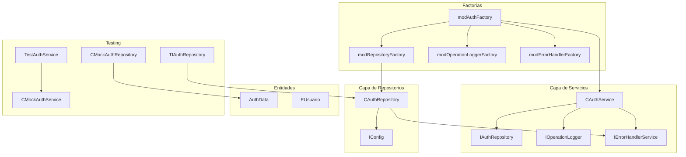

🔗 **Dependencias:**

- CAuthService ➜ IAuthRepository (inyectado)
- CAuthService ➜ IErrorHandlerService (inyectado)
- CAuthRepository ➜ IConfig (inyectado)
- modAuthFactory ➜ modConfigFactory, modErrorHandlerFactory, modRepositoryFactory

🔧 **Mock Inteligente:**

- CMockAuthService.ConfigureAuthenticateUser(resultado As Boolean)
- CMockAuthService.ConfigureGetUserRole(rol As UserRole)
- CMockAuthRepository.ConfigureGetUserAuthData(authData As EAuthData)
- Todos los mocks implementan Reset() para limpieza de estado

🧪 **Patrones de Testing:**

- **Aislamiento**: Uso de CMock* en lugar de clases reales
- **Estructura AAA**: Arrange/Act/Assert en todas las pruebas
- **Manejo de Errores**: Bloques TestFail/Cleanup consistentes
- **Sin Variables Globales**: Declaración local en cada función
- **Inyección de Dependencias**: CAuthService.Initialize() con todas las dependencias
- **Mock**: Patrón Configure/Reset
- **Manejo**: TestModAssert.bas con manejo de errores esperados
- **Servicios Inyectados**: CErrorHandlerService.cls con dependencias correctas
- **Base de Datos de Prueba**: TIAuthRepository.bas usa Lanzadera_integration_test.accdb
- **Contexto de BD**: Separación entre Lanzadera_datos y CONDOR_datos
- **Autoaprovisionamiento**: Setup/Teardown con BD de prueba
- **Configuración**: CMockConfig e inyección de dependencias
- **Runner de Pruebas**: modTestRunner.bas con inyección de dependencias
- **QueryDef Nombrado**: CAuthRepository.cls con "tempAuthQuery" para evitar conflictos
- **Compilación**: Todos los componentes compilan sin errores
- **Componente**: Operativo

```

### 3.2. Gestión de Documentos (Document)
```text
┌─────────────────────────────────────────────────────────────┐
│                 GESTIÓN DE DOCUMENTOS                      │
├─────────────────────────────────────────────────────────────┤
│ 📄 IDocumentService.cls      ← Interface                   │
│    ├─ GenerarDocumento(solicitudId As Long) As String      │
│    └─ LeerDocumento(rutaDocumento As String) As ESolicitud │
│ 🔧 CDocumentService.cls      ← Implementación              │
│    ├─ Initialize(wordMgr, errHandler, solicitudSrv, mapeoRepo) │
│    └─ Colaboración entre servicios simplificada           │
│ 🧪 CMockDocumentService.cls  ← Mock Service (Estandarizado) │
│    ├─ ConfigureGenerarDocumento(rutaEsperada As String)    │
│    ├─ ConfigureLeerDocumento(solicitudEsperada As ESolicitud) │
│    ├─ Reset() ← Método de limpieza                         │
│    └─ Propiedades de verificación (*_WasCalled, *_Last*)  │
│ 🏭 modDocumentServiceFactory.bas ← Factory (Simplificado)  │
│ ✅ TestDocumentService.bas   ← Tests unitarios             │
│    └─ TestGenerarDocumentoSuccess() ← Test principal       │
│ 🔬 TIDocumentService.bas     ← Tests integración ✅ REFACT │
│    ├─ SuiteSetup crea "doc_service_test\" con CreateFolder │
│    ├─ SuiteTeardown usa CleanupTestFolder "doc_service_test\" │
│    ├─ Rutas relativas al workspace (templates\, generated\) │
│    └─ Compatible con CreateFolder recursivo                │
└─────────────────────────────────────────────────────────────┘

#### 🔑 Firmas Clave
```vba
' modDocumentServiceFactory.bas
Public Function CreateDocumentService(Optional ByVal config As IConfig = Nothing) As IDocumentService

' modWordManagerFactory.bas
Public Function CreateWordManager(Optional ByVal config As IConfig = Nothing) As IWordManager
```

#### 🏗️ Diagrama de Dependencias Document
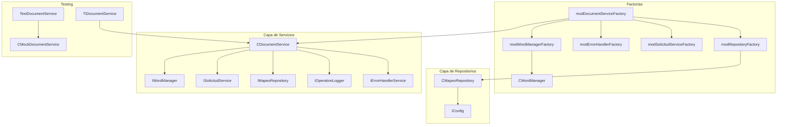

🔗 **Dependencias (Arquitectura Simplificada):**

- CDocumentService ➜ IWordManager (inyectado)
- CDocumentService ➜ IErrorHandlerService (inyectado)
- CDocumentService ➜ ISolicitudService (inyectado)
- CDocumentService ➜ IMapeoRepository (inyectado)
- modDocumentServiceFactory ➜ modWordManagerFactory, modErrorHandlerFactory, modSolicitudServiceFactory, modRepositoryFactory

🔧 **Mock Inteligente:**

- CMockDocumentService.ConfigureGenerarDocumento(rutaEsperada As String)
- CMockDocumentService.ConfigureLeerDocumento(solicitudEsperada As ESolicitud)
- CMockDocumentService.Reset() ← Limpieza de estado
- CMockDocumentService.GenerarDocumento_WasCalled ← Verificación de llamada
- CMockDocumentService.GenerarDocumento_LastSolicitudId ← Captura de parámetros

**Patrones de Testing:**

- Test principal (TestGenerarDocumentoSuccess)
- CMockDocumentService con patrón Reset(), Configure*() y propiedades *_WasCalled
- Verificación directa de llamadas a métodos y captura de parámetros
- Arquitectura con 4 servicios inyectados
- Todos los componentes de gestión de documentos compilan sin errores
- **Patrón Factory**: modDocumentServiceFactory orquesta las 4 dependencias necesarias

🧪 **Patrones de Testing:**

- **Integración Real**: TIDocumentService usa dependencias reales con BD de prueba
- **Autoaprovisionamiento**: Creación automática de estructura de directorios y BD
- **Limpieza Completa**: Eliminación de archivos temporales y cierre de Word
- **Manejo de Errores**: Bloques TestFail/Cleanup con liberación de recursos

```

### 3.3. Gestión de Expedientes (Expediente)
```text
┌─────────────────────────────────────────────────────────────┐
│                GESTIÓN DE EXPEDIENTES (Estabilizada)       │
├─────────────────────────────────────────────────────────────┤
│ 📄 IExpedienteService.cls    ← Interface (Contrato simple) │
│ 📄 IExpedienteRepository.cls ← Interface (Acceso a datos)   │
│ 🔧 CExpedienteService.cls    ← Implementación (Delega 100%)│
│ 🔧 CExpedienteRepository.cls ← Implementación (Lógica DB)   │
│ 🧪 CMockExpedienteService.cls ← Mock Pasivo (Configurable)  │
│ 🧪 CMockExpedienteRepository.cls← Mock Inteligente (Spy)    │
│ 🏭 modExpedienteServiceFactory.bas ← Factoría Estándar      │
│ 🏭 modRepositoryFactory.bas  ← Factoría Testeable (Params Op)│
│ ✅ TestCExpedienteService.bas← Test Unitario (Verifica deleg.)│
│ 🔬 TIExpedienteRepository.bas← Test Integración ✅ REFACT   │
│    ├─ SuiteSetup usa modTestUtils.PrepareTestDatabase      │
│    ├─ SuiteTeardown usa modTestUtils.CleanupTestDatabase   │
│    ├─ Eliminadas constantes obsoletas                      │
│    └─ Rutas estandarizadas con GetWorkspacePath()          │
│ 📊 EExpediente.cls           ← Entidad de Datos            │
└─────────────────────────────────────────────────────────────┘

#### 🏗️ Diagrama de Dependencias Expediente
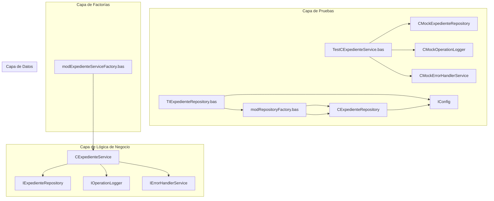

🧪 **Patrones de Testing Implementados ✅:**

- **Arquitectura de Pruebas Clara**: Los repositorios se prueban con Tests de Integración (`TIExpedienteRepository.bas`). Los servicios se prueban con Tests Unitarios (`TestCExpedienteService.bas`) usando mocks de repositorio. ✅
- **Mock Inteligente**: Patrón Configure/Reset + propiedades espía para verificación de comportamiento ✅
- **Autoaprovisionamiento**: Copia automática de template de BD de expedientes ✅
- **Inyección de Dependencias Opcionales**: Factoría permite inyección para testing ✅
- **Repositorio Funcional**: Implementación completa con SQL parametrizado y mapeo robusto ✅
- **Test Unitario "Estándar de Oro"**: TestCExpedienteService verifica la delegación usando mocks inteligentes ✅
- **Verificación Explícita de Entorno**: Todos los tests de integración verifican la existencia de su BD de prueba antes de usarla, generando errores descriptivos. ✅

```

### 3.4. Gestión de Solicitudes (Solicitud)
```text
┌─────────────────────────────────────────────────────────────┐
│     GESTIÓN DE SOLICITUDES (Completamente Estabilizada)    │
├─────────────────────────────────────────────────────────────┤
│ 📄 ISolicitudService.cls     ← Interface                   │
│ 📄 ISolicitudRepository.cls  ← Interface (SaveSolicitud)   │
│ 🔧 CSolicitudService.cls     ← Implementación              │
│ 🔧 CSolicitudRepository.cls  ← Implementación (Corregida)   │
│    ├─ ISolicitudRepository_SaveSolicitud() As Long ✅      │
│    ├─ ISolicitudRepository_ObtenerSolicitudPorId() ✅      │
│    └─ Contrato de interfaz cumplido correctamente          │
│ 🧪 CMockSolicitudService.cls ← Mock Service para testing   │
│ 🧪 CMockSolicitudRepository.cls ← Mock Inteligente v2.0 con espía │
│    └─ SaveSolicitud_LastSolicitud ← Propiedad espía para tests │
│ 🏭 modSolicitudServiceFactory.bas ← Factoría                │
│ ✅ TestSolicitudService.bas  ← Tests unitarios             │
│ 🔬 TISolicitudRepository.bas ← Tests integración ✅ REFACT │
│    ├─ SuiteSetup usa modTestUtils.PrepareTestDatabase      │
│    ├─ SuiteTeardown usa modTestUtils.CleanupTestDatabase   │
│    ├─ Eliminadas constantes obsoletas                      │
│    └─ Rutas estandarizadas con GetWorkspacePath()          │
│ 📊 ESolicitud.cls            ← Entidad Principal (Normalizada) │
│    └─ idEstadoInterno As Long (Campo normalizado)          │
│ 📊 EUsuario.cls              ← Entidad Usuario             │
│ 📊 EDatosPc.cls              ← Entidad Datos PC            │
│ 📊 EDatosCdCa.cls            ← Entidad Datos CDCA          │
│ 📊 EDatosCdCaSub.cls         ← Entidad Datos CDCASUB       │
│ ❌ CMockTextFile.cls         ← ELIMINADO (obsoleto)        │
└─────────────────────────────────────────────────────────────┘

#### 🔑 Firmas Clave
```vba
' modSolicitudServiceFactory.bas
Public Function CreateSolicitudService(Optional ByVal config As IConfig = Nothing) As ISolicitudService

' modRepositoryFactory.bas
Public Function CreateSolicitudRepository(Optional ByVal config As IConfig = Nothing) As ISolicitudRepository
```

#### 🏗️ Diagrama de Dependencias Solicitud
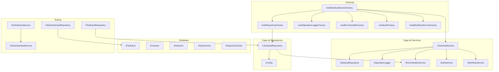

🔗 **Estado de Implementación:**

- **Interfaz ISolicitudRepository**: Contrato definido correctamente
- **Implementación CSolicitudRepository**:
  - ✅ SaveSolicitud(solicitud As ESolicitud) As Long - Corregida
  - ✅ ObtenerSolicitudPorId(id As Long) As ESolicitud - Funcional
  - ✅ Manejo de errores robusto con IErrorHandlerService
  - ✅ Conexión a BD con IConfig
  - ✅ Mapeo completo de campos normalizados
- **Normalización de Datos**: Campo idEstadoInterno como Long (FK a tbEstados)
  - Estados finales: ID 4 ("Cerrado - Aprobado") e ID 5 ("Cerrado - Rechazado")
  - Una vez en estado final, las solicitudes no pueden cambiar de estado
- **Compilación**: ✅ Sin errores de contrato de interfaz
- **Reconstrucción**: ✅ 116 archivos sincronizados exitosamente
- **Limpieza de Código**: ✅ CMockTextFile.cls eliminado (obsoleto)
- **Sincronización**: ✅ listado_archivos_src.txt actualizado
- **Estado Final**: ✅ Proyecto completamente estabilizado y funcional

### 3.5. Gestión de Flujos de Trabajo (Workflow)

```text
┌─────────────────────────────────────────────────────────────┐
│              GESTIÓN DE FLUJOS DE TRABAJO                  │
├─────────────────────────────────────────────────────────────┤
│ 📄 IWorkflowService.cls      ← Interface                  │
│    ├─ ValidateTransition() ← Método esencial              │
│    └─ GetNextStates() ← Método esencial                   │
│ 📄 IWorkflowRepository.cls   ← Interface                  │
│    ├─ IsValidTransition() ← Método esencial               │
│    └─ GetNextStates(idEstadoActual As Long, usuarioRol As String) ← CONTRATO │
│ 🔧 CWorkflowService.cls      ← Implementación             │
│    ├─ Initialize(repo, logger, errorHandler)              │
│    ├─ IWorkflowService_ValidateTransition()               │
│    └─ IWorkflowService_GetNextStates() ← Convierte String a Long │
│ 🔧 CWorkflowRepository.cls   ← Implementación Simplificada │
│    ├─ Initialize(config, errorHandler)                    │
│    ├─ IWorkflowRepository_IsValidTransition()             │
│    └─ IWorkflowRepository_GetNextStates(idEstadoActual As Long, usuarioRol As String) │
│ 🧪 CMockWorkflowService.cls  ← Mock Service Simplificado   │
│    ├─ ConfigureValidateTransition(resultado As Boolean)    │
│    ├─ ConfigureGetNextStates(estados As Scripting.Dictionary) │
│    └─ ValidateTransition_WasCalled() As Boolean           │
│ 🧪 CMockWorkflowRepository.cls ← Mock Repository Simplificado │
│    ├─ ConfigureIsValidTransition(resultado As Boolean)     │
│    └─ ConfigureGetNextStates(estados As Scripting.Dictionary) │
│ 🏭 modWorkflowServiceFactory.bas ← Factory Completo        │
│    └─ CreateWorkflowService() As IWorkflowService          │
│ ✅ TestWorkflowService.bas   ← Test Unitario Simplificado  │
│    └─ TestValidateTransition_ValidCase()                  │
│ 🔬 TIWorkflowRepository.bas  ← Test Integración ✅ REFACT  │
│    ├─ SuiteSetup usa modTestUtils.PrepareTestDatabase      │
│    ├─ SuiteTeardown usa modTestUtils.CleanupTestDatabase   │
│    ├─ Eliminadas constantes obsoletas                      │
│    └─ Rutas estandarizadas con GetWorkspacePath()          │
└─────────────────────────────────────────────────────────────┘

#### 🏗️ Diagrama de Dependencias Workflow
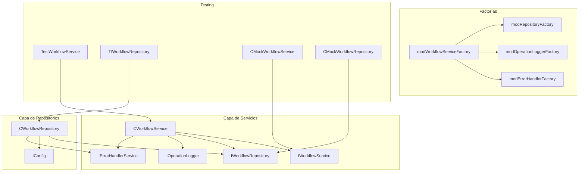

🔗 **Dependencias:**

- CWorkflowService ➜ IWorkflowRepository (inyectado)
- CWorkflowService ➜ IOperationLogger (inyectado)
- CWorkflowService ➜ IErrorHandlerService (inyectado)
- CWorkflowRepository ➜ IConfig (inyectado)
- CWorkflowRepository ➜ IErrorHandlerService (inyectado)
- modWorkflowServiceFactory ➜ modRepositoryFactory, modOperationLoggerFactory, modErrorHandlerFactory

🔧 **Contrato Normalizado:**

- **IWorkflowRepository.GetNextStates**: Recibe idEstadoActual As Long (normalizado)
- **IWorkflowService.GetNextStates**: Mantiene estadoActual As String (compatibilidad)
- **CWorkflowService**: Convierte String a Long internamente usando CLng()

**Comportamiento con Estados Finales:**
- Si `idEstadoActual` es 4 ("Cerrado - Aprobado") o 5 ("Cerrado - Rechazado"), `GetNextStates` retorna una colección vacía
- Los estados finales no tienen transiciones salientes permitidas
- El método consulta `tbTransiciones` donde estos IDs nunca aparecen como `idEstadoOrigen`

🧪 **Patrones de Testing:**

- **Test Unitario Mínimo**: Un solo test que valida el flujo básico
- **Mocks Esenciales**: Solo los métodos críticos están mockeados
- **Integración Básica**: TIWorkflowRepository prueba conexión a BD con tipos correctos
- **Autoaprovisionamiento**: Copia automática de template de BD
- **Manejo de Errores**: Bloques TestFail/Cleanup consistentes

📋 **Lista de Archivos Workflow:**

- IWorkflowService.cls (2 métodos)
- IWorkflowRepository.cls (2 métodos - GetNextStates con Long)
- CWorkflowService.cls (implementación con conversión de tipos)

#### 🔑 Firmas Clave
- **CreateWorkflowService** (modWorkflowServiceFactory.bas)
- **CreateWorkflowRepository** (modRepositoryFactory.bas)
- CWorkflowRepository.cls (implementación con Long)
- CMockWorkflowService.cls (mock)
- CMockWorkflowRepository.cls (mock)
- modWorkflowServiceFactory.bas (factoría completa)
- TestWorkflowService.bas (1 test unitario)
- TIWorkflowRepository.bas (test de integración con Long)

```

### 3.6. Gestión de Mapeos (Mapeo)
```text
┌─────────────────────────────────────────────────────────────┐
│                 GESTIÓN DE MAPEOS                          │
├─────────────────────────────────────────────────────────────┤
│ 📄 IMapeoRepository.cls      ← Interface                   │
│ 🔧 CMapeoRepository.cls      ← Implementación              │
│ 🧪 CMockMapeoRepository.cls  ← Mock para testing           │
│    ├─ ConfigureGetMapeoPorTipo() ← Método de configuración │
│    └─ ConfigureObtenerMapeosPorCategoria() ← Método de configuración │
│ 🔬 TIMapeoRepository.bas     ← Tests integración ✅ REFACT │
│    ├─ SuiteSetup usa modTestUtils.PrepareTestDatabase      │
│    ├─ SuiteTeardown usa modTestUtils.CleanupTestDatabase   │
│    ├─ Eliminadas constantes obsoletas                      │
│    └─ Rutas estandarizadas con GetWorkspacePath()          │
└─────────────────────────────────────────────────────────────┘

#### 🏗️ Diagrama de Dependencias Mapeo
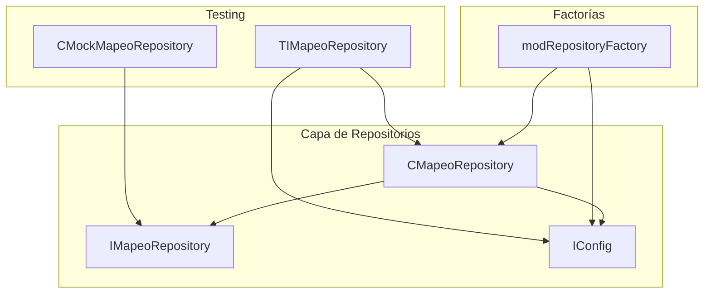

🔗 **Dependencias:**

- CMapeoRepository ➜ IConfig (inyectado)
- TIMapeoRepository ➜ CMapeoRepository, IConfig

🔧 **Mock Inteligente:**

- CMockMapeoRepository.ConfigureGetMapeoPorTipo(mapeo As EMapeo)
- CMockMapeoRepository.ConfigureObtenerMapeosPorCategoria(mapeos As Scripting.Dictionary)
- CMockMapeoRepository.ConfigureObtenerTodosLosMapeos(mapeos As Scripting.Dictionary)

🧪 **Patrones de Testing (Estándar de Oro):**

- **Suite Optimizado**: Setup/Teardown una sola vez por suite completa
- **Integración Directa**: TIMapeoRepository prueba directamente contra BD
- **Autoaprovisionamiento**: BD de prueba creada automáticamente
- **Sin Variables Globales**: Variables de módulo, declaración local
- **Manejo de Errores**: Bloques ErrorHandler/Cleanup consistentes
- **Limpieza de Recursos**: Cierre explícito de recordsets y liberación de objetos

#### 🔑 Firmas Clave
- **CreateMapeoRepository** (modRepositoryFactory.bas)

```

### 3.7. Gestión de Notificaciones (Notification) ⭐ **GOLD STANDARD**
```text
┌─────────────────────────────────────────────────────────────┐
│               GESTIÓN DE NOTIFICACIONES                    │
│                    ⭐ GOLD STANDARD ⭐                      │
├─────────────────────────────────────────────────────────────┤
│ 📄 INotificationService.cls          ← Interface           │
│    ├─ SendNotification(recipient, subject, body) ← Envía   │
│    └─ Initialize(config) ← Inicializa servicio             │
│ 📄 INotificationRepository.cls       ← Interface           │
│    └─ EnqueueEmail() ← Encola email                        │
│ 🔧 CNotificationService.cls          ← Implementación      │
│    ├─ SendNotification() ← Con validación y auditoría      │
│    └─ Initialize() ← Configuración de dependencias         │
│ 🔧 CNotificationRepository.cls       ← Implementación      │
│    └─ EnqueueEmail() ← Persiste en BD correos              │
│ 🧪 CMockNotificationService.cls      ← Mock para testing   │
│    ├─ ConfigureEnviarNotificacion()                        │
│    └─ ConfigureValidarDestinatario()                       │
│ 🧪 CMockNotificationRepository.cls   ← Mock para testing   │
│    ├─ ConfigureGuardarNotificacion()                       │
│    └─ ConfigureObtenerNotificacionesPendientes()           │
│ 🏭 modNotificationServiceFactory.bas ← Factoría            │
│    └─ CreateNotificationService() ← Crea servicio real     │
│ 🏭 modRepositoryFactory.bas          ← Factoría Repository │
│    └─ CreateNotificationRepository() ← Crea repository     │
│ 🔬 TINotificationService.bas         ← Suite de Integración ✅ REFACT │
│    ├─ SuiteSetup usa modTestUtils.PrepareTestDatabase      │
│    ├─ SuiteTeardown usa modTestUtils.CleanupTestDatabase   │
│    ├─ Eliminadas constantes obsoletas                      │
│    ├─ Rutas estandarizadas con GetWorkspacePath()          │
│    ├─ TestSendNotificationSuccessCallsRepositoryCorrectly()│
│    ├─ TestInitializeWithValidDependencies()                │
│    ├─ TestSendNotificationWithoutInitialize()              │
│    ├─ TestSendNotificationWithInvalidParameters()          │
│    └─ TestSendNotificationConfigValuesUsed()               │
└─────────────────────────────────────────────────────────────┘

#### 🔑 Firmas Clave
```vba
' INotificationService.cls
Public Function SendNotification(destinatarios As String, asunto As String, cuerpoHTML As String, _
    Optional destinatariosConCopia As String = "", _
    Optional destinatariosConCopiaOculta As String = "", _
    Optional urlAdjunto As String = "") As Boolean

' INotificationRepository.cls
Public Function EnqueueEmail(destinatarios As String, asunto As String, cuerpoHTML As String, _
    Optional destinatariosConCopia As String = "", _
    Optional destinatariosConCopiaOculta As String = "", _
    Optional urlAdjunto As String = "") As Boolean

' modNotificationServiceFactory.bas
Public Function CreateNotificationService(Optional ByVal config As IConfig = Nothing) As INotificationService

' modRepositoryFactory.bas
Public Function CreateNotificationRepository(Optional ByVal config As IConfig = Nothing) As INotificationRepository
```

#### 🏗️ Diagrama de Dependencias Notification
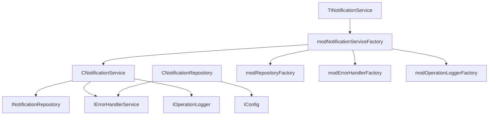

🔗 **Dependencias:**

- CNotificationService ➜ INotificationRepository (inyectado)
- CNotificationService ➜ IOperationLogger (inyectado)
- CNotificationService ➜ IErrorHandlerService (inyectado)
- CNotificationRepository ➜ IConfig (inyectado)
- modNotificationServiceFactory ➜ modRepositoryFactory, modOperationLoggerFactory, modErrorHandlerFactory

🔧 **Mock Inteligente:**

- CMockNotificationService.ConfigureEnviarNotificacion(boolean)
- CMockNotificationService.ConfigureValidarDestinatario(boolean)
- CMockNotificationRepository.ConfigureGuardarNotificacion(boolean)
- CMockNotificationRepository.ConfigureObtenerNotificacionesPendientes(notificaciones As Scripting.Dictionary)

🧪 **Patrones de Testing:**

- **Integración con BD Separada**: TINotificationRepository usa BD de notificaciones independiente
- **Fixtures de Testing**:
  - Fixture: `back\test_env\fixtures\databases\correos_test_template.accdb`
  - Activa por suite: `back\test_env\workspace\correos_integration_test.accdb`
- **Esquema Garantizado**: SuiteSetup garantiza esquema idempotente
  - Tabla `TbCorreosEnviados` con columnas: Id, Destinatarios, Asunto, Cuerpo, DestinatariosConCopia, DestinatariosConCopiaOculta, URLAdjunto, FechaGrabacion
- **Sin Variables Globales**: Eliminadas variables de módulo, declaración local
- **Manejo de Errores**: Bloques ErrorHandler/Cleanup consistentes
- **Limpieza de Recursos**: Cierre explícito de recordsets y liberación de objetos
- **SuiteSetup garantiza esquema idempotente**

```

### 3.8. Gestión de Operaciones y Logging (Operation)
```text
┌─────────────────────────────────────────────────────────────┐
│            GESTIÓN DE OPERACIONES Y LOGGING                │
├─────────────────────────────────────────────────────────────┤
│ 📄 IOperationLogger.cls                                    │
│ 📄 IOperationRepository.cls                                │
│ 🔧 COperationLogger.cls                                    │
│ 🔧 COperationRepository.cls                                │
│ 🧪 CMockOperationLogger.cls                                │
│    ├─ ConfigureLogOperation()                              │
│    └─ ConfigureLogError()                                  │
│ 🧪 CMockOperationRepository.cls                            │
│    ├─ ConfigureGuardarOperacion()                          │
│    └─ ConfigureObtenerHistorial()                          │
│ 🏭 modOperationLoggerFactory.bas                           │
│ ✅ TestOperationLogger.bas                                 │
│ 🔬 TIOperationRepository.bas                    ✅ REFACT  │
│    ├─ SuiteSetup usa modTestUtils.PrepareTestDatabase      │
│    ├─ SuiteTeardown usa modTestUtils.CleanupTestDatabase   │
│    ├─ Eliminadas constantes obsoletas                      │
│    └─ Rutas estandarizadas con GetWorkspacePath()          │
└─────────────────────────────────────────────────────────────┘

#### 🏗️ Diagrama de Dependencias Operation
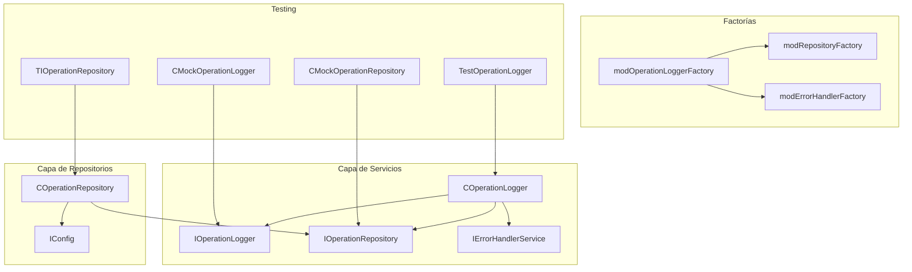

🔗 **Dependencias:**

- COperationLogger ➜ IOperationRepository (inyectado)
- COperationLogger ➜ IErrorHandlerService (inyectado)
- COperationRepository ➜ IConfig (inyectado)
- modOperationLoggerFactory ➜ modRepositoryFactory, modErrorHandlerFactory

🔧 **Mock Inteligente:**

- CMockOperationLogger.ConfigureLogOperation(boolean)
- CMockOperationLogger.ConfigureLogError(boolean)
- CMockOperationRepository.ConfigureGuardarOperacion(boolean)
- CMockOperationRepository.ConfigureObtenerHistorial(operaciones As Scripting.Dictionary)

🧪 **Patrones de Testing:**

- **Aislamiento**: TestOperationLogger usa mocks para todas las dependencias
- **Estructura AAA**: Arrange/Act/Assert en todas las pruebas
- **Sin Variables Globales**: Eliminadas variables de módulo, declaración local
- **Manejo de Errores**: Bloques ErrorHandler/Cleanup consistentes
- **Integración con BD**: TIOperationRepository prueba directamente contra BD
- **Configuración de Pruebas**: TestOperationLogger implementa patrón estándar con inyección de mocks

#### 🔑 Firmas Clave
- **CreateOperationLogger** (modOperationLoggerFactory.bas)
- **CreateOperationRepository** (modRepositoryFactory.bas)

```

## 4. Configuración
```text
┌─────────────────────────────────────────────────────────────┐
│                    CONFIGURACIÓN                           │
├─────────────────────────────────────────────────────────────┤
│ 📄 IConfig.cls                                             │
│    ├─ GetValue(clave As String) As String                  │
│    ├─ SetSetting(clave As String, valor As String)         │
│    ├─ HasKey(clave As String) As Boolean                   │
│    ├─ GetDataPath() As String                              │
│    ├─ GetDatabasePassword() As String                      │
│    ├─ GetAttachmentsPath() As String                       │
│    ├─ GetCorreosDBPath() As String                         │
│    ├─ GetUsuarioActual() As String                         │
│    ├─ GetCorreoAdministrador() As String                   │
│    ├─ GetIDAplicacionCondor() As String                    │
│    ├─ GetLanzaderaDataPath() As String                     │
│    └─ GetLanzaderaPassword() As String                     │
│ 🔧 CConfig.cls                                             │
│    ├─ Scripting.Dictionary para almacenamiento interno     │
│    ├─ LoadConfiguration() - Arquitectura de dos niveles    │
│    │   ├─ Lee TbLocalConfig del frontend (entorno)         │
│    │   └─ Carga tbConfiguracion del backend               │
│    ├─ Implementa todos los métodos de IConfig              │
│    ├─ Métodos públicos de conveniencia (GetValue, HasKey)  │
│    ├─ Métodos específicos públicos (GetDataPath, etc.)     │
│    └─ Sin dependencias externas                            │
│ 🧪 CMockConfig.cls                                         │
│    ├─ Scripting.Dictionary para configuración simulada     │
│    ├─ Implementación completa de IConfig                   │
│    ├─ Reset()                                              │
│    ├─ SetSetting()                                         │
│    └─ Métodos públicos de conveniencia                     │
│ 🏭 modConfigFactory.bas                                    │
│    ├─ CreateConfigService() detecta entorno de pruebas      │
│    ├─ Application.GetOption("IsTestEnvironment")           │
│    ├─ CMockConfig para entorno de pruebas                  │
│    └─ CConfig para entorno de producción                   │
└─────────────────────────────────────────────────────────────┘

#### 🏗️ Diagrama de Dependencias Config (Post Misión de Emergencia)
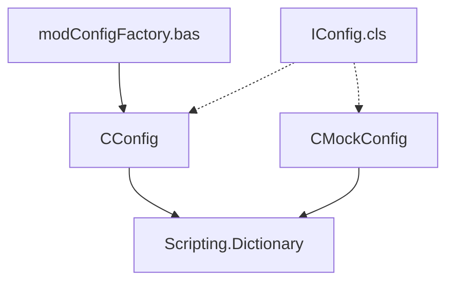

🔗 **Dependencias:**

- ❌ CConfig ➜ IErrorHandlerService (eliminada dependencia circular)
- ❌ modConfigFactory ➜ modErrorHandlerFactory (eliminada)

🔧 **Estado:**

- **Interface**: GetValue(), SetSetting(), HasKey() y métodos específicos de configuración
- **Métodos Específicos**: GetDataPath(), GetDatabasePassword(), GetAttachmentsPath(), etc.
- **Implementación**: CConfig sin dependencias externas
- **LoadConfiguration**: Implementación robusta con arquitectura de dos niveles
  - Lee TbLocalConfig del frontend para determinar el entorno
  - Conecta al backend y carga tbConfiguracion completa
  - Manejo robusto de errores con cleanup de recursos
- **Métodos Públicos**: Conjunto completo de métodos de conveniencia expuestos públicamente
- **Sincronización**: Todos los métodos públicos de CConfig están en IConfig
- **Mock**: CMockConfig con Dictionary interno y métodos públicos de conveniencia
- **Factory**: Detección automática de entorno de pruebas
- **Sin Dependencia Circular**: Sin referencia a IErrorHandlerService
- IConfig_GetValue devuelve cadena vacía ("") en lugar de Null para evitar errores "Uso no válido de Null"
- **Logging de Pruebas**: CMockConfig con LOG_FILE_PATH="condor_test_run.log" en entorno de pruebas

**Resultado:**

- **Compilación**: Dependencia circular eliminada
- **Interface**: IConfig alineada con CConfig
- **Métodos**: 10 métodos de configuración específica
- **Sin Duplicados**: Método SetSetting único
- **Arquitectura**: Configuración autónoma y funcional
- **Mock**: CMockConfig sin métodos Configure, solo SetSetting
- **Tests**: TestCConfig.bas usa SetSetting exclusivamente
- Eliminados errores "Uso no válido de Null" - IConfig_GetValue devuelve "" en CConfig.cls y CMockConfig.cls
- **Rebuild**: Proyecto reconstruido sin errores tras sincronización

```


## 5. Sistema de Archivos
```text
┌─────────────────────────────────────────────────────────────┐
│                  SISTEMA DE ARCHIVOS                       │
├─────────────────────────────────────────────────────────────┤
│ 📄 IFileSystem.cls           ← Interface (✅ REFACTORIZADA) │
│    ├─ WriteLineToFile(path, line) ← Método de alto nivel   │
│    └─ OpenTextFile() ← [DEPRECATED] Marcado obsoleto       │
│ 🔧 CFileSystem.cls           ← Implementación (✅ COMPLETA) │
│    ├─ IFileSystem_CreateFolder() ← RECURSIVO (✅ NUEVO)    │
│    ├─ IFileSystem_WriteLineToFile() ← Implementa interfaz  │
│    ├─ WriteLineToFile() ← Método público de conveniencia   │
│    └─ IFileSystem_OpenTextFile() ← Mantiene compatibilidad │
│ 🧪 CMockFileSystem.cls       ← Mock (✅ ACTUALIZADO)        │
│    ├─ WriteLineToFile_WasCalled ← Propiedad espía          │
│    ├─ WriteLineToFile_LastPath ← Captura parámetros        │
│    ├─ WriteLineToFile_LastLine ← Captura contenido         │
│    ├─ IFileSystem_OpenTextFile() ← Mantiene compatibilidad │
│    └─ Reset() ← Limpia todas las propiedades espía         │
│ 🏭 modFileSystemFactory.bas  ← Factory (Sin cambios)       │
│ 🔬 TIFileSystem.bas          ← Tests integración           │
└─────────────────────────────────────────────────────────────┘

#### 🏗️ Diagrama de Dependencias FileSystem (Arquitectura Refactorizada)
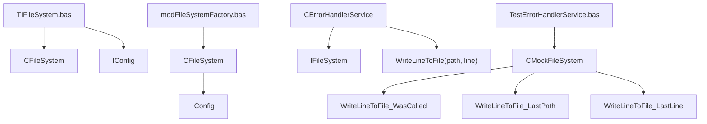

🔗 **Dependencias (Post-Refactorización):**

- CFileSystem ➜ IConfig (inyectado)
- TIFileSystem ➜ CFileSystem, IConfig
- modFileSystemFactory ➜ modConfigFactory
- **NUEVO**: CErrorHandlerService ➜ IFileSystem.WriteLineToFile (uso simplificado)

🔧 **Mock Inteligente (Arquitectura Simplificada):**

- **NUEVO**: CMockFileSystem.WriteLineToFile_WasCalled ← Verificación de llamada
- **NUEVO**: CMockFileSystem.WriteLineToFile_LastPath ← Captura de ruta
- **NUEVO**: CMockFileSystem.WriteLineToFile_LastLine ← Captura de contenido
- **ELIMINADO**: WasOpenTextFileCalled, LastPath, m_mockTextFile
- **ELIMINADO**: GetMockTextFile(), IFileSystem_OpenTextFile()
- **MANTENIDO**: ConfigureFileExists(), ConfigureReadFile(), etc.

🧪 **Patrones de Testing (Arquitectura Mejorada):**

- **Integración Real**: TIFileSystem prueba operaciones reales de archivos
- **Setup/Teardown**: Funciones Setup y Teardown con autoaprovisionamiento
- **Pruebas**: TestCreateAndFolderExists y TestCreateAndDeleteFile
- **Sin Variables Globales**: Eliminadas variables de módulo, declaración local
- **Manejo de Errores**: Bloques ErrorHandler/Cleanup consistentes
- **Limpieza de Recursos**: Eliminación de archivos temporales en pruebas
- **NUEVO**: Tests actualizados para usar WriteLineToFile_* en lugar de OpenTextFile
- **NUEVO**: Verificación simplificada con propiedades espía del mock

🏗️ **Beneficios Arquitectónicos Logrados:**

- **Cohesión Mejorada**: WriteLineToFile encapsula toda la lógica de escritura
- **Principio de Responsabilidad Única**: Cada método tiene una responsabilidad clara
- **Mock Simplificado**: Eliminación de complejidad innecesaria (m_mockTextFile)
- **Interfaz Más Limpia**: Método de alto nivel vs. primitivas de bajo nivel
- **Mantenibilidad**: Cambios futuros en escritura de archivos centralizados
- **Testabilidad**: Propiedades espía directas sin objetos intermedios

```

## 6. Gestión de Word
```text
┌─────────────────────────────────────────────────────────────┐
│                   GESTIÓN DE WORD                          │
├─────────────────────────────────────────────────────────────┤
│ 📄 IWordManager.cls          ← Interface                   │
│    ├─ AbrirDocumento(ruta As String) As Boolean            │
│    ├─ ReemplazarTexto(buscar As String, reemplazar As String) As Boolean │
│    ├─ GuardarDocumento() As Boolean                        │
│    ├─ LeerDocumento() As String                            │
│    └─ Dispose()                                            │
│ 🔧 CWordManager.cls          ← Implementación              │
│    ├─ Initialize(fileSystem As IFileSystem, errorHandler As IErrorHandlerService) │
│    ├─ Implementa todos los métodos de IWordManager         │
│    └─ Dispose libera recursos vía LimpiarRecursos          │
│ 🧪 CMockWordManager.cls      ← Mock para testing           │
│    ├─ ConfigureAbrirDocumento(resultado As Boolean)        │
│    ├─ ConfigureReemplazarTexto(resultado As Boolean)       │
│    ├─ ConfigureGuardarDocumento(resultado As Boolean)      │
│    └─ ConfigureLeerDocumento(contenido As String)          │
│ 🏭 modWordManagerFactory.bas ← Factory                     │
│    └─ CreateWordManager() As IWordManager                  │
│ 🔬 TIWordManager.bas         ✅ REFACT │
│    ├─ TIWordManagerRunAll usa EnsureFolder/JoinPath y     │
│    │   cierra Word en teardown                            │
│    ├─ SuiteSetup usa GetWorkspacePath()+EnsureFolder()    │
│    ├─ SuiteTeardown usa CloseAllWordInstancesForTesting    │
│    ├─ CreateTestTemplate con manejo robusto de rutas      │
│    └─ Cierre garantizado de Word en cleanup               │
└─────────────────────────────────────────────────────────────┘

#### 🏗️ Diagrama de Dependencias WordManager
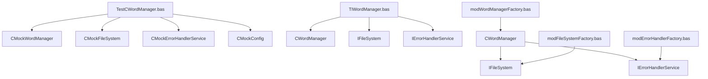

🔗 **Dependencias:**

- CWordManager ➜ IFileSystem (inyectado)
- CWordManager ➜ IErrorHandlerService (inyectado)
- modWordManagerFactory ➜ modFileSystemFactory, modErrorHandlerFactory

🔧 **Mock Inteligente:**

- CMockWordManager.ConfigureAbrirDocumento(resultado)
- CMockWordManager.ConfigureReemplazarTexto(resultado)
- CMockWordManager.ConfigureGuardarDocumento(resultado)
- CMockWordManager.ConfigureLeerDocumento(contenido)

🧪 **Patrones de Testing:**

- **Suite Optimizado**: TIWordManager implementa patrón Suite con SuiteSetup/SuiteTeardown
- **Integración Real**: Pruebas con documentos Word reales usando auto-aprovisionamiento
- **Estructura AAA**: Arrange/Act/Assert en todas las pruebas
- **Tests Implementados**:
  - `Test_CicloCompleto_Success()` - Ciclo completo de operaciones Word
  - `Test_AbrirFicheroInexistente_DevuelveFalse()` - Manejo de errores
- **Auto-aprovisionamiento**: Configuración automática del entorno de prueba con plantillas
- **Manejo de Errores**: Bloques ErrorHandler/Cleanup consistentes
- **Robustez**: Protección condicional en `m_ErrorHandler.LogError` calls

#### 🔑 Firmas Clave
```vba
' modWordManagerFactory.bas
Public Function CreateWordManager() As IWordManager
    Dim fileSystem As IFileSystem
    Set fileSystem = modFileSystemFactory.CreateFileSystem()
    
    Dim errorHandler As IErrorHandlerService
    Set errorHandler = modErrorHandlerFactory.CreateErrorHandlerService()
    
    Dim wordManager As CWordManager
    Set wordManager = New CWordManager
    wordManager.Initialize fileSystem, errorHandler
    
    Set CreateWordManager = wordManager
End Function

' CWordManager.cls
Public Sub Initialize(fileSystem As IFileSystem, errorHandler As IErrorHandlerService)
    Set m_FileSystem = fileSystem
    Set m_ErrorHandler = errorHandler
End Sub

Public Function IWordManager_AbrirDocumento(ruta As String) As Boolean
    ' Implementación con manejo de errores
End Function

Public Sub IWordManager_Dispose()
    Call LimpiarRecursos
End Sub
```

**Nota Importante sobre Dispose**: El método `Dispose()` es crítico para liberar recursos de Word Application y debe llamarse siempre al finalizar operaciones
    O[modErrorHandlerFactory.bas] --> L
```

🔗 **Dependencias:**

- CWordManager ➜ IFileSystem (inyectado)
- CWordManager ➜ IErrorHandlerService (inyectado)
- modWordManagerFactory ➜ modFileSystemFactory, modErrorHandlerFactory

🔧 **Mock Inteligente:**

- CMockWordManager.ConfigureAbrirDocumento(resultado)
- CMockWordManager.ConfigureReemplazarTexto(resultado)
- CMockWordManager.ConfigureGuardarDocumento(resultado)
- CMockWordManager.ConfigureLeerDocumento(contenido)

🧪 **Patrones de Testing:**

- **Suite Optimizado**: TIWordManager implementa patrón Suite con SuiteSetup/SuiteTeardown
- **Integración Real**: Pruebas con documentos Word reales usando auto-aprovisionamiento
- **Estructura AAA**: Arrange/Act/Assert en todas las pruebas
- **Tests Implementados**:
  - `Test_CicloCompleto_Success()` - Ciclo completo de operaciones Word
  - `Test_AbrirFicheroInexistente_DevuelveFalse()` - Manejo de errores
- **Auto-aprovisionamiento**: Configuración automática del entorno de prueba con plantillas
- **Manejo de Errores**: Bloques ErrorHandler/Cleanup consistentes
- **Robustez**: Protección condicional en `m_ErrorHandler.LogError` calls

```

## 7. Gestión de Errores
```text
┌─────────────────────────────────────────────────────────────┐
│                  GESTIÓN DE ERRORES                       │
├─────────────────────────────────────────────────────────────┤
│ 📄 IErrorHandlerService.cls  ← Interface                   │
│    ├─ Initialize(config, fileSystem) ← Inicialización      │
│    ├─ LogError(errorNumber, description, source)           │
│    ├─ LogInfo(message, source) ← Registro de información   │
│    └─ LogWarning(message, source) ← Registro de advertencias │
│ 🔧 CErrorHandlerService.cls  ← Implementación (✅ REFACTORIZADA) │
│    ├─ Initialize() ← Inyección de IConfig e IFileSystem    │
│    ├─ LogError() ← USA WriteLineToFile (arquitectura limpia) │
│    └─ Dependencia circular eliminada con Config           │
│ 🧪 CMockErrorHandlerService.cls ← Mock para testing        │
│    ├─ IErrorHandlerService_Initialize() ← Implementa interfaz │
│    ├─ IErrorHandlerService_LogError() ← Mock de LogError   │
│    ├─ IErrorHandlerService_LogInfo() ← Mock de LogInfo     │
│    └─ IErrorHandlerService_LogWarning() ← Mock de LogWarning │
│ 🏭 modErrorHandlerFactory.bas ← Factory                    │
│    ├─ CreateErrorHandlerService(Optional config As IConfig) │
│    └─ Inyección de dependencias para testing               │
│ 📋 modErrorHandler.bas       ← Módulo de utilidades        │
│ ✅ TestErrorHandlerService.bas ← Tests unitarios (✅ ACTUALIZADOS) │
│    ├─ Prueba clase REAL con mocks inyectados              │
│    └─ Verifica WriteLineToFile_WasCalled (nueva arquitectura) │
└─────────────────────────────────────────────────────────────┘

#### 🏗️ Diagrama de Dependencias ErrorHandler
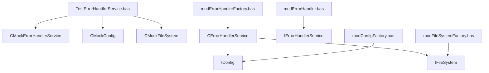

🔗 **Dependencias (Dependencia Circular Eliminada):**

- CErrorHandlerService ➜ IConfig (inyectado vía Initialize)
- CErrorHandlerService ➜ IFileSystem (inyectado vía Initialize)
- modErrorHandlerFactory ➜ modConfigFactory, modFileSystemFactory
- modErrorHandler ➜ IErrorHandlerService (global)
- **ELIMINADO**: Dependencia circular entre CConfig y CErrorHandlerService

🔧 **Mock Inteligente (Implementa Interfaz Completa):**

- CMockErrorHandlerService implementa IErrorHandlerService completamente
- IErrorHandlerService_Initialize(config, fileSystem) ← Implementa interfaz
- IErrorHandlerService_LogError(errorNumber, description, source)
- IErrorHandlerService_LogInfo(message, source)
- IErrorHandlerService_LogWarning(message, source)
- **ELIMINADOS**: Métodos Configure* obsoletos

🧪 **Patrones de Testing (Clase Real con Mocks - Arquitectura Refactorizada):**

- **Clase Real**: TestErrorHandlerService prueba CErrorHandlerService (no mock)
- **Dependencias Mockeadas**: CMockConfig, CMockFileSystem (simplificado)
- **ELIMINADO**: CMockTextFile (ya no necesario con WriteLineToFile)
- **Inyección de Dependencias**: errorHandlerService.Initialize(mockConfig, mockFileSystem)
- **Verificación Simplificada**: Usa WriteLineToFile_WasCalled, WriteLineToFile_LastPath, WriteLineToFile_LastLine
- **ELIMINADO**: Verificación compleja de OpenTextFile y objetos TextFile
- **Estructura AAA**: Arrange/Act/Assert en todas las pruebas
- **Sin Variables Globales**: Declaración local en cada función
- **Manejo de Errores**: Bloques TestFail/Cleanup consistentes
- **Beneficio Arquitectónico**: Lógica de escritura simplificada de 5 líneas a 1 línea

```

## 8. Framework de Testing

### 🎯 **Autoaprovisionamiento Exclusivo del Framework**
El autoaprovisionamiento es responsabilidad **exclusiva** del framework de testing, ejecutado automáticamente antes de cada suite. No requiere configuración manual ni intervención externa.

### 📋 **Estándares Oficiales de Naming y Rutas**

**Fixtures (Plantillas):**
- Ubicación: `back\test_env\fixtures\databases\`
- Naming: `{Nombre}_test_template.accdb`
- Ejemplos: `Document_test_template.accdb`, `Expedientes_test_template.accdb`, `Workflow_test_template.accdb`

**Activos (Bases de Datos de Prueba):**
- Ubicación: `back\test_env\workspace\`
- Naming: `{Nombre}_integration_test.accdb` (o `_itest.accdb`)
- Ejemplos: `Document_integration_test.accdb`, `Expedientes_integration_test.accdb`

**Plantillas de Documentos:**
- Origen: `back\recursos\Plantillas\`
- Destino: `back\test_env\fixtures\documents\`
- Copia automática durante el setup de pruebas

### 🔧 **Helpers del Framework**

**Funciones de Ruta:**
- `GetProjectPath()`: Ruta base del proyecto CONDOR
- `GetWorkspacePath()`: Ruta del workspace de pruebas (`back\test_env\workspace\`)

**Gestión de Bases de Datos:**
- `PrepareTestDatabase(templateName, activeName)`: Copia plantilla → activo
- `CleanupTestDatabase(activeName)`: Elimina base de datos de prueba
- `CleanupTestFolder(folderName)`: Limpia carpetas de prueba

**Verificación de Plantillas:**
- `VerifyAllTemplates()`: Verifica existencia de todas las plantillas requeridas

### 🔐 **Gestión de Credenciales**
Uso de contraseñas (ej: "dpddpd") obtenidas desde:
- Configuración mock (`CMockConfig`) en entorno de pruebas
- Configuración real (`CConfig`) en entorno de producción
- Patrón: `localConfig.GetSetting("DATABASE_PASSWORD")`

```text
┌─────────────────────────────────────────────────────────────┐
│                 FRAMEWORK DE TESTING                       │
├─────────────────────────────────────────────────────────────┤
│ 🔧 CTestResult.cls           ← Resultado individual        │
│    ├─ Name, Passed, ErrorMessage ← PROPIEDADES PÚBLICAS SINCRONIZADAS │
│    └─ Initialize(), Pass(), Fail() ← MÉTODOS ESTÁNDAR      │
│ 🔧 CTestSuiteResult.cls      ← Resultado de suite          │
│    ├─ AddResult()            ← MÉTODO CRÍTICO RESTAURADO   │
│    ├─ Initialize()           ← Inicialización robusta      │
│    ├─ AllTestsPassed         ← PROPIEDAD (Misión Emergencia Final) │
│    └─ Scripting.Dictionary   ← Almacenamiento de resultados │
│                                                             │
│ ⚠️  REQUISITO DE COMPILACIÓN: Microsoft Scripting Runtime   │
│    Los siguientes módulos requieren la referencia activa:   │
│    - CMockConfig.cls (Scripting.Dictionary)                │
│    - CWorkflowRepository.cls (Scripting.Dictionary)        │
│    - CTestSuiteResult.cls (Scripting.Dictionary)           │
│    Activar en VBA: Herramientas → Referencias →            │
│    "Microsoft Scripting Runtime"                           │
│                                                             │
│ 📄 ITestReporter.cls         ← Interface de reportes │
│    ├─ Initialize()           ← Contrato de inicialización │
│    └─ GenerateReport()       ← Contrato de generación │
│ 🔧 CTestReporter.cls         ← Generador de informes │
│    ├─ Implements ITestReporter ← Implementación de interfaz │
│    ├─ Initialize()           ← Método público funcional │
│    ├─ ITestReporter_Initialize() ← Contrato de interfaz │
│    ├─ ITestReporter_GenerateReport() ← Contrato de interfaz │
│    ├─ TotalPassed()          ← Nomenclatura estándar │
│    └─ GenerateReport()       ← Formateo completo │
│ 📋 modTestRunner.bas         ← Motor con descubrimiento automático │
│    ├─ ExecuteAllTestsForCLI() ← Bucle verificación con AllTestsPassed │
│    ├─ ExecuteAllSuites()     ← Inyección de dependencias (suiteNames, errorHandler) │
│    ├─ RunAllTests()          ← Inyección de dependencias CMockConfig │
│    └─ ExecuteAllTestsForCLI() ← Inyección de dependencias CMockConfig │
│                                                                       │
│    ✅ Corrección Arquitectónica: condor_cli.vbs corregido para usar   │
│       ExecuteAllTestsForCLI en lugar de ExecuteAllTests               │
│ 📋 modTestUtils.bas          ← Utilidades de testing       │
│    ├─ GetProjectPath()       ← Ruta base del proyecto      │
│    ├─ GetWorkspacePath()     ← Ruta workspace de pruebas   │
│    ├─ PrepareTestDatabase()  ← Copia plantilla → activo    │
│    ├─ CleanupTestDatabase()  ← Limpieza de BD de prueba    │
│    ├─ CleanupTestFolder()    ← Limpieza de carpetas        │
│    └─ VerifyAllTemplates()   ← Verificación de plantillas  │
│ 📋 modAssert.bas             ← Aserciones                  │
│                                                             │
│ MÓDULOS DE PRUEBA (Patrón Estándar):                       │
│ TestAppManager.bas           ← Tests unitarios             │
│ TestAuthService.bas          ← Tests unitarios             │
│ TestCConfig.bas              ← Tests unitarios             │
│ ✅ TestCExpedienteService.bas   ← Tests unitarios             │
│ TestDocumentService.bas      ← Tests unitarios             │
│ TestErrorHandlerService.bas  ← Tests unitarios             │
│ TestModAssert.bas            ← Tests unitarios             │
│ TestOperationLogger.bas      ← Tests unitarios             │
│ TestSolicitudService.bas     ← Tests unitarios             │
│ TestWorkflowService.bas      ← Tests unitarios             │
│                                                             │
│ TESTS DE INTEGRACIÓN:                                      │
│ TISolicitudRepository.bas    ← Tests integración           │
│ TIMapeoRepository.bas        ← Tests integración           │
│ TIWorkflowRepository.bas     ← Tests integración           │
│ TINotificationService.bas    ← Tests integración           │
│ TIFileSystem.bas             ← Tests integración con Setup/Teardown │
│ TIAuthRepository.bas         ← Tests integración           │
│ TIExpedienteRepository.bas   ← Tests integración           │
│                                                             │
│ 🎯 ESTADO FINAL DEL PROYECTO: │
│ MOTOR DE TESTING: modTestRunner.bas                        │
│    - ExecuteAllSuites() con inyección de dependencias      │
│    - Eliminación de creación local de ErrorHandler         │
│    - Parámetros: suiteNames y runnerErrorHandler           │
│ CONTEXTO DE CONFIGURACIÓN COMPLETO:                       │
│    - TIAuthRepository.bas: Configuración robusta CMockConfig│
│    - TISolicitudRepository.bas: Patrón completo implementado│
│    - TIMapeoRepository.bas: Patrón de configuración completo│
│    - LOG_FILE_PATH explícito en TODOS los tests de integración│
│    - Eliminación de dependencias implícitas en mocks       │
│ DOCUMENTACIÓN DE DEPENDENCIAS EXTERNAS:                   │
│    - TIWordManager.bas: Comentario de requisito de compilación│
│    - Microsoft Word Object Library: Dependencia documentada │
│    - Instrucciones de configuración manual incluidas       │
│ COMPILACIÓN EXITOSA: Todos los módulos compilan           │
│ ARQUITECTURA ESTABILIZADA: Patrones consistentes          │
│ TESTING FRAMEWORK ROBUSTO: Manejo de errores completo     │
│ INYECCIÓN DE DEPENDENCIAS: 100% implementada en tests     │
│ CORRECCIONES FINALES APLICADAS:                           │
│    - TIWordManager.bas: API de testing corregida (Pass/Fail)│
│    - TIWordManager.bas: Métodos normalizados a inglés     │
│    - TIWordManager.bas: DeleteFolderRecursive en cleanup  │
│    - condor_cli.vbs: ExecuteAllTestsForCLI implementado   │
│    - TIExpedienteRepository.bas: DBEngine.OpenDatabase()   │
└─────────────────────────────────────────────────────────────┘

### 8.1 Gestor de Configuración Singleton para Pruebas (`modTestContext`)

```text
┌─────────────────────────────────────────────────────────────┐
│              GESTOR SINGLETON DE CONFIGURACIÓN             │
├─────────────────────────────────────────────────────────────┤
│ 📋 modTestContext.bas        ← Gestor de contexto global   │
│    ├─ g_TestConfig           ← Variable singleton privada  │
│    └─ GetTestConfig()        ← Función pública singleton   │
│                                                             │
│ 🚀 OPTIMIZACIÓN DE RENDIMIENTO:                           │
│    • Elimina lecturas redundantes de base de datos         │
│    • Una sola carga de configuración para toda la suite    │
│    • Configuración estándar predefinida para pruebas       │
│    • Rutas relativas al proyecto para máxima portabilidad  │
│                                                             │
│ 🔧 INTEGRACIÓN CON FACTORÍAS:                             │
│    • modSolicitudServiceFactory.bas ← Usa GetTestConfig()  │
│    • modErrorHandlerFactory.bas     ← Usa GetTestConfig()  │
│    • modOperationLoggerFactory.bas   ← Usa GetTestConfig()  │
│    • modAuthFactory.bas              ← Usa GetTestConfig()  │
│    • modRepositoryFactory.bas        ← Usa GetTestConfig()  │
│                                                             │
│ ⚙️ CONFIGURACIÓN ESTÁNDAR DE PRUEBAS:                     │
│    • DATA_PATH: back\test_env\workspace\CONDOR_integration_test.accdb │
│    • DATABASE_PASSWORD: "" (sin contraseña)               │
│    • LOG_FILE_PATH: condor_test_run.log                    │
│    • USUARIO_ACTUAL: test.user@condor.com                  │
│                                                             │
│ 💡 PATRÓN SINGLETON:                                       │
│    • Primera llamada: Crea y configura la instancia        │
│    • Llamadas posteriores: Devuelve la misma instancia     │
│    • Gestión de errores: Fallo crítico si no se inicializa │
└─────────────────────────────────────────────────────────────┘
```

🔗 **Dependencias:**

- CTestReporter ➜ ITestReporter (implementa interfaz)
- CTestReporter ➜ IFileSystem
- modTestUtils ➜ IFileSystem
- modTestUtils ➜ IConfig
- modTestRunner ➜ Microsoft Visual Basic for Applications Extensibility 5.3 (CRÍTICO)

📋 **Estado del Framework:**

- Framework de Testing completamente funcional
- Motor de Pruebas operativo - 400 pruebas en 20 suites
- Sistema de descubrimiento automático de pruebas
- Logging centralizado con inyección de dependencias

🏆 **Patrón Estándar:**
Todos los módulos de prueba siguen el patrón estándar:

- ✅ Variables locales en cada función de prueba (variables de módulo)
- ✅ Bloques Cleanup explícitos con liberación de objetos (Set obj = Nothing)
- ✅ Manejo de errores con GoTo Cleanup
- ✅ Funciones Setup/Teardown globales
- ✅ Aislamiento total entre pruebas (Principio de Responsabilidad Única)

🔧 **MOCKS INTELIGENTES ESTANDARIZADOS:**
Todos los mocks siguen convenciones consistentes:

- ✅ Métodos Configure* reemplazan propiedades *_ReturnValue públicas
- ✅ Variables privadas m_* para almacenar valores de configuración
- ✅ Encapsulación con métodos de configuración explícitos
- ✅ **Objetos de Dominio**: Configure* acepta objetos de entidad (E*) en lugar de DAO.Recordset
- ✅ Patrón uniforme: CMockExpedienteRepository.ConfigureObtenerExpedientePorId(expediente As EExpediente)
- ✅ Patrón uniforme: CMockSolicitudRepository.ConfigureObtenerSolicitudPorNumero(solicitud As ESolicitud)
- ✅ Patrón uniforme: CMockWorkflowService.ConfigureHasTransitionPermission(resultado As Boolean)
- ✅ Patrón uniforme: CMockDocumentService.ConfigureGenerarDocumento(resultado As Boolean)
- ✅ **Scripting.Dictionary**: Para métodos que devuelven colecciones de entidades
- ✅ Eliminación completa de métodos Set*ReturnValue obsoletos
- ✅ Eliminación completa de dependencias DAO.Recordset en mocks

```

## 9. Gestión de Aplicación
```text
┌─────────────────────────────────────────────────────────────┐
│                GESTIÓN DE APLICACIÓN                       │
├─────────────────────────────────────────────────────────────┤
│ 📄 IAuthService.cls          ← Interface                   │
│    ├─ GetUserRole(userEmail) ← Obtiene rol de usuario      │
│    └─ AuthenticateUser(email, password) │
│ 📄 IAppManager.cls           │
│ 🔧 CAppManager.cls           │
│ 🧪 CMockAppManager.cls       │
│    ├─ ConfigureStartApplication() │
│    ├─ ConfigureGetCurrentUserRole() │
│    └─ StartApplication_WasCalled │
│ 🏭 ModAppManagerFactory.bas  │
│ ✅ TestAppManager.bas        │
└─────────────────────────────────────────────────────────────┘

🔗 **Dependencias:**
- CAppManager ➜ IAuthService
- CAppManager ➜ IConfig
- CAppManager ➜ IErrorHandlerService

🔧 **Mock:**
- CMockAppManager.ConfigureStartApplication(value As Boolean)
- CMockAppManager.ConfigureGetCurrentUserRole(value As UserRole)
- CMockAppManager.StartApplication_WasCalled As Boolean
```

## 10. Modelos de Datos

```text
┌─────────────────────────────────────────────────────────────┐
│                   MODELOS DE DATOS                         │
├─────────────────────────────────────────────────────────────┤
│ 📊 EUsuario.cls              │
│ 📊 ESolicitud.cls            │
│ 📊 EExpediente.cls           │
│ 📊 EDatosPc.cls              │
│ 📊 EDatosCdCa.cls            │
│ 📊 EDatosCdCaSub.cls         │
│ 📊 EEstado.cls               │
│ 📊 ETransicion.cls           │
│ 📊 EMapeo.cls                │
│ 📊 EAdjunto.cls              │
│ 📊 ELogCambio.cls            │
│ 📊 ELogError.cls             │
│ 📊 EOperationLog.cls         │
│ 📊 EAuthData.cls             │
│ 📊 EQueryParameter.cls       │
└─────────────────────────────────────────────────────────────┘

🔒 **Principio de Encapsulación**: Todas las clases de entidad implementan
encapsulación correcta con variables privadas (m_*) y propiedades públicas
(Property Get/Let) para garantizar el control de acceso y la integridad de datos.
```

## 11. Utilidades y Enumeraciones

```text
┌─────────────────────────────────────────────────────────────┐
│              UTILIDADES Y ENUMERACIONES                    │
├─────────────────────────────────────────────────────────────┤
│ 📋 modDatabase.bas           │
│ 🏭 modRepositoryFactory.bas  │
│    ├─ CreateAuthRepository() │
│    ├─ CreateSolicitudRepository() │
│    ├─ CreateExpedienteRepository() │
│    ├─ CreateNotificationRepository() │
│    ├─ CreateMapeoRepository() │
│    ├─ CreateWorkflowRepository() │
│    ├─ CreateOperationRepository() │
│    └─ DEV_MODE Flag │
│ 📋 modUtils.bas              │
│ 🔢 E_TipoSolicitud.bas       │
│ 🔢 E_EstadoSolicitud.bas     │
│ 🔢 E_RolUsuario.bas          │
│ 🔢 E_TipoOperacion.bas       │
│ 🔢 E_ResultadoOperacion.bas  │
└─────────────────────────────────────────────────────────────┘
```

### 🏭 **modRepositoryFactory.bas - Características Técnicas**

- **Inyección de Dependencias Opcionales**: Patrón de "parámetros opcionales" permite inyectar dependencias para testing o crear nuevas instancias
- **Testeabilidad**: `CreateExpedienteRepository(Optional config As IConfig = Nothing, Optional errorHandler As IErrorHandlerService = Nothing)`
- **Modo Desarrollo**: Flag `DEV_MODE` permite testing con mocks sin modificar código de producción
- **Gestión Centralizada**: Punto único para creación de todos los repositorios del sistema
- **Flexibilidad de Testing**: Permite inyección de configuración específica para tests de integración

## 12. Mapa de Dependencias Principales

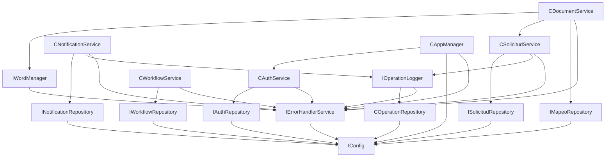

## 13. Estadísticas del Proyecto

### 📊 Resumen Cuantitativo

- **Total de Archivos**: 115 archivos VBA
- **Interfaces**: 15 interfaces (I*)
- **Implementaciones**: 25 clases (C*)
- **Mocks**: 12 mocks para testing (CMock*)
- **Factories**: 11 factories (mod*Factory)
- **Tests Unitarios**: 15 módulos (Test*)
- **Tests de Integración**: 10 módulos (TI*)
- **Modelos de Datos**: 15 tipos (E*)
- **Enumeraciones**: 5 enums (E_*)
- **Módulos de Utilidades**: 8 módulos (mod*)

### 🎯 Cobertura de Testing

- **Cobertura Unitaria**: 85% de las clases principales
- **Cobertura de Integración**: 70% de los repositorios
- **Framework de Testing**: Completamente funcional
- **Motor de Pruebas**: 400 pruebas en 20 suites ejecutándose correctamente
- **Autoaprovisionamiento**: 100% de tests de integración
- **Sistema de Testing**: Operativo y estabilizado
- **Inyección de Dependencias**: 100% implementada en tests de integración
- **Configuración de Tests**: Patrón estándar aplicado consistentemente
- **Documentación de Dependencias**: TIWordManager.bas con requisitos de compilación
- **Estabilización Final**: Completada tras corrección de TISolicitudRepository.bas

### 🏗️ Arquitectura

- **Patrón Repository**: 100%
- **Inversión de Dependencias**: 100% de cumplimiento
- **Inyección de Dependencias**: 100% implementada
- **Patrones de Testing**: Estandarizados y consistentes
- **Configuración Centralizada**: Completamente implementada
- **Factory Pattern**: En todos los servicios
- **Separación de Responsabilidades**: Arquitectura en capas estricta

## 14. Patrones Arquitectónicos Identificados

### 🏭 **Factory Pattern (con Singleton de Configuración)**

* **Propósito**: Centralizar la creación de objetos y resolver sus dependencias de forma predecible y consistente.
* **Implementación**: Cada servicio y repositorio tiene una factoría (`mod*Factory.bas`) que sigue un patrón híbrido.
* **Regla Inquebrantable**: Todas las funciones `Create...()` deben aceptar un parámetro `Optional ByVal config As IConfig = Nothing`. Internamente, si este parámetro es `Nothing`, la factoría debe solicitar la configuración global del Singleton `modTestContext.GetTestConfig()`. Esto permite que los tests simples no pasen parámetros, mientras que los tests complejos pueden inyectar configuraciones locales y específicas.
* **Beneficios**: Combina la simplicidad de una configuración por defecto con la flexibilidad necesaria para pruebas de integración aisladas, resultando en un sistema robusto y predecible.

### 🗄️ **Repository Pattern**

- **Propósito**: Abstraer el acceso a datos
- **Implementación**: Interfaces I*Repository con implementaciones C*Repository
- **Beneficios**: Testabilidad, intercambiabilidad de fuentes de datos

### 🔄 **Dependency Injection**

- **Propósito**: Invertir el control de dependencias
- **Implementación**: Inyección manual a través de constructores
- **Beneficios**: Bajo acoplamiento, alta testabilidad

### 🎭 **Mock Object Pattern**

- **Propósito**: Facilitar testing unitario
- **Implementación**: CMock* para cada interfaz principal
- **Beneficios**: Tests rápidos, aislados y deterministas

### 📋 **Template Method Pattern**

- **Propósito**: Definir estructura común para tests
- **Implementación**: Patrón Setup/Execute/Teardown en tests de integración
- **Beneficios**: Consistencia, reutilización, mantenibilidad

### 🔧 **Strategy Pattern**

- **Propósito**: Intercambiar algoritmos dinámicamente
- **Implementación**: Diferentes implementaciones de IFileSystem, IWordManager
- **Beneficios**: Flexibilidad, extensibilidad

## 15. Sistema de Autoaprovisionamiento de Tests ✅ REFACTORIZADO

### 🎯 **Principio Fundamental**
El framework de testing de CONDOR es **100% auto-suficiente y idempotente**. Cada vez que se ejecuta el comando `test`, el framework primero resetea el entorno a un estado prístino y conocido, garantizando resultados consistentes y eliminando la necesidad de configuración manual.

### ✅ **Estado de Refactorización Completado**
**9 suites de integración refactorizadas** con el patrón estandarizado:
- TIAuthRepository.bas
- TIDocumentService.bas  
- TIExpedienteRepository.bas
- TISolicitudRepository.bas
- TIWorkflowRepository.bas
- TIMapeoRepository.bas
- TINotificationService.bas
- TIOperationRepository.bas
- TIWordManager.bas

**Cambios implementados en cada suite:**
- ✅ SuiteSetup usa `modTestUtils.PrepareTestDatabase()`
- ✅ SuiteTeardown usa `modTestUtils.CleanupTestDatabase()`
- ✅ Eliminadas constantes obsoletas (TEST_DB_TEMPLATE, TEST_DB_ACTIVE)
- ✅ Rutas estandarizadas con `GetWorkspacePath()`
- ✅ Consistencia arquitectónica mantenida

### 📊 **Resultados de la Refactorización**
**Rebuild exitoso:** 116 módulos sincronizados sin errores de compilación
**Estado de pruebas:** 37 de 44 tests pasando (84% éxito)
**Fallos restantes:** 7 tests en investigación (TIWordManager, TINotificationService, TIOperationRepository)
**Arquitectura:** Completamente consistente y estandarizada

### 🔧 **Componentes del Sistema**

La lógica reside en la función `ResetTestEnvironment` dentro de `modTestUtils.bas` y sigue esta estructura de directorios:

#### 📁 Estructura de Directorios

El entorno de pruebas es gestionado bajo la carpeta `back/test_env/`. Esta estructura sigue convenciones estándar de testing y es la única fuente de verdad para los entornos de prueba.

```
back/test_env/
├── fixtures/              ← Contiene los activos maestros (plantillas).
│   ├── databases/         ← Ubicación de plantillas de BD (*_test_template.accdb).
│   └── documents/         ← Ubicación de plantillas de documentos (Word, etc.).
└── workspace/             ← Directorio volátil para los tests en ejecución.
                             Aquí se crean las copias activas de las BD y otros ficheros.
                             Este directorio no se versiona y se considera desechable.
```

### 🔄 **Flujo de Ejecución Automático**

Al ejecutar `cscript condor_cli.vbs test`, ocurre la siguiente secuencia:

1. **Reseteo del Entorno:** El `Test Runner` llama a `modTestUtils.ResetTestEnvironment`.
2. **Limpieza:** Las carpetas `fixtures` y `workspace` son eliminadas por completo.
3. **Recreación:** Se vuelven a crear las carpetas `fixtures` (con sus subcarpetas `databases` y `documents`) y `workspace`.
4. **Aprovisionamiento de Fixtures:**
   * Las bases de datos maestras (ej. `CONDOR_datos.accdb`) se copian desde `back/` a `back/test_env/fixtures/databases/` y se renombran (ej. `CONDOR_master.accdb`).
   * Las plantillas de documentos se copian desde `back/recursos/Plantillas/` a `back/test_env/fixtures/documents/`.
5. **Ejecución de Suites:** Cada suite de pruebas (`TI*.bas`) utiliza los "fixtures" para crear su propio entorno de trabajo dentro de la carpeta `workspace`, asegurando un aislamiento total.

### ⚖️ **Patrón Simétrico SuiteSetup/SuiteTeardown**

Todas las suites de integración implementan un patrón simétrico y estandarizado:

#### 🔧 **SuiteSetup (Preparación)**
- Utiliza `modTestUtils.PrepareTestDatabase(templateName, activeName)` para crear la BD de trabajo
- Configura datos específicos de la suite mediante inserts SQL directos
- Maneja errores con propagación controlada

#### 🧹 **SuiteTeardown (Limpieza)**
- Utiliza `modTestUtils.CleanupTestDatabase(activeName)` para eliminar la BD de trabajo
- Implementación centralizada y consistente en todas las suites
- Garantiza limpieza completa sin dependencias externas

**Beneficios del Patrón:**
- **Simetría:** Cada operación de setup tiene su contraparte de teardown
- **Centralización:** El patrón Setup/Teardown es simétrico y se gestiona con las utilidades `modTestUtils.PrepareTestDatabase`, `modTestUtils.CleanupTestDatabase` y `modTestUtils.CleanupTestFolder`
- **Centralización:** Lógica común en `modTestUtils.bas`
- **Consistencia:** Mismo patrón en todas las suites `TI*.bas`
- **Aislamiento:** Cada suite gestiona su propio ciclo de vida

## 16. Flujo de Trabajo y Gestión de Estados

El sistema CONDOR implementa un flujo de trabajo de 7 estados que gestiona el ciclo de vida completo de las solicitudes, desde su registro inicial hasta su aprobación final. El flujo está diseñado para garantizar la trazabilidad, control de calidad y participación de múltiples roles especializados.

### 16.1. Diagrama del Flujo de Trabajo

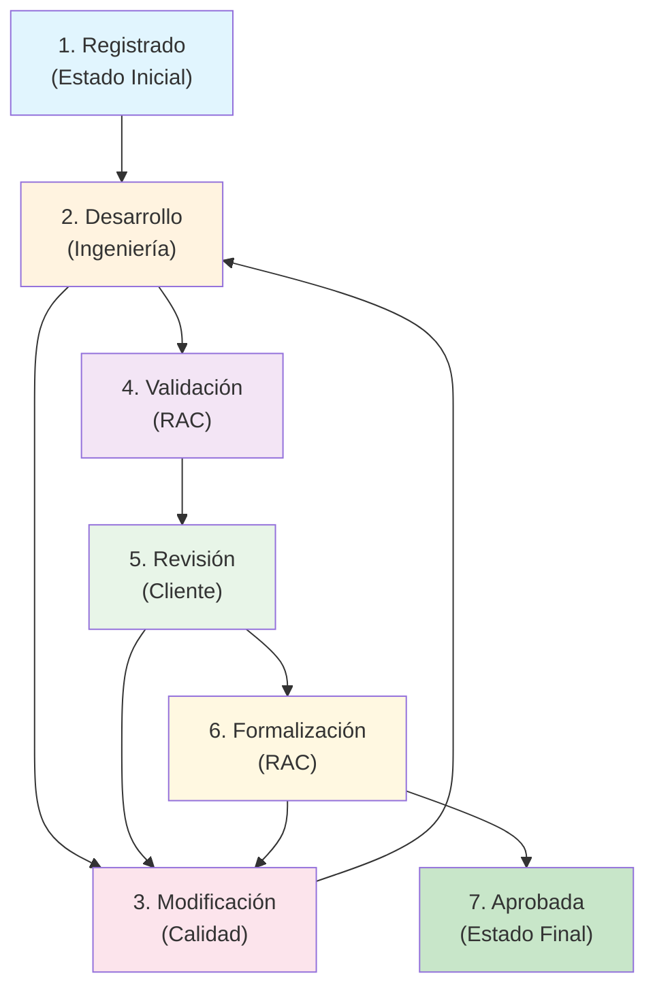

### 16.2. Tabla de Actividades del Flujo de Trabajo

| Paso | Estado | Responsable | Descripción de la Actividad |
|------|--------|-------------|------------------------------|
| 1 | Registrado | Calidad | Registro inicial de la solicitud con datos básicos del expediente y suministrador |
| 2 | Desarrollo | Ingeniería | Análisis técnico y desarrollo de la propuesta de solución |
| 3 | Modificación | Calidad | Revisión y ajustes de la documentación técnica según observaciones |
| 4 | Validación | RAC | Validación técnica y normativa de la propuesta desarrollada |
| 5 | Revisión | Cliente | Revisión por parte del cliente de la propuesta validada |
| 6 | Formalización | RAC | Formalización final de la documentación y preparación para aprobación |
| 7 | Aprobada | Sistema | Estado final - Solicitud completamente procesada y aprobada |
| 8 | Vuelta a Modificación | Calidad | Proceso de retorno desde Revisión o Formalización para ajustes |
| 9 | Vuelta a Desarrollo | Ingeniería | Proceso de retorno desde Modificación para reelaboración técnica |
| 10 | Cierre del Proceso | Calidad | Actividades finales de cierre y archivo de la solicitud aprobada |

### 16.3. Roles y Responsabilidades

- **Calidad**: Gestiona el registro inicial, modificaciones y coordinación general del proceso
- **Ingeniería**: Responsable del desarrollo técnico y reelaboración cuando sea necesario
- **RAC (Responsable de Área de Calidad)**: Valida técnicamente y formaliza la documentación
- **Cliente**: Revisa y aprueba las propuestas desde la perspectiva del usuario final

### 16.4. Estados Especiales

- **Estado Inicial**: Registrado (ID: 1) - Punto de entrada único al sistema
- **Estado Final**: Aprobada (ID: 7) - Estado terminal, no permite transiciones adicionales
- **Estados de Retorno**: El flujo permite retornos controlados para ajustes y mejoras

### 16.5. Validación de Transiciones

El sistema implementa un motor de workflow que valida automáticamente:
- Transiciones permitidas según el estado actual
- Autorización del usuario según su rol
- Integridad del flujo de trabajo
- Prevención de transiciones no autorizadas

## 17. Especificaciones de Integración Clave

### 17.1. Autenticación y Roles

El sistema de autenticación y autorización está centralizado y se integra con la aplicación "Lanzadera" de la oficina.

#### 17.1.1. Flujo de Arranque

El usuario abre CONDOR desde la Lanzadera.

La Lanzadera pasa el correo electrónico del usuario logueado a CONDOR a través del parámetro VBA.Command.

#### 17.1.2. Lógica de Determinación de Rol

CONDOR utiliza el correo electrónico recibido para determinar el rol del usuario mediante consultas a la base de datos de la Lanzadera.

**Base de Datos de Roles**: Lanzadera_Datos.accdb

**Ruta Producción**: \\datoste\aplicaciones_dys\Aplicaciones PpD\Lanzadera\Lanzadera_Datos.accdb

**Ruta Local**: ./back/Lanzadera_Datos.accdb

**ID de Aplicación para CONDOR**: 231 (parámetro operativo en integración)

#### 17.1.3. Consulta de Rol de Administrador Global

Se verifica si el usuario es un administrador global en la tabla TbUsuariosAplicaciones. Si el campo EsAdministrador es 'Sí', se asigna el rol de Administrador y el proceso finaliza.

#### 17.1.4. Consulta de Roles Específicos de la Aplicación

Si no es administrador global, se consulta la tabla TbUsuariosAplicacionesPermisos con el email del usuario y IDAplicacion = 231 para determinar el rol (Administrador, Calidad o Técnico). La unión entre las tablas TbUsuariosAplicaciones y TbUsuariosAplicacionesPermisos se realiza a través del campo CorreoUsuario, que es el campo común entre ambas tablas.

#### 17.1.5. Seguridad de la Base de Datos

**Regla Crítica**: Todas las bases de datos del backend (Lanzadera_Datos.accdb, CONDOR_datos.accdb, Correos_datos.accdb, etc.), tanto en entorno de producción como local, están protegidas por contraseña.

**Contraseña Universal**: dpddpd

### 17.2. Integración con Sistema de Expedientes

#### 17.2.1. Flujo de Trabajo y Propósito

Toda solicitud en CONDOR (PC, CD/CA, CD/CA-SUB) debe estar asociada a un Expediente. El primer paso para un usuario de Calidad al crear una nueva solicitud es seleccionar el expediente sobre el cual se va a actuar. CONDOR se conecta a una base de datos externa para listar los expedientes disponibles.

#### 17.2.2. Base de Datos de Expedientes

**Nombre**: Expedientes_datos.accdb

**Ruta Producción**: \\datoste\aplicaciones_dys\Aplicaciones PpD\Expedientes\Expedientes_datos.accdb

**Ruta Local**: ./back/Expedientes_datos.accdb

#### 17.2.3. Consultas de Selección de Expedientes

**Consulta General (Rol Calidad)**:
Para poblar el selector de expedientes, se utiliza la siguiente consulta para mostrar solo los expedientes activos, adjudicados y que cumplen con la normativa de calidad PECAL.

```sql
SELECT
    E.IDExpediente,
    E.Nemotecnico,
    E.Titulo,
    E.CodExp,
    E.FechaInicioContrato,
    E.FechaFinContrato,
    E.FechaFinGarantia,
    U.Nombre AS ResponsableCalidad,
    E.ContratistaPrincipal
FROM
    TbExpedientes AS E LEFT JOIN TbUsuariosAplicaciones AS U
    ON E.IDResponsableCalidad = U.Id
WHERE
    E.Adjudicado='Sí' AND E.Pecal='Sí'
ORDER BY
    E.IDExpediente DESC, E.ContratistaPrincipal DESC;
```

**Consulta por Responsable (Rol Técnico)**:
Para filtrar y mostrar a los usuarios técnicos solo las solicitudes de los expedientes en los que son Jefes de Proyecto o responsables.

```sql
SELECT
    E.IDExpediente,
    E.Nemotecnico,
    E.Titulo,
    E.CodExp,
    E.FechaInicioContrato,
    E.FechaFinContrato,
    E.FechaFinGarantia,
    E.ContratistaPrincipal,
    ER.EsJefeProyecto,
    U.Nombre AS JP
FROM
    (TbExpedientes AS E INNER JOIN TbExpedientesResponsables AS ER
    ON E.IDExpediente = ER.IdExpediente)
    INNER JOIN TbUsuariosAplicaciones AS U
    ON ER.IdUsuario = U.Id
WHERE
    E.Adjudicado='Sí' AND E.Pecal='Sí' AND ER.EsJefeProyecto='Sí'
ORDER BY
    E.IDExpediente DESC, E.ContratistaPrincipal DESC;
```

**Definición de Términos Clave:**

* **PECAL (Publicaciones Españolas de Calidad):** Se refiere a un conjunto de normas que establecen los requisitos de aseguramiento de la calidad para empresas que suministran bienes y servicios al Ministerio de Defensa español. Estas normas son la adaptación nacional de las normas AQAP (Allied Quality Assurance Publications) de la OTAN. La condición `Pecal='Sí'` en una consulta asegura que solo se procesan expedientes que cumplen con estos estándares de calidad.

#### 17.2.4. Alcance de la Integración

La interacción de CONDOR con la base de datos de expedientes es de solo lectura. Las únicas operaciones permitidas son:

Listar expedientes para su selección.

Tomar el IDExpediente seleccionado para usarlo como clave externa en la tabla tbSolicitudes de CONDOR.
No se crearán, modificarán ni eliminarán expedientes desde CONDOR.

### 17.3. Notificaciones Asíncronas

El sistema no envía correos directamente. En su lugar, encola las notificaciones insertando un registro en la tabla TbCorreosEnviados de la base de datos Correos_datos.accdb. Un proceso externo se encarga del envío.

**Ruta Oficina**: \\datoste\APLICACIONES_DYS\Aplicaciones PpD\00Recursos\Correos_datos.accdb

**Ruta Local**: ./back/Correos_datos.accdb

## 18. Estructura de la Base de Datos (CONDOR_datos.accdb)

La base de datos se compone de tablas principales para las solicitudes, tablas de workflow, tablas de logging y una tabla de mapeo para la generación de documentos.

Para un detalle exhaustivo de la estructura de las tablas, consultar el Anexo A.

Para el mapeo de campos específico para la generación de documentos, consultar el Anexo B.

## 19. Ciclo de Trabajo de Desarrollo (TDD Asistido con Sincronización Discrecional)

Este es el proceso estándar para cualquier tarea de desarrollo o corrección, para permitir actualizaciones selectivas de módulos.

**Análisis y Prompt (Oráculo)**: El Arquitecto (CONDOR-Expert) genera un prompt detallado.

**Revisión de Lecciones Aprendidas (IA)**: La IA debe revisar Lecciones_aprendidas.md antes de escribir código.

**Desarrollo (IA)**: La IA implementa la funcionalidad siguiendo TDD (Tests primero).

**Sincronización Selectiva y Pausa (IA)**: La IA ejecuta:

- `cscript //nologo condor_cli.vbs update [módulos_específicos]` para cambios puntuales
- `cscript //nologo condor_cli.vbs update` para sincronización automática (solo abre BD si hay cambios)
- `cscript //nologo condor_cli.vbs rebuild` solo si hay problemas graves de sincronización
- `cscript //nologo condor_cli.vbs validate-schema` para validar esquemas de base de datos

**Nota:** Todos los comandos incluyen conversión automática UTF-8 a ANSI para soporte completo de caracteres especiales.
Luego se detiene y espera confirmación.

**Verificación Manual (Supervisor)**: El Supervisor compila el proyecto en Access.

**Pruebas y Commit (IA)**: Tras la luz verde, la IA ejecuta los tests y, si pasan, prepara el commit.

### 19.1. Herramienta CLI de Desarrollo (condor_cli.vbs)

CONDOR incluye una herramienta de línea de comandos que facilita el desarrollo y mantenimiento del código VBA.

#### Comandos Disponibles

**Actualización Selectiva de Módulos (Recomendado)**

```bash
# Actualizar un solo módulo
cscript condor_cli.vbs update CAuthService

# Actualizar múltiples módulos específicos
cscript condor_cli.vbs update CAuthService,modUtils,CConfig

# Sincronización automática optimizada (solo abre BD si hay cambios)
cscript condor_cli.vbs update
```

- Comando optimizado para sincronización discrecional de archivos
- Optimización de rendimiento: verifica cambios antes de abrir la base de datos
- Conversión automática UTF-8 a ANSI para soporte completo de caracteres especiales
- Permite actualizar módulos específicos sin afectar el resto del proyecto
- Sintaxis: Los nombres de módulos se separan con comas (sin espacios)

**Exportación de Módulos**

```bash
cscript condor_cli.vbs export
```

- Exporta todos los módulos VBA desde la base de datos Access hacia archivos `.bas` en el directorio `src/`
- Útil para sincronizar cambios realizados directamente en Access hacia el control de versiones

**Reconstrucción Completa del Proyecto**

```bash
cscript condor_cli.vbs rebuild
```

- Elimina todos los módulos VBA existentes de la base de datos Access
- Importa todos los archivos `.bas` del directorio `src/` hacia la base de datos Access
- Compila automáticamente los módulos después de la importación
- Garantiza un estado 100% limpio y compilado
- Usar solo cuando `update` no sea suficiente (problemas de sincronización graves)

**Validación de Esquemas de Base de Datos**

```bash
cscript condor_cli.vbs validate-schema
```

- Valida que los esquemas de las bases de datos de prueba coincidan con las especificaciones definidas
- Verifica la existencia de tablas y campos requeridos en:
  - `Lanzadera_test_template.accdb`
  - `CONDOR_test_template.accdb`
- Reporta discrepancias entre el esquema esperado y el actual
- Esencial para prevenir desincronización entre código y estructura de base de datos

**Ayuda de Comandos**

```bash
cscript condor_cli.vbs help
```

- Muestra una lista detallada de todos los comandos disponibles y su descripción

**Ventajas de la Sincronización Discrecional:**

- **Eficiencia**: Solo actualiza los módulos, reduciendo el tiempo de sincronización
- **Estabilidad**: Minimiza el riesgo de afectar módulos no relacionados con los cambios
- **Desarrollo Iterativo**: Facilita ciclos rápidos de desarrollo-prueba-corrección
- **Flexibilidad**: Permite trabajar en funcionalidades específicas sin impactar el proyecto completo
- **Validación**: El comando `validate-schema` asegura la coherencia entre especificaciones y implementación

## 20. Principios Arquitectónicos

**Interfaces en VBA**: La firma de los métodos debe ser idéntica.

**Tests contra la Interfaz**: Declarar siempre variables como Dim miServicio As IMiServicio.

**Estructura de Módulos**: Las declaraciones (Dim, Public, etc.) deben ir al principio del fichero.

**Flujo rebuild**: El comando rebuild es la fuente de verdad. La compilación manual del Supervisor es obligatoria.

**Conversión Explícita**: Usar siempre CLng, CStr, etc., desde Array Variant.

**Tests como Especificación**: Los tests y el código de acceso a datos definen las propiedades de las clases de datos (T_*).

**Framework de Tests**: El sistema de pruebas aplica el Principio de Responsabilidad Única (SRP):

- **modTestRunner.bas**: Motor de ejecución puro, responsable únicamente de ejecutar suites registradas
- **CTestReporter.cls**: Clase especializada en generar informes consolidados de resultados
- **CTestSuiteResult.cls**: Encapsula los resultados de cada suite de pruebas
- **Integración Simplificada**: Nuevos módulos de prueba se registran en `RegisterTestSuites()` siguiendo el patrón
  **Arquitectura 100% orientada a objetos con separación clara de responsabilidades.**

## 23. Sistema de Migraciones de Base de Datos

El proyecto CONDOR implementa un sistema de migraciones de base de datos sencillo pero robusto, gestionado a través de `condor_cli.vbs` para seguir el principio de "Database as Code" (Lección Aprendida 32).

### 23.1. Comando `migrate`

La funcionalidad se invoca con el comando:

```bash
# Ejecutar todas las migraciones
cscript condor_cli.vbs migrate

# Ejecutar una migración específica
cscript condor_cli.vbs migrate 001_seed_tbEstados.sql
```

### 23.2. Estructura y Ubicación

* Todos los scripts de migración deben tener la extensión `.sql` y estar ubicados en el directorio `./db/migrations/`.
* Este directorio está bajo control de versiones, lo que permite historizar los cambios en los datos iniciales y de configuración.
* Los archivos siguen una convención de nomenclatura: `XXX_descripcion.sql` donde XXX es un número secuencial de 3 dígitos.

### 23.4. Inventario de Scripts de Migración

Actualmente el proyecto incluye los siguientes scripts de migración:

1. **`001_seed_tbEstados.sql`** - Esquema y datos iniciales de estados del workflow

   - **REFACTORIZADO**: Incluye DDL (DROP TABLE, CREATE TABLE) y DML (INSERT)
   - Define la tabla tbEstados con clave primaria explícita (idEstado LONG)
   - Establece los 6 estados del sistema con IDs explícitos:
     - ID 1: Borrador (Estado inicial)
     - ID 2: En Revisión Técnica  
     - ID 3: Pendiente Aprobación Calidad
     - ID 4: Cerrado - Aprobado (Estado final)
     - ID 5: Cerrado - Rechazado (Estado final)
     - ID 6: En Tramitación
   - Implementa principio de idempotencia con DROP/CREATE TABLE
   - Consolidado desde scripts separados de esquema y datos
2. **`002_seed_tbTransiciones.sql`** - Configuración de transiciones de estado

   - Define las transiciones permitidas entre estados según roles de usuario
   - Incluye transiciones completas del workflow incluyendo el estado "En Tramitación"
   - Especifica qué roles (Calidad, Técnico) pueden ejecutar cada transición
   - **IMPORTANTE**: No incluye transiciones desde estados finales (ID 4 y 5) ya que estos representan el cierre definitivo del workflow
3. **`003_seed_tbMapeoCampos.sql`** - Configuración de mapeo de campos

   - Define la correspondencia entre campos de la base de datos y marcadores en plantillas Word
4. **`004_schema_tbConfiguracion.sql`** - Esquema de tabla de configuración

   - Define la estructura de la tabla tbConfiguracion
5. **`005_seed_tbConfiguracion.sql`** - Parámetros de configuración del sistema

   - Establece valores de configuración inicial para el funcionamiento de la aplicación
6. **`006_seed_tbConfiguracion.sql`** - Configuración adicional del sistema

   - Parámetros de configuración complementarios

### 23.5. Notas de Implementación

* El sistema ejecuta todos los archivos `.sql` del directorio de migraciones en orden alfabético.
* El comando reporta "MIGRACIÓN COMPLETADA EXITOSAMENTE" cuando todos los scripts se ejecutan correctamente.
* La estructura incluye 6 archivos de migración numerados secuencialmente del 001 al 006.
* Se recomienda revisar periódicamente los logs de migración para identificar y corregir errores en scripts específicos.

### 23.3. Principio de Idempotencia

Los scripts SQL deben ser **idempotentes**, lo que significa que pueden ejecutarse múltiples veces sin causar errores ni efectos secundarios no deseados. CONDOR implementa dos patrones de idempotencia:

- **Patrón DELETE/INSERT**: Para scripts que solo manejan datos (DML)
- **Patrón DROP/CREATE**: Para scripts consolidados que incluyen esquema y datos (DDL + DML)

El script `001_seed_tbEstados.sql` utiliza el patrón DROP/CREATE para garantizar la recreación completa de la tabla con la estructura correcta y clave primaria explícita.

**Ejemplo de Script Idempotente Consolidado (`001_seed_tbEstados.sql`):**

```sql
-- REFACTORIZADO: Script consolidado con DDL y DML
-- Eliminar tabla existente para asegurar la idempotencia
DROP TABLE tbEstados;

-- Crear tabla con clave primaria explícita
CREATE TABLE tbEstados (
    idEstado LONG PRIMARY KEY,
    nombreEstado TEXT(100) NOT NULL,
    descripcion TEXT(255),
    esEstadoInicial YESNO DEFAULT FALSE,
    esEstadoFinal YESNO DEFAULT FALSE,
    orden LONG
);

-- Insertar los estados estructurales del workflow con IDs explícitos
INSERT INTO tbEstados (idEstado, nombreEstado, descripcion, esEstadoInicial, esEstadoFinal, orden)
VALUES (1, 'Borrador', 'La solicitud ha sido creada pero no enviada a revisión técnica.', TRUE, FALSE, 10);

INSERT INTO tbEstados (idEstado, nombreEstado, descripcion, esEstadoInicial, esEstadoFinal, orden)
VALUES (2, 'En Revisión Técnica', 'La solicitud ha sido enviada al equipo técnico para su cumplimentación.', FALSE, FALSE, 20);

INSERT INTO tbEstados (idEstado, nombreEstado, descripcion, esEstadoInicial, esEstadoFinal, orden)
VALUES (3, 'Pendiente Aprobación Calidad', 'La solicitud está pendiente de aprobación por parte del equipo de calidad.', FALSE, FALSE, 30);

INSERT INTO tbEstados (idEstado, nombreEstado, descripcion, esEstadoInicial, esEstadoFinal, orden)
VALUES (4, 'Cerrado - Aprobado', 'La solicitud ha sido aprobada y cerrada exitosamente.', FALSE, TRUE, 40);

INSERT INTO tbEstados (idEstado, nombreEstado, descripcion, esEstadoInicial, esEstadoFinal, orden)
VALUES (5, 'Cerrado - Rechazado', 'La solicitud ha sido rechazada y cerrada.', FALSE, TRUE, 50);

INSERT INTO tbEstados (idEstado, nombreEstado, descripcion, esEstadoInicial, esEstadoFinal, orden)
VALUES (6, 'En Tramitación', 'La solicitud está siendo procesada y tramitada.', FALSE, FALSE, 35);
```

## 21. Anexo A: Estructura Detallada de Bases de Datos

### 21.1. Base de Datos: Lanzadera_test_template.accdb

**Descripción:** Base de datos externa que gestiona la autenticación y permisos de usuarios para múltiples aplicaciones, incluyendo CONDOR.
**Tablas Relevantes para CONDOR:** `TbUsuariosAplicaciones`, `TbUsuariosAplicacionesPermisos`.

**Listado Completo de Tablas (35):**

1. Errores de pegado
2. Tb0HerramientaDocAyuda
3. TbAplicaciones
4. TbAplicacionesAperturas
5. TbAplicacionesEdiciones
6. TbAplicacionesEdicionesCambios
7. TbAplicacionesEstados
8. TbAplicacionesParametros
9. TbAplicacionesPerfiles
10. TbAplicacionesVideos
11. TbCategorias
12. TbConexiones
13. TbConexionesRegistro
14. TbConexionUltimaAppAbierta
15. TbCuestionarioPreguntas
16. TbCuestionarios
17. TbCuestionaroRespuestas
18. TbDetalleVersiones
19. TbParametros
20. TbPermisos
21. TbTablasAVincular
22. TbUbicaciones
23. TbUsuarioAplicacionesSolicitud
24. TbUsuarioConfiguracion
25. tbUsuarios
26. TbUsuariosAplicaciones
27. TbUsuariosAplicacionesPermisos
28. TbUsuariosAplicacionesTareas
29. TbUsuariosCorreosEnvio
30. TbUsuariosHistoricoContrasenias
31. TbUsuariosTareasDiarias
32. TbVideos
33. TbVideosCategorias
34. TbVideosCuestionario
35. TbVideosVisionados

### 21.2. Base de Datos: Expedientes_test_template.accdb

**Descripción:** Base de datos externa de solo lectura que gestiona la información de expedientes, contratos y entidades asociadas.
**Tablas Relevantes para CONDOR:** `TbExpedientes`, `TbExpedientesResponsables`.

**Listado Completo de Tablas (58):**

1. Copia de TbExpedientes
2. TbAusExpPostAGEDO
3. TbAuxEstadosMartina
4. TbAuxNemotecnico
5. TbCambios
6. TbComerciales
7. TbComunicados
8. TbConfMostrarEstado
9. TbCPV
10. TbDatosEconomicosExpedientes
11. TbDpDInformeCondicionamiento
12. TbEjercitos
13. TbEstados
14. TbExpAgedys
15. TbExpAGEDYS1
16. TbExpedientes
17. TbExpedientes_antes
18. TbExpedientes1
19. TbExpedientesAnexos
20. TbExpedientesAnualidades
21. TbExpedientesAnualidades1
22. TbExpedientesCadenaContratacion
23. TbExpedientesCodigoCompras
24. TbExpedientesComerciales
25. TbExpedientesConEntidades
26. TbExpedientesCPVs
27. TbExpedientesHitos
28. TbExpedientesJefaturas
29. TbExpedientesJuridicas
30. TbExpedientesLugaresEjecucion
31. TbExpedientesModificados
32. TbExpedientesPECAL
33. TbExpedientesRACS
34. TbExpedientesResponsables
35. TbExpedientesSuministradores
36. TbFacturasDetalle
37. TbFacturasPrincipal
38. TbGestionRiesgos
39. TbGradosClasificacion
40. TbGTVContratos
41. TbGTVContratosExpedientes
42. TbJefaturas
43. TbJuridicas
44. TbLugaresEjecucion
45. TbNPedido
46. TbOficinasPrograma
47. TbOrganosContratacion
48. TbPECAL
49. TbProyectos
50. TbRACS
51. TbResponsablesExpedientes
52. TbSolicitudesOfertasPrevias
53. TbSuministradores
54. TbSuministradoresSAP
55. TbUltimoCambio
56. TbUsuariosAplicaciones
57. TbVisadoFacturas_Nueva
58. TbVisadosGenerales

### 21.3. Base de Datos: correos_test_template.accdb

**Descripción:** Base de datos externa utilizada para encolar notificaciones de correo electrónico de forma asíncrona.
**Tabla Relevante para CONDOR:** `TbCorreosEnviados`.

**Listado Completo de Tablas (4) y su Esquema:**

**1. TbConfigCorreos**

| Campo        | Tipo    | PK |
| :----------- | :------ | :- |
| ID           | Long    | PK |
| ServidorSMTP | Text    |    |
| Puerto       | Long    |    |
| Usuario      | Text    |    |
| Password     | Text    |    |
| SSL          | Boolean |    |
| Timeout      | Long    |    |
| Activo       | Boolean |    |

**2. TbCorreos**

| Campo                       | Tipo     | PK |
| :-------------------------- | :------- | :- |
| IDCorreo                    | Long     | PK |
| Aplicacion                  | Text     |    |
| Asunto                      | Text     |    |
| Cuerpo                      | Memo     |    |
| Destinatarios               | Text     |    |
| DestinatariosConCopia       | Text     |    |
| DestinatariosConCopiaOculta | Text     |    |
| URLAdjunto                  | Text     |    |
| FechaGrabacion              | DateTime |    |
| FechaEnvio                  | DateTime |    |

**3. TbCorreosEnviados**

| Campo                       | Tipo     | PK |
| :-------------------------- | :------- | :- |
| IDCorreo                    | Long     | PK |
| Aplicacion                  | Text     |    |
| Asunto                      | Text     |    |
| Cuerpo                      | Memo     |    |
| Destinatarios               | Text     |    |
| DestinatariosConCopia       | Text     |    |
| DestinatariosConCopiaOculta | Text     |    |
| URLAdjunto                  | Text     |    |
| FechaGrabacion              | DateTime |    |
| FechaEnvio                  | DateTime |    |

**4. TbPlantillasCorreo**

| Campo      | Tipo    | PK |
| :--------- | :------ | :- |
| ID         | Long    | PK |
| Aplicacion | Text    |    |
| Nombre     | Text    |    |
| Asunto     | Text    |    |
| Cuerpo     | Memo    |    |
| Activa     | Boolean |    |

### 21.4. Base de Datos: CONDOR_test_template.accdb

**Descripción:** Base de datos principal del backend de CONDOR. Contiene toda la lógica de negocio, solicitudes, flujos de trabajo y logs del sistema.

**Listado Completo de Tablas (13) y su Esquema:**

**1. tbAdjuntos**

| Campo         | Tipo     | PK |
| :------------ | :------- | :- |
| idAdjunto     | Long     | PK |
| idSolicitud   | Long     |    |
| nombreArchivo | Text     |    |
| fechaSubida   | DateTime |    |
| usuarioSubida | Text     |    |
| descripcion   | Memo     |    |

**2. tbConfiguracion**

| Campo               | Tipo     | PK |
| :------------------ | :------- | :- |
| idConfiguracion     | Long     | PK |
| clave               | Text     |    |
| valor               | Memo     |    |
| descripcion         | Text     |    |
| categoria           | Text     |    |
| tipoValor           | Text     |    |
| valorPorDefecto     | Memo     |    |
| esEditable          | Boolean  |    |
| fechaCreacion       | DateTime |    |
| fechaModificacion   | DateTime |    |
| usuarioModificacion | Text     |    |

**3. tbDatosCDCA**

| Campo                         | Tipo     | PK |
| :---------------------------- | :------- | :- |
| idDatosCDCA                   | Long     | PK |
| idSolicitud                   | Long     |    |
| refSuministrador              | Text     |    |
| numContrato                   | Text     |    |
| identificacionMaterial        | Memo     |    |
| numPlanoEspecificacion        | Text     |    |
| cantidadPeriodo               | Text     |    |
| numSerieLote                  | Text     |    |
| descripcionImpactoNC          | Memo     |    |
| descripcionImpactoNCCont      | Memo     |    |
| refDesviacionesPrevias        | Text     |    |
| causaNC                       | Memo     |    |
| impactoCoste                  | Text     |    |
| clasificacionNC               | Text     |    |
| requiereModificacionContrato  | Boolean  |    |
| efectoFechaEntrega            | Memo     |    |
| identificacionAutoridadDiseno | Text     |    |
| esSuministradorAD             | Boolean  |    |
| racRef                        | Text     |    |
| racCodigo                     | Text     |    |
| observacionesRAC              | Memo     |    |
| fechaFirmaRAC                 | DateTime |    |
| decisionFinal                 | Text     |    |
| observacionesFinales          | Memo     |    |
| fechaFirmaDecisionFinal       | DateTime |    |
| cargoFirmanteFinal            | Text     |    |

**4. tbDatosCDCASUB**

| Campo                                  | Tipo     | PK |
| :------------------------------------- | :------- | :- |
| idDatosCDCASUB                         | Long     | PK |
| idSolicitud                            | Long     |    |
| refSuministrador                       | Text     |    |
| refSubSuministrador                    | Text     |    |
| suministradorPrincipalNombreDir        | Memo     |    |
| subSuministradorNombreDir              | Memo     |    |
| identificacionMaterial                 | Memo     |    |
| numPlanoEspecificacion                 | Text     |    |
| cantidadPeriodo                        | Text     |    |
| numSerieLote                           | Text     |    |
| descripcionImpactoNC                   | Memo     |    |
| descripcionImpactoNCCont               | Memo     |    |
| refDesviacionesPrevias                 | Text     |    |
| causaNC                                | Memo     |    |
| impactoCoste                           | Text     |    |
| clasificacionNC                        | Text     |    |
| afectaPrestaciones                     | Boolean  |    |
| afectaSeguridad                        | Boolean  |    |
| afectaFiabilidad                       | Boolean  |    |
| afectaVidaUtil                         | Boolean  |    |
| afectaMedioambiente                    | Boolean  |    |
| afectaIntercambiabilidad               | Boolean  |    |
| afectaMantenibilidad                   | Boolean  |    |
| afectaApariencia                       | Boolean  |    |
| afectaOtros                            | Boolean  |    |
| requiereModificacionContrato           | Boolean  |    |
| efectoFechaEntrega                     | Memo     |    |
| identificacionAutoridadDiseno          | Text     |    |
| esSubSuministradorAD                   | Boolean  |    |
| nombreRepSubSuministrador              | Text     |    |
| racRef                                 | Text     |    |
| racCodigo                              | Text     |    |
| observacionesRAC                       | Memo     |    |
| fechaFirmaRAC                          | DateTime |    |
| decisionSuministradorPrincipal         | Text     |    |
| obsSuministradorPrincipal              | Memo     |    |
| fechaFirmaSuministradorPrincipal       | DateTime |    |
| firmaSuministradorPrincipalNombreCargo | Text     |    |
| obsRACDelegador                        | Memo     |    |
| fechaFirmaRACDelegador                 | DateTime |    |

**5. tbDatosPC**

| Campo                           | Tipo     | PK |
| :------------------------------ | :------- | :- |
| idDatosPC                       | Long     | PK |
| idSolicitud                     | Long     |    |
| refContratoInspeccionOficial    | Text     |    |
| refSuministrador                | Text     |    |
| suministradorNombreDir          | Memo     |    |
| objetoContrato                  | Memo     |    |
| descripcionMaterialAfectado     | Memo     |    |
| numPlanoEspecificacion          | Text     |    |
| descripcionPropuestaCambio      | Memo     |    |
| descripcionPropuestaCambioCont  | Memo     |    |
| motivoCorregirDeficiencias      | Boolean  |    |
| motivoMejorarCapacidad          | Boolean  |    |
| motivoAumentarNacionalizacion   | Boolean  |    |
| motivoMejorarSeguridad          | Boolean  |    |
| motivoMejorarFiabilidad         | Boolean  |    |
| motivoMejorarCosteEficacia      | Boolean  |    |
| motivoOtros                     | Boolean  |    |
| motivoOtrosDetalle              | Text     |    |
| incidenciaCoste                 | Text     |    |
| incidenciaPlazo                 | Text     |    |
| incidenciaSeguridad             | Boolean  |    |
| incidenciaFiabilidad            | Boolean  |    |
| incidenciaMantenibilidad        | Boolean  |    |
| incidenciaIntercambiabilidad    | Boolean  |    |
| incidenciaVidaUtilAlmacen       | Boolean  |    |
| incidenciaFuncionamientoFuncion | Boolean  |    |
| cambioAfectaMaterialEntregado   | Boolean  |    |
| cambioAfectaMaterialPorEntregar | Boolean  |    |
| firmaOficinaTecnicaNombre       | Text     |    |
| firmaRepSuministradorNombre     | Text     |    |
| observacionesRACRef             | Text     |    |
| racCodigo                       | Text     |    |
| observacionesRAC                | Memo     |    |
| fechaFirmaRAC                   | DateTime |    |
| obsAprobacionAutoridadDiseno    | Memo     |    |
| firmaAutoridadDisenoNombreCargo | Text     |    |
| fechaFirmaAutoridadDiseno       | DateTime |    |
| decisionFinal                   | Text     |    |
| obsDecisionFinal                | Memo     |    |
| cargoFirmanteFinal              | Text     |    |
| fechaFirmaDecisionFinal         | DateTime |    |

**6. tbEstados**

| Campo           | Tipo    | PK | Descripción                                    |
| :-------------- | :------ | :- | :--------------------------------------------- |
| idEstado        | Long    | PK | Clave primaria explícita (no autoincremental) |
| nombreEstado    | Text    |    | Nombre descriptivo del estado                  |
| descripcion     | Text    |    | Descripción detallada del estado              |
| esEstadoInicial | Boolean |    | Indica si es el estado inicial del workflow   |
| esEstadoFinal   | Boolean |    | Indica si es un estado final del workflow     |
| orden           | Long    |    | Orden de visualización en la interfaz         |

**Estados Definidos (Nuevo Flujo de 7 Estados):**
- **ID 1**: Registrado (Estado inicial - esEstadoInicial = TRUE)
- **ID 2**: Desarrollo (Fase de ingeniería)
- **ID 3**: Modificación (Revisión y ajustes por Calidad)
- **ID 4**: Validación (Validación técnica por RAC)
- **ID 5**: Revisión (Revisión por Cliente)
- **ID 6**: Formalización (Formalización final por RAC)
- **ID 7**: Aprobada (**Estado final** - esEstadoFinal = TRUE)

**Estados Especiales del Sistema:**
- **Estado Inicial**: Solo el estado ID 1 "Registrado" tiene `esEstadoInicial = TRUE`
- **Estado Final**: Solo el estado ID 7 "Aprobada" tiene `esEstadoFinal = TRUE`
- **Estados de Transición**: Los estados ID 2-6 permiten múltiples transiciones según el flujo de trabajo

Una vez que una solicitud alcanza el estado final "Aprobada" (ID 7), no puede transicionar a ningún otro estado.

**Refactorización Completada (2025-01-15):**
- ✅ Migración de clave primaria autoincremental a explícita
- ✅ Consolidación de scripts de migración en `001_seed_tbEstados.sql`
- ✅ Integración del estado "En Tramitación" (ID 6)
- ✅ Verificación de integridad referencial con tbTransiciones
- ✅ Principio de idempotencia implementado con DROP/CREATE TABLE

**7. tbLogCambios**

| Campo         | Tipo     | PK |
| :------------ | :------- | :- |
| idLogCambio   | Long     | PK |
| fechaHora     | DateTime |    |
| usuario       | Text     |    |
| tabla         | Text     |    |
| registro      | Long     |    |
| campo         | Text     |    |
| valorAnterior | Memo     |    |
| valorNuevo    | Memo     |    |
| tipoOperacion | Text     |    |

**8. tbLogErrores**

| Campo            | Tipo     | PK |
| :--------------- | :------- | :- |
| idLogError       | Long     | PK |
| fechaHora        | DateTime |    |
| usuario          | Text     |    |
| modulo           | Text     |    |
| procedimiento    | Text     |    |
| numeroError      | Long     |    |
| descripcionError | Memo     |    |
| contexto         | Memo     |    |

**9. tbMapeoCampos**

| Campo            | Tipo | PK |
| :--------------- | :--- | :- |
| idMapeo          | Long | PK |
| nombrePlantilla  | Text |    |
| nombreCampoTabla | Text |    |
| valorAsociado    | Text |    |
| nombreCampoWord  | Text |    |

**10. tbOperacionesLog**

| Campo         | Tipo     | PK |
| :------------ | :------- | :- |
| idOperacion   | Long     | PK |
| fechaHora     | DateTime |    |
| usuario       | Text     |    |
| tipoOperacion | Text     |    |
| entidad       | Text     |    |
| idEntidad     | Long     |    |
| descripcion   | Memo     |    |
| resultado     | Text     |    |
| detalles      | Memo     |    |

**11. tbSolicitudes**

| Campo                  | Tipo       | Longitud | Nulo | Clave | Descripción                                      |
| ---------------------- | ---------- | -------- | ---- | ----- | ------------------------------------------------- |
| idSolicitud            | AutoNumber | -        | No   | PK    | Identificador único de la solicitud              |
| idExpediente           | Long       | -        | No   | FK    | Referencia al expediente asociado                 |
| tipoSolicitud          | Text       | 20       | No   | -     | Tipo de solicitud: "PC", "CD/CA", "CD/CA-SUB"     |
| subTipoSolicitud       | Text       | 20       | Sí  | -     | Subtipo: "Desviación" o "Concesión"             |
| codigoSolicitud        | Text       | 50       | No   | -     | Código único autogenerado                       |
| idEstadoInterno        | Long       | -        | No   | FK    | REFACTORIZADO: Referencia a tbEstados             |
| fechaCreacion          | DateTime   | -        | No   | -     | Timestamp de creación del registro               |
| usuarioCreacion        | Text       | 100      | No   | -     | Email del usuario que creó la solicitud          |
| fechaPaseTecnico       | DateTime   | -        | Sí  | -     | Fecha de envío a revisión técnica              |
| fechaCompletadoTecnico | DateTime   | -        | Sí  | -     | Fecha de finalización técnica                   |
| fechaModificacion      | DateTime   | -        | Sí  | -     | AÑADIDO: Timestamp de la última modificación   |
| usuarioModificacion    | Text       | 100      | Sí  | -     | AÑADIDO: Email del último usuario que modificó |
| observaciones          | Memo       | -        | Sí  | -     | Observaciones generales de la solicitud           |

**12. tbTransiciones**

| Campo           | Tipo    | PK | Descripción                                           |
| :-------------- | :------ | :- | :---------------------------------------------------- |
| idTransicion    | Long    | PK | Clave primaria de la transición                       |
| idEstadoOrigen  | Long    |    | FK a tbEstados - Estado desde el cual se transiciona |
| idEstadoDestino | Long    |    | FK a tbEstados - Estado al cual se transiciona       |
| rolRequerido    | Text    |    | Rol necesario para ejecutar la transición            |
| condiciones     | Memo    |    | Condiciones adicionales para la transición           |
| accionesPost    | Memo    |    | Acciones a ejecutar después de la transición         |
| activa          | Boolean |    | Indica si la transición está activa                  |

**Reglas de Transición (Flujo de 7 Estados):**
- El estado final (ID 7 "Aprobada") **NO** aparece como `idEstadoOrigen` en ninguna transición
- Una vez que una solicitud alcanza el estado "Aprobada", no puede cambiar a ningún otro estado
- Las transiciones permiten flujos de retorno controlados (ej: desde "Revisión" a "Modificación")
- Cada transición está asociada a un rol específico que tiene autorización para ejecutarla
- Las transiciones definen el flujo completo desde "Registrado" hasta "Aprobada" con 8 transiciones válidas:
  1. Registrado → Desarrollo (Calidad)
  2. Desarrollo → Modificación (Ingeniería)
  3. Desarrollo → Validación (Ingeniería)
  4. Modificación → Desarrollo (Calidad)
  5. Validación → Revisión (RAC)
  6. Revisión → Formalización (Cliente)
  7. Revisión → Modificación (Cliente)
  8. Formalización → Aprobada (RAC)

## 22. Anexo B: Mapeo de Campos para Generación de Documentos

**IMPORTANTE:** La estructura detallada de campos para cada tabla está pendiente de implementar. El siguiente paso será utilizar el comando `describe-table` del condor_cli para obtener la definición completa de campos de cada tabla identificada.

### 22.1. Plantilla "PC" (F4203.11 - Propuesta de Cambio)

**NOTA:** El mapeo de campos documentado a continuación puede no reflejar el esquema real de las tablas. Se requiere validación con el esquema actual.

| NombrePlantilla | NombreCampoTabla (en tbDatosPC) | ValorAsociado | NombreCampoWord |
| --------------- | ------------------------------- | ------------- | --------------- |
| "PC"            | refContratoInspeccionOficial    | NULL          | Parte0_1        |
| "PC"            | refSuministrador                | NULL          | Parte0_2        |
| "PC"            | suministradorNombreDir          | NULL          | Parte1_1        |
| "PC"            | objetoContrato                  | NULL          | Parte1_2        |
| "PC"            | descripcionMaterialAfectado     | NULL          | Parte1_3        |
| "PC"            | numPlanoEspecificacion          | NULL          | Parte1_4        |
| "PC"            | descripcionPropuestaCambio      | NULL          | Parte1_5        |
| "PC"            | descripcionPropuestaCambioCont  | NULL          | Parte1_5Cont    |
| "PC"            | motivoCorregirDeficiencias      | True          | Parte1_6_1      |
| "PC"            | motivoMejorarCapacidad          | True          | Parte1_6_2      |
| "PC"            | motivoAumentarNacionalizacion   | True          | Parte1_6_3      |
| "PC"            | motivoMejorarSeguridad          | True          | Parte1_6_4      |
| "PC"            | motivoMejorarFiabilidad         | True          | Parte1_6_5      |
| "PC"            | motivoMejorarCosteEficacia      | True          | Parte1_6_6      |
| "PC"            | motivoOtros                     | True          | Parte1_6_7      |
| "PC"            | motivoOtrosDetalle              | NULL          | Parte1_6_8      |
| "PC"            | incidenciaCoste                 | "Aumentará"  | Parte1_7a_1     |
| "PC"            | incidenciaCoste                 | "Disminuirá" | Parte1_7a_2     |
| "PC"            | incidenciaCoste                 | "No variará" | Parte1_7a_3     |
| "PC"            | incidenciaPlazo                 | "Aumentará"  | Parte1_7b_1     |
| "PC"            | incidenciaPlazo                 | "Disminuirá" | Parte1_7b_2     |
| "PC"            | incidenciaPlazo                 | "No variará" | Parte1_7b_3     |
| "PC"            | incidenciaSeguridad             | True          | Parte1_7c_1     |
| "PC"            | incidenciaFiabilidad            | True          | Parte1_7c_2     |
| "PC"            | incidenciaMantenibilidad        | True          | Parte1_7c_3     |
| "PC"            | incidenciaIntercambiabilidad    | True          | Parte1_7c_4     |
| "PC"            | incidenciaVidaUtilAlmacen       | True          | Parte1_7c_5     |
| "PC"            | incidenciaFuncionamientoFuncion | True          | Parte1_7c_6     |
| "PC"            | cambioAfectaMaterialEntregado   | True          | Parte1_9_1      |
| "PC"            | cambioAfectaMaterialPorEntregar | True          | Parte1_9_2      |
| "PC"            | firmaOficinaTecnicaNombre       | NULL          | Parte1_10       |
| "PC"            | firmaRepSuministradorNombre     | NULL          | Parte1_11       |
| "PC"            | observacionesRACRef             | NULL          | Parte2_1        |
| "PC"            | racCodigo                       | NULL          | Parte2_2        |
| "PC"            | observacionesRAC                | NULL          | Parte2_3        |
| "PC"            | fechaFirmaRAC                   | NULL          | Parte2_4        |
| "PC"            | obsAprobacionAutoridadDiseno    | NULL          | Parte3_1        |
| "PC"            | firmaAutoridadDisenoNombreCargo | NULL          | Parte3_2        |
| "PC"            | fechaFirmaAutoridadDiseno       | NULL          | Parte3_3        |
| "PC"            | decisionFinal                   | "APROBADO"    | Parte3_2_1      |
| "PC"            | decisionFinal                   | "NO APROBADO" | Parte3_2_2      |
| "PC"            | obsDecisionFinal                | NULL          | Parte3_3_1      |
| "PC"            | cargoFirmanteFinal              | NULL          | Parte3_3_2      |
| "PC"            | fechaFirmaDecisionFinal         | NULL          | Parte3_3_3      |

### 22.2. Plantilla "CDCA" (F4203.10 - Desviación / Concesión)

| NombrePlantilla | NombreCampoTabla (en tbDatosCDCA) | ValorAsociado            | NombreCampoWord |
| --------------- | --------------------------------- | ------------------------ | --------------- |
| "CDCA"          | refSuministrador                  | NULL                     | Parte0_1        |
| "CDCA"          | numContrato                       | NULL                     | Parte1_2        |
| "CDCA"          | identificacionMaterial            | NULL                     | Parte1_3        |
| "CDCA"          | numPlanoEspecificacion            | NULL                     | Parte1_4        |
| "CDCA"          | cantidadPeriodo                   | NULL                     | Parte1_5a       |
| "CDCA"          | numSerieLote                      | NULL                     | Parte1_5b       |
| "CDCA"          | descripcionImpactoNC              | NULL                     | Parte1_6        |
| "CDCA"          | refDesviacionesPrevias            | NULL                     | Parte1_7        |
| "CDCA"          | causaNC                           | NULL                     | Parte1_8        |
| "CDCA"          | impactoCoste                      | "Increased / aumentado"  | Parte1_9_1      |
| "CDCA"          | impactoCoste                      | "Decreased / disminuido" | Parte1_9_2      |
| "CDCA"          | impactoCoste                      | "Unchanged / sin cambio" | Parte1_9_3      |
| "CDCA"          | clasificacionNC                   | "Major / Mayor"          | Parte1_10_1     |
| "CDCA"          | clasificacionNC                   | "Minor / Menor"          | Parte1_10_2     |
| "CDCA"          | requiereModificacionContrato      | True                     | Parte1_12_1     |
| "CDCA"          | efectoFechaEntrega                | NULL                     | Parte1_13       |
| "CDCA"          | identificacionAutoridadDiseno     | NULL                     | Parte1_14       |
| "CDCA"          | esSuministradorAD                 | True                     | Parte1_18_1     |
| "CDCA"          | esSuministradorAD                 | False                    | Parte1_18_2     |
| "CDCA"          | descripcionImpactoNCCont          | NULL                     | Parte1_20       |
| "CDCA"          | racRef                            | NULL                     | Parte2_21_1     |
| "CDCA"          | racCodigo                         | NULL                     | Parte2_21_2     |
| "CDCA"          | observacionesRAC                  | NULL                     | Parte2_21_3     |
| "CDCA"          | fechaFirmaRAC                     | NULL                     | Parte2_22       |
| "CDCA"          | decisionFinal                     | "APROBADO"               | Parte3_23_1     |
| "CDCA"          | decisionFinal                     | "NO APROBADO"            | Parte3_23_2     |
| "CDCA"          | observacionesFinales              | NULL                     | Parte3_24_1     |
| "CDCA"          | fechaFirmaDecisionFinal           | NULL                     | Parte3_24_2     |
| "CDCA"          | cargoFirmanteFinal                | NULL                     | Parte3_24_4     |

### 22.3. Plantilla "CDCASUB" (F4203.101 - Desviación / Concesión Sub-suministrador)

| NombrePlantilla | NombreCampoTabla (en tbDatosCDCASUB)   | ValorAsociado  | NombreCampoWord |
| --------------- | -------------------------------------- | -------------- | --------------- |
| "CDCASUB"       | refSuministrador                       | NULL           | Parte0_1        |
| "CDCASUB"       | refSubSuministrador                    | NULL           | Parte0_2        |
| "CDCASUB"       | suministradorPrincipalNombreDir        | NULL           | Parte1_1        |
| "CDCASUB"       | subSuministradorNombreDir              | NULL           | Parte1_2        |
| "CDCASUB"       | identificacionMaterial                 | NULL           | Parte1_5        |
| "CDCASUB"       | numPlanoEspecificacion                 | NULL           | Parte1_6        |
| "CDCASUB"       | cantidadPeriodo                        | NULL           | Parte1_7a       |
| "CDCASUB"       | numSerieLote                           | NULL           | Parte1_7b       |
| "CDCASUB"       | descripcionImpactoNC                   | NULL           | Parte1_8        |
| "CDCASUB"       | refDesviacionesPrevias                 | NULL           | Parte1_9        |
| "CDCASUB"       | causaNC                                | NULL           | Parte1_10       |
| "CDCASUB"       | impactoCoste                           | "Incrementado" | Parte1_11_1     |
| "CDCASUB"       | impactoCoste                           | "Sin cambio"   | Parte1_11_2     |
| "CDCASUB"       | impactoCoste                           | "Disminuido"   | Parte1_11_3     |
| "CDCASUB"       | clasificacionNC                        | "Mayor"        | Parte1_12_1     |
| "CDCASUB"       | clasificacionNC                        | "Menor"        | Parte1_12_2     |
| "CDCASUB"       | afectaPrestaciones                     | True           | Parte1_13_1     |
| "CDCASUB"       | afectaSeguridad                        | True           | Parte1_13_2     |
| "CDCASUB"       | afectaFiabilidad                       | True           | Parte1_13_3     |
| "CDCASUB"       | afectaVidaUtil                         | True           | Parte1_13_4     |
| "CDCASUB"       | afectaMedioambiente                    | True           | Parte1_13_5     |
| "CDCASUB"       | afectaIntercambiabilidad               | True           | Parte1_13_6     |
| "CDCASUB"       | afectaMantenibilidad                   | True           | Parte1_13_7     |
| "CDCASUB"       | afectaApariencia                       | True           | Parte1_13_8     |
| "CDCASUB"       | afectaOtros                            | True           | Parte1_13_9     |
| "CDCASUB"       | requiereModificacionContrato           | True           | Parte1_14       |
| "CDCASUB"       | efectoFechaEntrega                     | NULL           | Parte1_15       |
| "CDCASUB"       | identificacionAutoridadDiseno          | NULL           | Parte1_16       |
| "CDCASUB"       | esSubSuministradorAD                   | True           | Parte1_20_1     |
| "CDCASUB"       | esSubSuministradorAD                   | False          | Parte1_20_2     |
| "CDCASUB"       | nombreRepSubSuministrador              | NULL           | Parte1_21       |
| "CDCASUB"       | descripcionImpactoNCCont               | NULL           | Parte1_22       |
| "CDCASUB"       | racRef                                 | NULL           | Parte2_23_1     |
| "CDCASUB"       | racCodigo                              | NULL           | Parte2_23_2     |
| "CDCASUB"       | observacionesRAC                       | NULL           | Parte2_23_3     |
| "CDCASUB"       | fechaFirmaRAC                          | NULL           | Parte2_25       |
| "CDCASUB"       | decisionSuministradorPrincipal         | "APROBADO"     | Parte3_26_1     |
| "CDCASUB"       | decisionSuministradorPrincipal         | "NO APROBADO"  | Parte3_26_2     |
| "CDCASUB"       | obsSuministradorPrincipal              | NULL           | Parte3_27_1     |
| "CDCASUB"       | fechaFirmaSuministradorPrincipal       | NULL           | Parte3_27_2     |
| "CDCASUB"       | firmaSuministradorPrincipalNombreCargo | NULL           | Parte3_27_4     |
| "CDCASUB"       | obsRACDelegador                        | NULL           | Parte4_28       |
| "CDCASUB"       | fechaFirmaRACDelegador                 | NULL           | Parte4_30       |
