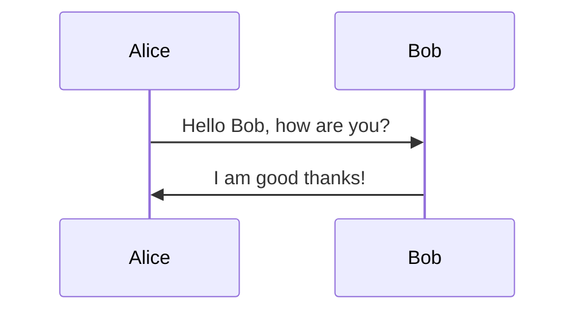

# CONDOR Master Plan

## Overview

This document outlines the master plan for the CONDOR project, including key diagrams and workflows.

## Workflow Diagram

## Architecture Diagram

## Conclusion

This document will be updated regularly as the project evolves.
