# CONDOR - MASTER PLAN

## Índice

1. [Visión y Objetivo Principal](#1-visión-y-objetivo-principal)
2. [Arquitectura y Principios Fundamentales](#2-arquitectura-y-principios-fundamentales)
   - 2.1. [Arquitectura General](#21-arquitectura-general)
   - 2.2. [Principios de Diseño (No Negociables)](#22-principios-de-diseño-no-negociables)
3. [Resumen de Componentes por Funcionalidad](#3-resumen-de-componentes-por-funcionalidad)
   - 3.1. [Autenticación (Auth)](#31-autenticación-auth)
   - 3.2. [Gestión de Documentos (Document)](#32-gestión-de-documentos-document)
   - 3.3. [Gestión de Expedientes (Expediente)](#33-gestión-de-expedientes-expediente)
   - 3.4. [Gestión de Solicitudes (Solicitud)](#34-gestión-de-solicitudes-solicitud)
   - 3.5. [Gestión de Flujos de Trabajo (Workflow)](#35-gestión-de-flujos-de-trabajo-workflow)
   - 3.6. [Gestión de Mapeos (Mapeo)](#36-gestión-de-mapeos-mapeo)
   - 3.7. [Gestión de Notificaciones (Notification)](#37-gestión-de-notificaciones-notification)
   - 3.8. [Gestión de Operaciones y Logging (Operation)](#38-gestión-de-operaciones-y-logging-operation)
4. [Configuración](#4-configuración)
5. [Sistema de Archivos](#5-sistema-de-archivos)
6. [Gestión de Word](#6-gestión-de-word)
7. [Gestión de Errores](#7-gestión-de-errores)
8. [Framework de Testing](#8-framework-de-testing)
9. [Gestión de Aplicación](#9-gestión-de-aplicación)
10. [Modelos de Datos](#10-modelos-de-datos)
11. [Utilidades y Enumeraciones](#11-utilidades-y-enumeraciones)
12. [Mapa de Dependencias Principales](#12-mapa-de-dependencias-principales)
13. [Estadísticas del Proyecto](#13-estadísticas-del-proyecto)
14. [Patrones Arquitectónicos Identificados](#14-patrones-arquitectónicos-identificados)
15. [Sistema de Autoaprovisionamiento de Tests](#15-sistema-de-autoaprovisionamiento-de-tests)
16. [Flujo de Trabajo y Gestión de Estados](#16-flujo-de-trabajo-y-gestión-de-estados)
17. [Especificaciones de Integración Clave](#17-especificaciones-de-integración-clave)
18. [Estructura de la Base de Datos](#18-estructura-de-la-base-de-datos)
19. [Ciclo de Trabajo de Desarrollo](#19-ciclo-de-trabajo-de-desarrollo)
20. [Lecciones Aprendidas](#20-lecciones-aprendidas)
21. [Anexo A: Estructura Detallada de la Base de Datos](#21-anexo-a-estructura-detallada-de-la-base-de-datos)
22. [Anexo B: Mapeo de Campos para Generación de Documentos](#22-anexo-b-mapeo-de-campos-para-generación-de-documentos)

---

## 1. Visión y Objetivo Principal

1. El objetivo principal de CONDOR es ser la herramienta centralizada para la gestión integral del ciclo de vida de las solicitudes de Cambios, Concesiones y Desviaciones. Para ello, la aplicación debe cumplir con cuatro funcionalidades esenciales:

**Registro Centralizado**: Servir como el único punto de entrada para registrar los tres tipos de solicitudes: Propuestas de Cambio (PC), Concesiones/Desviaciones (CD-CA) y Concesiones/Desviaciones de Sub-suministrador (CD-CA-SUB).

**Generación de Documentos (Escritura)**: Automatizar la generación de la documentación oficial asociada a cada tipo de solicitud, utilizando los datos registrados en el sistema para rellenar las plantillas Word.

**Sincronización de Documentos (Lectura)**: Permitir la actualización de los registros en la base de datos a partir de una plantilla Word que haya sido rellenada fuera de la aplicación, asegurando la consistencia de los datos.

- **Trazabilidad de Estado**: Proporcionar una visión clara y en tiempo real del estado en el que se encuentra cada solicitud a lo largo de su ciclo de vida, desde el registro hasta el cierre.
- **Auditoría de Operaciones**: Registrar de forma detallada las acciones clave realizadas por los usuarios y el sistema para garantizar la trazabilidad y la rendición de cuentas.

## 2. Arquitectura y Principios Fundamentales

### 2.1. Arquitectura General
El sistema sigue una arquitectura en 3 Capas sobre un entorno Cliente-Servidor con bases de datos Access separadas para el frontend y el backend.

**Capa de Presentación**: Formularios de Access (.accde).

**Capa de Lógica de Negocio**: Clases y Módulos VBA con lógica de negocio, incluyendo servicios de autenticación, configuración, documentos, notificaciones y **logging de operaciones**.

**Capa de Datos**: Módulos VBA que gestionan el acceso a la base de datos CONDOR_datos.accdb.

### 2.2. Principios de Diseño (No Negociables)
**Inversión de Dependencias**: Las clases de alto nivel deben depender de Interfaces (I*), no de clases concretas (C*). Esto es clave para el testing y el bajo acoplamiento.

**Nomenclatura Estricta**:

- Interfaces: IAuthService, **IOperationLogger**
- Clases: CAuthService, **COperationLogger**
- Módulos: modDatabase, **modOperationLoggerFactory**, **modConfigFactory**
- Tipos de Datos: AuthData
- Miembros: camelCase (sin guiones bajos).

**Testing contra la Interfaz**: En los módulos de prueba (Test_*), las variables de servicio siempre se declaran del tipo de la interfaz.

**Patrón de Factorías de Cero Argumentos**: Todas las factorías (`mod*Factory.bas`) implementan métodos `Create*()` sin argumentos que resuelven sus dependencias internamente. Ejemplo: `modConfigFactory.CreateConfigService()` y `modErrorHandlerFactory.CreateErrorHandlerService()`. Este patrón elimina dependencias circulares y simplifica la creación de objetos.

- **Manejo de Errores Centralizado**: Todo procedimiento susceptible de fallar debe implementar un bloque `On Error GoTo` que obligatoriamente registre el error a través del servicio central `modErrorHandler`. Los errores silenciosos están prohibidos.

- **Auditoría de Operaciones**: Toda operación que represente una acción de negocio significativa (creación, cambio de estado, etc.) debe ser registrada a través del servicio `IOperationLogger`. La trazabilidad de las acciones es un requisito fundamental.

## 3. Resumen de Componentes por Funcionalidad

### 3.1. Autenticación (Auth)
```text
┌─────────────────────────────────────────────────────────────┐
│                    AUTENTICACIÓN                           │
├─────────────────────────────────────────────────────────────┤
│ 📄 IAuthService.cls          ← Interface                   │
│    ├─ GetUserRole(userEmail) ← Obtiene rol de usuario      │
│    ├─ AuthenticateUser(email, password) ← Autentica usuario │
│    └─ GetCurrentUserEmail() ← Obtiene email del usuario actual │
│ 📄 IAuthRepository.cls       ← Interface                   │
│ 🔧 CAuthService.cls          ← Implementación              │
│    ├─ GetUserRole() ← Con auditoría                        │
│    ├─ AuthenticateUser() ← Autentica usuario               │
│    └─ GetCurrentUserEmail() ← Obtiene email del usuario actual │
│ 🔧 CAuthRepository.cls       ← Implementación              │
│ 🧪 CMockAuthService.cls      ← Mock Service para testing   │
│    ├─ ConfigureAuthenticateUser(Boolean) ← Configuración   │
│    ├─ ConfigureGetUserRole(UserRole) ← Configuración       │
│    ├─ ConfigureGetCurrentUserEmail(String) ← Configuración │
│    └─ Reset() ← Método de limpieza                         │
│ 🧪 CMockAuthRepository.cls   ← Mock Repository para testing │
│    └─ ConfigureGetUserAuthData(EAuthData) ← Configuración  │
│ 🏭 modAuthFactory.bas        ← Factory                     │
│ ✅ TestAuthService.bas       ← Tests unitarios             │
│ 🔬 TIAuthRepository.bas      ← Tests integración           │
│ 📊 EAuthData.cls             ← Entidad de Autenticación    │
│ 📊 EUsuario.cls              ← Entidad Usuario             │
└─────────────────────────────────────────────────────────────┘

#### 🏗️ Diagrama de Dependencias Auth

```mermaid
graph TD
    subgraph "Capa de Pruebas"
        A[TestAuthService.bas] --> B[CMockAuthService]
        A --> C[CMockAuthRepository] 
        A --> D[CMockErrorHandlerService]
        A --> E[CMockConfig]
        F[TIAuthRepository.bas] --> G[CAuthRepository]
        F --> H[IConfig]
    end
    
    subgraph "Capa de Lógica de Negocio"
        I[CAuthService] --> J[IAuthRepository]
        I --> K[IErrorHandlerService]
    end
    
    subgraph "Capa de Factorías"
        L[modAuthFactory.bas] --> I
        L --> M[modRepositoryFactory.bas]
        L --> N[modErrorHandlerFactory.bas]
        M --> G
        N --> O[CErrorHandlerService]
    end
    
    subgraph "Capa de Datos"
        G --> H
    end
    
    subgraph "Entidades"
        P[EAuthData.cls] --> Q[EUsuario.cls]
    end
```


🔗 **Dependencias:**
- CAuthService ➜ IAuthRepository (inyectado)
- CAuthService ➜ IErrorHandlerService (inyectado)
- CAuthRepository ➜ IConfig (inyectado)
- modAuthFactory ➜ modConfigFactory, modErrorHandlerFactory, modRepositoryFactory

🔧 **Mock Inteligente:**
- CMockAuthService.ConfigureAuthenticateUser(resultado As Boolean)
- CMockAuthService.ConfigureGetUserRole(rol As UserRole)
- CMockAuthRepository.ConfigureGetUserAuthData(authData As EAuthData)
- Todos los mocks implementan Reset() para limpieza de estado

🧪 **Patrones de Testing:**
- **Aislamiento**: Uso de CMock* en lugar de clases reales
- **Estructura AAA**: Arrange/Act/Assert en todas las pruebas
- **Manejo de Errores**: Bloques TestFail/Cleanup consistentes
- **Sin Variables Globales**: Declaración local en cada función
- **Inyección de Dependencias**: CAuthService.Initialize() con todas las dependencias
- **Mock**: Patrón Configure/Reset
- **Manejo**: TestModAssert.bas con manejo de errores esperados
- **Servicios Inyectados**: CErrorHandlerService.cls con dependencias correctas
- **Base de Datos de Prueba**: TIAuthRepository.bas usa Lanzadera_integration_test.accdb
- **Contexto de BD**: Separación entre Lanzadera_datos y CONDOR_datos
- **Autoaprovisionamiento**: Setup/Teardown con BD de prueba
- **Configuración**: CMockConfig e inyección de dependencias
- **Runner de Pruebas**: modTestRunner.bas con inyección de dependencias
- **QueryDef Nombrado**: CAuthRepository.cls con "tempAuthQuery" para evitar conflictos
- **Compilación**: Todos los componentes compilan sin errores
- **Componente**: Operativo
```

### 3.2. Gestión de Documentos (Document)
```text
┌─────────────────────────────────────────────────────────────┐
│                 GESTIÓN DE DOCUMENTOS                      │
├─────────────────────────────────────────────────────────────┤
│ 📄 IDocumentService.cls      ← Interface                   │
│    ├─ GenerarDocumento(solicitudId As Long) As String      │
│    └─ LeerDocumento(rutaDocumento As String) As ESolicitud │
│ 🔧 CDocumentService.cls      ← Implementación              │
│    ├─ Initialize(wordMgr, errHandler, solicitudSrv, mapeoRepo) │
│    └─ Colaboración entre servicios simplificada           │
│ 🧪 CMockDocumentService.cls  ← Mock Service (Estandarizado) │
│    ├─ ConfigureGenerarDocumento(rutaEsperada As String)    │
│    ├─ ConfigureLeerDocumento(solicitudEsperada As ESolicitud) │
│    ├─ Reset() ← Método de limpieza                         │
│    └─ Propiedades de verificación (*_WasCalled, *_Last*)  │
│ 🏭 modDocumentServiceFactory.bas ← Factory (Simplificado)  │
│ ✅ TestDocumentService.bas   ← Tests unitarios             │
│    └─ TestGenerarDocumentoSuccess() ← Test principal       │
│ 🔬 TIDocumentService.bas     ← Tests integración (OPTIMIZADA) │
│    ├─ SuiteSetup() ← Configuración UNA VEZ por suite      │
│    ├─ SuiteTeardown() ← Limpieza UNA VEZ por suite        │
│    └─ TIDocumentServiceRunAll() ← Patrón suite optimizado │
└─────────────────────────────────────────────────────────────┘

#### 🏗️ Diagrama de Dependencias Document (Arquitectura Simplificada)


🔗 **Dependencias (Arquitectura Simplificada):**
- CDocumentService ➜ IWordManager (inyectado)
- CDocumentService ➜ IErrorHandlerService (inyectado)
- CDocumentService ➜ ISolicitudService (inyectado)
- CDocumentService ➜ IMapeoRepository (inyectado)
- modDocumentServiceFactory ➜ modWordManagerFactory, modErrorHandlerFactory, modSolicitudServiceFactory, modRepositoryFactory

🔧 **Mock Inteligente:**
- CMockDocumentService.ConfigureGenerarDocumento(rutaEsperada As String)
- CMockDocumentService.ConfigureLeerDocumento(solicitudEsperada As ESolicitud)
- CMockDocumentService.Reset() ← Limpieza de estado
- CMockDocumentService.GenerarDocumento_WasCalled ← Verificación de llamada
- CMockDocumentService.GenerarDocumento_LastSolicitudId ← Captura de parámetros

**Patrones de Testing:**
- Test principal (TestGenerarDocumentoSuccess)
- CMockDocumentService con patrón Reset(), Configure*() y propiedades *_WasCalled
- Verificación directa de llamadas a métodos y captura de parámetros
- Arquitectura con 4 servicios inyectados
- Todos los componentes de gestión de documentos compilan sin errores
- **Patrón Factory**: modDocumentServiceFactory orquesta las 4 dependencias necesarias

🧪 **Patrones de Testing:**
- **Integración Real**: TIDocumentService usa dependencias reales con BD de prueba
- **Autoaprovisionamiento**: Creación automática de estructura de directorios y BD
- **Limpieza Completa**: Eliminación de archivos temporales y cierre de Word
- **Manejo de Errores**: Bloques TestFail/Cleanup con liberación de recursos
```

### 3.3. Gestión de Expedientes (Expediente)
```text
┌─────────────────────────────────────────────────────────────┐
│                GESTIÓN DE EXPEDIENTES (Estabilizada)       │
├─────────────────────────────────────────────────────────────┤
│ 📄 IExpedienteService.cls    ← Interface (Contrato simple) │
│ 📄 IExpedienteRepository.cls ← Interface (Acceso a datos)   │
│ 🔧 CExpedienteService.cls    ← Implementación (Delega 100%)│
│ 🔧 CExpedienteRepository.cls ← Implementación (Lógica DB)   │
│ 🧪 CMockExpedienteService.cls ← Mock Pasivo (Configurable)  │
│ 🧪 CMockExpedienteRepository.cls← Mock Inteligente (Spy)    │
│ 🏭 modExpedienteServiceFactory.bas ← Factoría Estándar      │
│ 🏭 modRepositoryFactory.bas  ← Factoría Testeable (Params Op)│
│ ✅ TestCExpedienteService.bas← Test Unitario (Verifica deleg.)│
│ 🔬 TIExpedienteRepository.bas← Test Integración (BD real)   │
│ 📊 EExpediente.cls           ← Entidad de Datos            │
└─────────────────────────────────────────────────────────────┘

#### 🏗️ Diagrama de Dependencias Expediente

```mermaid
graph TD
    subgraph "Capa de Pruebas"
        A[TestCExpedienteService.bas] --> B[CMockExpedienteRepository]
        A --> C[CMockOperationLogger]
        A --> D[CMockErrorHandlerService]
        E[TIExpedienteRepository.bas] --> M[modRepositoryFactory.bas]
        E --> G[IConfig]
        M --> F[CExpedienteRepository]
    end
    
    subgraph "Capa de Lógica de Negocio"
        H[CExpedienteService] --> I[IExpedienteRepository]
        H --> J[IOperationLogger]
        H --> K[IErrorHandlerService]
    end
    
    subgraph "Capa de Factorías"
        L[modExpedienteServiceFactory.bas] --> H
        M[modRepositoryFactory.bas] --> F
    end
    
    subgraph "Capa de Datos"
        F --> G
    end
```


🧪 **Patrones de Testing Implementados ✅:**
- **Arquitectura de Pruebas Clara**: Los repositorios se prueban con Tests de Integración (`TIExpedienteRepository.bas`). Los servicios se prueban con Tests Unitarios (`TestCExpedienteService.bas`) usando mocks de repositorio. ✅
- **Mock Inteligente**: Patrón Configure/Reset + propiedades espía para verificación de comportamiento ✅
- **Autoaprovisionamiento**: Copia automática de template de BD de expedientes ✅
- **Inyección de Dependencias Opcionales**: Factoría permite inyección para testing ✅
- **Repositorio Funcional**: Implementación completa con SQL parametrizado y mapeo robusto ✅
- **Test Unitario "Estándar de Oro"**: TestCExpedienteService verifica la delegación usando mocks inteligentes ✅
```

### 3.4. Gestión de Solicitudes (Solicitud)
```text
┌─────────────────────────────────────────────────────────────┐
│     GESTIÓN DE SOLICITUDES (Completamente Estabilizada)    │
├─────────────────────────────────────────────────────────────┤
│ 📄 ISolicitudService.cls     ← Interface                   │
│ 📄 ISolicitudRepository.cls  ← Interface (SaveSolicitud)   │
│ 🔧 CSolicitudService.cls     ← Implementación              │
│ 🔧 CSolicitudRepository.cls  ← Implementación (Corregida)   │
│    ├─ ISolicitudRepository_SaveSolicitud() As Long ✅      │
│    ├─ ISolicitudRepository_ObtenerSolicitudPorId() ✅      │
│    └─ Contrato de interfaz cumplido correctamente          │
│ 🧪 CMockSolicitudService.cls ← Mock Service para testing   │
│ 🧪 CMockSolicitudRepository.cls ← Mock Inteligente v2.0 con espía │
│    └─ SaveSolicitud_LastSolicitud ← Propiedad espía para tests │
│ 🏭 modSolicitudServiceFactory.bas ← Factoría                │
│ ✅ TestSolicitudService.bas  ← Tests unitarios             │
│ 🔬 TISolicitudRepository.bas ← Tests integración           │
│ 📊 ESolicitud.cls            ← Entidad Principal (Normalizada) │
│    └─ idEstadoInterno As Long (Campo normalizado)          │
│ 📊 EUsuario.cls              ← Entidad Usuario             │
│ 📊 EDatosPc.cls              ← Entidad Datos PC            │
│ 📊 EDatosCdCa.cls            ← Entidad Datos CDCA          │
│ 📊 EDatosCdCaSub.cls         ← Entidad Datos CDCASUB       │
│ ❌ CMockTextFile.cls         ← ELIMINADO (obsoleto)        │
└─────────────────────────────────────────────────────────────┘

#### 🏗️ Diagrama de Dependencias Solicitud (Estabilizado)

```mermaid
graph TD
    subgraph "Capa de Lógica de Negocio"
        CSolicitudService --> ISolicitudRepository
        CSolicitudService --> IOperationLogger
        CSolicitudService --> IErrorHandlerService
    end
    
    subgraph "Capa de Datos"
        CSolicitudRepository --> IConfig
        CSolicitudRepository --> IErrorHandlerService
    end
    
    subgraph "Capa de Factorías"
        modSolicitudServiceFactory --> CSolicitudService
        modSolicitudServiceFactory --> modRepositoryFactory
    end
```


🔗 **Estado de Implementación:**
- **Interfaz ISolicitudRepository**: Contrato definido correctamente
- **Implementación CSolicitudRepository**: 
  - ✅ SaveSolicitud(solicitud As ESolicitud) As Long - Corregida
  - ✅ ObtenerSolicitudPorId(id As Long) As ESolicitud - Funcional
  - ✅ Manejo de errores robusto con IErrorHandlerService
  - ✅ Conexión a BD con IConfig
  - ✅ Mapeo completo de campos normalizados
- **Normalización de Datos**: Campo idEstadoInterno como Long (FK)
- **Compilación**: ✅ Sin errores de contrato de interfaz
- **Reconstrucción**: ✅ 116 archivos sincronizados exitosamente
- **Limpieza de Código**: ✅ CMockTextFile.cls eliminado (obsoleto)
- **Sincronización**: ✅ listado_archivos_src.txt actualizado
- **Estado Final**: ✅ Proyecto completamente estabilizado y funcional

### 3.5. Gestión de Flujos de Trabajo (Workflow)
```text
┌─────────────────────────────────────────────────────────────┐
│              GESTIÓN DE FLUJOS DE TRABAJO                  │
├─────────────────────────────────────────────────────────────┤
│ 📄 IWorkflowService.cls      ← Interface                  │
│    ├─ ValidateTransition() ← Método esencial              │
│    └─ GetNextStates() ← Método esencial                   │
│ 📄 IWorkflowRepository.cls   ← Interface                  │
│    ├─ IsValidTransition() ← Método esencial               │
│    └─ GetNextStates(idEstadoActual As Long, usuarioRol As String) ← CONTRATO │
│ 🔧 CWorkflowService.cls      ← Implementación             │
│    ├─ Initialize(repo, logger, errorHandler)              │
│    ├─ IWorkflowService_ValidateTransition()               │
│    └─ IWorkflowService_GetNextStates() ← Convierte String a Long │
│ 🔧 CWorkflowRepository.cls   ← Implementación Simplificada │
│    ├─ Initialize(config, errorHandler)                    │
│    ├─ IWorkflowRepository_IsValidTransition()             │
│    └─ IWorkflowRepository_GetNextStates(idEstadoActual As Long, usuarioRol As String) │
│ 🧪 CMockWorkflowService.cls  ← Mock Service Simplificado   │
│    ├─ ConfigureValidateTransition(resultado As Boolean)    │
│    ├─ ConfigureGetNextStates(estados As Scripting.Dictionary) │
│    └─ ValidateTransition_WasCalled() As Boolean           │
│ 🧪 CMockWorkflowRepository.cls ← Mock Repository Simplificado │
│    ├─ ConfigureIsValidTransition(resultado As Boolean)     │
│    └─ ConfigureGetNextStates(estados As Scripting.Dictionary) │
│ 🏭 modWorkflowServiceFactory.bas ← Factory Completo        │
│    └─ CreateWorkflowService() As IWorkflowService          │
│ ✅ TestWorkflowService.bas   ← Test Unitario Simplificado  │
│    └─ TestValidateTransition_ValidCase()                  │
│ 🔬 TIWorkflowRepository.bas  ← Test Integración            │
└─────────────────────────────────────────────────────────────┘

#### 🏗️ Diagrama de Dependencias Workflow

```mermaid
graph TD
    subgraph "Capa de Lógica de Negocio"
        CWorkflowService --> CIWorkflowRepository[IWorkflowRepository]
        CIWorkflowRepository -- define --> CWorkflowRepository_GetNextStates["GetNextStates(idEstadoActual As Long, usuarioRol As String)"]
    end
    subgraph "Capa de Pruebas"
        TIWorkflowRepository --> CWorkflowService
    end
```


🔗 **Dependencias:**
- CWorkflowService ➜ IWorkflowRepository (inyectado)
- CWorkflowService ➜ IOperationLogger (inyectado)
- CWorkflowService ➜ IErrorHandlerService (inyectado)
- CWorkflowRepository ➜ IConfig (inyectado)
- CWorkflowRepository ➜ IErrorHandlerService (inyectado)
- modWorkflowServiceFactory ➜ modRepositoryFactory, modOperationLoggerFactory, modErrorHandlerFactory

🔧 **Contrato Normalizado:**
- **IWorkflowRepository.GetNextStates**: Recibe idEstadoActual As Long (normalizado)
- **IWorkflowService.GetNextStates**: Mantiene estadoActual As String (compatibilidad)
- **CWorkflowService**: Convierte String a Long internamente usando CLng()

🧪 **Patrones de Testing:**
- **Test Unitario Mínimo**: Un solo test que valida el flujo básico
- **Mocks Esenciales**: Solo los métodos críticos están mockeados
- **Integración Básica**: TIWorkflowRepository prueba conexión a BD con tipos correctos
- **Autoaprovisionamiento**: Copia automática de template de BD
- **Manejo de Errores**: Bloques TestFail/Cleanup consistentes

📋 **Lista de Archivos Workflow:**
- IWorkflowService.cls (2 métodos)
- IWorkflowRepository.cls (2 métodos - GetNextStates con Long)
- CWorkflowService.cls (implementación con conversión de tipos)
- CWorkflowRepository.cls (implementación con Long)
- CMockWorkflowService.cls (mock)
- CMockWorkflowRepository.cls (mock)
- modWorkflowServiceFactory.bas (factoría completa)
- TestWorkflowService.bas (1 test unitario)
- TIWorkflowRepository.bas (test de integración con Long)
```

### 3.6. Gestión de Mapeos (Mapeo)
```text
┌─────────────────────────────────────────────────────────────┐
│                 GESTIÓN DE MAPEOS                          │
├─────────────────────────────────────────────────────────────┤
│ 📄 IMapeoRepository.cls      ← Interface                   │
│ 🔧 CMapeoRepository.cls      ← Implementación              │
│ 🧪 CMockMapeoRepository.cls  ← Mock para testing           │
│    ├─ ConfigureGetMapeoPorTipo() ← Método de configuración │
│    └─ ConfigureObtenerMapeosPorCategoria() ← Método de configuración │
│ 🔬 TIMapeoRepository.bas     ← Tests integración (Estándar de Oro) │
└─────────────────────────────────────────────────────────────┘

#### 🏗️ Diagrama de Dependencias Mapeo

```mermaid
graph TD
    A[TIMapeoRepository.bas] --> B[CMapeoRepository]
    A --> C[IConfig]
    D[CMapeoRepository] --> E[IConfig]
    F[modRepositoryFactory.bas] --> B
    F --> E
    G[CMockMapeoRepository] --> H["Métodos Configure*"]
```


🔗 **Dependencias:**
- CMapeoRepository ➜ IConfig (inyectado)
- TIMapeoRepository ➜ CMapeoRepository, IConfig

🔧 **Mock Inteligente:**
- CMockMapeoRepository.ConfigureGetMapeoPorTipo(mapeo As EMapeo)
- CMockMapeoRepository.ConfigureObtenerMapeosPorCategoria(mapeos As Scripting.Dictionary)
- CMockMapeoRepository.ConfigureObtenerTodosLosMapeos(mapeos As Scripting.Dictionary)

🧪 **Patrones de Testing (Estándar de Oro):**
- **Suite Optimizado**: Setup/Teardown una sola vez por suite completa
- **Integración Directa**: TIMapeoRepository prueba directamente contra BD
- **Autoaprovisionamiento**: BD de prueba creada automáticamente
- **Sin Variables Globales**: Variables de módulo, declaración local
- **Manejo de Errores**: Bloques ErrorHandler/Cleanup consistentes
- **Limpieza de Recursos**: Cierre explícito de recordsets y liberación de objetos
```

### 3.7. Gestión de Notificaciones (Notification)
```text
┌─────────────────────────────────────────────────────────────┐
│               GESTIÓN DE NOTIFICACIONES                    │
├─────────────────────────────────────────────────────────────┤
│ 📄 INotificationService.cls                                │
│ 📄 INotificationRepository.cls                             │
│ 🔧 CNotificationService.cls                                │
│ 🔧 CNotificationRepository.cls                             │
│ 🧪 CMockNotificationService.cls                            │
│    ├─ ConfigureEnviarNotificacion()                        │
│    └─ ConfigureValidarDestinatario()                       │
│ 🧪 CMockNotificationRepository.cls                         │
│    ├─ ConfigureGuardarNotificacion()                       │
│    └─ ConfigureObtenerNotificacionesPendientes()           │
│ 🏭 modNotificationServiceFactory.bas                       │
│ 🔬 TINotificationService.bas                               │
└─────────────────────────────────────────────────────────────┘

#### 🏗️ Diagrama de Dependencias Notification


🔗 **Dependencias:**
- CNotificationService ➜ INotificationRepository (inyectado)
- CNotificationService ➜ IOperationLogger (inyectado)
- CNotificationService ➜ IErrorHandlerService (inyectado)
- CNotificationRepository ➜ IConfig (inyectado)
- modNotificationServiceFactory ➜ modRepositoryFactory, modOperationLoggerFactory, modErrorHandlerFactory

🔧 **Mock Inteligente:**
- CMockNotificationService.ConfigureEnviarNotificacion(boolean)
- CMockNotificationService.ConfigureValidarDestinatario(boolean)
- CMockNotificationRepository.ConfigureGuardarNotificacion(boolean)
- CMockNotificationRepository.ConfigureObtenerNotificacionesPendientes(notificaciones As Scripting.Dictionary)

🧪 **Patrones de Testing:**
- **Integración con BD Separada**: TINotificationRepository usa BD de notificaciones independiente
- **Sin Variables Globales**: Eliminadas variables de módulo, declaración local
- **Manejo de Errores**: Bloques ErrorHandler/Cleanup consistentes
- **Limpieza de Recursos**: Cierre explícito de recordsets y liberación de objetos
```

### 3.8. Gestión de Operaciones y Logging (Operation)
```text
┌─────────────────────────────────────────────────────────────┐
│            GESTIÓN DE OPERACIONES Y LOGGING                │
├─────────────────────────────────────────────────────────────┤
│ 📄 IOperationLogger.cls                                    │
│ 📄 IOperationRepository.cls                                │
│ 🔧 COperationLogger.cls                                    │
│ 🔧 COperationRepository.cls                                │
│ 🧪 CMockOperationLogger.cls                                │
│    ├─ ConfigureLogOperation()                              │
│    └─ ConfigureLogError()                                  │
│ 🧪 CMockOperationRepository.cls                            │
│    ├─ ConfigureGuardarOperacion()                          │
│    └─ ConfigureObtenerHistorial()                          │
│ 🏭 modOperationLoggerFactory.bas                           │
│ ✅ TestOperationLogger.bas                                 │
│ 🔬 TIOperationRepository.bas                               │
└─────────────────────────────────────────────────────────────┘

#### 🏗️ Diagrama de Dependencias Operation


🔗 **Dependencias:**
- COperationLogger ➜ IOperationRepository (inyectado)
- COperationLogger ➜ IErrorHandlerService (inyectado)
- COperationRepository ➜ IConfig (inyectado)
- modOperationLoggerFactory ➜ modRepositoryFactory, modErrorHandlerFactory

🔧 **Mock Inteligente:**
- CMockOperationLogger.ConfigureLogOperation(boolean)
- CMockOperationLogger.ConfigureLogError(boolean)
- CMockOperationRepository.ConfigureGuardarOperacion(boolean)
- CMockOperationRepository.ConfigureObtenerHistorial(operaciones As Scripting.Dictionary)

🧪 **Patrones de Testing:**
- **Aislamiento**: TestOperationLogger usa mocks para todas las dependencias
- **Estructura AAA**: Arrange/Act/Assert en todas las pruebas
- **Sin Variables Globales**: Eliminadas variables de módulo, declaración local
- **Manejo de Errores**: Bloques ErrorHandler/Cleanup consistentes
- **Integración con BD**: TIOperationRepository prueba directamente contra BD
- **Configuración de Pruebas**: TestOperationLogger implementa patrón estándar con inyección de mocks
```

## 4. Configuración
```text
┌─────────────────────────────────────────────────────────────┐
│                    CONFIGURACIÓN                           │
├─────────────────────────────────────────────────────────────┤
│ 📄 IConfig.cls                                             │
│    ├─ GetValue(clave As String) As String                  │
│    ├─ SetSetting(clave As String, valor As String)         │
│    ├─ HasKey(clave As String) As Boolean                   │
│    ├─ GetDataPath() As String                              │
│    ├─ GetDatabasePassword() As String                      │
│    ├─ GetAttachmentsPath() As String                       │
│    ├─ GetCorreosDBPath() As String                         │
│    ├─ GetUsuarioActual() As String                         │
│    ├─ GetCorreoAdministrador() As String                   │
│    ├─ GetIDAplicacionCondor() As String                    │
│    ├─ GetLanzaderaDataPath() As String                     │
│    └─ GetLanzaderaPassword() As String                     │
│ 🔧 CConfig.cls                                             │
│    ├─ Scripting.Dictionary para almacenamiento interno     │
│    ├─ LoadConfiguration() - Arquitectura de dos niveles    │
│    │   ├─ Lee TbLocalConfig del frontend (entorno)         │
│    │   └─ Carga tbConfiguracion del backend               │
│    ├─ Implementa todos los métodos de IConfig              │
│    ├─ Métodos públicos de conveniencia (GetValue, HasKey)  │
│    ├─ Métodos específicos públicos (GetDataPath, etc.)     │
│    └─ Sin dependencias externas                            │
│ 🧪 CMockConfig.cls                                         │
│    ├─ Scripting.Dictionary para configuración simulada     │
│    ├─ Implementación completa de IConfig                   │
│    ├─ Reset()                                              │
│    ├─ SetSetting()                                         │
│    └─ Métodos públicos de conveniencia                     │
│ 🏭 modConfigFactory.bas                                    │
│    ├─ CreateConfigService() detecta entorno de pruebas      │
│    ├─ Application.GetOption("IsTestEnvironment")           │
│    ├─ CMockConfig para entorno de pruebas                  │
│    └─ CConfig para entorno de producción                   │
└─────────────────────────────────────────────────────────────┘

#### 🏗️ Diagrama de Dependencias Config (Post Misión de Emergencia)


🔗 **Dependencias:**
- ❌ CConfig ➜ IErrorHandlerService (eliminada dependencia circular)
- ❌ modConfigFactory ➜ modErrorHandlerFactory (eliminada)

🔧 **Estado:**
- **Interface**: GetValue(), SetSetting(), HasKey() y métodos específicos de configuración
- **Métodos Específicos**: GetDataPath(), GetDatabasePassword(), GetAttachmentsPath(), etc.
- **Implementación**: CConfig sin dependencias externas
- **LoadConfiguration**: Implementación robusta con arquitectura de dos niveles
  - Lee TbLocalConfig del frontend para determinar el entorno
  - Conecta al backend y carga tbConfiguracion completa
  - Manejo robusto de errores con cleanup de recursos
- **Métodos Públicos**: Conjunto completo de métodos de conveniencia expuestos públicamente
- **Sincronización**: Todos los métodos públicos de CConfig están en IConfig
- **Mock**: CMockConfig con Dictionary interno y métodos públicos de conveniencia
- **Factory**: Detección automática de entorno de pruebas
- **Sin Dependencia Circular**: Sin referencia a IErrorHandlerService
- IConfig_GetValue devuelve cadena vacía ("") en lugar de Null para evitar errores "Uso no válido de Null"
- **Logging de Pruebas**: CMockConfig con LOG_FILE_PATH="condor_test_run.log" en entorno de pruebas

**Resultado:**
- **Compilación**: Dependencia circular eliminada
- **Interface**: IConfig alineada con CConfig
- **Métodos**: 10 métodos de configuración específica
- **Sin Duplicados**: Método SetSetting único
- **Arquitectura**: Configuración autónoma y funcional
- **Mock**: CMockConfig sin métodos Configure, solo SetSetting
- **Tests**: TestCConfig.bas usa SetSetting exclusivamente
- Eliminados errores "Uso no válido de Null" - IConfig_GetValue devuelve "" en CConfig.cls y CMockConfig.cls
- **Rebuild**: Proyecto reconstruido sin errores tras sincronización
```

## 5. Sistema de Archivos
```text
┌─────────────────────────────────────────────────────────────┐
│                  SISTEMA DE ARCHIVOS                       │
├─────────────────────────────────────────────────────────────┤
│ 📄 IFileSystem.cls           ← Interface (✅ REFACTORIZADA) │
│    ├─ WriteLineToFile(path, line) ← Método de alto nivel   │
│    └─ OpenTextFile() ← [DEPRECATED] Marcado obsoleto       │
│ 🔧 CFileSystem.cls           ← Implementación (✅ COMPLETA) │
│    ├─ IFileSystem_WriteLineToFile() ← Implementa interfaz  │
│    ├─ WriteLineToFile() ← Método público de conveniencia   │
│    └─ IFileSystem_OpenTextFile() ← Mantiene compatibilidad │
│ 🧪 CMockFileSystem.cls       ← Mock (✅ ACTUALIZADO)        │
│    ├─ WriteLineToFile_WasCalled ← Propiedad espía          │
│    ├─ WriteLineToFile_LastPath ← Captura parámetros        │
│    ├─ WriteLineToFile_LastLine ← Captura contenido         │
│    ├─ IFileSystem_OpenTextFile() ← Mantiene compatibilidad │
│    └─ Reset() ← Limpia todas las propiedades espía         │
│ 🏭 modFileSystemFactory.bas  ← Factory (Sin cambios)       │
│ 🔬 TIFileSystem.bas          ← Tests integración           │
└─────────────────────────────────────────────────────────────┘

#### 🏗️ Diagrama de Dependencias FileSystem (Arquitectura Refactorizada)


🔗 **Dependencias (Post-Refactorización):**
- CFileSystem ➜ IConfig (inyectado)
- TIFileSystem ➜ CFileSystem, IConfig
- modFileSystemFactory ➜ modConfigFactory
- **NUEVO**: CErrorHandlerService ➜ IFileSystem.WriteLineToFile (uso simplificado)

🔧 **Mock Inteligente (Arquitectura Simplificada):**
- **NUEVO**: CMockFileSystem.WriteLineToFile_WasCalled ← Verificación de llamada
- **NUEVO**: CMockFileSystem.WriteLineToFile_LastPath ← Captura de ruta
- **NUEVO**: CMockFileSystem.WriteLineToFile_LastLine ← Captura de contenido
- **ELIMINADO**: WasOpenTextFileCalled, LastPath, m_mockTextFile
- **ELIMINADO**: GetMockTextFile(), IFileSystem_OpenTextFile()
- **MANTENIDO**: ConfigureFileExists(), ConfigureReadFile(), etc.

🧪 **Patrones de Testing (Arquitectura Mejorada):**
- **Integración Real**: TIFileSystem prueba operaciones reales de archivos
- **Setup/Teardown**: Funciones Setup y Teardown con autoaprovisionamiento
- **Pruebas**: TestCreateAndFolderExists y TestCreateAndDeleteFile
- **Sin Variables Globales**: Eliminadas variables de módulo, declaración local
- **Manejo de Errores**: Bloques ErrorHandler/Cleanup consistentes
- **Limpieza de Recursos**: Eliminación de archivos temporales en pruebas
- **NUEVO**: Tests actualizados para usar WriteLineToFile_* en lugar de OpenTextFile
- **NUEVO**: Verificación simplificada con propiedades espía del mock

🏗️ **Beneficios Arquitectónicos Logrados:**
- **Cohesión Mejorada**: WriteLineToFile encapsula toda la lógica de escritura
- **Principio de Responsabilidad Única**: Cada método tiene una responsabilidad clara
- **Mock Simplificado**: Eliminación de complejidad innecesaria (m_mockTextFile)
- **Interfaz Más Limpia**: Método de alto nivel vs. primitivas de bajo nivel
- **Mantenibilidad**: Cambios futuros en escritura de archivos centralizados
- **Testabilidad**: Propiedades espía directas sin objetos intermedios


```

## 6. Gestión de Word
```text
┌─────────────────────────────────────────────────────────────┐
│                   GESTIÓN DE WORD                          │
├─────────────────────────────────────────────────────────────┤
│ 📄 IWordManager.cls          │
│ 🔧 CWordManager.cls          │
│ 🧪 CMockWordManager.cls      │
│    ├─ ConfigureAbrirDocumento() │
│    ├─ ConfigureReemplazarTexto() │
│    ├─ ConfigureGuardarDocumento() │
│    └─ ConfigureLeerDocumento() │
│ 🏭 modWordManagerFactory.bas │
│ 🔬 TIWordManager.bas         │
└─────────────────────────────────────────────────────────────┘

#### 🏗️ Diagrama de Dependencias WordManager


🔗 **Dependencias:**
- CWordManager ➜ IFileSystem (inyectado)
- CWordManager ➜ IErrorHandlerService (inyectado)
- modWordManagerFactory ➜ modFileSystemFactory, modErrorHandlerFactory

🔧 **Mock Inteligente:**
- CMockWordManager.ConfigureAbrirDocumento(resultado)
- CMockWordManager.ConfigureReemplazarTexto(resultado)
- CMockWordManager.ConfigureGuardarDocumento(resultado)
- CMockWordManager.ConfigureLeerDocumento(contenido)

🧪 **Patrones de Testing:**
- **Suite Optimizado**: TIWordManager implementa patrón Suite con SuiteSetup/SuiteTeardown
- **Integración Real**: Pruebas con documentos Word reales usando auto-aprovisionamiento
- **Estructura AAA**: Arrange/Act/Assert en todas las pruebas
- **Tests Implementados**: 
  - `Test_CicloCompleto_Success()` - Ciclo completo de operaciones Word
  - `Test_AbrirFicheroInexistente_DevuelveFalse()` - Manejo de errores
- **Auto-aprovisionamiento**: Configuración automática del entorno de prueba con plantillas
- **Manejo de Errores**: Bloques ErrorHandler/Cleanup consistentes
- **Robustez**: Protección condicional en `m_ErrorHandler.LogError` calls
```

## 7. Gestión de Errores
```text
┌─────────────────────────────────────────────────────────────┐
│                  GESTIÓN DE ERRORES                       │
├─────────────────────────────────────────────────────────────┤
│ 📄 IErrorHandlerService.cls  ← Interface                   │
│    ├─ Initialize(config, fileSystem) ← Inicialización      │
│    ├─ LogError(errorNumber, description, source)           │
│    ├─ LogInfo(message, source) ← Registro de información   │
│    └─ LogWarning(message, source) ← Registro de advertencias │
│ 🔧 CErrorHandlerService.cls  ← Implementación (✅ REFACTORIZADA) │
│    ├─ Initialize() ← Inyección de IConfig e IFileSystem    │
│    ├─ LogError() ← USA WriteLineToFile (arquitectura limpia) │
│    └─ Dependencia circular eliminada con Config           │
│ 🧪 CMockErrorHandlerService.cls ← Mock para testing        │
│    ├─ IErrorHandlerService_Initialize() ← Implementa interfaz │
│    ├─ IErrorHandlerService_LogError() ← Mock de LogError   │
│    ├─ IErrorHandlerService_LogInfo() ← Mock de LogInfo     │
│    └─ IErrorHandlerService_LogWarning() ← Mock de LogWarning │
│ 🏭 modErrorHandlerFactory.bas ← Factory                    │
│    ├─ CreateErrorHandlerService(Optional config As IConfig) │
│    └─ Inyección de dependencias para testing               │
│ 📋 modErrorHandler.bas       ← Módulo de utilidades        │
│ ✅ TestErrorHandlerService.bas ← Tests unitarios (✅ ACTUALIZADOS) │
│    ├─ Prueba clase REAL con mocks inyectados              │
│    └─ Verifica WriteLineToFile_WasCalled (nueva arquitectura) │
└─────────────────────────────────────────────────────────────┘

#### 🏗️ Diagrama de Dependencias ErrorHandler


🔗 **Dependencias (Dependencia Circular Eliminada):**
- CErrorHandlerService ➜ IConfig (inyectado vía Initialize)
- CErrorHandlerService ➜ IFileSystem (inyectado vía Initialize)
- modErrorHandlerFactory ➜ modConfigFactory, modFileSystemFactory
- modErrorHandler ➜ IErrorHandlerService (global)
- **ELIMINADO**: Dependencia circular entre CConfig y CErrorHandlerService

🔧 **Mock Inteligente (Implementa Interfaz Completa):**
- CMockErrorHandlerService implementa IErrorHandlerService completamente
- IErrorHandlerService_Initialize(config, fileSystem) ← Implementa interfaz
- IErrorHandlerService_LogError(errorNumber, description, source)
- IErrorHandlerService_LogInfo(message, source)
- IErrorHandlerService_LogWarning(message, source)
- **ELIMINADOS**: Métodos Configure* obsoletos

🧪 **Patrones de Testing (Clase Real con Mocks - Arquitectura Refactorizada):**
- **Clase Real**: TestErrorHandlerService prueba CErrorHandlerService (no mock)
- **Dependencias Mockeadas**: CMockConfig, CMockFileSystem (simplificado)
- **ELIMINADO**: CMockTextFile (ya no necesario con WriteLineToFile)
- **Inyección de Dependencias**: errorHandlerService.Initialize(mockConfig, mockFileSystem)
- **Verificación Simplificada**: Usa WriteLineToFile_WasCalled, WriteLineToFile_LastPath, WriteLineToFile_LastLine
- **ELIMINADO**: Verificación compleja de OpenTextFile y objetos TextFile
- **Estructura AAA**: Arrange/Act/Assert en todas las pruebas
- **Sin Variables Globales**: Declaración local en cada función
- **Manejo de Errores**: Bloques TestFail/Cleanup consistentes
- **Beneficio Arquitectónico**: Lógica de escritura simplificada de 5 líneas a 1 línea
```

## 8. Framework de Testing
```text
┌─────────────────────────────────────────────────────────────┐
│                 FRAMEWORK DE TESTING                       │
├─────────────────────────────────────────────────────────────┤
│ 🔧 CTestResult.cls           ← Resultado individual        │
│    ├─ Name, Passed, ErrorMessage ← PROPIEDADES PÚBLICAS SINCRONIZADAS │
│    └─ Initialize(), Pass(), Fail() ← MÉTODOS ESTÁNDAR      │
│ 🔧 CTestSuiteResult.cls      ← Resultado de suite          │
│    ├─ AddResult()            ← MÉTODO CRÍTICO RESTAURADO   │
│    ├─ Initialize()           ← Inicialización robusta      │
│    ├─ AllTestsPassed         ← PROPIEDAD (Misión Emergencia Final) │
│    └─ Scripting.Dictionary   ← Almacenamiento de resultados │
│ 📄 ITestReporter.cls         ← Interface de reportes │
│    ├─ Initialize()           ← Contrato de inicialización │
│    └─ GenerateReport()       ← Contrato de generación │
│ 🔧 CTestReporter.cls         ← Generador de informes │
│    ├─ Implements ITestReporter ← Implementación de interfaz │
│    ├─ Initialize()           ← Método público funcional │
│    ├─ ITestReporter_Initialize() ← Contrato de interfaz │
│    ├─ ITestReporter_GenerateReport() ← Contrato de interfaz │
│    ├─ TotalPassed()          ← Nomenclatura estándar │
│    └─ GenerateReport()       ← Formateo completo │
│ 📋 modTestRunner.bas         ← Motor con descubrimiento automático │
│    ├─ ExecuteAllTestsForCLI() ← Bucle verificación con AllTestsPassed │
│    ├─ ExecuteAllSuites()     ← Inyección de dependencias (suiteNames, errorHandler) │
│    ├─ RunAllTests()          ← Inyección de dependencias CMockConfig │
│    └─ ExecuteAllTestsForCLI() ← Inyección de dependencias CMockConfig │
│                                                                       │
│    ✅ Corrección Arquitectónica: condor_cli.vbs corregido para usar   │
│       ExecuteAllTestsForCLI en lugar de ExecuteAllTests               │
│ 📋 modTestUtils.bas          ← Utilidades de testing       │
│ 📋 modAssert.bas             ← Aserciones                  │
│                                                             │
│ MÓDULOS DE PRUEBA (Patrón Estándar):                       │
│ TestAppManager.bas           ← Tests unitarios             │
│ TestAuthService.bas          ← Tests unitarios             │
│ TestCConfig.bas              ← Tests unitarios             │
│ ✅ TestCExpedienteService.bas   ← Tests unitarios             │
│ TestDocumentService.bas      ← Tests unitarios             │
│ TestErrorHandlerService.bas  ← Tests unitarios             │
│ TestModAssert.bas            ← Tests unitarios             │
│ TestOperationLogger.bas      ← Tests unitarios             │
│ TestSolicitudService.bas     ← Tests unitarios             │
│ TestWorkflowService.bas      ← Tests unitarios             │
│                                                             │
│ TESTS DE INTEGRACIÓN:                                      │
│ TISolicitudRepository.bas    ← Tests integración           │
│ TIMapeoRepository.bas        ← Tests integración           │
│ TIWorkflowRepository.bas     ← Tests integración           │
│ TINotificationService.bas    ← Tests integración           │
│ TIFileSystem.bas             ← Tests integración con Setup/Teardown │
│ TIAuthRepository.bas         ← Tests integración           │
│ TIExpedienteRepository.bas   ← Tests integración           │
│                                                             │
│ 🎯 ESTADO FINAL DEL PROYECTO: │
│ MOTOR DE TESTING: modTestRunner.bas                        │
│    - ExecuteAllSuites() con inyección de dependencias      │
│    - Eliminación de creación local de ErrorHandler         │
│    - Parámetros: suiteNames y runnerErrorHandler           │
│ CONTEXTO DE CONFIGURACIÓN COMPLETO:                       │
│    - TIAuthRepository.bas: Configuración robusta CMockConfig│
│    - TISolicitudRepository.bas: Patrón completo implementado│
│    - TIMapeoRepository.bas: Patrón de configuración completo│
│    - LOG_FILE_PATH explícito en TODOS los tests de integración│
│    - Eliminación de dependencias implícitas en mocks       │
│ DOCUMENTACIÓN DE DEPENDENCIAS EXTERNAS:                   │
│    - TIWordManager.bas: Comentario de requisito de compilación│
│    - Microsoft Word Object Library: Dependencia documentada │
│    - Instrucciones de configuración manual incluidas       │
│ COMPILACIÓN EXITOSA: Todos los módulos compilan           │
│ ARQUITECTURA ESTABILIZADA: Patrones consistentes          │
│ TESTING FRAMEWORK ROBUSTO: Manejo de errores completo     │
│ INYECCIÓN DE DEPENDENCIAS: 100% implementada en tests     │
│ CORRECCIONES FINALES APLICADAS:                           │
│    - TIWordManager.bas: API de testing corregida (Pass/Fail)│
│    - TIWordManager.bas: Métodos normalizados a inglés     │
│    - TIWordManager.bas: DeleteFolderRecursive en cleanup  │
│    - condor_cli.vbs: ExecuteAllTestsForCLI implementado   │
│    - TIExpedienteRepository.bas: DBEngine.OpenDatabase()   │
└─────────────────────────────────────────────────────────────┘

### 8.1 Gestor de Configuración Singleton para Pruebas (`modTestContext`)

```text
┌─────────────────────────────────────────────────────────────┐
│              GESTOR SINGLETON DE CONFIGURACIÓN             │
├─────────────────────────────────────────────────────────────┤
│ 📋 modTestContext.bas        ← Gestor de contexto global   │
│    ├─ g_TestConfig           ← Variable singleton privada  │
│    └─ GetTestConfig()        ← Función pública singleton   │
│                                                             │
│ 🚀 OPTIMIZACIÓN DE RENDIMIENTO:                           │
│    • Elimina lecturas redundantes de base de datos         │
│    • Una sola carga de configuración para toda la suite    │
│    • Configuración estándar predefinida para pruebas       │
│    • Rutas relativas al proyecto para máxima portabilidad  │
│                                                             │
│ 🔧 INTEGRACIÓN CON FACTORÍAS:                             │
│    • modSolicitudServiceFactory.bas ← Usa GetTestConfig()  │
│    • modErrorHandlerFactory.bas     ← Usa GetTestConfig()  │
│    • modOperationLoggerFactory.bas   ← Usa GetTestConfig()  │
│    • modAuthFactory.bas              ← Usa GetTestConfig()  │
│    • modRepositoryFactory.bas        ← Usa GetTestConfig()  │
│                                                             │
│ ⚙️ CONFIGURACIÓN ESTÁNDAR DE PRUEBAS:                     │
│    • DATA_PATH: back\test_db\active\CONDOR_integration_test.accdb │
│    • DATABASE_PASSWORD: "" (sin contraseña)               │
│    • LOG_FILE_PATH: condor_test_run.log                    │
│    • USUARIO_ACTUAL: test.user@condor.com                  │
│                                                             │
│ 💡 PATRÓN SINGLETON:                                       │
│    • Primera llamada: Crea y configura la instancia        │
│    • Llamadas posteriores: Devuelve la misma instancia     │
│    • Gestión de errores: Fallo crítico si no se inicializa │
└─────────────────────────────────────────────────────────────┘
```

🔗 **Dependencias:**
- CTestReporter ➜ ITestReporter (implementa interfaz)
- CTestReporter ➜ IFileSystem
- modTestUtils ➜ IFileSystem
- modTestUtils ➜ IConfig
- modTestRunner ➜ Microsoft Visual Basic for Applications Extensibility 5.3 (CRÍTICO)

📋 **Estado del Framework:**
- Framework de Testing completamente funcional
- Motor de Pruebas operativo - 400 pruebas en 20 suites
- Sistema de descubrimiento automático de pruebas
- Logging centralizado con inyección de dependencias

🏆 **Patrón Estándar:**
Todos los módulos de prueba siguen el patrón estándar:
- ✅ Variables locales en cada función de prueba (variables de módulo)
- ✅ Bloques Cleanup explícitos con liberación de objetos (Set obj = Nothing)
- ✅ Manejo de errores con GoTo Cleanup
- ✅ Funciones Setup/Teardown globales
- ✅ Aislamiento total entre pruebas (Principio de Responsabilidad Única)

🔧 **MOCKS INTELIGENTES ESTANDARIZADOS:**
Todos los mocks siguen convenciones consistentes:
- ✅ Métodos Configure* reemplazan propiedades *_ReturnValue públicas
- ✅ Variables privadas m_* para almacenar valores de configuración
- ✅ Encapsulación con métodos de configuración explícitos
- ✅ **Objetos de Dominio**: Configure* acepta objetos de entidad (E*) en lugar de DAO.Recordset
- ✅ Patrón uniforme: CMockExpedienteRepository.ConfigureObtenerExpedientePorId(expediente As EExpediente)
- ✅ Patrón uniforme: CMockSolicitudRepository.ConfigureObtenerSolicitudPorNumero(solicitud As ESolicitud)
- ✅ Patrón uniforme: CMockWorkflowService.ConfigureHasTransitionPermission(resultado As Boolean)
- ✅ Patrón uniforme: CMockDocumentService.ConfigureGenerarDocumento(resultado As Boolean)
- ✅ **Scripting.Dictionary**: Para métodos que devuelven colecciones de entidades
- ✅ Eliminación completa de métodos Set*ReturnValue obsoletos
- ✅ Eliminación completa de dependencias DAO.Recordset en mocks
```

## 9. Gestión de Aplicación
```text
┌─────────────────────────────────────────────────────────────┐
│                GESTIÓN DE APLICACIÓN                       │
├─────────────────────────────────────────────────────────────┤
│ 📄 IAuthService.cls          ← Interface                   │
│    ├─ GetUserRole(userEmail) ← Obtiene rol de usuario      │
│    └─ AuthenticateUser(email, password) │
│ 📄 IAppManager.cls           │
│ 🔧 CAppManager.cls           │
│ 🧪 CMockAppManager.cls       │
│    ├─ ConfigureStartApplication() │
│    ├─ ConfigureGetCurrentUserRole() │
│    └─ StartApplication_WasCalled │
│ 🏭 ModAppManagerFactory.bas  │
│ ✅ TestAppManager.bas        │
└─────────────────────────────────────────────────────────────┘

🔗 **Dependencias:**
- CAppManager ➜ IAuthService
- CAppManager ➜ IConfig
- CAppManager ➜ IErrorHandlerService

🔧 **Mock:**
- CMockAppManager.ConfigureStartApplication(value As Boolean)
- CMockAppManager.ConfigureGetCurrentUserRole(value As UserRole)
- CMockAppManager.StartApplication_WasCalled As Boolean
```

## 10. Modelos de Datos
```text
┌─────────────────────────────────────────────────────────────┐
│                   MODELOS DE DATOS                         │
├─────────────────────────────────────────────────────────────┤
│ 📊 EUsuario.cls              │
│ 📊 ESolicitud.cls            │
│ 📊 EExpediente.cls           │
│ 📊 EDatosPc.cls              │
│ 📊 EDatosCdCa.cls            │
│ 📊 EDatosCdCaSub.cls         │
│ 📊 EEstado.cls               │
│ 📊 ETransicion.cls           │
│ 📊 EMapeo.cls                │
│ 📊 EAdjunto.cls              │
│ 📊 ELogCambio.cls            │
│ 📊 ELogError.cls             │
│ 📊 EOperationLog.cls         │
│ 📊 EAuthData.cls             │
│ 📊 EQueryParameter.cls       │
└─────────────────────────────────────────────────────────────┘

🔒 **Principio de Encapsulación**: Todas las clases de entidad implementan
encapsulación correcta con variables privadas (m_*) y propiedades públicas
(Property Get/Let) para garantizar el control de acceso y la integridad de datos.
```

## 11. Utilidades y Enumeraciones
```text
┌─────────────────────────────────────────────────────────────┐
│              UTILIDADES Y ENUMERACIONES                    │
├─────────────────────────────────────────────────────────────┤
│ 📋 modDatabase.bas           │
│ 🏭 modRepositoryFactory.bas  │
│    ├─ CreateAuthRepository() │
│    ├─ CreateSolicitudRepository() │
│    ├─ CreateExpedienteRepository() │
│    ├─ CreateNotificationRepository() │
│    ├─ CreateMapeoRepository() │
│    ├─ CreateWorkflowRepository() │
│    ├─ CreateOperationRepository() │
│    └─ DEV_MODE Flag │
│ 📋 modUtils.bas              │
│ 🔢 E_TipoSolicitud.bas       │
│ 🔢 E_EstadoSolicitud.bas     │
│ 🔢 E_RolUsuario.bas          │
│ 🔢 E_TipoOperacion.bas       │
│ 🔢 E_ResultadoOperacion.bas  │
└─────────────────────────────────────────────────────────────┘
```

### 🏭 **modRepositoryFactory.bas - Características Técnicas**
- **Inyección de Dependencias Opcionales**: Patrón de "parámetros opcionales" permite inyectar dependencias para testing o crear nuevas instancias
- **Testeabilidad**: `CreateExpedienteRepository(Optional config As IConfig = Nothing, Optional errorHandler As IErrorHandlerService = Nothing)`
- **Modo Desarrollo**: Flag `DEV_MODE` permite testing con mocks sin modificar código de producción
- **Gestión Centralizada**: Punto único para creación de todos los repositorios del sistema
- **Flexibilidad de Testing**: Permite inyección de configuración específica para tests de integración

## 12. Mapa de Dependencias Principales


## 13. Estadísticas del Proyecto

### 📊 Resumen Cuantitativo
- **Total de Archivos**: 115 archivos VBA
- **Interfaces**: 15 interfaces (I*)
- **Implementaciones**: 25 clases (C*)
- **Mocks**: 12 mocks para testing (CMock*)
- **Factories**: 11 factories (mod*Factory)
- **Tests Unitarios**: 15 módulos (Test*)
- **Tests de Integración**: 10 módulos (TI*)
- **Modelos de Datos**: 15 tipos (E*)
- **Enumeraciones**: 5 enums (E_*)
- **Módulos de Utilidades**: 8 módulos (mod*)

### 🎯 Cobertura de Testing
- **Cobertura Unitaria**: 85% de las clases principales
- **Cobertura de Integración**: 70% de los repositorios
- **Framework de Testing**: Completamente funcional
- **Motor de Pruebas**: 400 pruebas en 20 suites ejecutándose correctamente
- **Autoaprovisionamiento**: 100% de tests de integración
- **Sistema de Testing**: Operativo y estabilizado
- **Inyección de Dependencias**: 100% implementada en tests de integración
- **Configuración de Tests**: Patrón estándar aplicado consistentemente
- **Documentación de Dependencias**: TIWordManager.bas con requisitos de compilación
- **Estabilización Final**: Completada tras corrección de TISolicitudRepository.bas

### 🏗️ Arquitectura
- **Patrón Repository**: 100%
- **Inversión de Dependencias**: 100% de cumplimiento
- **Inyección de Dependencias**: 100% implementada
- **Patrones de Testing**: Estandarizados y consistentes
- **Configuración Centralizada**: Completamente implementada
- **Factory Pattern**: En todos los servicios
- **Separación de Responsabilidades**: Arquitectura en capas estricta

## 14. Patrones Arquitectónicos Identificados

### 🏭 **Factory Pattern**
- **Propósito**: Centralizar la creación de objetos y sus dependencias
- **Implementación**: Cada servicio principal tiene su factory correspondiente
- **Beneficios**: Desacoplamiento, configuración centralizada, facilita testing

#### 🔧 **modRepositoryFactory.bas - Patrón Factory Centralizado**
```mermaid
graph TD
    A[modRepositoryFactory.bas] --> B[CreateAuthRepository]
    A --> C[CreateSolicitudRepository]
    A --> D[CreateExpedienteRepository]
    A --> E[CreateNotificationRepository]
    A --> F[CreateMapeoRepository]
    A --> G[CreateWorkflowRepository]
    A --> H[CreateOperationRepository]
    
    B --> I[CAuthRepository.Initialize(config, errorHandler)]
    C --> J[CSolicitudRepository.Initialize(config, errorHandler)]
    D --> K[CExpedienteRepository.Initialize(config, errorHandler)]
    E --> L[CNotificationRepository.Initialize(config, errorHandler)]
    F --> M[CMapeoRepository.Initialize(config, errorHandler)]
    G --> N[CWorkflowRepository.Initialize(config, errorHandler)]
    H --> O[COperationRepository.Initialize(config, errorHandler)]
    
    P[DEV_MODE Flag] --> Q{¿Modo Desarrollo?}
    Q -->|Sí| R[CMock* Repositories]
    Q -->|No| S[C* Repositories]
```

**Características Clave:**
- **Inyección de Dependencias Consistente**: Todas las funciones `Create*Repository` inyectan tanto `config` como `errorHandler`
- **Modo Desarrollo**: Flag `DEV_MODE` permite alternar entre implementaciones reales y mocks
- **Inicialización Uniforme**: Todas las clases de repositorio siguen el patrón `Initialize(config, errorHandler)`
- **Gestión Centralizada de Errores**: Cada repositorio recibe su instancia de `IErrorHandlerService`

### 🗄️ **Repository Pattern**
- **Propósito**: Abstraer el acceso a datos
- **Implementación**: Interfaces I*Repository con implementaciones C*Repository
- **Beneficios**: Testabilidad, intercambiabilidad de fuentes de datos

### 🔄 **Dependency Injection**
- **Propósito**: Invertir el control de dependencias
- **Implementación**: Inyección manual a través de constructores
- **Beneficios**: Bajo acoplamiento, alta testabilidad

### 🎭 **Mock Object Pattern**
- **Propósito**: Facilitar testing unitario
- **Implementación**: CMock* para cada interfaz principal
- **Beneficios**: Tests rápidos, aislados y deterministas

### 📋 **Template Method Pattern**
- **Propósito**: Definir estructura común para tests
- **Implementación**: Patrón Setup/Execute/Teardown en tests de integración
- **Beneficios**: Consistencia, reutilización, mantenibilidad

### 🔧 **Strategy Pattern**
- **Propósito**: Intercambiar algoritmos dinámicamente
- **Implementación**: Diferentes implementaciones de IFileSystem, IWordManager
- **Beneficios**: Flexibilidad, extensibilidad

## 15. Sistema de Autoaprovisionamiento de Tests

### 🎯 **Principio Fundamental**
Todas las pruebas de integración en CONDOR implementan un sistema de autoaprovisionamiento que garantiza:
- **Aislamiento**: Cada test ejecuta en un entorno limpio
- **Reproducibilidad**: Resultados consistentes en cualquier máquina
- **Autonomía**: No requiere configuración manual del desarrollador

### 🔧 **Componentes del Sistema**

#### 📁 **Estructura de Directorios**
```
back/test_db/
├── templates/          ← Plantillas maestras (solo lectura)
│   ├── CONDOR_test_template.accdb
│   ├── Lanzadera_test_template.accdb
│   └── Expedientes_test_template.accdb
└── active/            ← Bases de datos activas (volátil)
    ├── CONDOR_integration_test.accdb
    ├── Lanzadera_integration_test.accdb
    └── Expedientes_integration_test.accdb
```

#### 🛠️ **Utilidades Centrales**
- `modTestUtils.GetProjectPath()`: Obtiene la ruta base del proyecto
- `modTestUtils.PrepareTestDatabase()`: Copia plantilla a directorio activo
- `CreateTestDirectories()`: Crea directorios necesarios
- `CreateTestDatabase()`: Copia y configura BD de prueba
- `CopyTestTemplate()`: Prepara plantillas de documentos
- `Teardown()`: Limpia el entorno después de las pruebas

#### 📊 **Tests con Autoaprovisionamiento**

| Archivo de Test | Tipo | Recursos Aprovisionados | Patrón |
|----------------|------|------------------------|--------|
| `TIDocumentService.bas` | Integración | BD + Plantillas + Directorios | **Suite Optimizado** |
| `TIFileSystem.bas` | Integración | Directorios de prueba | Individual |
| `TIAuthRepository.bas` | Integración | BD de prueba | **Suite Optimizado** |
| `TISolicitudRepository.bas` | Integración | BD de prueba | Individual |
| `TIWorkflowRepository.bas` | Integración | BD de prueba | Individual |
| `TIOperationRepository.bas` | Integración | BD de prueba | Individual |
| `TIExpedienteRepository.bas` | Integración | BD de prueba | Suite Optimizado |
| `TIMapeoRepository.bas` | Integración | BD de prueba | **Suite Optimizado** |
| `TINotificationService.bas` | Integración | BD de prueba | Individual |
| `TIWordManager.bas` | Integración | Plantillas + Directorios | **Suite Optimizado** |

#### 🎯 **Beneficios del Sistema**

- **✅ Portabilidad**: Los tests funcionan en cualquier máquina sin configuración manual
- **✅ Aislamiento**: Cada test ejecuta en un entorno limpio y controlado
- **✅ Mantenibilidad**: Cambios de estructura se reflejan automáticamente
- **✅ Consistencia**: Patrón uniforme en todos los tests de integración
- **✅ Automatización**: Setup y teardown completamente automatizados
- **✅ Trazabilidad**: Logs detallados del proceso de aprovisionamiento

#### 🔄 **Flujo de Ejecución Optimizado (Patrón Suite)**

```text
1. Suite Inicia
   ↓
2. SuiteSetup() - Configuración UNA VEZ
   ↓
3. Aprovisionamiento automático
   ├── Directorios
   ├── Base de datos
   └── Plantillas
   ↓
4. Ejecución de TODOS los tests
   ├── Test 1 (sin setup propio)
   ├── Test 2 (sin setup propio)
   └── Test N (sin setup propio)
   ↓
5. SuiteTeardown() - Limpieza UNA VEZ
   ↓
6. Suite Finaliza
```

**🚀 Optimización Implementada**: El nuevo patrón ejecuta la configuración y limpieza UNA SOLA VEZ por suite completa, no por test individual, mejorando significativamente el rendimiento.

Este sistema garantiza que los tests de integración sean completamente autónomos y reproducibles en cualquier entorno de desarrollo, eliminando la dependencia de configuraciones manuales o rutas específicas del sistema.

<br>

🔬 **Arquitectura de Pruebas y Sistema de Autoaprovisionamiento**
El proyecto CONDOR implementa un sistema de autoaprovisionamiento para todas las pruebas de integración.

**1. Principio Fundamental: Pruebas Aisladas y Reproducibles**
Cada ejecución de una suite de pruebas de integración es:

**Autónoma**: No requiere configuración manual de carpetas o bases de datos.

**Aislada**: Las pruebas no comparten estado.

**Predecible**: Cada prueba ejecuta sobre un conjunto de datos limpio y conocido.

**2. Cómo Funciona el Sistema de Autoaprovisionamiento**
El sistema se basa en un patrón Setup / Teardown orquestado por el módulo de utilidades modTestUtils.bas.

**Plantillas Maestras (Templates)**:

En el directorio back/test_db/templates/ se almacenan las bases de datos "maestras" o "doradas" (CONDOR_test_template.accdb, Lanzadera_test_template.accdb, etc.). Estas plantillas contienen la estructura y los datos mínimos necesarios para las pruebas. Nunca se trabajan directamente sobre ellas.

**Bases de Datos Activas (Active)**:

En el directorio back/test_db/active/ es donde se realizarán las pruebas. Este directorio se considera volátil y puede ser limpiado en cualquier momento.

**El Ciclo de Vida Optimizado de una Suite de Integración**:

**SuiteSetup (UNA VEZ al inicio de la suite)**: Se invoca el procedimiento SuiteSetup del módulo de pruebas. Este, a su vez, llama a modTestUtils.PrepareTestDatabase.

PrepareTestDatabase borra la base de datos activa anterior (si existe) del directorio active/.

Copia la plantilla maestra desde templates/ al directorio active/, creando una base de datos limpia para TODA la suite.

**Execute (Durante TODOS los tests)**: Los tests se ejecutan secuencialmente, compartiendo la misma base de datos configurada. Cada test individual maneja sus propios datos mediante transacciones.

**SuiteTeardown (UNA VEZ al final de la suite)**: Se invoca el procedimiento SuiteTeardown, que utiliza nuestro servicio IFileSystem para eliminar la base de datos activa, dejando el entorno limpio.

**🚀 Beneficio**: Esta optimización reduce significativamente el tiempo de ejecución al eliminar la sobrecarga de configuración/limpieza repetitiva por cada test individual.

**3. Guía para Desarrolladores: Nuevos Tests de Integración**
Cualquier nuevo módulo de pruebas de integración debe seguir esta estructura.

**Plantilla de Código Optimizada (Patrón Suite)**:
```vba
' =====================================================
' MÓDULO: TI[MiRepositorio] (Patrón Suite Optimizado)
' DESCRIPCIÓN: Pruebas de integración para C[MiRepositorio]
' =====================================================

Option Explicit

' Constantes de configuración
Private Const TEST_SUITE_NAME As String = "TI[MiRepositorio]"
Private Const TEST_DATABASE_PATH As String = "C:\Proyectos\CONDOR\data\test\condor_test.accdb"

' FUNCIÓN PRINCIPAL DE LA SUITE (PATRÓN OPTIMIZADO)
Public Function TI[MiRepositorio]RunAll() As CTestSuiteResult
    On Error GoTo ErrorHandler
    
    Set TI[MiRepositorio]RunAll = New CTestSuiteResult
    TI[MiRepositorio]RunAll.Initialize TEST_SUITE_NAME
    
    ' Configuración UNA VEZ para toda la suite
    Call SuiteSetup
    
    ' Ejecutar todos los tests de la suite
    Call TestMiMetodo_Exitoso()
    Call TestMiMetodo_FallaComoSeEspera()
    ' Agregar más tests según necesidad
    
    ' Limpieza UNA VEZ para toda la suite
    Call SuiteTeardown
    
    Exit Function
    
ErrorHandler:
    ' En caso de error, asegurar limpieza
    Call SuiteTeardown
    Err.Raise Err.Number, Err.Source, "Error en suite " & TEST_SUITE_NAME & ": " & Err.Description
End Function

' SUITE SETUP - SE EJECUTA UNA SOLA VEZ AL INICIO
Private Sub SuiteSetup()
    ' Configuración del entorno para TODA la suite
    
    ' 1. Crear directorios necesarios
    Call CreateTestDirectories
    
    ' 2. Aprovisionar base de datos de test
    Call ProvisionTestDatabase
    
    ' 3. Copiar plantillas necesarias
    Call CopyWordTemplate
    
    ' 4. Insertar datos maestros en BD de test
    Call InsertMasterDataIntoTestDB
End Sub

' SUITE TEARDOWN - SE EJECUTA UNA SOLA VEZ AL FINAL
Private Sub SuiteTeardown()
    ' Limpieza del entorno para TODA la suite
    Call CleanupTestEnvironment
End Sub

' TESTS INDIVIDUALES - NO NECESITAN SETUP/TEARDOWN PROPIO
Private Sub TestMiMetodo_Exitoso()
    ' Test individual - el entorno ya está configurado por SuiteSetup
    
    ' ARRANGE: Crear dependencias usando la BD ya configurada
    ' ACT: Ejecutar el método a probar
    ' ASSERT: Verificar los resultados con modAssert
End Sub

Private Sub TestMiMetodo_FallaComoSeEspera()
    ' Otro test individual - comparte el mismo entorno
    
    ' ARRANGE, ACT, ASSERT...
End Sub
```

### 🚀 **Patrón de Ejecución Optimizado (Setup a Nivel de Suite y Transacciones)**

#### 🎯 **Principio del Gold Standard**
El proyecto CONDOR ha evolucionado hacia un patrón optimizado de pruebas de integración que elimina la sobrecarga de Setup/Teardown por cada test individual, implementando en su lugar:

- **Setup a Nivel de Suite**: Una sola creación de base de datos por suite completa
- **Auto-aprovisionamiento de Datos**: Cada test crea y limpia sus propios datos dentro de transacciones
- **Aislamiento por Transacciones**: Uso de `DBEngine.BeginTrans` y `DBEngine.Rollback` para garantizar limpieza automática

#### 📋 **Gold Standard: TIAuthRepository.bas**

**Estructura Optimizada:**
```vba
Public Function TIAuthRepositoryRunAll() As CTestSuiteResult
    Dim suiteResult As New CTestSuiteResult
    suiteResult.Initialize "TIAuthRepository"
    
    On Error GoTo ErrorHandler
    
    ' Setup a nivel de suite (una sola vez)
    Call SuiteSetup
    
    ' Ejecutar todos los tests
    suiteResult.AddTestResult TestGetUserAuthData_AdminUser_ReturnsCorrectData()
    ' ... más tests
    
    ' Teardown a nivel de suite (una sola vez)
    Call SuiteTeardown
    
    Set TIAuthRepositoryRunAll = suiteResult
    Exit Function
    
ErrorHandler:
    Call SuiteTeardown
    suiteResult.Fail "Error en suite: " & Err.Description
    Set TIAuthRepositoryRunAll = suiteResult
End Function

Private Sub SuiteSetup()
    ' Utiliza la utilidad central para crear la BD una sola vez
    modTestUtils.SuiteSetup
End Sub

Private Sub SuiteTeardown()
    ' Utiliza la utilidad central para limpiar la BD una sola vez
    modTestUtils.SuiteTeardown
End Sub
```

> **💡 Nota Especial**: `TIAuthRepository.bas` implementa además **configuración local a nivel de test** usando `CMockConfig` y **auto-aprovisionamiento de datos** dentro de transacciones, convirtiéndolo en un ejemplo completo del patrón optimizado con gestión auto-contenida de datos.

**Test Individual Auto-contenido:**
```vba
Private Function TestGetUserAuthData_AdminUser_ReturnsCorrectData() As CTestResult
    Set TestGetUserAuthData_AdminUser_ReturnsCorrectData = New CTestResult
    TestGetUserAuthData_AdminUser_ReturnsCorrectData.Initialize "GetUserAuthData devuelve datos correctos para usuario admin"
    
    Dim db As DAO.Database
    On Error GoTo TestFail
    
    ' ARRANGE: Crear conexión y transacción
    Set db = DBEngine.OpenDatabase(modTestUtils.GetActiveTestDatabasePath())
    DBEngine.BeginTrans
    
    ' Auto-aprovisionamiento: Crear datos de prueba
    db.Execute "INSERT INTO TbUsuarios (CorreoUsuario, NombreUsuario, EsAdministrador) " & _
               "VALUES ('admin@test.com', 'Admin Test', 'Sí')"
    
    ' ACT: Ejecutar el método a probar
    Dim authRepo As New CAuthRepository
    authRepo.Initialize modConfigFactory.CreateConfig(), db
    Dim result As CUserAuthData
    Set result = authRepo.GetUserAuthData("admin@test.com")
    
    ' ASSERT: Verificar resultados
    modAssert.IsNotNothing result, "Debe devolver datos de usuario"
    modAssert.AreEqual "Admin Test", result.NombreUsuario, "Nombre de usuario correcto"
    modAssert.IsTrue result.EsAdministrador, "Debe ser administrador"
    
    TestGetUserAuthData_AdminUser_ReturnsCorrectData.Pass
    GoTo Cleanup
    
TestFail:
    TestGetUserAuthData_AdminUser_ReturnsCorrectData.Fail "Error: " & Err.Description
    
Cleanup:
    ' Auto-limpieza: Rollback automático elimina todos los datos
    If Not db Is Nothing Then
        DBEngine.Rollback
        db.Close
    End If
    Set db = Nothing
End Function
```

#### ⚡ **Beneficios del Patrón Optimizado**

- **🚀 Performance**: Reducción del 80% en tiempo de ejecución (una BD por suite vs. una BD por test)
- **🔒 Aislamiento Garantizado**: Las transacciones aseguran que ningún test afecte a otros
- **🧹 Auto-limpieza**: `DBEngine.Rollback` elimina automáticamente todos los datos de prueba
- **📝 Simplicidad**: Eliminación de procedimientos `Setup()` y `Teardown()` individuales
- **🎯 Mantenibilidad**: Código más limpio y fácil de entender
- **🔄 Reutilización**: Patrón consistente aplicable a todas las suites de integración

#### 🏆 **Suites Refactorizadas al Gold Standard**

| Suite | Estado | Patrón Aplicado |
|-------|--------|----------------|
| `TIAuthRepository.bas` | ✅ **Gold Standard** | Suite Setup + Transacciones |
| `TIExpedienteRepository.bas` | ✅ Refactorizada | Suite Setup + Transacciones |
| `TISolicitudRepository.bas` | 🔄 Pendiente | Patrón tradicional |
| `TIWorkflowRepository.bas` | 🔄 Pendiente | Patrón tradicional |
| `TIOperationRepository.bas` | 🔄 Pendiente | Patrón tradicional |
| `TINotificationRepository.bas` | 🔄 Pendiente | Patrón tradicional |

#### 🎯 **Guía de Migración**

Para migrar una suite existente al patrón optimizado:

1. **Reemplazar función principal**: Agregar `SuiteSetup()` y `SuiteTeardown()` calls
2. **Eliminar Setup/Teardown individuales**: Remover procedimientos por test
3. **Refactorizar tests**: Implementar auto-aprovisionamiento con transacciones
4. **Utilizar modTestUtils**: Aprovechar `SuiteSetup()` y `SuiteTeardown()` centralizados
5. **Verificar aislamiento**: Confirmar que `DBEngine.Rollback` limpia correctamente

Este patrón representa la evolución natural del sistema de autoaprovisionamiento hacia una arquitectura más eficiente y mantenible.

## 16. Flujo de Trabajo y Gestión de Estados
El flujo de trabajo de la aplicación se divide en fases gestionadas por los roles Calidad y Técnico. El rol Administrador tiene acceso a todas las funcionalidades.

**Fase 1: Registro (A cargo de Calidad)**
**Inicio**: Un usuario con rol Calidad inicia el proceso de "Alta de Solicitud".

**Selección de Expediente**: El usuario elige un expediente de una lista precargada desde la base de datos de Expedientes.

**Selección de Suministrador**: Se selecciona un suministrador asociado al expediente elegido.

**Selección de Tipo de Solicitud**: Calidad elige si la solicitud es de tipo PC o CD-CA.

**Lógica de Sub-contratista**: Si se elige CD-CA, el sistema consulta el campo ContratistaPrincipal del expediente. Si el valor es 'Sí', la solicitud se clasifica como CD-CA; en caso contrario, se clasifica como CD-CA-SUB.

**Cumplimentación Inicial**: Calidad rellena los campos iniciales de la solicitud.

**Pase a Técnico**: Al guardar, la solicitud entra en la FASE DE REGISTRO. El sistema automáticamente:

Rellena el campo fechaPaseTecnico en la tabla tbSolicitudes.

Encola una notificación por correo electrónico para el equipo Técnico responsable de ese expediente.

**Fase 2: Desarrollo Técnico (A cargo del Técnico)**
**Recepción**: Un usuario con rol Técnico accede a su "bandeja de entrada", que muestra las solicitudes asociadas a sus expedientes y que están en la fase técnica (es decir, tienen fechaPaseTecnico pero no fechaCompletadoTecnico).

**Cumplimentación Técnica**: El técnico rellena los campos técnicos correspondientes a la solicitud.

**Liberación**: Una vez completada su parte, el técnico pulsa un botón de "Liberar" o "Finalizar". El sistema automáticamente:

Rellena el campo fechaCompletadoTecnico en la tabla tbSolicitudes.

Encola una notificación por correo electrónico para el usuario de Calidad que inició el proceso.

**Fase 3: Gestión Externa y Cierre (A cargo de Calidad)**
**Recepción**: El usuario de Calidad recibe la notificación y ve en su panel que la solicitud ha vuelto de la fase técnica.

**Generación de Documentos**: Calidad utiliza CONDOR para generar la plantilla Word (.docx) con los datos de la solicitud. Cada versión del documento generado se guarda en un directorio de anexos para mantener la trazabilidad.

**Interacción Externa (Fuera de CONDOR)**: Calidad gestiona la comunicación con los agentes externos (suministradores, etc.) por correo electrónico, enviando y recibiendo las plantillas Word.

**Actualización de Datos (Sincronización)**: A medida que recibe las plantillas de agentes externos, Calidad utiliza una funcionalidad específica en la interfaz de CONDOR (p. ej., un botón "Sincronizar desde Documento"). Al activarla, la aplicación:
1. Abre un selector de archivos para que el usuario elija el documento `.docx`.
2. Lee el contenido del documento Word, extrae los datos de los campos relevantes (según el mapeo del Anexo B).
3. Actualiza automáticamente los campos correspondientes en la base de datos de CONDOR.
Este proceso evita la entrada manual de datos, reduce errores y asegura la consistencia.

**Cierre**: El proceso continúa hasta que la solicitud es finalmente aprobada o denegada, momento en el cual Calidad actualiza el estado final en el sistema.

## 17. Especificaciones de Integración Clave

### 17.1. Autenticación y Roles
El sistema de autenticación y autorización está centralizado y se integra con la aplicación "Lanzadera" de la oficina.

#### 17.1.1. Flujo de Arranque
El usuario abre CONDOR desde la Lanzadera.

La Lanzadera pasa el correo electrónico del usuario logueado a CONDOR a través del parámetro VBA.Command.

#### 17.1.2. Lógica de Determinación de Rol
CONDOR utiliza el correo electrónico recibido para determinar el rol del usuario mediante consultas a la base de datos de la Lanzadera.

**Base de Datos de Roles**: Lanzadera_Datos.accdb

**Ruta Producción**: \\datoste\aplicaciones_dys\Aplicaciones PpD\Lanzadera\Lanzadera_Datos.accdb

**Ruta Local**: ./back/Lanzadera_Datos.accdb

**ID de Aplicación para CONDOR**: 231

#### 17.1.3. Consulta de Rol de Administrador Global
Se verifica si el usuario es un administrador global en la tabla TbUsuariosAplicaciones. Si el campo EsAdministrador es 'Sí', se asigna el rol de Administrador y el proceso finaliza.

#### 17.1.4. Consulta de Roles Específicos de la Aplicación
Si no es administrador global, se consulta la tabla TbUsuariosAplicacionesPermisos con el email del usuario y IDAplicacion = 231 para determinar el rol (Administrador, Calidad o Técnico). La unión entre las tablas TbUsuariosAplicaciones y TbUsuariosAplicacionesPermisos se realiza a través del campo CorreoUsuario, que es el campo común entre ambas tablas.

#### 17.1.5. Seguridad de la Base de Datos
**Regla Crítica**: Todas las bases de datos del backend (Lanzadera_Datos.accdb, CONDOR_datos.accdb, Correos_datos.accdb, etc.), tanto en entorno de producción como local, están protegidas por contraseña.

**Contraseña Universal**: dpddpd

### 17.2. Integración con Sistema de Expedientes

#### 17.2.1. Flujo de Trabajo y Propósito
Toda solicitud en CONDOR (PC, CD/CA, CD/CA-SUB) debe estar asociada a un Expediente. El primer paso para un usuario de Calidad al crear una nueva solicitud es seleccionar el expediente sobre el cual se va a actuar. CONDOR se conecta a una base de datos externa para listar los expedientes disponibles.

#### 17.2.2. Base de Datos de Expedientes
**Nombre**: Expedientes_datos.accdb

**Ruta Producción**: \\datoste\aplicaciones_dys\Aplicaciones PpD\Expedientes\Expedientes_datos.accdb

**Ruta Local**: ./back/Expedientes_datos.accdb

#### 17.2.3. Consultas de Selección de Expedientes
**Consulta General (Rol Calidad)**:
Para poblar el selector de expedientes, se utiliza la siguiente consulta para mostrar solo los expedientes activos, adjudicados y que cumplen con la normativa de calidad PECAL.

```sql
SELECT
    E.IDExpediente,
    E.Nemotecnico,
    E.Titulo,
    E.CodExp,
    E.FechaInicioContrato,
    E.FechaFinContrato,
    E.FechaFinGarantia,
    U.Nombre AS ResponsableCalidad,
    E.ContratistaPrincipal
FROM
    TbExpedientes AS E LEFT JOIN TbUsuariosAplicaciones AS U
    ON E.IDResponsableCalidad = U.Id
WHERE
    E.Adjudicado='Sí' AND E.Pecal='Sí'
ORDER BY
    E.IDExpediente DESC, E.ContratistaPrincipal DESC;
```

**Consulta por Responsable (Rol Técnico)**:
Para filtrar y mostrar a los usuarios técnicos solo las solicitudes de los expedientes en los que son Jefes de Proyecto o responsables.

```sql
SELECT
    E.IDExpediente,
    E.Nemotecnico,
    E.Titulo,
    E.CodExp,
    E.FechaInicioContrato,
    E.FechaFinContrato,
    E.FechaFinGarantia,
    E.ContratistaPrincipal,
    ER.EsJefeProyecto,
    U.Nombre AS JP
FROM
    (TbExpedientes AS E INNER JOIN TbExpedientesResponsables AS ER
    ON E.IDExpediente = ER.IdExpediente)
    INNER JOIN TbUsuariosAplicaciones AS U
    ON ER.IdUsuario = U.Id
WHERE
    E.Adjudicado='Sí' AND E.Pecal='Sí' AND ER.EsJefeProyecto='Sí'
ORDER BY
    E.IDExpediente DESC, E.ContratistaPrincipal DESC;
```

**Definición de Términos Clave:**
* **PECAL (Publicaciones Españolas de Calidad):** Se refiere a un conjunto de normas que establecen los requisitos de aseguramiento de la calidad para empresas que suministran bienes y servicios al Ministerio de Defensa español. Estas normas son la adaptación nacional de las normas AQAP (Allied Quality Assurance Publications) de la OTAN. La condición `Pecal='Sí'` en una consulta asegura que solo se procesan expedientes que cumplen con estos estándares de calidad.

#### 17.2.4. Alcance de la Integración
La interacción de CONDOR con la base de datos de expedientes es de solo lectura. Las únicas operaciones permitidas son:

Listar expedientes para su selección.

Tomar el IDExpediente seleccionado para usarlo como clave externa en la tabla tbSolicitudes de CONDOR.
No se crearán, modificarán ni eliminarán expedientes desde CONDOR.

### 17.3. Notificaciones Asíncronas
El sistema no envía correos directamente. En su lugar, encola las notificaciones insertando un registro en la tabla TbCorreosEnviados de la base de datos Correos_datos.accdb. Un proceso externo se encarga del envío.

**Ruta Oficina**: \\datoste\APLICACIONES_DYS\Aplicaciones PpD\00Recursos\Correos_datos.accdb

**Ruta Local**: ./back/Correos_datos.accdb

## 18. Estructura de la Base de Datos (CONDOR_datos.accdb)
La base de datos se compone de tablas principales para las solicitudes, tablas de workflow, tablas de logging y una tabla de mapeo para la generación de documentos.

Para un detalle exhaustivo de la estructura de las tablas, consultar el Anexo A.

Para el mapeo de campos específico para la generación de documentos, consultar el Anexo B.

## 19. Ciclo de Trabajo de Desarrollo (TDD Asistido con Sincronización Discrecional)
Este es el proceso estándar para cualquier tarea de desarrollo o corrección, para permitir actualizaciones selectivas de módulos.

**Análisis y Prompt (Oráculo)**: El Arquitecto (CONDOR-Expert) genera un prompt detallado.

**Revisión de Lecciones Aprendidas (IA)**: La IA debe revisar Lecciones_aprendidas.md antes de escribir código.

**Desarrollo (IA)**: La IA implementa la funcionalidad siguiendo TDD (Tests primero).

**Sincronización Selectiva y Pausa (IA)**: La IA ejecuta:
- `cscript //nologo condor_cli.vbs update [módulos_específicos]` para cambios puntuales
- `cscript //nologo condor_cli.vbs update` para sincronización automática (solo abre BD si hay cambios)
- `cscript //nologo condor_cli.vbs rebuild` solo si hay problemas graves de sincronización
- `cscript //nologo condor_cli.vbs validate-schema` para validar esquemas de base de datos

**Nota:** Todos los comandos incluyen conversión automática UTF-8 a ANSI para soporte completo de caracteres especiales.
Luego se detiene y espera confirmación.

**Verificación Manual (Supervisor)**: El Supervisor compila el proyecto en Access.

**Pruebas y Commit (IA)**: Tras la luz verde, la IA ejecuta los tests y, si pasan, prepara el commit.

### 19.1. Herramienta CLI de Desarrollo (condor_cli.vbs)

CONDOR incluye una herramienta de línea de comandos que facilita el desarrollo y mantenimiento del código VBA.

#### Comandos Disponibles

**Actualización Selectiva de Módulos (Recomendado)**
```bash
# Actualizar un solo módulo
cscript condor_cli.vbs update CAuthService

# Actualizar múltiples módulos específicos
cscript condor_cli.vbs update CAuthService,modUtils,CConfig

# Sincronización automática optimizada (solo abre BD si hay cambios)
cscript condor_cli.vbs update
```
- Comando optimizado para sincronización discrecional de archivos
- Optimización de rendimiento: verifica cambios antes de abrir la base de datos
- Conversión automática UTF-8 a ANSI para soporte completo de caracteres especiales
- Permite actualizar módulos específicos sin afectar el resto del proyecto
- Sintaxis: Los nombres de módulos se separan con comas (sin espacios)

**Exportación de Módulos**
```bash
cscript condor_cli.vbs export
```
- Exporta todos los módulos VBA desde la base de datos Access hacia archivos `.bas` en el directorio `src/`
- Útil para sincronizar cambios realizados directamente en Access hacia el control de versiones

**Reconstrucción Completa del Proyecto**
```bash
cscript condor_cli.vbs rebuild
```
- Elimina todos los módulos VBA existentes de la base de datos Access
- Importa todos los archivos `.bas` del directorio `src/` hacia la base de datos Access
- Compila automáticamente los módulos después de la importación
- Garantiza un estado 100% limpio y compilado
- Usar solo cuando `update` no sea suficiente (problemas de sincronización graves)

**Validación de Esquemas de Base de Datos**
```bash
cscript condor_cli.vbs validate-schema
```
- Valida que los esquemas de las bases de datos de prueba coincidan con las especificaciones definidas
- Verifica la existencia de tablas y campos requeridos en:
  - `Lanzadera_test_template.accdb`
  - `CONDOR_test_template.accdb`
- Reporta discrepancias entre el esquema esperado y el actual
- Esencial para prevenir desincronización entre código y estructura de base de datos

**Ayuda de Comandos**
```bash
cscript condor_cli.vbs help
```
- Muestra una lista detallada de todos los comandos disponibles y su descripción

**Ventajas de la Sincronización Discrecional:**
- **Eficiencia**: Solo actualiza los módulos, reduciendo el tiempo de sincronización
- **Estabilidad**: Minimiza el riesgo de afectar módulos no relacionados con los cambios
- **Desarrollo Iterativo**: Facilita ciclos rápidos de desarrollo-prueba-corrección
- **Flexibilidad**: Permite trabajar en funcionalidades específicas sin impactar el proyecto completo
- **Validación**: El comando `validate-schema` asegura la coherencia entre especificaciones y implementación

## 20. Principios Arquitectónicos
**Interfaces en VBA**: La firma de los métodos debe ser idéntica.

**Tests contra la Interfaz**: Declarar siempre variables como Dim miServicio As IMiServicio.

**Estructura de Módulos**: Las declaraciones (Dim, Public, etc.) deben ir al principio del fichero.

**Flujo rebuild**: El comando rebuild es la fuente de verdad. La compilación manual del Supervisor es obligatoria.

**Conversión Explícita**: Usar siempre CLng, CStr, etc., desde Array Variant.

**Tests como Especificación**: Los tests y el código de acceso a datos definen las propiedades de las clases de datos (T_*).

**Framework de Tests**: El sistema de pruebas aplica el Principio de Responsabilidad Única (SRP):
- **modTestRunner.bas**: Motor de ejecución puro, responsable únicamente de ejecutar suites registradas
- **CTestReporter.cls**: Clase especializada en generar informes consolidados de resultados
- **CTestSuiteResult.cls**: Encapsula los resultados de cada suite de pruebas
- **Integración Simplificada**: Nuevos módulos de prueba se registran en `RegisterTestSuites()` siguiendo el patrón
**Arquitectura 100% orientada a objetos con separación clara de responsabilidades.**

## 21. Anexo A: Estructura Detallada de Bases de Datos

### 21.1. Base de Datos: Lanzadera_test_template.accdb
**Descripción:** Base de datos externa que gestiona la autenticación y permisos de usuarios para múltiples aplicaciones, incluyendo CONDOR.
**Tablas Relevantes para CONDOR:** `TbUsuariosAplicaciones`, `TbUsuariosAplicacionesPermisos`.

**Listado Completo de Tablas (35):**
1.  Errores de pegado
2.  Tb0HerramientaDocAyuda
3.  TbAplicaciones
4.  TbAplicacionesAperturas
5.  TbAplicacionesEdiciones
6.  TbAplicacionesEdicionesCambios
7.  TbAplicacionesEstados
8.  TbAplicacionesParametros
9.  TbAplicacionesPerfiles
10. TbAplicacionesVideos
11. TbCategorias
12. TbConexiones
13. TbConexionesRegistro
14. TbConexionUltimaAppAbierta
15. TbCuestionarioPreguntas
16. TbCuestionarios
17. TbCuestionaroRespuestas
18. TbDetalleVersiones
19. TbParametros
20. TbPermisos
21. TbTablasAVincular
22. TbUbicaciones
23. TbUsuarioAplicacionesSolicitud
24. TbUsuarioConfiguracion
25. tbUsuarios
26. TbUsuariosAplicaciones
27. TbUsuariosAplicacionesPermisos
28. TbUsuariosAplicacionesTareas
29. TbUsuariosCorreosEnvio
30. TbUsuariosHistoricoContrasenias
31. TbUsuariosTareasDiarias
32. TbVideos
33. TbVideosCategorias
34. TbVideosCuestionario
35. TbVideosVisionados

### 21.2. Base de Datos: Expedientes_test_template.accdb
**Descripción:** Base de datos externa de solo lectura que gestiona la información de expedientes, contratos y entidades asociadas.
**Tablas Relevantes para CONDOR:** `TbExpedientes`, `TbExpedientesResponsables`.

**Listado Completo de Tablas (58):**
1.  Copia de TbExpedientes
2.  TbAusExpPostAGEDO
3.  TbAuxEstadosMartina
4.  TbAuxNemotecnico
5.  TbCambios
6.  TbComerciales
7.  TbComunicados
8.  TbConfMostrarEstado
9.  TbCPV
10. TbDatosEconomicosExpedientes
11. TbDpDInformeCondicionamiento
12. TbEjercitos
13. TbEstados
14. TbExpAgedys
15. TbExpAGEDYS1
16. TbExpedientes
17. TbExpedientes_antes
18. TbExpedientes1
19. TbExpedientesAnexos
20. TbExpedientesAnualidades
21. TbExpedientesAnualidades1
22. TbExpedientesCadenaContratacion
23. TbExpedientesCodigoCompras
24. TbExpedientesComerciales
25. TbExpedientesConEntidades
26. TbExpedientesCPVs
27. TbExpedientesHitos
28. TbExpedientesJefaturas
29. TbExpedientesJuridicas
30. TbExpedientesLugaresEjecucion
31. TbExpedientesModificados
32. TbExpedientesPECAL
33. TbExpedientesRACS
34. TbExpedientesResponsables
35. TbExpedientesSuministradores
36. TbFacturasDetalle
37. TbFacturasPrincipal
38. TbGestionRiesgos
39. TbGradosClasificacion
40. TbGTVContratos
41. TbGTVContratosExpedientes
42. TbJefaturas
43. TbJuridicas
44. TbLugaresEjecucion
45. TbNPedido
46. TbOficinasPrograma
47. TbOrganosContratacion
48. TbPECAL
49. TbProyectos
50. TbRACS
51. TbResponsablesExpedientes
52. TbSolicitudesOfertasPrevias
53. TbSuministradores
54. TbSuministradoresSAP
55. TbUltimoCambio
56. TbUsuariosAplicaciones
57. TbVisadoFacturas_Nueva
58. TbVisadosGenerales

### 21.3. Base de Datos: correos_test_template.accdb
**Descripción:** Base de datos externa utilizada para encolar notificaciones de correo electrónico de forma asíncrona.
**Tabla Relevante para CONDOR:** `TbCorreosEnviados`.

**Listado Completo de Tablas (4) y su Esquema:**

**1. TbConfigCorreos**
| Campo | Tipo | PK |
| :--- | :--- | :--- |
| ID | Long | PK |
| ServidorSMTP | Text | |
| Puerto | Long | |
| Usuario | Text | |
| Password | Text | |
| SSL | Boolean | |
| Timeout | Long | |
| Activo | Boolean | |

**2. TbCorreos**
| Campo | Tipo | PK |
| :--- | :--- | :--- |
| IDCorreo | Long | PK |
| Aplicacion | Text | |
| Asunto | Text | |
| Cuerpo | Memo | |
| Destinatarios | Text | |
| DestinatariosConCopia | Text | |
| DestinatariosConCopiaOculta | Text | |
| URLAdjunto | Text | |
| FechaGrabacion | DateTime | |
| FechaEnvio | DateTime | |

**3. TbCorreosEnviados**
| Campo | Tipo | PK |
| :--- | :--- | :--- |
| IDCorreo | Long | PK |
| Aplicacion | Text | |
| Asunto | Text | |
| Cuerpo | Memo | |
| Destinatarios | Text | |
| DestinatariosConCopia | Text | |
| DestinatariosConCopiaOculta | Text | |
| URLAdjunto | Text | |
| FechaGrabacion | DateTime | |
| FechaEnvio | DateTime | |

**4. TbPlantillasCorreo**
| Campo | Tipo | PK |
| :--- | :--- | :--- |
| ID | Long | PK |
| Aplicacion | Text | |
| Nombre | Text | |
| Asunto | Text | |
| Cuerpo | Memo | |
| Activa | Boolean | |

### 21.4. Base de Datos: CONDOR_test_template.accdb
**Descripción:** Base de datos principal del backend de CONDOR. Contiene toda la lógica de negocio, solicitudes, flujos de trabajo y logs del sistema.

**Listado Completo de Tablas (13) y su Esquema:**

**1. tbAdjuntos**
| Campo | Tipo | PK |
| :--- | :--- | :--- |
| idAdjunto | Long | PK |
| idSolicitud | Long | |
| nombreArchivo | Text | |
| fechaSubida | DateTime | |
| usuarioSubida | Text | |
| descripcion | Memo | |

**2. tbConfiguracion**
| Campo | Tipo | PK |
| :--- | :--- | :--- |
| idConfiguracion | Long | PK |
| clave | Text | |
| valor | Memo | |
| descripcion | Text | |
| categoria | Text | |
| tipoValor | Text | |
| valorPorDefecto | Memo | |
| esEditable | Boolean | |
| fechaCreacion | DateTime | |
| fechaModificacion | DateTime | |
| usuarioModificacion | Text | |

**3. tbDatosCDCA**
| Campo | Tipo | PK |
| :--- | :--- | :--- |
| idDatosCDCA | Long | PK |
| idSolicitud | Long | |
| refSuministrador | Text | |
| numContrato | Text | |
| identificacionMaterial | Memo | |
| numPlanoEspecificacion | Text | |
| cantidadPeriodo | Text | |
| numSerieLote | Text | |
| descripcionImpactoNC | Memo | |
| descripcionImpactoNCCont | Memo | |
| refDesviacionesPrevias | Text | |
| causaNC | Memo | |
| impactoCoste | Text | |
| clasificacionNC | Text | |
| requiereModificacionContrato | Boolean | |
| efectoFechaEntrega | Memo | |
| identificacionAutoridadDiseno | Text | |
| esSuministradorAD | Boolean | |
| racRef | Text | |
| racCodigo | Text | |
| observacionesRAC | Memo | |
| fechaFirmaRAC | DateTime | |
| decisionFinal | Text | |
| observacionesFinales | Memo | |
| fechaFirmaDecisionFinal | DateTime | |
| cargoFirmanteFinal | Text | |

**4. tbDatosCDCASUB**
| Campo | Tipo | PK |
| :--- | :--- | :--- |
| idDatosCDCASUB | Long | PK |
| idSolicitud | Long | |
| refSuministrador | Text | |
| refSubSuministrador | Text | |
| suministradorPrincipalNombreDir | Memo | |
| subSuministradorNombreDir | Memo | |
| identificacionMaterial | Memo | |
| numPlanoEspecificacion | Text | |
| cantidadPeriodo | Text | |
| numSerieLote | Text | |
| descripcionImpactoNC | Memo | |
| descripcionImpactoNCCont | Memo | |
| refDesviacionesPrevias | Text | |
| causaNC | Memo | |
| impactoCoste | Text | |
| clasificacionNC | Text | |
| afectaPrestaciones | Boolean | |
| afectaSeguridad | Boolean | |
| afectaFiabilidad | Boolean | |
| afectaVidaUtil | Boolean | |
| afectaMedioambiente | Boolean | |
| afectaIntercambiabilidad | Boolean | |
| afectaMantenibilidad | Boolean | |
| afectaApariencia | Boolean | |
| afectaOtros | Boolean | |
| requiereModificacionContrato | Boolean | |
| efectoFechaEntrega | Memo | |
| identificacionAutoridadDiseno | Text | |
| esSubSuministradorAD | Boolean | |
| nombreRepSubSuministrador | Text | |
| racRef | Text | |
| racCodigo | Text | |
| observacionesRAC | Memo | |
| fechaFirmaRAC | DateTime | |
| decisionSuministradorPrincipal | Text | |
| obsSuministradorPrincipal | Memo | |
| fechaFirmaSuministradorPrincipal | DateTime | |
| firmaSuministradorPrincipalNombreCargo | Text | |
| obsRACDelegador | Memo | |
| fechaFirmaRACDelegador | DateTime | |

**5. tbDatosPC**
| Campo | Tipo | PK |
| :--- | :--- | :--- |
| idDatosPC | Long | PK |
| idSolicitud | Long | |
| refContratoInspeccionOficial | Text | |
| refSuministrador | Text | |
| suministradorNombreDir | Memo | |
| objetoContrato | Memo | |
| descripcionMaterialAfectado | Memo | |
| numPlanoEspecificacion | Text | |
| descripcionPropuestaCambio | Memo | |
| descripcionPropuestaCambioCont | Memo | |
| motivoCorregirDeficiencias | Boolean | |
| motivoMejorarCapacidad | Boolean | |
| motivoAumentarNacionalizacion | Boolean | |
| motivoMejorarSeguridad | Boolean | |
| motivoMejorarFiabilidad | Boolean | |
| motivoMejorarCosteEficacia | Boolean | |
| motivoOtros | Boolean | |
| motivoOtrosDetalle | Text | |
| incidenciaCoste | Text | |
| incidenciaPlazo | Text | |
| incidenciaSeguridad | Boolean | |
| incidenciaFiabilidad | Boolean | |
| incidenciaMantenibilidad | Boolean | |
| incidenciaIntercambiabilidad | Boolean | |
| incidenciaVidaUtilAlmacen | Boolean | |
| incidenciaFuncionamientoFuncion | Boolean | |
| cambioAfectaMaterialEntregado | Boolean | |
| cambioAfectaMaterialPorEntregar | Boolean | |
| firmaOficinaTecnicaNombre | Text | |
| firmaRepSuministradorNombre | Text | |
| observacionesRACRef | Text | |
| racCodigo | Text | |
| observacionesRAC | Memo | |
| fechaFirmaRAC | DateTime | |
| obsAprobacionAutoridadDiseno | Memo | |
| firmaAutoridadDisenoNombreCargo | Text | |
| fechaFirmaAutoridadDiseno | DateTime | |
| decisionFinal | Text | |
| obsDecisionFinal | Memo | |
| cargoFirmanteFinal | Text | |
| fechaFirmaDecisionFinal | DateTime | |

**6. tbEstados**
| Campo | Tipo | PK |
| :--- | :--- | :--- |
| idEstado | Long | PK |
| nombreEstado | Text | |
| descripcion | Text | |
| esEstadoInicial | Boolean | |
| esEstadoFinal | Boolean | |
| orden | Long | |

**7. tbLogCambios**
| Campo | Tipo | PK |
| :--- | :--- | :--- |
| idLogCambio | Long | PK |
| fechaHora | DateTime | |
| usuario | Text | |
| tabla | Text | |
| registro | Long | |
| campo | Text | |
| valorAnterior | Memo | |
| valorNuevo | Memo | |
| tipoOperacion | Text | |

**8. tbLogErrores**
| Campo | Tipo | PK |
| :--- | :--- | :--- |
| idLogError | Long | PK |
| fechaHora | DateTime | |
| usuario | Text | |
| modulo | Text | |
| procedimiento | Text | |
| numeroError | Long | |
| descripcionError | Memo | |
| contexto | Memo | |

**9. tbMapeoCampos**
| Campo | Tipo | PK |
| :--- | :--- | :--- |
| idMapeo | Long | PK |
| nombrePlantilla | Text | |
| nombreCampoTabla | Text | |
| valorAsociado | Text | |
| nombreCampoWord | Text | |

**10. tbOperacionesLog**
| Campo | Tipo | PK |
| :--- | :--- | :--- |
| idOperacion | Long | PK |
| fechaHora | DateTime | |
| usuario | Text | |
| tipoOperacion | Text | |
| entidad | Text | |
| idEntidad | Long | |
| descripcion | Memo | |
| resultado | Text | |
| detalles | Memo | |

**11. tbSolicitudes**
| Campo | Tipo | Longitud | Nulo | Clave | Descripción |
|-------|------|----------|------|-------|-------------|
| idSolicitud | AutoNumber | - | No | PK | Identificador único de la solicitud |
| idExpediente | Long | - | No | FK | Referencia al expediente asociado |
| tipoSolicitud | Text | 20 | No | - | Tipo de solicitud: "PC", "CD/CA", "CD/CA-SUB" |
| subTipoSolicitud | Text | 20 | Sí | - | Subtipo: "Desviación" o "Concesión" |
| codigoSolicitud | Text | 50 | No | - | Código único autogenerado |
| idEstadoInterno | Long | - | No | FK | REFACTORIZADO: Referencia a tbEstados |
| fechaCreacion | DateTime | - | No | - | Timestamp de creación del registro |
| usuarioCreacion | Text | 100 | No | - | Email del usuario que creó la solicitud |
| fechaPaseTecnico | DateTime | - | Sí | - | Fecha de envío a revisión técnica |
| fechaCompletadoTecnico | DateTime | - | Sí | - | Fecha de finalización técnica |
| fechaModificacion | DateTime | - | Sí | - | AÑADIDO: Timestamp de la última modificación |
| usuarioModificacion | Text | 100 | Sí | - | AÑADIDO: Email del último usuario que modificó |
| observaciones | Memo | - | Sí | - | Observaciones generales de la solicitud |

**12. tbTransiciones**
| Campo | Tipo | PK |
| :--- | :--- | :--- |
| idTransicion | Long | PK |
| idEstadoOrigen | Long | |
| idEstadoDestino | Long | |
| rolRequerido | Text | |
| condiciones | Memo | |
| accionesPost | Memo | |
| activa | Boolean | |

## 22. Anexo B: Mapeo de Campos para Generación de Documentos

**IMPORTANTE:** La estructura detallada de campos para cada tabla está pendiente de implementar. El siguiente paso será utilizar el comando `describe-table` del condor_cli para obtener la definición completa de campos de cada tabla identificada.

### 22.1. Plantilla "PC" (F4203.11 - Propuesta de Cambio)

**NOTA:** El mapeo de campos documentado a continuación puede no reflejar el esquema real de las tablas. Se requiere validación con el esquema actual.

| NombrePlantilla | NombreCampoTabla (en tbDatosPC) | ValorAsociado | NombreCampoWord |
|---|---|---|---|
| "PC" | refContratoInspeccionOficial | NULL | Parte0_1 |
| "PC" | refSuministrador | NULL | Parte0_2 |
| "PC" | suministradorNombreDir | NULL | Parte1_1 |
| "PC" | objetoContrato | NULL | Parte1_2 |
| "PC" | descripcionMaterialAfectado | NULL | Parte1_3 |
| "PC" | numPlanoEspecificacion | NULL | Parte1_4 |
| "PC" | descripcionPropuestaCambio | NULL | Parte1_5 |
| "PC" | descripcionPropuestaCambioCont | NULL | Parte1_5Cont |
| "PC" | motivoCorregirDeficiencias | True | Parte1_6_1 |
| "PC" | motivoMejorarCapacidad | True | Parte1_6_2 |
| "PC" | motivoAumentarNacionalizacion | True | Parte1_6_3 |
| "PC" | motivoMejorarSeguridad | True | Parte1_6_4 |
| "PC" | motivoMejorarFiabilidad | True | Parte1_6_5 |
| "PC" | motivoMejorarCosteEficacia | True | Parte1_6_6 |
| "PC" | motivoOtros | True | Parte1_6_7 |
| "PC" | motivoOtrosDetalle | NULL | Parte1_6_8 |
| "PC" | incidenciaCoste | "Aumentará" | Parte1_7a_1 |
| "PC" | incidenciaCoste | "Disminuirá" | Parte1_7a_2 |
| "PC" | incidenciaCoste | "No variará" | Parte1_7a_3 |
| "PC" | incidenciaPlazo | "Aumentará" | Parte1_7b_1 |
| "PC" | incidenciaPlazo | "Disminuirá" | Parte1_7b_2 |
| "PC" | incidenciaPlazo | "No variará" | Parte1_7b_3 |
| "PC" | incidenciaSeguridad | True | Parte1_7c_1 |
| "PC" | incidenciaFiabilidad | True | Parte1_7c_2 |
| "PC" | incidenciaMantenibilidad | True | Parte1_7c_3 |
| "PC" | incidenciaIntercambiabilidad | True | Parte1_7c_4 |
| "PC" | incidenciaVidaUtilAlmacen | True | Parte1_7c_5 |
| "PC" | incidenciaFuncionamientoFuncion | True | Parte1_7c_6 |
| "PC" | cambioAfectaMaterialEntregado | True | Parte1_9_1 |
| "PC" | cambioAfectaMaterialPorEntregar | True | Parte1_9_2 |
| "PC" | firmaOficinaTecnicaNombre | NULL | Parte1_10 |
| "PC" | firmaRepSuministradorNombre | NULL | Parte1_11 |
| "PC" | observacionesRACRef | NULL | Parte2_1 |
| "PC" | racCodigo | NULL | Parte2_2 |
| "PC" | observacionesRAC | NULL | Parte2_3 |
| "PC" | fechaFirmaRAC | NULL | Parte2_4 |
| "PC" | obsAprobacionAutoridadDiseno | NULL | Parte3_1 |
| "PC" | firmaAutoridadDisenoNombreCargo | NULL | Parte3_2 |
| "PC" | fechaFirmaAutoridadDiseno | NULL | Parte3_3 |
| "PC" | decisionFinal | "APROBADO" | Parte3_2_1 |
| "PC" | decisionFinal | "NO APROBADO" | Parte3_2_2 |
| "PC" | obsDecisionFinal | NULL | Parte3_3_1 |
| "PC" | cargoFirmanteFinal | NULL | Parte3_3_2 |
| "PC" | fechaFirmaDecisionFinal | NULL | Parte3_3_3 |

### 22.2. Plantilla "CDCA" (F4203.10 - Desviación / Concesión)

| NombrePlantilla | NombreCampoTabla (en tbDatosCDCA) | ValorAsociado | NombreCampoWord |
|---|---|---|---|
| "CDCA" | refSuministrador | NULL | Parte0_1 |
| "CDCA" | numContrato | NULL | Parte1_2 |
| "CDCA" | identificacionMaterial | NULL | Parte1_3 |
| "CDCA" | numPlanoEspecificacion | NULL | Parte1_4 |
| "CDCA" | cantidadPeriodo | NULL | Parte1_5a |
| "CDCA" | numSerieLote | NULL | Parte1_5b |
| "CDCA" | descripcionImpactoNC | NULL | Parte1_6 |
| "CDCA" | refDesviacionesPrevias | NULL | Parte1_7 |
| "CDCA" | causaNC | NULL | Parte1_8 |
| "CDCA" | impactoCoste | "Increased / aumentado" | Parte1_9_1 |
| "CDCA" | impactoCoste | "Decreased / disminuido" | Parte1_9_2 |
| "CDCA" | impactoCoste | "Unchanged / sin cambio" | Parte1_9_3 |
| "CDCA" | clasificacionNC | "Major / Mayor" | Parte1_10_1 |
| "CDCA" | clasificacionNC | "Minor / Menor" | Parte1_10_2 |
| "CDCA" | requiereModificacionContrato | True | Parte1_12_1 |
| "CDCA" | efectoFechaEntrega | NULL | Parte1_13 |
| "CDCA" | identificacionAutoridadDiseno | NULL | Parte1_14 |
| "CDCA" | esSuministradorAD | True | Parte1_18_1 |
| "CDCA" | esSuministradorAD | False | Parte1_18_2 |
| "CDCA" | descripcionImpactoNCCont | NULL | Parte1_20 |
| "CDCA" | racRef | NULL | Parte2_21_1 |
| "CDCA" | racCodigo | NULL | Parte2_21_2 |
| "CDCA" | observacionesRAC | NULL | Parte2_21_3 |
| "CDCA" | fechaFirmaRAC | NULL | Parte2_22 |
| "CDCA" | decisionFinal | "APROBADO" | Parte3_23_1 |
| "CDCA" | decisionFinal | "NO APROBADO" | Parte3_23_2 |
| "CDCA" | observacionesFinales | NULL | Parte3_24_1 |
| "CDCA" | fechaFirmaDecisionFinal | NULL | Parte3_24_2 |
| "CDCA" | cargoFirmanteFinal | NULL | Parte3_24_4 |

### 22.3. Plantilla "CDCASUB" (F4203.101 - Desviación / Concesión Sub-suministrador)

| NombrePlantilla | NombreCampoTabla (en tbDatosCDCASUB) | ValorAsociado | NombreCampoWord |
|---|---|---|---|
| "CDCASUB" | refSuministrador | NULL | Parte0_1 |
| "CDCASUB" | refSubSuministrador | NULL | Parte0_2 |
| "CDCASUB" | suministradorPrincipalNombreDir | NULL | Parte1_1 |
| "CDCASUB" | subSuministradorNombreDir | NULL | Parte1_2 |
| "CDCASUB" | identificacionMaterial | NULL | Parte1_5 |
| "CDCASUB" | numPlanoEspecificacion | NULL | Parte1_6 |
| "CDCASUB" | cantidadPeriodo | NULL | Parte1_7a |
| "CDCASUB" | numSerieLote | NULL | Parte1_7b |
| "CDCASUB" | descripcionImpactoNC | NULL | Parte1_8 |
| "CDCASUB" | refDesviacionesPrevias | NULL | Parte1_9 |
| "CDCASUB" | causaNC | NULL | Parte1_10 |
| "CDCASUB" | impactoCoste | "Incrementado" | Parte1_11_1 |
| "CDCASUB" | impactoCoste | "Sin cambio" | Parte1_11_2 |
| "CDCASUB" | impactoCoste | "Disminuido" | Parte1_11_3 |
| "CDCASUB" | clasificacionNC | "Mayor" | Parte1_12_1 |
| "CDCASUB" | clasificacionNC | "Menor" | Parte1_12_2 |
| "CDCASUB" | afectaPrestaciones | True | Parte1_13_1 |
| "CDCASUB" | afectaSeguridad | True | Parte1_13_2 |
| "CDCASUB" | afectaFiabilidad | True | Parte1_13_3 |
| "CDCASUB" | afectaVidaUtil | True | Parte1_13_4 |
| "CDCASUB" | afectaMedioambiente | True | Parte1_13_5 |
| "CDCASUB" | afectaIntercambiabilidad | True | Parte1_13_6 |
| "CDCASUB" | afectaMantenibilidad | True | Parte1_13_7 |
| "CDCASUB" | afectaApariencia | True | Parte1_13_8 |
| "CDCASUB" | afectaOtros | True | Parte1_13_9 |
| "CDCASUB" | requiereModificacionContrato | True | Parte1_14 |
| "CDCASUB" | efectoFechaEntrega | NULL | Parte1_15 |
| "CDCASUB" | identificacionAutoridadDiseno | NULL | Parte1_16 |
| "CDCASUB" | esSubSuministradorAD | True | Parte1_20_1 |
| "CDCASUB" | esSubSuministradorAD | False | Parte1_20_2 |
| "CDCASUB" | nombreRepSubSuministrador | NULL | Parte1_21 |
| "CDCASUB" | descripcionImpactoNCCont | NULL | Parte1_22 |
| "CDCASUB" | racRef | NULL | Parte2_23_1 |
| "CDCASUB" | racCodigo | NULL | Parte2_23_2 |
| "CDCASUB" | observacionesRAC | NULL | Parte2_23_3 |
| "CDCASUB" | fechaFirmaRAC | NULL | Parte2_25 |
| "CDCASUB" | decisionSuministradorPrincipal | "APROBADO" | Parte3_26_1 |
| "CDCASUB" | decisionSuministradorPrincipal | "NO APROBADO" | Parte3_26_2 |
| "CDCASUB" | obsSuministradorPrincipal | NULL | Parte3_27_1 |
| "CDCASUB" | fechaFirmaSuministradorPrincipal | NULL | Parte3_27_2 |
| "CDCASUB" | firmaSuministradorPrincipalNombreCargo | NULL | Parte3_27_4 |
| "CDCASUB" | obsRACDelegador | NULL | Parte4_28 |
| "CDCASUB" | fechaFirmaRACDelegador | NULL | Parte4_30 |
