# CONDOR - MASTER PLAN

## Índice

1. [Visión y Objetivo Principal](#1-visión-y-objetivo-principal)
2. [Arquitectura y Principios Fundamentales](#2-arquitectura-y-principios-fundamentales)
   - 2.1. [Arquitectura General](#21-arquitectura-general)
   - 2.2. [Principios de Diseño (No Negociables)](#22-principios-de-diseño-no-negociables)
3. [Resumen de Componentes por Funcionalidad](#3-resumen-de-componentes-por-funcionalidad)
   - 3.1. [Autenticación (Auth)](#31-autenticación-auth)
   - 3.2. [Gestión de Documentos (Document)](#32-gestión-de-documentos-document)
   - 3.3. [Gestión de Expedientes (Expediente)](#33-gestión-de-expedientes-expediente)
   - 3.4. [Gestión de Solicitudes (Solicitud)](#34-gestión-de-solicitudes-solicitud)
   - 3.5. [Gestión de Flujos de Trabajo (Workflow)](#35-gestión-de-flujos-de-trabajo-workflow)
   - 3.6. [Gestión de Mapeos (Mapeo)](#36-gestión-de-mapeos-mapeo)
   - 3.7. [Gestión de Notificaciones (Notification)](#37-gestión-de-notificaciones-notification)
   - 3.8. [Gestión de Operaciones y Logging (Operation)](#38-gestión-de-operaciones-y-logging-operation)
4. [Configuración](#4-configuración)
5. [Sistema de Archivos](#5-sistema-de-archivos)
6. [Gestión de Word](#6-gestión-de-word)
7. [Gestión de Errores](#7-gestión-de-errores)
8. [Framework de Testing](#8-framework-de-testing)
9. [Gestión de Aplicación](#9-gestión-de-aplicación)
10. [Modelos de Datos](#10-modelos-de-datos)
11. [Utilidades y Enumeraciones](#11-utilidades-y-enumeraciones)
12. [Mapa de Dependencias Principales](#12-mapa-de-dependencias-principales)
13. [Estadísticas del Proyecto](#13-estadísticas-del-proyecto)
14. [Patrones Arquitectónicos Identificados](#14-patrones-arquitectónicos-identificados)
15. [Sistema de Autoaprovisionamiento de Tests](#15-sistema-de-autoaprovisionamiento-de-tests)
16. [Flujo de Trabajo y Gestión de Estados](#16-flujo-de-trabajo-y-gestión-de-estados)
17. [Especificaciones de Integración Clave](#17-especificaciones-de-integración-clave)
18. [Estructura de la Base de Datos](#18-estructura-de-la-base-de-datos)
19. [Ciclo de Trabajo de Desarrollo](#19-ciclo-de-trabajo-de-desarrollo)
20. [Lecciones Aprendidas](#20-lecciones-aprendidas)
21. [Anexo A: Estructura Detallada de la Base de Datos](#21-anexo-a-estructura-detallada-de-la-base-de-datos)
22. [Anexo B: Mapeo de Campos para Generación de Documentos](#22-anexo-b-mapeo-de-campos-para-generación-de-documentos)

---

## 1. Visión y Objetivo Principal

1. El objetivo principal de CONDOR es ser la herramienta centralizada para la gestión integral del ciclo de vida de las solicitudes de Cambios, Concesiones y Desviaciones. Para ello, la aplicación debe cumplir con cuatro funcionalidades esenciales:

**Registro Centralizado**: Servir como el único punto de entrada para registrar los tres tipos de solicitudes: Propuestas de Cambio (PC), Concesiones/Desviaciones (CD-CA) y Concesiones/Desviaciones de Sub-suministrador (CD-CA-SUB).

**Generación de Documentos (Escritura)**: Automatizar la generación de la documentación oficial asociada a cada tipo de solicitud, utilizando los datos registrados en el sistema para rellenar las plantillas Word predefinidas.

**Sincronización de Documentos (Lectura)**: Permitir la actualización de los registros en la base de datos a partir de una plantilla Word que haya sido rellenada o modificada fuera de la aplicación, asegurando la consistencia de los datos.

- **Trazabilidad de Estado**: Proporcionar una visión clara y en tiempo real del estado en el que se encuentra cada solicitud a lo largo de su ciclo de vida, desde el registro hasta el cierre.
- **Auditoría de Operaciones**: Registrar de forma detallada las acciones clave realizadas por los usuarios y el sistema para garantizar la trazabilidad y la rendición de cuentas.

## 2. Arquitectura y Principios Fundamentales

### 2.1. Arquitectura General
El sistema sigue una arquitectura en 3 Capas sobre un entorno Cliente-Servidor con bases de datos Access separadas para el frontend y el backend.

**Capa de Presentación**: Formularios de Access (.accde).

**Capa de Lógica de Negocio**: Clases y Módulos VBA con lógica de negocio, incluyendo servicios de autenticación, configuración, documentos, notificaciones y **logging de operaciones**.

**Capa de Datos**: Módulos VBA que gestionan el acceso a la base de datos CONDOR_datos.accdb.

### 2.2. Principios de Diseño (No Negociables)
**Inversión de Dependencias**: Las clases de alto nivel deben depender de Interfaces (I*), no de clases concretas (C*). Esto es clave para el testing y el bajo acoplamiento.

**Nomenclatura Estricta**:

- Interfaces: IAuthService, **IOperationLogger**
- Clases: CAuthService, **COperationLogger**
- Módulos: modDatabase, **modOperationLoggerFactory**, **modConfigFactory**
- Tipos de Datos: AuthData
- Miembros: camelCase (sin guiones bajos).

**Testing contra la Interfaz**: En los módulos de prueba (Test_*), las variables de servicio siempre se declaran del tipo de la interfaz.

**Patrón de Factorías de Cero Argumentos**: Todas las factorías (`mod*Factory.bas`) implementan métodos `Create*()` sin argumentos que resuelven sus dependencias internamente. Ejemplo: `modConfigFactory.CreateConfigService()` y `modErrorHandlerFactory.CreateErrorHandlerService()`. Este patrón elimina dependencias circulares y simplifica la creación de objetos.

- **Manejo de Errores Centralizado**: Todo procedimiento susceptible de fallar debe implementar un bloque `On Error GoTo` que obligatoriamente registre el error a través del servicio central `modErrorHandler`. Los errores silenciosos están prohibidos.

- **Auditoría de Operaciones**: Toda operación que represente una acción de negocio significativa (creación, cambio de estado, etc.) debe ser registrada a través del servicio `IOperationLogger`. La trazabilidad de las acciones es un requisito fundamental.

## 3. Resumen de Componentes por Funcionalidad

### 3.1. Autenticación (Auth)
```text
┌─────────────────────────────────────────────────────────────┐
│                    AUTENTICACIÓN                           │
├─────────────────────────────────────────────────────────────┤
│ 📄 IAuthService.cls          ← Interface                   │
│    ├─ GetUserRole(userEmail) ← Obtiene rol de usuario      │
│    └─ AuthenticateUser(email, password) ← Autentica usuario │
│ 📄 IAuthRepository.cls       ← Interface                   │
│ 🔧 CAuthService.cls          ← Implementación Completa     │
│    ├─ GetUserRole() ← Implementado con auditoría          │
│    └─ AuthenticateUser() ← Implementado (placeholder)     │
│ 🔧 CAuthRepository.cls       ← Implementación              │
│ 🧪 CMockAuthService.cls      ← Mock Service para testing   │
│    ├─ ConfigureAuthenticateUser(Boolean) ← Configuración   │
│    ├─ ConfigureGetUserRole(UserRole) ← Configuración       │
│    └─ Reset() ← Método de limpieza estándar               │
│ 🧪 CMockAuthRepository.cls   ← Mock Repository para testing │
│    └─ ConfigureGetUserAuthData(EAuthData) ← Configuración  │
│ 🏭 modAuthFactory.bas        ← Factory                     │
│ ✅ TestAuthService.bas       ← Tests unitarios             │
│ 🔬 TIAuthRepository.bas      ← Tests integración           │
│ 📊 EAuthData.cls             ← Entidad de Autenticación    │
│ 📊 EUsuario.cls              ← Entidad Usuario             │
└─────────────────────────────────────────────────────────────┘

#### 🏗️ Diagrama de Dependencias Auth

```mermaid
graph TD
    subgraph "Capa de Pruebas"
        A[TestAuthService.bas] --> B[CMockAuthService]
        A --> C[CMockAuthRepository] 
        A --> D[CMockErrorHandlerService]
        A --> E[CMockConfig]
        F[TIAuthRepository.bas] --> G[CAuthRepository]
        F --> H[IConfig]
    end
    
    subgraph "Capa de Lógica de Negocio"
        I[CAuthService] --> J[IAuthRepository]
        I --> K[IErrorHandlerService]
    end
    
    subgraph "Capa de Factorías"
        L[modAuthFactory.bas] --> I
        L --> M[modRepositoryFactory.bas]
        L --> N[modErrorHandlerFactory.bas]
        M --> G
        N --> O[CErrorHandlerService]
    end
    
    subgraph "Capa de Datos"
        G --> H
    end
    
    subgraph "Entidades"
        P[EAuthData.cls] --> Q[EUsuario.cls]
    end
```


🔗 **Dependencias:**
- CAuthService ➜ IAuthRepository (inyectado)
- CAuthService ➜ IErrorHandlerService (inyectado)
- CAuthRepository ➜ IConfig (inyectado)
- modAuthFactory ➜ modConfigFactory, modErrorHandlerFactory, modRepositoryFactory

🔧 **Mock Inteligente (Patrón Estándar v2.0):**
- CMockAuthService.ConfigureAuthenticateUser(resultado As Boolean)
- CMockAuthService.ConfigureGetUserRole(rol As UserRole)
- CMockAuthRepository.ConfigureGetUserAuthData(authData As EAuthData)
- Todos los mocks implementan Reset() para limpieza de estado

🧪 **Patrones de Testing (Actualizado tras Misión de Emergencia):**
- **Aislamiento**: Uso de CMock* en lugar de clases reales
- **AAA**: Arrange/Act/Assert en todas las pruebas
- **Manejo de Errores**: Bloques TestFail/Cleanup consistentes
- **Sin Variables Globales**: Declaración local en cada función
- **Inicialización Correcta**: CAuthService.Initialize() con todas las dependencias
- **Mock Estandarizado**: Eliminados métodos obsoletos como ConfigureMockData
```

### 3.2. Gestión de Documentos (Document)
```text
┌─────────────────────────────────────────────────────────────┐
│                GESTIÓN DE DOCUMENTOS                       │
├─────────────────────────────────────────────────────────────┤
│ 📄 IDocumentService.cls      ← Interface (v3.0)            │
│    ├─ GenerarDocumento(solicitudId As Long) As String      │
│    └─ LeerDocumento(rutaDocumento As String) As ESolicitud │
│ 🔧 CDocumentService.cls      ← Implementación (v3.0)       │
│    ├─ Initialize(wordMgr, errHandler, solicitudSrv, mapeoRepo) │
│    └─ Colaboración entre servicios simplificada           │
│ 🧪 CMockDocumentService.cls  ← Mock Service (Estandarizado) │
│    ├─ ConfigureGenerarDocumento(rutaEsperada As String)    │
│    ├─ ConfigureLeerDocumento(solicitudEsperada As ESolicitud) │
│    ├─ Reset() ← Método de limpieza                         │
│    └─ Propiedades de verificación (*_WasCalled, *_Last*)  │
│ 🏭 modDocumentServiceFactory.bas ← Factory (Simplificado)  │
│ ✅ TestDocumentService.bas   ← Tests unitarios (v2.0)      │
│    └─ TestGenerarDocumentoSuccess() ← Test principal       │
│ 🔬 TIDocumentService.bas     ← Tests integración           │
└─────────────────────────────────────────────────────────────┘

#### 🏗️ Diagrama de Dependencias Document (Arquitectura Simplificada v3.0)


🔗 **Dependencias (Arquitectura Simplificada v3.0):**
- CDocumentService ➜ IWordManager (inyectado)
- CDocumentService ➜ IErrorHandlerService (inyectado)
- CDocumentService ➜ ISolicitudService (inyectado)
- CDocumentService ➜ IMapeoRepository (inyectado)
- modDocumentServiceFactory ➜ modWordManagerFactory, modErrorHandlerFactory, modSolicitudServiceFactory, modRepositoryFactory

🔧 **Mock Inteligente (Patrón Estandarizado):**
- CMockDocumentService.ConfigureGenerarDocumento(rutaEsperada As String)
- CMockDocumentService.ConfigureLeerDocumento(solicitudEsperada As ESolicitud)
- CMockDocumentService.Reset() ← Limpieza de estado
- CMockDocumentService.GenerarDocumento_WasCalled ← Verificación de llamada
- CMockDocumentService.GenerarDocumento_LastSolicitudId ← Captura de parámetros

🧪 **Patrones de Testing (Refactorizados v2.0):**
- **Simplificación Extrema**: Reducción de 8 tests a 1 test principal (TestGenerarDocumentoSuccess)
- **Mock Estandarizado**: CMockDocumentService sigue patrón de oro con Reset(), Configure*() y propiedades *_WasCalled
- **Verificación Directa**: Tests verifican llamadas a métodos y captura de parámetros sin complejidad innecesaria
- **Eliminación de Dependencias**: No se requieren mocks de FileSystem, Config, OperationLogger, ni repositorios
- **Arquitectura Limpia**: DocumentService colabora únicamente con 4 servicios inyectados (WordManager, ErrorHandler, SolicitudService, MapeoRepository)
- **Patrón Factory Simplificado**: modDocumentServiceFactory orquesta únicamente las 4 dependencias necesarias

🧪 **Patrones de Testing:**
- **Integración Real**: TIDocumentService usa dependencias reales con BD de prueba
- **Autoaprovisionamiento**: Creación automática de estructura de directorios y BD
- **Limpieza Completa**: Eliminación de archivos temporales y cierre de Word
- **Manejo de Errores**: Bloques TestFail/Cleanup con liberación de recursos
```

### 3.3. Gestión de Expedientes (Expediente)
```text
┌─────────────────────────────────────────────────────────────┐
│                GESTIÓN DE EXPEDIENTES (Estabilizada)       │
├─────────────────────────────────────────────────────────────┤
│ 📄 IExpedienteService.cls    ← Interface (Contrato simple) │
│ 📄 IExpedienteRepository.cls ← Interface (Acceso a datos)   │
│ 🔧 CExpedienteService.cls    ← Implementación (Delega 100%)│
│ 🔧 CExpedienteRepository.cls ← Implementación (Lógica DB)   │
│ 🧪 CMockExpedienteService.cls ← Mock Pasivo (Configurable)  │
│ 🧪 CMockExpedienteRepository.cls← Mock Inteligente v2.0 (Spy)│
│ 🏭 modExpedienteServiceFactory.bas ← Factoría Estándar      │
│ 🏭 modRepositoryFactory.bas  ← Factoría Testeable (Params Op)│
│ ✅ TestCExpedienteService.bas← Test Unitario (Verifica deleg.)│
│ 🔬 TIExpedienteRepository.bas← Test Integración (BD real)   │
│ 📊 EExpediente.cls           ← Entidad de Datos            │
└─────────────────────────────────────────────────────────────┘

#### 🏗️ Diagrama de Dependencias Expediente (Arquitectura Estabilizada)


#### 🏗️ Diagrama de Dependencias Expediente (Arquitectura Estabilizada)


🔗 **Dependencias Simplificadas:**
- CExpedienteService ➜ IExpedienteRepository (inyectado)
- CExpedienteService ➜ IOperationLogger (inyectado)
- CExpedienteService ➜ IErrorHandlerService (inyectado)
- CExpedienteRepository ➜ IConfig (inyectado)
- CExpedienteRepository ➜ IErrorHandlerService (inyectado)
- TIExpedienteRepository ➜ modRepositoryFactory (con inyección de IConfig)
- modExpedienteServiceFactory ➜ modRepositoryFactory, modOperationLoggerFactory, modErrorHandlerFactory

🔧 **Mock Inteligente v2.0 con Propiedades Espía:**
- CMockExpedienteRepository.ConfigureObtenerExpedientePorId(result As EExpediente)
- CMockExpedienteRepository.ConfigureObtenerExpedientePorNemotecnico(result As EExpediente)
- CMockExpedienteRepository.ConfigureObtenerExpedientesActivosParaSelector(result As Scripting.Dictionary)
- **Propiedades de Verificación**: ObtenerExpedientePorId_WasCalled, ObtenerExpedientePorId_LastId
- **Propiedades de Verificación**: ObtenerExpedientePorNemotecnico_WasCalled, ObtenerExpedientePorNemotecnico_LastNemotecnico
- **Propiedades de Verificación**: ObtenerExpedientesActivosParaSelector_WasCalled
- CMockExpedienteService.ConfigureObtenerExpedientePorId(result As EExpediente)
- CMockExpedienteService.ConfigureObtenerExpedientePorNemotecnico(result As EExpediente)
- CMockExpedienteService.ConfigureObtenerExpedientesParaSelector(result As Scripting.Dictionary)

🧪 **Patrones de Testing Implementados ✅:**
- **Arquitectura Limpia**: Interfaces simplificadas, implementaciones delegadas ✅
- **Mock Inteligente v2.0**: Patrón Configure/Reset + propiedades espía para verificación de comportamiento ✅
- **Mocks Estándar**: Patrón Configure/Reset consistente en todos los mocks ✅
- **Tests Unitarios Focalizados**: Un test por funcionalidad principal ✅
- **Tests de Integración Mínimos**: Un test de integración con BD real ✅
- **Autoaprovisionamiento**: Copia automática de template de BD de expedientes ✅
- **Manejo de Errores**: Bloques ErrorHandler/Cleanup consistentes ✅
- **Limpieza de Recursos**: Liberación explícita de todos los objetos en el bloque Cleanup ✅
- **Sincronización de Interfaces**: Métodos de implementación alineados con interfaces ✅
- **Inyección de Dependencias Opcionales**: Factoría refactorizada permite inyección para testing ✅
- **Repositorio Completamente Funcional**: CExpedienteRepository implementa conexión real a BD, consultas SQL parametrizadas, mapeo completo de datos y manejo robusto de errores ✅
- **Mapeo de Datos Completo**: Función MapRecordsetToExpediente maneja todos los campos de EExpediente con validación de valores nulos ✅
- **Tests de Integración Fortalecidos**: TIExpedienteRepository incluye aserciones sobre Titulo y ContratistaPrincipal además de campos básicos ✅
- **Test Unitario "Estándar de Oro"**: TestCExpedienteService verifica delegación correcta usando propiedades espía del Mock Inteligente v2.0 (verificación de *_WasCalled y *_LastId) ✅
```

### 3.4. Gestión de Solicitudes (Solicitud)
```text
┌─────────────────────────────────────────────────────────────┐
│                GESTIÓN DE SOLICITUDES                      │
├─────────────────────────────────────────────────────────────┤
│ 📄 ISolicitudService.cls     ← Interface                   │
│ 📄 ISolicitudRepository.cls  ← Interface                   │
│ 🔧 CSolicitudService.cls     ← Implementación              │
│ 🔧 CSolicitudRepository.cls  ← Implementación              │
│ 🧪 CMockSolicitudService.cls ← Mock Service para testing   │
│ 🧪 CMockSolicitudRepository.cls ← Mock Repository para testing │
│ 🏭 modSolicitudServiceFactory.bas ← Factory                │
│ ✅ TestSolicitudService.bas  ← Tests unitarios             │
│ 🔬 TISolicitudRepository.bas ← Tests integración           │
│ 📊 ESolicitud.cls            ← Entidad Principal           │
│ 📊 EUsuario.cls              ← Entidad Usuario             │
│ 📊 EDatosPc.cls              ← Entidad Datos PC            │
│ 📊 EDatosCdCa.cls            ← Entidad Datos CDCA          │
│ 📊 EDatosCdCaSub.cls         ← Entidad Datos CDCASUB       │
└─────────────────────────────────────────────────────────────┘

#### 🏗️ Diagrama de Dependencias Solicitud


🔗 **Dependencias:**
- CSolicitudService ➜ ISolicitudRepository (inyectado)
- CSolicitudService ➜ IErrorHandlerService (inyectado)
- CSolicitudRepository ➜ IConfig (inyectado)
- modSolicitudServiceFactory ➜ modRepositoryFactory, modErrorHandlerFactory

🔧 **Mock Inteligente:**
- CMockSolicitudRepository.ConfigureObtenerSolicitudPorNumero(solicitud As ESolicitud)
- CMockSolicitudRepository.ConfigureObtenerSolicitudesPorUsuario(solicitudes As Scripting.Dictionary)
- CMockSolicitudRepository.ConfigureObtenerSolicitudPorId(solicitud As ESolicitud)
- CMockSolicitudService.ConfigureCreateSolicitud(solicitud As ESolicitud)
- CMockSolicitudService.ConfigureSaveSolicitud(boolean)
- CMockSolicitudService.ConfigureObtenerSolicitudPorId(solicitud As ESolicitud)

🧪 **Patrones de Testing:**
- **Tests Unitarios**: Uso exclusivo de mocks para dependencias externas
- **Tests de Integración**: Operan con objetos reales y base de datos de prueba
- **Autoaprovisionamiento**: Sistema automático de preparación de BD de prueba
- **Estructura AAA**: Arrange/Act/Assert claramente definida
- **Sin Variables Globales**: Eliminadas variables de módulo, declaración local
- **Manejo de Errores**: Bloques TestFail/ErrorHandler consistentes
- **Reset de Mocks**: Llamada a .Reset() después de instanciación
- **Setup/Teardown**: Gestión automática de recursos en tests de integración

#### 🏗️ Diagrama UML de Entidades
```mermaid
classDiagram
    class ESolicitud {
        -Long m_idSolicitud
        -Long m_idExpediente
        -String m_tipoSolicitud
        -String m_subTipoSolicitud
        -String m_codigoSolicitud
        -Long m_idEstadoInterno
        -Date m_fechaCreacion
        -String m_usuarioCreacion
        -Date m_fechaPaseTecnico
        -Date m_fechaCompletadoTecnico
        -Date m_fechaModificacion
        -String m_usuarioModificacion
        +String observaciones
        -EDatosPc m_datosPC
        -EDatosCdCa m_datosCDCA
        -EDatosCdCaSub m_datosCDCASUB
        +Property Get/Let idSolicitud() Long
        +Property Get/Let idExpediente() Long
        +Property Get/Let tipoSolicitud() String
        +Property Get/Let subTipoSolicitud() String
        +Property Get/Let codigoSolicitud() String
        +Property Get/Let idEstadoInterno() Long
        +Property Get/Let fechaCreacion() Date
        +Property Get/Let usuarioCreacion() String
        +Property Get/Let fechaPaseTecnico() Date
        +Property Get/Let fechaCompletadoTecnico() Date
        +Property Get/Let fechaModificacion() Date
        +Property Get/Let usuarioModificacion() String
        +Property Get/Set datosPC() EDatosPc
        +Property Get/Set datosCDCA() EDatosCdCa
        +Property Get/Set datosCDCASUB() EDatosCdCaSub
        +Property Get Datos() Object
    }
    
    class EUsuario {
        -Long m_ID
        -String m_Email
        -String m_NombreCompleto
        -UserRole m_Rol
        -Boolean m_EsAdministrador
        -Boolean m_EsUsuarioCalidad
        -Boolean m_EsUsuarioTecnico
        -String m_VersionInstalada
        -Date m_UltimoAcceso
        -Date m_FechaRegistro
        -String m_Permisos
        +Property Get/Let ID() Long
        +Property Get/Let Email() String
        +Property Get/Let NombreCompleto() String
        +Property Get/Let Rol() UserRole
        +Property Get/Let EsAdministrador() Boolean
        +Property Get/Let EsUsuarioCalidad() Boolean
        +Property Get/Let EsUsuarioTecnico() Boolean
        +Property Get/Let VersionInstalada() String
        +Property Get/Let UltimoAcceso() Date
        +Property Get/Let FechaRegistro() Date
        +Property Get/Let Permisos() String
        +Function TienePermisosAdmin() Boolean
        +Function PuedeConsultarSolicitudes() Boolean
    }
    
    class EDatosPc {
        -Long m_idDatosPC
        -Long m_idSolicitud
        -String m_refContratoInspeccionOficial
        -String m_refSuministrador
        -String m_suministradorNombreDir
        -String m_objetoContrato
        -String m_descripcionMaterialAfectado
        -String m_numPlanoEspecificacion
        -String m_descripcionPropuestaCambio
        -String m_descripcionPropuestaCambioCont
        -Boolean m_motivoCorregirDeficiencias
        -Boolean m_motivoMejorarCapacidad
        -Boolean m_motivoAumentarNacionalizacion
        -Boolean m_motivoMejorarSeguridad
        -String m_racRef
        -String m_racCodigo
        -String m_observacionesRAC
        -Date m_fechaFirmaRAC
        -String m_obsAprobacionAutoridadDiseno
        -String m_firmaAutoridadDisenoNombreCargo
        -Date m_fechaFirmaAutoridadDiseno
        -String m_decisionFinal
        -String m_obsDecisionFinal
        -String m_cargoFirmanteFinal
        -Date m_fechaFirmaDecisionFinal
        +Property Get/Let [todas las propiedades]
    }
    
    class EDatosCdCa {
        -Long m_idDatosCDCA
        -Long m_idSolicitud
        -String m_refSuministrador
        -String m_suministradorNombreDir
        -String m_objetoContrato
        -String m_descripcionMaterialAfectado
        -String m_numPlanoEspecificacion
        -String m_descripcionPropuestaCambio
        -String m_racRef
        -String m_racCodigo
        -String m_observacionesRAC
        -Date m_fechaFirmaRAC
        -String m_decisionFinal
        -String m_observacionesFinales
        -Date m_fechaFirmaDecisionFinal
        -String m_cargoFirmanteFinal
        +Property Get/Let [todas las propiedades]
    }
    
    class EDatosCdCaSub {
        -Long m_idDatosCDCASUB
        -Long m_idSolicitud
        -String m_refSuministrador
        -String m_refSubSuministrador
        -String m_subSuministradorNombreDir
        -String m_objetoContrato
        -String m_descripcionMaterialAfectado
        -String m_numPlanoEspecificacion
        -String m_descripcionPropuestaCambio
        -Boolean m_afectaFuncion
        -Boolean m_afectaForma
        -Boolean m_afectaApariencia
        -Boolean m_afectaOtros
        -Boolean m_requiereModificacionContrato
        -String m_efectoFechaEntrega
        -String m_identificacionAutoridadDiseno
        -Boolean m_esSubSuministradorAD
        -String m_nombreRepSubSuministrador
        -String m_racRef
        -String m_racCodigo
        -String m_observacionesRAC
        -Date m_fechaFirmaRAC
        -String m_decisionSuministradorPrincipal
        -String m_obsSuministradorPrincipal
        -Date m_fechaFirmaSuministradorPrincipal
        -String m_firmaSuministradorPrincipalNombreCargo
        -String m_obsRACDelegador
        -Date m_fechaFirmaRACDelegador
        +Property Get/Let [todas las propiedades]
    }
    
    ESolicitud ||--o{ EDatosPc : "contiene según tipo"
    ESolicitud ||--o{ EDatosCdCa : "contiene según tipo"
    ESolicitud ||--o{ EDatosCdCaSub : "contiene según tipo"
```

🔗 **Dependencias:**
- CSolicitudService ➜ ISolicitudRepository (inyectado)
- CSolicitudService ➜ IOperationLogger (inyectado)
- CSolicitudService ➜ IErrorHandlerService (inyectado)
- modSolicitudServiceFactory ➜ modConfig (para IConfig)
- modSolicitudServiceFactory ➜ modFileSystemFactory (para IFileSystem)
- modSolicitudServiceFactory ➜ modErrorHandlerFactory (para IErrorHandlerService)
- modSolicitudServiceFactory ➜ modRepositoryFactory (para ISolicitudRepository)
- modSolicitudServiceFactory ➜ modOperationLoggerFactory (para IOperationLogger)
- ESolicitud ➜ EDatosPc, EDatosCdCa, EDatosCdCaSub (composición)
- EUsuario ➜ UserRole (enumeración estandarizada)
```

### 3.5. Gestión de Flujos de Trabajo (Workflow) - ARQUITECTURA SIMPLIFICADA
```text
┌─────────────────────────────────────────────────────────────┐
│              GESTIÓN DE FLUJOS DE TRABAJO (v2.0)          │
├─────────────────────────────────────────────────────────────┤
│ 📄 IWorkflowService.cls      ← Interface Simplificada      │
│    ├─ ValidateTransition() ← Método esencial              │
│    └─ GetNextStates() ← Método esencial                   │
│ 📄 IWorkflowRepository.cls   ← Interface Simplificada      │
│    ├─ IsValidTransition() ← Método esencial               │
│    └─ GetNextStates() ← Método esencial                   │
│ 🔧 CWorkflowService.cls      ← Implementación Simplificada │
│    ├─ Initialize(repo, logger, errorHandler)              │
│    ├─ IWorkflowService_ValidateTransition()               │
│    └─ IWorkflowService_GetNextStates()                    │
│ 🔧 CWorkflowRepository.cls   ← Implementación Simplificada │
│    ├─ Initialize(config, errorHandler)                    │
│    ├─ IWorkflowRepository_IsValidTransition()             │
│    └─ IWorkflowRepository_GetNextStates()                 │
│ 🧪 CMockWorkflowService.cls  ← Mock Service Simplificado   │
│    ├─ ConfigureValidateTransition(resultado As Boolean)    │
│    ├─ ConfigureGetNextStates(estados As Scripting.Dictionary) │
│    └─ ValidateTransition_WasCalled() As Boolean           │
│ 🧪 CMockWorkflowRepository.cls ← Mock Repository Simplificado │
│    ├─ ConfigureIsValidTransition(resultado As Boolean)     │
│    └─ ConfigureGetNextStates(estados As Scripting.Dictionary) │
│ 🏭 modWorkflowServiceFactory.bas ← Factory Completo        │
│    └─ CreateWorkflowService() As IWorkflowService          │
│ ✅ TestWorkflowService.bas   ← Test Unitario Simplificado  │
│    └─ TestValidateTransition_ValidCase()                  │
│ 🔬 TIWorkflowRepository.bas  ← Test Integración            │
└─────────────────────────────────────────────────────────────┘

#### 🏗️ Diagrama de Dependencias Workflow Simplificado


🔗 **Dependencias Simplificadas:**
- CWorkflowService ➜ IWorkflowRepository (inyectado)
- CWorkflowService ➜ IOperationLogger (inyectado)
- CWorkflowService ➜ IErrorHandlerService (inyectado)
- CWorkflowRepository ➜ IConfig (inyectado)
- CWorkflowRepository ➜ IErrorHandlerService (inyectado)
- modWorkflowServiceFactory ➜ modRepositoryFactory, modOperationLoggerFactory, modErrorHandlerFactory

🔧 **Mock Inteligente Simplificado:**
- CMockWorkflowService.ConfigureValidateTransition(resultado As Boolean)
- CMockWorkflowService.ConfigureGetNextStates(estados As Scripting.Dictionary)
- CMockWorkflowService.ValidateTransition_WasCalled() As Boolean
- CMockWorkflowRepository.ConfigureIsValidTransition(resultado As Boolean)
- CMockWorkflowRepository.ConfigureGetNextStates(estados As Scripting.Dictionary)

🧪 **Patrones de Testing Simplificados:**
- **Test Unitario Mínimo**: Un solo test que valida el flujo básico
- **Mocks Esenciales**: Solo los métodos críticos están mockeados
- **Integración Básica**: TIWorkflowRepository prueba conexión a BD
- **Autoaprovisionamiento**: Copia automática de template de BD
- **Manejo de Errores**: Bloques TestFail/Cleanup consistentes

📋 **Lista de Archivos Workflow (v2.0):**
- IWorkflowService.cls (2 métodos)
- IWorkflowRepository.cls (2 métodos)
- CWorkflowService.cls (implementación simplificada)
- CWorkflowRepository.cls (implementación simplificada)
- CMockWorkflowService.cls (mock simplificado)
- CMockWorkflowRepository.cls (mock simplificado)
- modWorkflowServiceFactory.bas (factoría completa)
- TestWorkflowService.bas (1 test unitario)
- TIWorkflowRepository.bas (test de integración)
```

### 3.6. Gestión de Mapeos (Mapeo)
```text
┌─────────────────────────────────────────────────────────────┐
│                  GESTIÓN DE MAPEOS                         │
├─────────────────────────────────────────────────────────────┤
│ 📄 IMapeoRepository.cls      ← Interface                   │
│ 🔧 CMapeoRepository.cls      ← Implementación              │
│ 🧪 CMockMapeoRepository.cls  ← Mock para testing           │
│    ├─ ConfigureGetMapeoPorTipo() ← Método de configuración │
│    └─ ConfigureObtenerMapeosPorCategoria() ← Método de configuración │
│ 🔬 TIMapeoRepository.bas     ← Tests integración           │
└─────────────────────────────────────────────────────────────┘

#### 🏗️ Diagrama de Dependencias Mapeo

```mermaid
graph TD
    A[TIMapeoRepository.bas] --> B[CMapeoRepository]
    A --> C[IConfig]
    D[CMapeoRepository] --> E[IConfig]
    F[modRepositoryFactory.bas] --> B
    F --> E
    G[CMockMapeoRepository] --> H["Métodos Configure*"]
```


🔗 **Dependencias:**
- CMapeoRepository ➜ IConfig (inyectado)
- TIMapeoRepository ➜ CMapeoRepository, IConfig

🔧 **Mock Inteligente:**
- CMockMapeoRepository.ConfigureGetMapeoPorTipo(mapeo As EMapeo)
- CMockMapeoRepository.ConfigureObtenerMapeosPorCategoria(mapeos As Scripting.Dictionary)
- CMockMapeoRepository.ConfigureObtenerTodosLosMapeos(mapeos As Scripting.Dictionary)

🧪 **Patrones de Testing:**
- **Integración Directa**: TIMapeoRepository prueba directamente contra BD
- **Sin Variables Globales**: Eliminadas variables de módulo, declaración local
- **Manejo de Errores**: Bloques ErrorHandler/Cleanup consistentes
- **Limpieza de Recursos**: Cierre explícito de recordsets y liberación de objetos
```

### 3.7. Gestión de Notificaciones (Notification)
```text
┌─────────────────────────────────────────────────────────────┐
│               GESTIÓN DE NOTIFICACIONES                    │
├─────────────────────────────────────────────────────────────┤
│ 📄 INotificationService.cls  ← Interface                   │
│ 📄 INotificationRepository.cls ← Interface                 │
│ 🔧 CNotificationService.cls  ← Implementación              │
│ 🔧 CNotificationRepository.cls ← Implementación            │
│ 🧪 CMockNotificationService.cls ← Mock Service para testing │
│    ├─ ConfigureEnviarNotificacion() ← Método de configuración │
│    └─ ConfigureValidarDestinatario() ← Método de configuración │
│ 🧪 CMockNotificationRepository.cls ← Mock Repository para testing │
│    ├─ ConfigureGuardarNotificacion() ← Método de configuración │
│    └─ ConfigureObtenerNotificacionesPendientes() ← Método de configuración │
│ 🏭 modNotificationServiceFactory.bas ← Factory             │
│ 🔬 TINotificationRepository.bas ← Tests integración        │
└─────────────────────────────────────────────────────────────┘

#### 🏗️ Diagrama de Dependencias Notification


🔗 **Dependencias:**
- CNotificationService ➜ INotificationRepository (inyectado)
- CNotificationService ➜ IOperationLogger (inyectado)
- CNotificationService ➜ IErrorHandlerService (inyectado)
- CNotificationRepository ➜ IConfig (inyectado)
- modNotificationServiceFactory ➜ modRepositoryFactory, modOperationLoggerFactory, modErrorHandlerFactory

🔧 **Mock Inteligente:**
- CMockNotificationService.ConfigureEnviarNotificacion(boolean)
- CMockNotificationService.ConfigureValidarDestinatario(boolean)
- CMockNotificationRepository.ConfigureGuardarNotificacion(boolean)
- CMockNotificationRepository.ConfigureObtenerNotificacionesPendientes(notificaciones As Scripting.Dictionary)

🧪 **Patrones de Testing:**
- **Integración con BD Separada**: TINotificationRepository usa BD de notificaciones independiente
- **Sin Variables Globales**: Eliminadas variables de módulo, declaración local
- **Manejo de Errores**: Bloques ErrorHandler/Cleanup consistentes
- **Limpieza de Recursos**: Cierre explícito de recordsets y liberación de objetos
```

### 3.8. Gestión de Operaciones y Logging (Operation)
```text
┌─────────────────────────────────────────────────────────────┐
│            GESTIÓN DE OPERACIONES Y LOGGING                │
├─────────────────────────────────────────────────────────────┤
│ 📄 IOperationLogger.cls      ← Interface                   │
│ 📄 IOperationRepository.cls  ← Interface                   │
│ 🔧 COperationLogger.cls      ← Implementación              │
│ 🔧 COperationRepository.cls  ← Implementación              │
│ 🧪 CMockOperationLogger.cls  ← Mock Logger para testing    │
│    ├─ ConfigureLogOperation() ← Método de configuración    │
│    └─ ConfigureLogError() ← Método de configuración        │
│ 🧪 CMockOperationRepository.cls ← Mock Repository para testing │
│    ├─ ConfigureGuardarOperacion() ← Método de configuración │
│    └─ ConfigureObtenerHistorial() ← Método de configuración │
│ 🏭 modOperationLoggerFactory.bas ← Factory                 │
│ ✅ TestOperationLogger.bas   ← Tests unitarios             │
│ 🔬 TIOperationRepository.bas ← Tests integración           │
└─────────────────────────────────────────────────────────────┘

#### 🏗️ Diagrama de Dependencias Operation


🔗 **Dependencias:**
- COperationLogger ➜ IOperationRepository (inyectado)
- COperationLogger ➜ IErrorHandlerService (inyectado)
- COperationRepository ➜ IConfig (inyectado)
- modOperationLoggerFactory ➜ modRepositoryFactory, modErrorHandlerFactory

🔧 **Mock Inteligente:**
- CMockOperationLogger.ConfigureLogOperation(boolean)
- CMockOperationLogger.ConfigureLogError(boolean)
- CMockOperationRepository.ConfigureGuardarOperacion(boolean)
- CMockOperationRepository.ConfigureObtenerHistorial(operaciones As Scripting.Dictionary)

🧪 **Patrones de Testing:**
- **Aislamiento**: TestOperationLogger usa mocks para todas las dependencias
- **Estructura AAA**: Arrange/Act/Assert en todas las pruebas
- **Sin Variables Globales**: Eliminadas variables de módulo, declaración local
- **Manejo de Errores**: Bloques ErrorHandler/Cleanup consistentes
- **Integración con BD**: TIOperationRepository prueba directamente contra BD
```

## 4. Configuración
```text
┌─────────────────────────────────────────────────────────────┐
│                    CONFIGURACIÓN                           │
├─────────────────────────────────────────────────────────────┤
│ 📄 IConfig.cls               ← Interface (Completa)        │
│    ├─ GetValue(clave As String) As String                  │
│    ├─ SetSetting(clave As String, valor As String)         │
│    ├─ HasKey(clave As String) As Boolean                   │
│    ├─ GetDataPath() As String                              │
│    ├─ GetDatabasePassword() As String                      │
│    ├─ GetAttachmentsPath() As String                       │
│    ├─ GetCorreosDBPath() As String                         │
│    ├─ GetUsuarioActual() As String                         │
│    ├─ GetCorreoAdministrador() As String                   │
│    ├─ GetIDAplicacionCondor() As String                    │
│    ├─ GetLanzaderaDataPath() As String                     │
│    └─ GetLanzaderaPassword() As String                     │
│ 🔧 CConfig.cls               ← Implementación (Autónoma)   │
│    ├─ Scripting.Dictionary para almacenamiento interno     │
│    ├─ LoadConfiguration() ← Carga valores de prueba        │
│    ├─ Implementa todos los métodos de IConfig              │
│    └─ Sin dependencias externas                            │
│ 🧪 CMockConfig.cls           ← Mock (Simplificado)         │
│    ├─ Scripting.Dictionary para configuración simulada     │
│    ├─ Implementación completa de IConfig                   │
│    ├─ Reset() ← Método de limpieza estándar               │
│    ├─ SetSetting() ← Único método de configuración        │
│    └─ Métodos públicos de conveniencia (Lección 24)       │
│ 🏭 modConfigFactory.bas      ← Factory (Simplificado)      │
│    └─ CreateConfigService() instancia CConfig directamente │
└─────────────────────────────────────────────────────────────┘

#### 🏗️ Diagrama de Dependencias Config (Post Misión de Emergencia)


🔗 **Dependencias Eliminadas:**
- ❌ CConfig ➜ IErrorHandlerService (eliminada dependencia circular)
- ❌ modConfigFactory ➜ modErrorHandlerFactory (eliminada)

🔧 **Estado Final Actualizado:**
- ✅ **Interface Completa**: GetValue(), SetSetting(), HasKey() y métodos específicos de configuración
- ✅ **Métodos Específicos**: GetDataPath(), GetDatabasePassword(), GetAttachmentsPath(), etc.
- ✅ **Implementación Autónoma**: CConfig sin dependencias externas
- ✅ **Sincronización Completa**: Todos los métodos públicos de CConfig están en IConfig
- ✅ **Mock Completo**: CMockConfig con Dictionary interno y métodos públicos de conveniencia
- ✅ **Factory Directo**: Instanciación directa sin inyecciones
- ✅ **Eliminación Dependencia Circular**: Sin referencia a IErrorHandlerService

🧪 **Resultado de la Misión de Emergencia (Actualizado):**
- ✅ **Compilación Exitosa**: Dependencia circular eliminada
- ✅ **Interface Sincronizada**: IConfig completamente alineada con CConfig
- ✅ **Métodos Específicos Añadidos**: 10 nuevos métodos de configuración específica
- ✅ **Eliminación de Duplicados**: Método SetSetting duplicado corregido
- ✅ **Arquitectura Robusta**: Configuración autónoma y completamente funcional
- ✅ **Mock Simplificado**: CMockConfig sin métodos Configure, solo SetSetting (Corrección Final)
- ✅ **Tests Corregidos**: TestCConfig.bas actualizado para usar SetSetting exclusivamente
- ✅ **Rebuild Validado**: Proyecto reconstruido sin errores tras sincronización
```

## 5. Sistema de Archivos
```text
┌─────────────────────────────────────────────────────────────┐
│                  SISTEMA DE ARCHIVOS                       │
├─────────────────────────────────────────────────────────────┤
│ 📄 IFileSystem.cls           ← Interface                   │
│ 🔧 CFileSystem.cls           ← Implementación              │
│ 🧪 CMockFileSystem.cls       ← Mock para testing           │
│    ├─ ConfigureFileExists() ← Método de configuración      │
│    ├─ ConfigureReadFile() ← Método de configuración        │
│    └─ ConfigureWriteFile() ← Método de configuración       │
│ 🏭 modFileSystemFactory.bas  ← Factory                     │
│ 🔬 TIFileSystem.bas          ← Tests integración           │
└─────────────────────────────────────────────────────────────┘

#### 🏗️ Diagrama de Dependencias FileSystem


🔗 **Dependencias:**
- CFileSystem ➜ IConfig (inyectado)
- TIFileSystem ➜ CFileSystem, IConfig
- modFileSystemFactory ➜ modConfigFactory

🔧 **Mock Inteligente:**
- CMockFileSystem.ConfigureFileExists(boolean)
- CMockFileSystem.ConfigureReadFile(string)
- CMockFileSystem.ConfigureWriteFile(boolean)
- CMockFileSystem.ConfigureCreateDirectory(boolean)

🧪 **Patrones de Testing:**
- **Integración Real**: TIFileSystem prueba operaciones reales de archivos
- **Sin Variables Globales**: Eliminadas variables de módulo, declaración local
- **Manejo de Errores**: Bloques ErrorHandler/Cleanup consistentes
- **Limpieza de Recursos**: Eliminación de archivos temporales creados en pruebas


```

## 6. Gestión de Word
```text
┌─────────────────────────────────────────────────────────────┐
│                   GESTIÓN DE WORD                          │
├─────────────────────────────────────────────────────────────┤
│ 📄 IWordManager.cls          ← Interface                   │
│ 🔧 CWordManager.cls          ← Implementación              │
│ 🧪 CMockWordManager.cls      ← Mock para testing           │
│    ├─ ConfigureAbrirDocumento() ← Método de configuración  │
│    ├─ ConfigureReemplazarTexto() ← Método de configuración │
│    ├─ ConfigureGuardarDocumento() ← Método de configuración │
│    └─ ConfigureLeerDocumento() ← Método de configuración   │
│ 🏭 modWordManagerFactory.bas ← Factory                     │
│ ✅ TestCWordManager.bas      ← Tests unitarios             │
│ 🔬 TIWordManager.bas         ← Tests integración           │
└─────────────────────────────────────────────────────────────┘

#### 🏗️ Diagrama de Dependencias WordManager


🔗 **Dependencias:**
- CWordManager ➜ IFileSystem (inyectado)
- CWordManager ➜ IErrorHandlerService (inyectado)
- modWordManagerFactory ➜ modFileSystemFactory, modErrorHandlerFactory

🔧 **Mock Inteligente:**
- CMockWordManager.ConfigureAbrirDocumento(resultado)
- CMockWordManager.ConfigureReemplazarTexto(resultado)
- CMockWordManager.ConfigureGuardarDocumento(resultado)
- CMockWordManager.ConfigureLeerDocumento(contenido)

🧪 **Patrones de Testing:**
- **Aislamiento**: TestCWordManager usa mocks para todas las dependencias
- **Estructura AAA**: Arrange/Act/Assert en todas las pruebas
- **Sin Variables Globales**: Eliminadas variables de módulo, declaración local
- **Manejo de Errores**: Bloques ErrorHandler/Cleanup consistentes
- **Integración Real**: TIWordManager prueba con documentos Word reales
```

## 7. Gestión de Errores
```text
┌─────────────────────────────────────────────────────────────┐
│                  GESTIÓN DE ERRORES                        │
├─────────────────────────────────────────────────────────────┤
│ 📄 IErrorHandlerService.cls  ← Interface                   │
│ 🔧 CErrorHandlerService.cls  ← Implementación              │
│ 🧪 CMockErrorHandlerService.cls ← Mock para testing        │
│    ├─ ConfigureHandleError() ← Método de configuración     │
│    └─ ConfigureLogError() ← Método de configuración        │
│ 🏭 modErrorHandlerFactory.bas ← Factory                    │
│ 📋 modErrorHandler.bas       ← Módulo de utilidades        │
│ ✅ TestErrorHandlerService.bas ← Tests unitarios           │
└─────────────────────────────────────────────────────────────┘

#### 🏗️ Diagrama de Dependencias ErrorHandler


🔗 **Dependencias:**
- CErrorHandlerService ➜ IConfig (inyectado)
- CErrorHandlerService ➜ IFileSystem (inyectado)
- modErrorHandlerFactory ➜ modConfigFactory, modFileSystemFactory
- modErrorHandler ➜ IErrorHandlerService (global)

🔧 **Mock Inteligente:**
- CMockErrorHandlerService.ConfigureHandleError(boolean)
- CMockErrorHandlerService.ConfigureLogError(boolean)
- CMockErrorHandlerService.ConfigureGetLastError(string)

🧪 **Patrones de Testing:**
- **Aislamiento**: TestErrorHandlerService usa mocks para todas las dependencias
- **Estructura AAA**: Arrange/Act/Assert en todas las pruebas
- **Sin Variables Globales**: Eliminadas variables de módulo, declaración local
- **Manejo de Errores**: Bloques ErrorHandler/Cleanup consistentes
- **Servicio Global**: modErrorHandler proporciona acceso global al servicio
```

## 8. Framework de Testing
```text
┌─────────────────────────────────────────────────────────────┐
│                 FRAMEWORK DE TESTING                       │
├─────────────────────────────────────────────────────────────┤
│ 🔧 CTestResult.cls           ← Resultado individual        │
│ 🔧 CTestSuiteResult.cls      ← Resultado de suite          │
│ 🔧 CTestReporter.cls         ← Generador de informes       │
│ 📋 modTestRunner.bas         ← Motor con descubrimiento 100% automático │
│ 📋 modTestUtils.bas          ← Utilidades de testing       │
│ 📋 modAssert.bas             ← Aserciones                  │
│                                                             │
│ ✅ MÓDULOS DE PRUEBA REFACTORIZADOS (Patrón Estándar):     │
│ ✅ TestAppManager.bas        ← Tests unitarios             │
│ ✅ TestAuthService.bas       ← Tests unitarios             │
│ ✅ TestCConfig.bas           ← Tests unitarios             │
│ ✅ TestCExpedienteService.bas ← Tests unitarios             │
│ ✅ TestCWordManager.bas      ← Tests unitarios             │
│ ✅ TestDocumentService.bas   ← Tests unitarios             │
│ ✅ TestErrorHandlerService.bas ← Tests unitarios           │
│ ✅ TestOperationLogger.bas   ← Tests unitarios             │
│ ✅ TestSolicitudService.bas  ← Tests unitarios             │
│ ✅ TestWorkflowService.bas   ← Tests unitarios             │
└─────────────────────────────────────────────────────────────┘

🔗 **Dependencias:**
- CTestReporter ➜ IFileSystem
- modTestUtils ➜ IFileSystem
- modTestUtils ➜ IConfig
- modTestRunner ➜ Microsoft Visual Basic for Applications Extensibility 5.3 (CRÍTICO)

🏆 **PATRÓN ESTÁNDAR DE ORO IMPLEMENTADO:**
Todos los módulos de prueba han sido refactorizados para seguir el patrón estándar:
- ✅ Variables locales en cada función de prueba (eliminadas variables de módulo)
- ✅ Bloques Cleanup explícitos con liberación de objetos (Set obj = Nothing)
- ✅ Manejo de errores con GoTo Cleanup
- ✅ Eliminación completa de funciones Setup/Teardown globales
- ✅ Aislamiento total entre pruebas (Principio de Responsabilidad Única)

🔧 **MOCKS INTELIGENTES ESTANDARIZADOS:**
Todos los mocks han sido refactorizados para seguir convenciones consistentes:
- ✅ Métodos Configure* reemplazan propiedades *_ReturnValue públicas
- ✅ Variables privadas m_* para almacenar valores de configuración
- ✅ Encapsulación mejorada con métodos de configuración explícitos
- ✅ **Objetos de Dominio**: Configure* acepta objetos de entidad (E*) en lugar de DAO.Recordset
- ✅ Patrón uniforme: CMockExpedienteRepository.ConfigureObtenerExpedientePorId(expediente As EExpediente)
- ✅ Patrón uniforme: CMockSolicitudRepository.ConfigureObtenerSolicitudPorNumero(solicitud As ESolicitud)
- ✅ Patrón uniforme: CMockWorkflowService.ConfigureHasTransitionPermission(resultado As Boolean)
- ✅ Patrón uniforme: CMockDocumentService.ConfigureGenerarDocumento(resultado As Boolean)
- ✅ **Scripting.Dictionary**: Para métodos que devuelven colecciones de entidades
- ✅ Eliminación completa de métodos Set*ReturnValue obsoletos
- ✅ Eliminación completa de dependencias DAO.Recordset en mocks
```

## 9. Gestión de Aplicación
```text
┌─────────────────────────────────────────────────────────────┐
│                GESTIÓN DE APLICACIÓN                       │
├─────────────────────────────────────────────────────────────┤
│ 📄 IAuthService.cls          ← Interface (Actualizada)     │
│    ├─ GetUserRole(userEmail) ← Obtiene rol de usuario      │
│    └─ AuthenticateUser(email, password) ← Autentica usuario │
│ 📄 IAppManager.cls           ← Interface                   │
│ 🔧 CAppManager.cls           ← Implementación              │
│ 🧪 CMockAppManager.cls       ← Mock simplificado           │
│    ├─ ConfigureStartApplication() ← Configura resultado    │
│    ├─ ConfigureGetCurrentUserRole() ← Configura rol        │
│    └─ StartApplication_WasCalled ← Propiedad de verificación │
│ 🏭 ModAppManagerFactory.bas  ← Factory                     │
│ ✅ TestAppManager.bas        ← Tests refactorizados        │
└─────────────────────────────────────────────────────────────┘

🔗 **Dependencias:**
- CAppManager ➜ IAuthService
- CAppManager ➜ IConfig
- CAppManager ➜ IErrorHandlerService

🔧 **Mock Simplificado (v2.0):**
- CMockAppManager.ConfigureStartApplication(value As Boolean)
- CMockAppManager.ConfigureGetCurrentUserRole(value As UserRole)
- CMockAppManager.StartApplication_WasCalled As Boolean

📋 **Estado Actual:**
- ✅ IAuthService completada con GetUserRole y AuthenticateUser
- ✅ CMockAppManager reconstruido con patrón simplificado
- ✅ TestAppManager refactorizado con un test básico
- ✅ Compilación exitosa verificada
```

## 10. Modelos de Datos
```text
┌─────────────────────────────────────────────────────────────┐
│                   MODELOS DE DATOS                         │
├─────────────────────────────────────────────────────────────┤
│ 📊 EUsuario.cls              ← Modelo de Usuario           │
│ 📊 ESolicitud.cls            ← Modelo de Solicitud         │
│ 📊 EExpediente.cls           ← Modelo de Expediente        │
│ 📊 EDatosPc.cls              ← Modelo de Datos PC          │
│ 📊 EDatosCdCa.cls            ← Modelo de Datos CDCA        │
│ 📊 EDatosCdCaSub.cls         ← Modelo de Datos CDCASUB     │
│ 📊 EEstado.cls               ← Modelo de Estado            │
│ 📊 ETransicion.cls           ← Modelo de Transición        │
│ 📊 EMapeo.cls                ← Modelo de Mapeo             │
│ 📊 EAdjunto.cls              ← Modelo de Adjunto           │
│ 📊 ELogCambio.cls            ← Modelo de Log de Cambio     │
│ 📊 ELogError.cls             ← Modelo de Log de Error      │
│ 📊 EOperationLog.cls         ← Modelo de Log de Operación  │
│ 📊 EAuthData.cls             ← Modelo de Datos de Auth     │
│ 📊 EQueryParameter.cls       ← Modelo de Parámetro Query   │
└─────────────────────────────────────────────────────────────┘

🔒 **Principio de Encapsulación**: Todas las clases de entidad implementan
encapsulación correcta con variables privadas (m_*) y propiedades públicas
(Property Get/Let) para garantizar el control de acceso y la integridad de datos.
```

## 11. Utilidades y Enumeraciones
```text
┌─────────────────────────────────────────────────────────────┐
│              UTILIDADES Y ENUMERACIONES                    │
├─────────────────────────────────────────────────────────────┤
│ 📋 modDatabase.bas           ← Utilidades de BD            │
│ 🏭 modRepositoryFactory.bas  ← Factory de Repositorios     │
│    ├─ CreateAuthRepository() ← Crea IAuthRepository         │
│    ├─ CreateSolicitudRepository() ← Crea ISolicitudRepository │
│    ├─ CreateExpedienteRepository() ← Crea IExpedienteRepository │
│    ├─ CreateNotificationRepository() ← Crea INotificationRepository │
│    ├─ CreateMapeoRepository() ← Crea IMapeoRepository       │
│    ├─ CreateWorkflowRepository() ← Crea IWorkflowRepository │
│    ├─ CreateOperationRepository() ← Crea IOperationRepository │
│    └─ DEV_MODE Flag ← Alterna entre mocks y implementaciones reales │
│ 📋 modUtils.bas              ← Utilidades generales        │
│ 🔢 E_TipoSolicitud.bas       ← Enum Tipo de Solicitud      │
│ 🔢 E_EstadoSolicitud.bas     ← Enum Estado de Solicitud    │
│ 🔢 E_RolUsuario.bas          ← Enum Rol de Usuario         │
│ 🔢 E_TipoOperacion.bas       ← Enum Tipo de Operación      │
│ 🔢 E_ResultadoOperacion.bas  ← Enum Resultado de Operación │
└─────────────────────────────────────────────────────────────┘
```

### 🏭 **modRepositoryFactory.bas - Características Técnicas (Refactorizado v2.0)**
- **Inyección de Dependencias Opcionales**: Patrón de "parámetros opcionales" permite inyectar dependencias para testing o crear nuevas instancias
- **Testeabilidad Mejorada**: `CreateExpedienteRepository(Optional config As IConfig = Nothing, Optional errorHandler As IErrorHandlerService = Nothing)`
- **Modo Desarrollo**: Flag `DEV_MODE` permite testing con mocks sin modificar código de producción
- **Gestión Centralizada**: Punto único para creación de todos los repositorios del sistema
- **Flexibilidad de Testing**: Permite inyección de configuración específica para tests de integración

## 12. Mapa de Dependencias Principales


## 13. Estadísticas del Proyecto

### 📊 Resumen Cuantitativo
- **Total de Archivos**: 115 archivos VBA
- **Interfaces**: 15 interfaces (I*)
- **Implementaciones**: 25 clases (C*)
- **Mocks**: 12 mocks para testing (CMock*)
- **Factories**: 11 factories (mod*Factory)
- **Tests Unitarios**: 15 módulos (Test*)
- **Tests de Integración**: 10 módulos (TI*)
- **Modelos de Datos**: 15 tipos (E*)
- **Enumeraciones**: 5 enums (E_*)
- **Módulos de Utilidades**: 8 módulos (mod*)

### 🎯 Cobertura de Testing
- **Cobertura Unitaria**: 85% de las clases principales
- **Cobertura de Integración**: 70% de los repositorios
- **Framework de Testing**: Completamente refactorizado con SRP
- **Autoaprovisionamiento**: 100% de tests de integración

### 🏗️ Arquitectura
- **Patrón Repository**: 100% implementado
- **Inversión de Dependencias**: 95% de cumplimiento
- **Factory Pattern**: Implementado en todos los servicios
- **Separación de Responsabilidades**: Arquitectura en capas estricta

## 14. Patrones Arquitectónicos Identificados

### 🏭 **Factory Pattern**
- **Propósito**: Centralizar la creación de objetos y sus dependencias
- **Implementación**: Cada servicio principal tiene su factory correspondiente
- **Beneficios**: Desacoplamiento, configuración centralizada, facilita testing

#### 🔧 **modRepositoryFactory.bas - Patrón Factory Centralizado**
```mermaid
graph TD
    A[modRepositoryFactory.bas] --> B[CreateAuthRepository]
    A --> C[CreateSolicitudRepository]
    A --> D[CreateExpedienteRepository]
    A --> E[CreateNotificationRepository]
    A --> F[CreateMapeoRepository]
    A --> G[CreateWorkflowRepository]
    A --> H[CreateOperationRepository]
    
    B --> I[CAuthRepository.Initialize(config, errorHandler)]
    C --> J[CSolicitudRepository.Initialize(config, errorHandler)]
    D --> K[CExpedienteRepository.Initialize(config, errorHandler)]
    E --> L[CNotificationRepository.Initialize(config, errorHandler)]
    F --> M[CMapeoRepository.Initialize(config, errorHandler)]
    G --> N[CWorkflowRepository.Initialize(config, errorHandler)]
    H --> O[COperationRepository.Initialize(config, errorHandler)]
    
    P[DEV_MODE Flag] --> Q{¿Modo Desarrollo?}
    Q -->|Sí| R[CMock* Repositories]
    Q -->|No| S[C* Repositories]
```

**Características Clave:**
- **Inyección de Dependencias Consistente**: Todas las funciones `Create*Repository` inyectan tanto `config` como `errorHandler`
- **Modo Desarrollo**: Flag `DEV_MODE` permite alternar entre implementaciones reales y mocks
- **Inicialización Uniforme**: Todas las clases de repositorio siguen el patrón `Initialize(config, errorHandler)`
- **Gestión Centralizada de Errores**: Cada repositorio recibe su instancia de `IErrorHandlerService`

### 🗄️ **Repository Pattern**
- **Propósito**: Abstraer el acceso a datos
- **Implementación**: Interfaces I*Repository con implementaciones C*Repository
- **Beneficios**: Testabilidad, intercambiabilidad de fuentes de datos

### 🔄 **Dependency Injection**
- **Propósito**: Invertir el control de dependencias
- **Implementación**: Inyección manual a través de constructores
- **Beneficios**: Bajo acoplamiento, alta testabilidad

### 🎭 **Mock Object Pattern**
- **Propósito**: Facilitar testing unitario
- **Implementación**: CMock* para cada interfaz principal
- **Beneficios**: Tests rápidos, aislados y deterministas

### 📋 **Template Method Pattern**
- **Propósito**: Definir estructura común para tests
- **Implementación**: Patrón Setup/Execute/Teardown en tests de integración
- **Beneficios**: Consistencia, reutilización, mantenibilidad

### 🔧 **Strategy Pattern**
- **Propósito**: Intercambiar algoritmos dinámicamente
- **Implementación**: Diferentes implementaciones de IFileSystem, IWordManager
- **Beneficios**: Flexibilidad, extensibilidad

## 15. Sistema de Autoaprovisionamiento de Tests

### 🎯 **Principio Fundamental**
Todas las pruebas de integración en CONDOR implementan un sistema de autoaprovisionamiento que garantiza:
- **Aislamiento**: Cada test ejecuta en un entorno limpio
- **Reproducibilidad**: Resultados consistentes en cualquier máquina
- **Autonomía**: No requiere configuración manual del desarrollador

### 🔧 **Componentes del Sistema**

#### 📁 **Estructura de Directorios**
```
back/test_db/
├── templates/          ← Plantillas maestras (solo lectura)
│   ├── CONDOR_test_template.accdb
│   ├── Lanzadera_test_template.accdb
│   └── Expedientes_test_template.accdb
└── active/            ← Bases de datos activas (volátil)
    ├── CONDOR_integration_test.accdb
    ├── Lanzadera_integration_test.accdb
    └── Expedientes_integration_test.accdb
```

#### 🛠️ **Utilidades Centrales**
- `modTestUtils.GetProjectPath()`: Obtiene la ruta base del proyecto
- `modTestUtils.PrepareTestDatabase()`: Copia plantilla a directorio activo
- `CreateTestDirectories()`: Crea directorios necesarios
- `CreateTestDatabase()`: Copia y configura BD de prueba
- `CopyTestTemplate()`: Prepara plantillas de documentos
- `Teardown()`: Limpia el entorno después de las pruebas

#### 📊 **Tests con Autoaprovisionamiento Implementado**

| Archivo de Test | Tipo | Recursos Aprovisionados |
|----------------|------|------------------------|
| `TIDocumentService.bas` | Integración | BD + Plantillas + Directorios |
| `TIFileSystem.bas` | Integración | Directorios de prueba |
| `TIAuthRepository.bas` | Integración | BD de prueba |
| `TISolicitudRepository.bas` | Integración | BD de prueba |
| `TIWorkflowRepository.bas` | Integración | BD de prueba |
| `TIOperationRepository.bas` | Integración | BD de prueba |
| `TIExpedienteRepository.bas` | Integración | BD de prueba |
| `TIMapeoRepository.bas` | Integración | BD de prueba |
| `TINotificationRepository.bas` | Integración | BD de prueba |
| `TIWordManager.bas` | Integración | BD de prueba |

#### 🎯 **Beneficios del Sistema**

- **✅ Portabilidad**: Los tests funcionan en cualquier máquina sin configuración manual
- **✅ Aislamiento**: Cada test ejecuta en un entorno limpio y controlado
- **✅ Mantenibilidad**: Cambios de estructura se reflejan automáticamente
- **✅ Consistencia**: Patrón uniforme en todos los tests de integración
- **✅ Automatización**: Setup y teardown completamente automatizados
- **✅ Trazabilidad**: Logs detallados del proceso de aprovisionamiento

#### 🔄 **Flujo de Ejecución**

```text
1. Test Inicia
   ↓
2. Setup() - Crea entorno
   ↓
3. Aprovisionamiento automático
   ├── Directorios
   ├── Base de datos
   └── Plantillas
   ↓
4. Ejecución del test
   ↓
5. Teardown() - Limpieza
   ↓
6. Test Finaliza
```

Este sistema garantiza que los tests de integración sean completamente autónomos y reproducibles en cualquier entorno de desarrollo, eliminando la dependencia de configuraciones manuales o rutas específicas del sistema.

<br>

🔬 **Arquitectura de Pruebas y Sistema de Autoaprovisionamiento**
Para garantizar la fiabilidad, portabilidad y consistencia de las pruebas, el proyecto CONDOR implementa un sistema de autoaprovisionamiento para todas las pruebas de integración. Este sistema es un principio fundamental y su uso es obligatorio para cualquier test que interactúe con una base de datos o el sistema de archivos.

**1. Principio Fundamental: Pruebas Aisladas y Reproducibles**
El objetivo del autoaprovisionamiento es eliminar la dependencia de un entorno de desarrollo manual. Cada ejecución de una suite de pruebas de integración debe ser:

**Autónoma**: No debe requerir que el desarrollador cree manualmente carpetas o bases de datos.

**Aislada**: Las pruebas no deben compartir estado. El resultado de una prueba no puede afectar a la siguiente.

**Predecible**: Cada prueba debe ejecutarse siempre sobre un conjunto de datos limpio y conocido, garantizando que los resultados sean consistentes y reproducibles en cualquier máquina.

**2. Cómo Funciona el Sistema de Autoaprovisionamiento**
El sistema se basa en un patrón Setup / Teardown orquestado por el módulo de utilidades modTestUtils.bas.

**Plantillas Maestras (Templates)**:

En el directorio back/test_db/templates/ se almacenan las bases de datos "maestras" o "doradas" (CONDOR_test_template.accdb, Lanzadera_test_template.accdb, etc.). Estas plantillas contienen la estructura y los datos mínimos necesarios para las pruebas. Nunca se trabajan directamente sobre ellas.

**Bases de Datos Activas (Active)**:

En el directorio back/test_db/active/ es donde se realizarán las pruebas. Este directorio se considera volátil y puede ser limpiado en cualquier momento.

**El Ciclo de Vida de un Test de Integración**:

**Setup (Antes de cada test)**: Se invoca el procedimiento Setup del módulo de pruebas. Este, a su vez, llama a modTestUtils.PrepareTestDatabase.

PrepareTestDatabase borra la base de datos activa anterior (si existe) del directorio active/.

Copia la plantilla maestra desde templates/ al directorio active/, creando una base de datos limpia para la prueba.

**Execute (Durante el test)**: La prueba se ejecuta, leyendo y escribiendo únicamente sobre la base de datos recién creada en el directorio active/.

**Teardown (Después de cada test)**: Se invoca el procedimiento Teardown, que utiliza nuestro servicio IFileSystem para eliminar la base de datos activa, dejando el entorno limpio para la siguiente ejecución.

**3. Guía para Desarrolladores: Creación de Nuevos Tests de Integración**
Para mantener la consistencia, cualquier nuevo módulo de pruebas de integración debe seguir esta estructura.

**Plantilla de Código Obligatoria**:
```vba
' =====================================================
' MÓDULO: IntegrationTest_[MiRepositorio]
' DESCRIPCIÓN: Pruebas de integración para C[MiRepositorio]
' =====================================================

#If DEV_MODE Then

' 1. DEFINIR CONSTANTES DE RUTA (SIEMPRE RELATIVAS)
Private Const MI_DB_TEMPLATE_PATH As String = "back\test_db\templates\MiDB_test_template.accdb"
Private Const MI_DB_ACTIVE_PATH As String = "back\test_db\active\MiDB_integration_test.accdb"

' 2. FUNCIÓN PRINCIPAL DE LA SUITE
Public Function IntegrationTest_[MiRepositorio]_RunAll() As CTestSuiteResult
    Dim suiteResult As New CTestSuiteResult
    suiteResult.Initialize "IntegrationTest_[MiRepositorio]"

    ' Añadir cada función de prueba individual aquí
    suiteResult.AddTestResult Test_MiMetodo_Exitoso()
    suiteResult.AddTestResult Test_MiMetodo_FallaComoSeEspera()

    Set IntegrationTest_[MiRepositorio]_RunAll = suiteResult
End Function

' 3. SETUP Y TEARDOWN
Private Sub Setup()
    On Error GoTo ErrorHandler
    
    ' Aprovisionar la BD de prueba usando la utilidad central
    Dim fullTemplatePath As String
    Dim fullTestPath As String
    
    fullTemplatePath = modTestUtils.GetProjectPath() & MI_DB_TEMPLATE_PATH
    fullTestPath = modTestUtils.GetProjectPath() & MI_DB_ACTIVE_PATH
    
    modTestUtils.PrepareTestDatabase fullTemplatePath, fullTestPath
    
    Exit Sub
ErrorHandler:
    Err.Raise Err.Number, "IntegrationTest_[MiRepositorio].Setup", Err.Description
End Sub

Private Sub Teardown()
    On Error Resume Next ' Ignorar errores en la limpieza
    
    Dim fs As IFileSystem
    Set fs = modFileSystemFactory.CreateFileSystem()
    
    Dim testPath As String
    testPath = modTestUtils.GetProjectPath() & MI_DB_ACTIVE_PATH
    
    If fs.FileExists(testPath) Then
        fs.DeleteFile testPath, True ' Forzar borrado
    End If
    
    Set fs = Nothing
End Sub

' 4. PRUEBAS INDIVIDUALES (SIGUIENDO EL PATRÓN AAA)
Private Function Test_MiMetodo_Exitoso() As CTestResult
    Set Test_MiMetodo_Exitoso = New CTestResult
    Test_MiMetodo_Exitoso.Initialize "Descripción del test"
    
    On Error GoTo TestFail

    ' Setup específico del test (si es necesario)
    Call Setup
    
    ' ARRANGE: Crear dependencias (Config, Repositorio, etc.)
    ' apuntando a la BD activa (MI_DB_ACTIVE_PATH)
    
    ' ACT: Ejecutar el método a probar
    
    ' ASSERT: Verificar los resultados con modAssert

    Test_MiMetodo_Exitoso.Pass
    GoTo Cleanup

TestFail:
    Test_MiMetodo_Exitoso.Fail "Error: " & Err.Description
    
Cleanup:
    ' Limpieza final
    Call Teardown
End Function

#End If
```

## 16. Flujo de Trabajo y Gestión de Estados
El flujo de trabajo de la aplicación se divide en fases gestionadas por los roles Calidad y Técnico. El rol Administrador tiene acceso a todas las funcionalidades.

**Fase 1: Registro (A cargo de Calidad)**
**Inicio**: Un usuario con rol Calidad inicia el proceso de "Alta de Solicitud".

**Selección de Expediente**: El usuario elige un expediente de una lista precargada desde la base de datos de Expedientes.

**Selección de Suministrador**: Se selecciona un suministrador asociado al expediente elegido.

**Selección de Tipo de Solicitud**: Calidad elige si la solicitud es de tipo PC o CD-CA.

**Lógica de Sub-contratista**: Si se elige CD-CA, el sistema consulta el campo ContratistaPrincipal del expediente. Si el valor es 'Sí', la solicitud se clasifica como CD-CA; en caso contrario, se clasifica como CD-CA-SUB.

**Cumplimentación Inicial**: Calidad rellena los campos iniciales de la solicitud.

**Pase a Técnico**: Al guardar, la solicitud entra en la FASE DE REGISTRO. El sistema automáticamente:

Rellena el campo fechaPaseTecnico en la tabla tbSolicitudes.

Encola una notificación por correo electrónico para el equipo Técnico responsable de ese expediente.

**Fase 2: Desarrollo Técnico (A cargo del Técnico)**
**Recepción**: Un usuario con rol Técnico accede a su "bandeja de entrada", que muestra las solicitudes asociadas a sus expedientes y que están en la fase técnica (es decir, tienen fechaPaseTecnico pero no fechaCompletadoTecnico).

**Cumplimentación Técnica**: El técnico rellena los campos técnicos correspondientes a la solicitud.

**Liberación**: Una vez completada su parte, el técnico pulsa un botón de "Liberar" o "Finalizar". El sistema automáticamente:

Rellena el campo fechaCompletadoTecnico en la tabla tbSolicitudes.

Encola una notificación por correo electrónico para el usuario de Calidad que inició el proceso.

**Fase 3: Gestión Externa y Cierre (A cargo de Calidad)**
**Recepción**: El usuario de Calidad recibe la notificación y ve en su panel que la solicitud ha vuelto de la fase técnica.

**Generación de Documentos**: Calidad utiliza CONDOR para generar la plantilla Word (.docx) con los datos de la solicitud. Cada versión del documento generado se guarda en un directorio de anexos para mantener la trazabilidad.

**Interacción Externa (Fuera de CONDOR)**: Calidad gestiona la comunicación con los agentes externos (suministradores, etc.) por correo electrónico, enviando y recibiendo las plantillas Word.

**Actualización de Datos (Sincronización)**: A medida que recibe las plantillas actualizadas de agentes externos, Calidad utiliza una funcionalidad específica en la interfaz de CONDOR (p. ej., un botón "Sincronizar desde Documento"). Al activarla, la aplicación:
1. Abre un selector de archivos para que el usuario elija el documento `.docx` actualizado.
2. Lee el contenido del documento Word, extrae los datos de los campos relevantes (según el mapeo del Anexo B).
3. Actualiza automáticamente los campos correspondientes en la base de datos de CONDOR.
Este proceso evita la entrada manual de datos, reduce errores y asegura la consistencia.

**Cierre**: El proceso continúa hasta que la solicitud es finalmente aprobada o denegada, momento en el cual Calidad actualiza el estado final en el sistema.

## 17. Especificaciones de Integración Clave

### 17.1. Autenticación y Roles
El sistema de autenticación y autorización está centralizado y se integra con la aplicación "Lanzadera" de la oficina.

#### 17.1.1. Flujo de Arranque
El usuario abre CONDOR desde la Lanzadera.

La Lanzadera pasa el correo electrónico del usuario logueado a CONDOR a través del parámetro VBA.Command.

#### 17.1.2. Lógica de Determinación de Rol
CONDOR utiliza el correo electrónico recibido para determinar el rol del usuario mediante consultas a la base de datos de la Lanzadera.

**Base de Datos de Roles**: Lanzadera_Datos.accdb

**Ruta Producción**: \\datoste\aplicaciones_dys\Aplicaciones PpD\Lanzadera\Lanzadera_Datos.accdb

**Ruta Local**: ./back/Lanzadera_Datos.accdb

**ID de Aplicación para CONDOR**: 231

#### 17.1.3. Consulta de Rol de Administrador Global
Se verifica si el usuario es un administrador global en la tabla TbUsuariosAplicaciones. Si el campo EsAdministrador es 'Sí', se asigna el rol de Administrador y el proceso finaliza.

#### 17.1.4. Consulta de Roles Específicos de la Aplicación
Si no es administrador global, se consulta la tabla TbUsuariosAplicacionesPermisos con el email del usuario y IDAplicacion = 231 para determinar el rol (Administrador, Calidad o Técnico).

#### 17.1.5. Seguridad de la Base de Datos
**Regla Crítica**: Todas las bases de datos del backend (Lanzadera_Datos.accdb, CONDOR_datos.accdb, Correos_datos.accdb, etc.), tanto en entorno de producción como local, están protegidas por contraseña.

**Contraseña Universal**: dpddpd

### 17.2. Integración con Sistema de Expedientes

#### 17.2.1. Flujo de Trabajo y Propósito
Toda solicitud en CONDOR (PC, CD/CA, CD/CA-SUB) debe estar asociada a un Expediente. El primer paso para un usuario de Calidad al crear una nueva solicitud es seleccionar el expediente sobre el cual se va a actuar. CONDOR se conecta a una base de datos externa para listar los expedientes disponibles.

#### 17.2.2. Base de Datos de Expedientes
**Nombre**: Expedientes_datos.accdb

**Ruta Producción**: \\datoste\aplicaciones_dys\Aplicaciones PpD\Expedientes\Expedientes_datos.accdb

**Ruta Local**: ./back/Expedientes_datos.accdb

#### 17.2.3. Consultas de Selección de Expedientes
**Consulta General (Rol Calidad)**:
Para poblar el selector de expedientes, se utiliza la siguiente consulta para mostrar solo los expedientes activos, adjudicados y que cumplen con la normativa de calidad PECAL.

```sql
SELECT
    E.IDExpediente,
    E.Nemotecnico,
    E.Titulo,
    E.CodExp,
    E.FechaInicioContrato,
    E.FechaFinContrato,
    E.FechaFinGarantia,
    U.Nombre AS ResponsableCalidad,
    E.ContratistaPrincipal
FROM
    TbExpedientes AS E LEFT JOIN TbUsuariosAplicaciones AS U
    ON E.IDResponsableCalidad = U.Id
WHERE
    E.Adjudicado='Sí' AND E.Pecal='Sí'
ORDER BY
    E.IDExpediente DESC, E.ContratistaPrincipal DESC;
```

**Consulta por Responsable (Rol Técnico)**:
Para filtrar y mostrar a los usuarios técnicos solo las solicitudes de los expedientes en los que son Jefes de Proyecto o responsables.

```sql
SELECT
    E.IDExpediente,
    E.Nemotecnico,
    E.Titulo,
    E.CodExp,
    E.FechaInicioContrato,
    E.FechaFinContrato,
    E.FechaFinGarantia,
    E.ContratistaPrincipal,
    ER.EsJefeProyecto,
    U.Nombre AS JP
FROM
    (TbExpedientes AS E INNER JOIN TbExpedientesResponsables AS ER
    ON E.IDExpediente = ER.IdExpediente)
    INNER JOIN TbUsuariosAplicaciones AS U
    ON ER.IdUsuario = U.Id
WHERE
    E.Adjudicado='Sí' AND E.Pecal='Sí' AND ER.EsJefeProyecto='Sí'
ORDER BY
    E.IDExpediente DESC, E.ContratistaPrincipal DESC;
```

**Definición de Términos Clave:**
* **PECAL (Publicaciones Españolas de Calidad):** Se refiere a un conjunto de normas que establecen los requisitos de aseguramiento de la calidad para empresas que suministran bienes y servicios al Ministerio de Defensa español. Estas normas son la adaptación nacional de las normas AQAP (Allied Quality Assurance Publications) de la OTAN. La condición `Pecal='Sí'` en una consulta asegura que solo se procesan expedientes que cumplen con estos estándares de calidad.

#### 17.2.4. Alcance de la Integración
La interacción de CONDOR con la base de datos de expedientes es de solo lectura. Las únicas operaciones permitidas son:

Listar expedientes para su selección.

Tomar el IDExpediente seleccionado para usarlo como clave externa en la tabla tbSolicitudes de CONDOR.
No se crearán, modificarán ni eliminarán expedientes desde CONDOR.

### 17.3. Notificaciones Asíncronas
El sistema no envía correos directamente. En su lugar, encola las notificaciones insertando un registro en la tabla TbCorreosEnviados de la base de datos Correos_datos.accdb. Un proceso externo se encarga del envío.

**Ruta Oficina**: \\datoste\APLICACIONES_DYS\Aplicaciones PpD\00Recursos\Correos_datos.accdb

**Ruta Local**: ./back/Correos_datos.accdb

## 18. Estructura de la Base de Datos (CONDOR_datos.accdb)
La base de datos se compone de tablas principales para las solicitudes, tablas de workflow, tablas de logging y una tabla de mapeo para la generación de documentos.

Para un detalle exhaustivo de la estructura de las tablas, consultar el Anexo A.

Para el mapeo de campos específico para la generación de documentos, consultar el Anexo B.

## 19. Ciclo de Trabajo de Desarrollo (TDD Asistido con Sincronización Discrecional)
Este es el proceso estándar para cualquier tarea de desarrollo o corrección, optimizado para permitir actualizaciones selectivas de módulos.

**Análisis y Prompt (Oráculo)**: El Arquitecto (CONDOR-Expert) genera un prompt detallado.

**Revisión de Lecciones Aprendidas (IA)**: La IA debe revisar Lecciones_aprendidas.md antes de escribir código.

**Desarrollo (IA)**: La IA implementa la funcionalidad siguiendo TDD (Tests primero).

**Sincronización Selectiva y Pausa (IA)**: La IA ejecuta:
- `cscript //nologo condor_cli.vbs update [módulos_específicos]` para cambios puntuales
- `cscript //nologo condor_cli.vbs update` para sincronización automática optimizada (solo abre BD si hay cambios)
- `cscript //nologo condor_cli.vbs rebuild` solo si hay problemas graves de sincronización

**Nota:** Todos los comandos incluyen conversión automática UTF-8 a ANSI para soporte completo de caracteres especiales.
Luego se detiene y espera confirmación.

**Verificación Manual (Supervisor)**: El Supervisor compila el proyecto en Access.

**Pruebas y Commit (IA)**: Tras la luz verde, la IA ejecuta los tests y, si pasan, prepara el commit.

**Ventajas de la Sincronización Discrecional:**
- **Eficiencia**: Solo actualiza los módulos modificados, reduciendo el tiempo de sincronización
- **Estabilidad**: Minimiza el riesgo de afectar módulos no relacionados con los cambios
- **Desarrollo Iterativo**: Facilita ciclos rápidos de desarrollo-prueba-corrección
- **Flexibilidad**: Permite trabajar en funcionalidades específicas sin impactar el proyecto completo

## 20. Lecciones Aprendidas (Resumen)
**Interfaces en VBA**: La firma de los métodos debe ser idéntica.

**Tests contra la Interfaz**: Declarar siempre variables como Dim miServicio As IMiServicio.

**Estructura de Módulos**: Las declaraciones (Dim, Public, etc.) deben ir al principio del fichero.

**Flujo rebuild**: El comando rebuild es la fuente de verdad. La compilación manual del Supervisor es obligatoria.

**Conversión Explícita**: Usar siempre CLng, CStr, etc., desde Array Variant.

**Tests como Especificación**: Los tests y el código de acceso a datos definen las propiedades de las clases de datos (T_*).

**Framework de Tests Refactorizado**: El sistema de pruebas ha sido refactorizado aplicando el Principio de Responsabilidad Única (SRP):
- **modTestRunner.bas**: Motor de ejecución puro, responsable únicamente de ejecutar suites registradas
- **CTestReporter.cls**: Clase especializada en generar informes consolidados de resultados
- **CTestSuiteResult.cls**: Encapsula los resultados de cada suite de pruebas
- **Integración Simplificada**: Nuevos módulos de prueba se registran en `RegisterTestSuites()` siguiendo el patrón establecido
**Arquitectura 100% orientada a objetos con separación clara de responsabilidades.**

(Este es un resumen. El documento completo Lecciones_aprendidas.md contiene más detalles).

## 21. Anexo A: Estructura Detallada de la Base de Datos

### 21.1. Tabla: tbSolicitudes
**Descripción:** Tabla principal que almacena las solicitudes de cambios, concesiones y desviaciones.

| Campo | Tipo | Longitud | Nulo | Clave | Descripción |
|-------|------|----------|------|-------|-------------|
| idSolicitud | AutoNumber | - | No | PK | Identificador único de la solicitud |
| idExpediente | Long | - | No | FK | Referencia al expediente asociado |
| tipoSolicitud | Text | 20 | No | - | Tipo de solicitud: "PC", "CD/CA", "CD/CA-SUB" |
| subTipoSolicitud | Text | 20 | Sí | - | Subtipo: "Desviación" o "Concesión" |
| codigoSolicitud | Text | 50 | No | - | Código único autogenerado |
| idEstadoInterno | Long | - | No | FK | Referencia al estado actual en la tabla tbEstados |
| fechaCreacion | DateTime | - | No | - | Timestamp de creación del registro |
| usuarioCreacion | Text | 100 | No | - | Email del usuario que creó la solicitud |
| fechaPaseTecnico | DateTime | - | Sí | - | Fecha de envío a revisión técnica |
| fechaCompletadoTecnico | DateTime | - | Sí | - | Fecha de finalización técnica |

### 21.2. Tabla: tbDatosPC
**Descripción:** Datos específicos para Propuestas de Cambio (Formulario F4203.11)

| Campo | Tipo | Longitud | Nulo | Clave | Descripción |
|-------|------|----------|------|-------|-------------|
| idDatosPC | AutoNumber | - | No | PK | Identificador único del registro |
| idSolicitud | Long | - | No | FK | Referencia a tbSolicitudes |
| refContratoInspeccionOficial | Text | 100 | Sí | - | Referencia del contrato de inspección oficial |
| refSuministrador | Text | 100 | Sí | - | Referencia del suministrador |
| suministradorNombreDir | Memo | - | Sí | - | Nombre y dirección del suministrador |
| objetoContrato | Memo | - | Sí | - | Descripción del objeto del contrato |
| descripcionMaterialAfectado | Memo | - | Sí | - | Descripción del material afectado |
| numPlanoEspecificacion | Text | 100 | Sí | - | Número de plano o especificación |
| descripcionPropuestaCambio | Memo | - | Sí | - | Descripción de la propuesta de cambio |
| descripcionPropuestaCambioCont | Memo | - | Sí | - | Continuación de la descripción |
| motivoCorregirDeficiencias | Boolean | - | Sí | - | Motivo: Corregir deficiencias |
| motivoMejorarCapacidad | Boolean | - | Sí | - | Motivo: Mejorar capacidad |
| motivoAumentarNacionalizacion | Boolean | - | Sí | - | Motivo: Aumentar nacionalización |
| motivoMejorarSeguridad | Boolean | - | Sí | - | Motivo: Mejorar seguridad |
| motivoMejorarFiabilidad | Boolean | - | Sí | - | Motivo: Mejorar fiabilidad |
| motivoMejorarCosteEficacia | Boolean | - | Sí | - | Motivo: Mejorar coste-eficacia |
| motivoOtros | Boolean | - | Sí | - | Otros motivos |
| motivoOtrosDetalle | Text | 255 | Sí | - | Detalle de otros motivos |
| incidenciaCoste | Text | 50 | Sí | - | Incidencia en coste |
| incidenciaPlazo | Text | 50 | Sí | - | Incidencia en plazo |
| incidenciaSeguridad | Boolean | - | Sí | - | Incidencia en seguridad |
| incidenciaFiabilidad | Boolean | - | Sí | - | Incidencia en fiabilidad |
| incidenciaMantenibilidad | Boolean | - | Sí | - | Incidencia en mantenibilidad |
| incidenciaIntercambiabilidad | Boolean | - | Sí | - | Incidencia en intercambiabilidad |
| incidenciaVidaUtilAlmacen | Boolean | - | Sí | - | Incidencia en vida útil de almacén |
| incidenciaFuncionamientoFuncion | Boolean | - | Sí | - | Incidencia en funcionamiento/función |
| cambioAfectaMaterialEntregado | Boolean | - | Sí | - | El cambio afecta material ya entregado |
| cambioAfectaMaterialPorEntregar | Boolean | - | Sí | - | El cambio afecta material por entregar |
| firmaOficinaTecnicaNombre | Text | 100 | Sí | - | Nombre del firmante de oficina técnica |
| firmaRepSuministradorNombre | Text | 100 | Sí | - | Nombre del representante del suministrador |
| observacionesRACRef | Text | 100 | Sí | - | Referencia de observaciones RAC |
| racCodigo | Text | 50 | Sí | - | Código RAC |
| observacionesRAC | Memo | - | Sí | - | Observaciones del RAC |
| fechaFirmaRAC | DateTime | - | Sí | - | Fecha de firma del RAC |
| obsAprobacionAutoridadDiseno | Memo | - | Sí | - | Observaciones de aprobación de autoridad de diseño |
| firmaAutoridadDisenoNombreCargo | Text | 100 | Sí | - | Nombre y cargo del firmante de autoridad de diseño |
| fechaFirmaAutoridadDiseno | DateTime | - | Sí | - | Fecha de firma de autoridad de diseño |
| decisionFinal | Text | 50 | Sí | - | Decisión final |
| obsDecisionFinal | Memo | - | Sí | - | Observaciones de la decisión final |
| cargoFirmanteFinal | Text | 100 | Sí | - | Cargo del firmante final |
| fechaFirmaDecisionFinal | DateTime | - | Sí | - | Fecha de firma de decisión final |

### 21.3. Tabla: tbDatosCDCA
**Descripción:** Datos específicos para Concesiones/Desviaciones (Formulario F4203.10)

| Campo | Tipo | Longitud | Nulo | Clave | Descripción |
|-------|------|----------|------|-------|-------------|
| idDatosCDCA | AutoNumber | - | No | PK | Identificador único del registro |
| idSolicitud | Long | - | No | FK | Referencia a tbSolicitudes |
| refSuministrador | Text | 100 | Sí | - | Referencia del suministrador |
| numContrato | Text | 100 | Sí | - | Número de contrato |
| identificacionMaterial | Memo | - | Sí | - | Identificación del material |
| numPlanoEspecificacion | Text | 100 | Sí | - | Número de plano o especificación |
| cantidadPeriodo | Text | 50 | Sí | - | Cantidad y período |
| numSerieLote | Text | 100 | Sí | - | Número de serie o lote |
| descripcionImpactoNC | Memo | - | Sí | - | Descripción del impacto de la no conformidad |
| descripcionImpactoNCCont | Memo | - | Sí | - | Continuación de la descripción del impacto |
| refDesviacionesPrevias | Text | 100 | Sí | - | Referencia a desviaciones previas |
| causaNC | Memo | - | Sí | - | Causa de la no conformidad |
| impactoCoste | Text | 50 | Sí | - | Impacto en coste |
| clasificacionNC | Text | 50 | Sí | - | Clasificación de la no conformidad |
| requiereModificacionContrato | Boolean | - | Sí | - | Requiere modificación de contrato |
| efectoFechaEntrega | Memo | - | Sí | - | Efecto en fecha de entrega |
| identificacionAutoridadDiseno | Text | 100 | Sí | - | Identificación de autoridad de diseño |
| esSuministradorAD | Boolean | - | Sí | - | Es suministrador autoridad de diseño |
| racRef | Text | 100 | Sí | - | Referencia RAC |
| racCodigo | Text | 50 | Sí | - | Código RAC |
| observacionesRAC | Memo | - | Sí | - | Observaciones del RAC |
| fechaFirmaRAC | DateTime | - | Sí | - | Fecha de firma del RAC |
| decisionFinal | Text | 50 | Sí | - | Decisión final |
| observacionesFinales | Memo | - | Sí | - | Observaciones finales |
| fechaFirmaDecisionFinal | DateTime | - | Sí | - | Fecha de firma de decisión final |
| cargoFirmanteFinal | Text | 100 | Sí | - | Cargo del firmante final |

### 21.4. Tabla: tbDatosCDCASUB
**Descripción:** Datos específicos para Concesiones/Desviaciones de Sub-suministrador (Formulario F4203.101)

| Campo | Tipo | Longitud | Nulo | Clave | Descripción |
|-------|------|----------|------|-------|-------------|
| idDatosCDCASUB | AutoNumber | - | No | PK | Identificador único del registro |
| idSolicitud | Long | - | No | FK | Referencia a tbSolicitudes |
| refSuministrador | Text | 100 | Sí | - | Referencia del suministrador |
| refSubSuministrador | Text | 100 | Sí | - | Referencia del sub-suministrador |
| suministradorPrincipalNombreDir | Memo | - | Sí | - | Nombre y dirección del suministrador principal |
| subSuministradorNombreDir | Memo | - | Sí | - | Nombre y dirección del sub-suministrador |
| identificacionMaterial | Memo | - | Sí | - | Identificación del material |
| numPlanoEspecificacion | Text | 100 | Sí | - | Número de plano o especificación |
| cantidadPeriodo | Text | 50 | Sí | - | Cantidad y período |
| numSerieLote | Text | 100 | Sí | - | Número de serie o lote |
| descripcionImpactoNC | Memo | - | Sí | - | Descripción del impacto de la no conformidad |
| descripcionImpactoNCCont | Memo | - | Sí | - | Continuación de la descripción del impacto |
| refDesviacionesPrevias | Text | 100 | Sí | - | Referencia a desviaciones previas |
| causaNC | Memo | - | Sí | - | Causa de la no conformidad |
| impactoCoste | Text | 50 | Sí | - | Impacto en coste |
| clasificacionNC | Text | 50 | Sí | - | Clasificación de la no conformidad |
| afectaPrestaciones | Boolean | - | Sí | - | Afecta a prestaciones |
| afectaSeguridad | Boolean | - | Sí | - | Afecta a seguridad |
| afectaFiabilidad | Boolean | - | Sí | - | Afecta a fiabilidad |
| afectaVidaUtil | Boolean | - | Sí | - | Afecta a vida útil |
| afectaMedioambiente | Boolean | - | Sí | - | Afecta al medio ambiente |
| afectaIntercambiabilidad | Boolean | - | Sí | - | Afecta a intercambiabilidad |
| afectaMantenibilidad | Boolean | - | Sí | - | Afecta a mantenibilidad |
| afectaApariencia | Boolean | - | Sí | - | Afecta a apariencia |
| afectaOtros | Boolean | - | Sí | - | Afecta a otros aspectos |
| requiereModificacionContrato | Boolean | - | Sí | - | Requiere modificación de contrato |
| efectoFechaEntrega | Memo | - | Sí | - | Efecto en fecha de entrega |
| identificacionAutoridadDiseno | Text | 100 | Sí | - | Identificación de autoridad de diseño |
| esSubSuministradorAD | Boolean | - | Sí | - | Es sub-suministrador autoridad de diseño |
| nombreRepSubSuministrador | Text | 100 | Sí | - | Nombre del representante del sub-suministrador |
| racRef | Text | 100 | Sí | - | Referencia RAC |
| racCodigo | Text | 50 | Sí | - | Código RAC |
| observacionesRAC | Memo | - | Sí | - | Observaciones del RAC |
| fechaFirmaRAC | DateTime | - | Sí | - | Fecha de firma del RAC |
| decisionSuministradorPrincipal | Text | 50 | Sí | - | Decisión del suministrador principal |
| obsSuministradorPrincipal | Memo | - | Sí | - | Observaciones del suministrador principal |
| fechaFirmaSuministradorPrincipal | DateTime | - | Sí | - | Fecha de firma del suministrador principal |
| firmaSuministradorPrincipalNombreCargo | Text | 100 | Sí | - | Nombre y cargo del firmante del suministrador principal |
| obsRACDelegador | Memo | - | Sí | - | Observaciones del RAC delegador |
| fechaFirmaRACDelegador | DateTime | - | Sí | - | Fecha de firma del RAC delegador |

### 21.5. Tabla: tbMapeoCampos
**Descripción:** Mapeo entre campos de tablas de datos y marcadores en plantillas Word para generación de documentos.

| Campo | Tipo | Longitud | Nulo | Clave | Descripción |
|-------|------|----------|------|-------|-------------|
| idMapeo | AutoNumber | - | No | PK | Identificador único del mapeo |
| nombrePlantilla | Text | 50 | No | - | Nombre de la plantilla Word |
| nombreCampoTabla | Text | 100 | No | - | Nombre del campo en la tabla de datos |
| valorAsociado | Text | 100 | Sí | - | Valor específico asociado al mapeo |
| nombreCampoWord | Text | 100 | No | - | Nombre del marcador en el documento Word |

### 21.6. Tablas de Soporte

#### 21.6.1. Tabla: tbLogCambios
**Descripción:** Auditoría de cambios realizados en el sistema.

| Campo | Tipo | Longitud | Nulo | Clave | Descripción |
|-------|------|----------|------|-------|-------------|
| idLogCambio | AutoNumber | - | No | PK | Identificador único del log |
| fechaHora | DateTime | - | No | - | Timestamp del cambio |
| usuario | Text | 100 | No | - | Usuario que realizó el cambio |
| tabla | Text | 50 | No | - | Tabla afectada |
| registro | Long | - | No | - | ID del registro modificado |
| campo | Text | 50 | Sí | - | Campo modificado |
| valorAnterior | Memo | - | Sí | - | Valor anterior |
| valorNuevo | Memo | - | Sí | - | Valor nuevo |
| tipoOperacion | Text | 20 | No | - | Tipo de operación (INSERT, UPDATE, DELETE) |

#### 21.6.2. Tabla: tbLogErrores
**Descripción:** Registro de errores de la aplicación.

| Campo | Tipo | Longitud | Nulo | Clave | Descripción |
|-------|------|----------|------|-------|-------------|
| idLogError | AutoNumber | - | No | PK | Identificador único del error |
| fechaHora | DateTime | - | No | - | Timestamp del error |
| usuario | Text | 100 | Sí | - | Usuario que experimentó el error |
| modulo | Text | 100 | No | - | Módulo donde ocurrió el error |
| procedimiento | Text | 100 | Sí | - | Procedimiento donde ocurrió el error |
| numeroError | Long | - | No | - | Número del error VBA |
| descripcionError | Memo | - | No | - | Descripción del error |
| contexto | Memo | - | Sí | - | Contexto adicional del error |

#### 21.6.3. Tabla: tbOperacionesLog
**Descripción:** Registro de operaciones clave del sistema para auditoría y trazabilidad.

| Campo | Tipo | Longitud | Nulo | Clave | Descripción |
|-------|------|----------|------|-------|-------------|
| idOperacion | AutoNumber | - | No | PK | Identificador único de la operación |
| fechaHora | DateTime | - | No | - | Timestamp de la operación |
| usuario | Text | 100 | No | - | Usuario que realizó la operación |
| tipoOperacion | Text | 50 | No | - | Tipo de operación realizada |
| entidad | Text | 50 | No | - | Entidad afectada |
| idEntidad | Long | - | Sí | - | ID de la entidad afectada |
| descripcion | Memo | - | No | - | Descripción de la operación |
| resultado | Text | 20 | No | - | Resultado de la operación (SUCCESS, ERROR) |
| detalles | Memo | - | Sí | - | Detalles adicionales |

#### 21.6.4. Tabla: tbAdjuntos
**Descripción:** Gestión de ficheros adjuntos a las solicitudes.

| Campo | Tipo | Longitud | Nulo | Clave | Descripción |
|-------|------|----------|------|-------|-------------|
| idAdjunto | AutoNumber | - | No | PK | Identificador único del adjunto |
| idSolicitud | Long | - | No | FK | Referencia a tbSolicitudes |
| nombreArchivo | Text | 255 | No | - | Nombre del archivo (solo nombre, sin ruta) |
| fechaSubida | DateTime | - | No | - | Fecha de subida del archivo |
| usuarioSubida | Text | 100 | No | - | Usuario que subió el archivo |
| descripcion | Memo | - | Sí | - | Descripción del adjunto |

**NOTA:** La ruta base de los adjuntos se obtiene dinámicamente desde la configuración (clave ATTACHMENTS_PATH) y se combina con nombreArchivo en tiempo de ejecución.

#### 21.6.5. Tabla: tbEstados
**Descripción:** Definición de los estados del workflow.

| Campo | Tipo | Longitud | Nulo | Clave | Descripción |
|-------|------|----------|------|-------|-------------|
| idEstado | AutoNumber | - | No | PK | Identificador único del estado |
| nombreEstado | Text | 50 | No | - | Nombre del estado |
| descripcion | Text | 255 | Sí | - | Descripción del estado |
| esEstadoInicial | Boolean | - | No | - | Indica si es estado inicial |
| esEstadoFinal | Boolean | - | No | - | Indica si es estado final |
| orden | Integer | - | Sí | - | Orden de visualización |

#### 21.6.6. Tabla: tbTransiciones
**Descripción:** Reglas para las transiciones de estado permitidas.

| Campo | Tipo | Longitud | Nulo | Clave | Descripción |
|-------|------|----------|------|-------|-------------|
| idTransicion | AutoNumber | - | No | PK | Identificador único de la transición |
| idEstadoOrigen | Long | - | No | FK | Estado de origen |
| idEstadoDestino | Long | - | No | FK | Estado de destino |
| rolRequerido | Text | 20 | No | - | Rol requerido para la transición |
| condiciones | Memo | - | Sí | - | Condiciones adicionales |
| accionesPost | Memo | - | Sí | - | Acciones a ejecutar post-transición |
| activa | Boolean | - | No | - | Indica si la transición está activa |

#### 21.6.7. Tabla: tbConfiguracion (en Backend)
**Descripción:** Configuración del sistema y parámetros globales de la aplicación. Esta tabla reside en el Backend (`CONDOR_datos.accdb`) y contiene todos los parámetros de configuración de la aplicación.

| Campo | Tipo | Longitud | Nulo | Clave | Descripción |
|-------|------|----------|------|-------|-------------|
| idConfiguracion | AutoNumber | - | No | PK | Identificador único de configuración |
| clave | Text | 100 | No | - | Clave de configuración |
| valor | Memo | - | Sí | - | Valor de configuración |
| descripcion | Text | 255 | Sí | - | Descripción de la configuración |
| categoria | Text | 50 | Sí | - | Categoría de configuración |
| tipoValor | Text | 20 | Sí | - | Tipo de valor (String, Number, Boolean, Date) |
| valorPorDefecto | Memo | - | Sí | - | Valor por defecto |
| esEditable | Boolean | - | No | - | Indica si es editable por el usuario |
| fechaCreacion | DateTime | - | No | - | Fecha de creación |
| fechaModificacion | DateTime | - | Sí | - | Fecha de última modificación |
| usuarioModificacion | Text | 100 | Sí | - | Usuario que realizó la modificación |

**Configuraciones Predefinidas:**

```sql
-- Configuración de rutas de adjuntos
INSERT INTO tbConfiguracion (clave, valor, descripcion, categoria, tipoValor, esEditable) VALUES
('ATTACHMENTS_PATH', 'C:\\Proyectos\\CONDOR\\back\\recursos\\Adjuntos', 'Ruta base para almacenamiento de archivos adjuntos', 'Rutas', 'String', 1);
```

#### 21.6.8. Tabla: TbLocalConfig (en Frontend)
**Descripción:** Tabla de arranque (bootstrap) ubicada en el Frontend (`CONDOR.accdb`). Su único propósito es indicar al sistema cómo encontrar y conectarse a la base de datos del Backend.

| Campo | Tipo | Longitud | Nulo | Clave | Descripción |
|---|---|---|---|---|---|
| ID | AutoNumber | - | No | PK | Identificador único |
| Entorno | Text | 20 | No | - | Indicador del entorno ("LOCAL" u "OFICINA") |

## 22. Anexo B: Mapeo de Campos para Generación de Documentos

### 22.1. Plantilla "PC" (F4203.11 - Propuesta de Cambio)

| NombrePlantilla | NombreCampoTabla (en tbDatosPC) | ValorAsociado | NombreCampoWord |
|---|---|---|---|
| "PC" | refContratoInspeccionOficial | NULL | Parte0_1 |
| "PC" | refSuministrador | NULL | Parte0_2 |
| "PC" | suministradorNombreDir | NULL | Parte1_1 |
| "PC" | objetoContrato | NULL | Parte1_2 |
| "PC" | descripcionMaterialAfectado | NULL | Parte1_3 |
| "PC" | numPlanoEspecificacion | NULL | Parte1_4 |
| "PC" | descripcionPropuestaCambio | NULL | Parte1_5 |
| "PC" | descripcionPropuestaCambioCont | NULL | Parte1_5Cont |
| "PC" | motivoCorregirDeficiencias | True | Parte1_6_1 |
| "PC" | motivoMejorarCapacidad | True | Parte1_6_2 |
| "PC" | motivoAumentarNacionalizacion | True | Parte1_6_3 |
| "PC" | motivoMejorarSeguridad | True | Parte1_6_4 |
| "PC" | motivoMejorarFiabilidad | True | Parte1_6_5 |
| "PC" | motivoMejorarCosteEficacia | True | Parte1_6_6 |
| "PC" | motivoOtros | True | Parte1_6_7 |
| "PC" | motivoOtrosDetalle | NULL | Parte1_6_8 |
| "PC" | incidenciaCoste | "Aumentará" | Parte1_7a_1 |
| "PC" | incidenciaCoste | "Disminuirá" | Parte1_7a_2 |
| "PC" | incidenciaCoste | "No variará" | Parte1_7a_3 |
| "PC" | incidenciaPlazo | "Aumentará" | Parte1_7b_1 |
| "PC" | incidenciaPlazo | "Disminuirá" | Parte1_7b_2 |
| "PC" | incidenciaPlazo | "No variará" | Parte1_7b_3 |
| "PC" | incidenciaSeguridad | True | Parte1_7c_1 |
| "PC" | incidenciaFiabilidad | True | Parte1_7c_2 |
| "PC" | incidenciaMantenibilidad | True | Parte1_7c_3 |
| "PC" | incidenciaIntercambiabilidad | True | Parte1_7c_4 |
| "PC" | incidenciaVidaUtilAlmacen | True | Parte1_7c_5 |
| "PC" | incidenciaFuncionamientoFuncion | True | Parte1_7c_6 |
| "PC" | cambioAfectaMaterialEntregado | True | Parte1_9_1 |
| "PC" | cambioAfectaMaterialPorEntregar | True | Parte1_9_2 |
| "PC" | firmaOficinaTecnicaNombre | NULL | Parte1_10 |
| "PC" | firmaRepSuministradorNombre | NULL | Parte1_11 |
| "PC" | observacionesRACRef | NULL | Parte2_1 |
| "PC" | racCodigo | NULL | Parte2_2 |
| "PC" | observacionesRAC | NULL | Parte2_3 |
| "PC" | fechaFirmaRAC | NULL | Parte2_4 |
| "PC" | obsAprobacionAutoridadDiseno | NULL | Parte3_1 |
| "PC" | firmaAutoridadDisenoNombreCargo | NULL | Parte3_2 |
| "PC" | fechaFirmaAutoridadDiseno | NULL | Parte3_3 |
| "PC" | decisionFinal | "APROBADO" | Parte3_2_1 |
| "PC" | decisionFinal | "NO APROBADO" | Parte3_2_2 |
| "PC" | obsDecisionFinal | NULL | Parte3_3_1 |
| "PC" | cargoFirmanteFinal | NULL | Parte3_3_2 |
| "PC" | fechaFirmaDecisionFinal | NULL | Parte3_3_3 |

### 22.2. Plantilla "CDCA" (F4203.10 - Desviación / Concesión)

| NombrePlantilla | NombreCampoTabla (en tbDatosCDCA) | ValorAsociado | NombreCampoWord |
|---|---|---|---|
| "CDCA" | refSuministrador | NULL | Parte0_1 |
| "CDCA" | numContrato | NULL | Parte1_2 |
| "CDCA" | identificacionMaterial | NULL | Parte1_3 |
| "CDCA" | numPlanoEspecificacion | NULL | Parte1_4 |
| "CDCA" | cantidadPeriodo | NULL | Parte1_5a |
| "CDCA" | numSerieLote | NULL | Parte1_5b |
| "CDCA" | descripcionImpactoNC | NULL | Parte1_6 |
| "CDCA" | refDesviacionesPrevias | NULL | Parte1_7 |
| "CDCA" | causaNC | NULL | Parte1_8 |
| "CDCA" | impactoCoste | "Increased / aumentado" | Parte1_9_1 |
| "CDCA" | impactoCoste | "Decreased / disminuido" | Parte1_9_2 |
| "CDCA" | impactoCoste | "Unchanged / sin cambio" | Parte1_9_3 |
| "CDCA" | clasificacionNC | "Major / Mayor" | Parte1_10_1 |
| "CDCA" | clasificacionNC | "Minor / Menor" | Parte1_10_2 |
| "CDCA" | requiereModificacionContrato | True | Parte1_12_1 |
| "CDCA" | efectoFechaEntrega | NULL | Parte1_13 |
| "CDCA" | identificacionAutoridadDiseno | NULL | Parte1_14 |
| "CDCA" | esSuministradorAD | True | Parte1_18_1 |
| "CDCA" | esSuministradorAD | False | Parte1_18_2 |
| "CDCA" | descripcionImpactoNCCont | NULL | Parte1_20 |
| "CDCA" | racRef | NULL | Parte2_21_1 |
| "CDCA" | racCodigo | NULL | Parte2_21_2 |
| "CDCA" | observacionesRAC | NULL | Parte2_21_3 |
| "CDCA" | fechaFirmaRAC | NULL | Parte2_22 |
| "CDCA" | decisionFinal | "APROBADO" | Parte3_23_1 |
| "CDCA" | decisionFinal | "NO APROBADO" | Parte3_23_2 |
| "CDCA" | observacionesFinales | NULL | Parte3_24_1 |
| "CDCA" | fechaFirmaDecisionFinal | NULL | Parte3_24_2 |
| "CDCA" | cargoFirmanteFinal | NULL | Parte3_24_4 |

### 22.3. Plantilla "CDCASUB" (F4203.101 - Desviación / Concesión Sub-suministrador)

| NombrePlantilla | NombreCampoTabla (en tbDatosCDCASUB) | ValorAsociado | NombreCampoWord |
|---|---|---|---|
| "CDCASUB" | refSuministrador | NULL | Parte0_1 |
| "CDCASUB" | refSubSuministrador | NULL | Parte0_2 |
| "CDCASUB" | suministradorPrincipalNombreDir | NULL | Parte1_1 |
| "CDCASUB" | subSuministradorNombreDir | NULL | Parte1_2 |
| "CDCASUB" | identificacionMaterial | NULL | Parte1_5 |
| "CDCASUB" | numPlanoEspecificacion | NULL | Parte1_6 |
| "CDCASUB" | cantidadPeriodo | NULL | Parte1_7a |
| "CDCASUB" | numSerieLote | NULL | Parte1_7b |
| "CDCASUB" | descripcionImpactoNC | NULL | Parte1_8 |
| "CDCASUB" | refDesviacionesPrevias | NULL | Parte1_9 |
| "CDCASUB" | causaNC | NULL | Parte1_10 |
| "CDCASUB" | impactoCoste | "Incrementado" | Parte1_11_1 |
| "CDCASUB" | impactoCoste | "Sin cambio" | Parte1_11_2 |
| "CDCASUB" | impactoCoste | "Disminuido" | Parte1_11_3 |
| "CDCASUB" | clasificacionNC | "Mayor" | Parte1_12_1 |
| "CDCASUB" | clasificacionNC | "Menor" | Parte1_12_2 |
| "CDCASUB" | afectaPrestaciones | True | Parte1_13_1 |
| "CDCASUB" | afectaSeguridad | True | Parte1_13_2 |
| "CDCASUB" | afectaFiabilidad | True | Parte1_13_3 |
| "CDCASUB" | afectaVidaUtil | True | Parte1_13_4 |
| "CDCASUB" | afectaMedioambiente | True | Parte1_13_5 |
| "CDCASUB" | afectaIntercambiabilidad | True | Parte1_13_6 |
| "CDCASUB" | afectaMantenibilidad | True | Parte1_13_7 |
| "CDCASUB" | afectaApariencia | True | Parte1_13_8 |
| "CDCASUB" | afectaOtros | True | Parte1_13_9 |
| "CDCASUB" | requiereModificacionContrato | True | Parte1_14 |
| "CDCASUB" | efectoFechaEntrega | NULL | Parte1_15 |
| "CDCASUB" | identificacionAutoridadDiseno | NULL | Parte1_16 |
| "CDCASUB" | esSubSuministradorAD | True | Parte1_20_1 |
| "CDCASUB" | esSubSuministradorAD | False | Parte1_20_2 |
| "CDCASUB" | nombreRepSubSuministrador | NULL | Parte1_21 |
| "CDCASUB" | descripcionImpactoNCCont | NULL | Parte1_22 |
| "CDCASUB" | racRef | NULL | Parte2_23_1 |
| "CDCASUB" | racCodigo | NULL | Parte2_23_2 |
| "CDCASUB" | observacionesRAC | NULL | Parte2_23_3 |
| "CDCASUB" | fechaFirmaRAC | NULL | Parte2_25 |
| "CDCASUB" | decisionSuministradorPrincipal | "APROBADO" | Parte3_26_1 |
| "CDCASUB" | decisionSuministradorPrincipal | "NO APROBADO" | Parte3_26_2 |
| "CDCASUB" | obsSuministradorPrincipal | NULL | Parte3_27_1 |
| "CDCASUB" | fechaFirmaSuministradorPrincipal | NULL | Parte3_27_2 |
| "CDCASUB" | firmaSuministradorPrincipalNombreCargo | NULL | Parte3_27_4 |
| "CDCASUB" | obsRACDelegador | NULL | Parte4_28 |
| "CDCASUB" | fechaFirmaRACDelegador | NULL | Parte4_30 |
